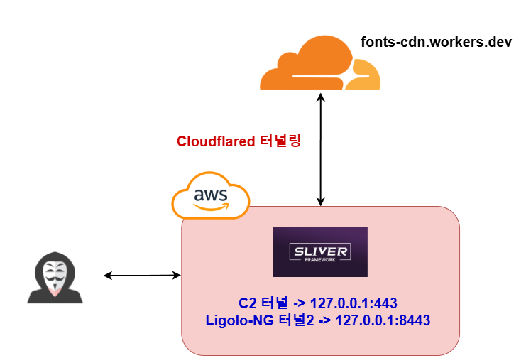
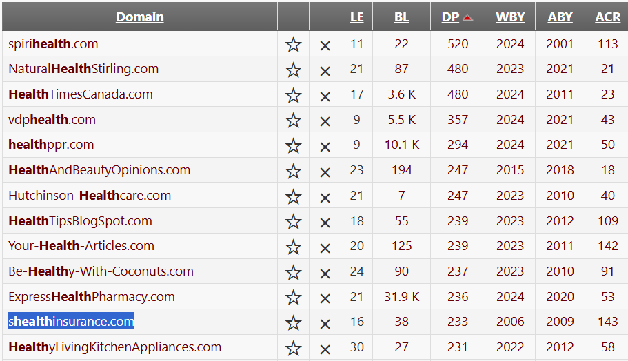
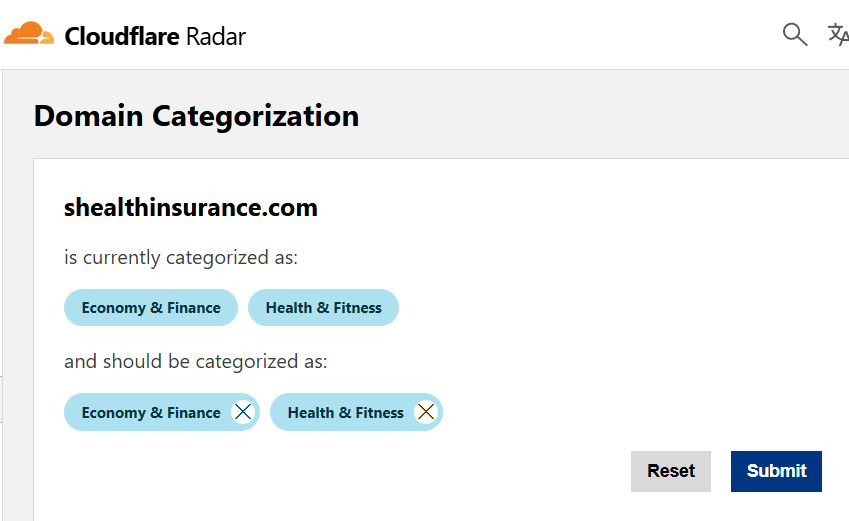
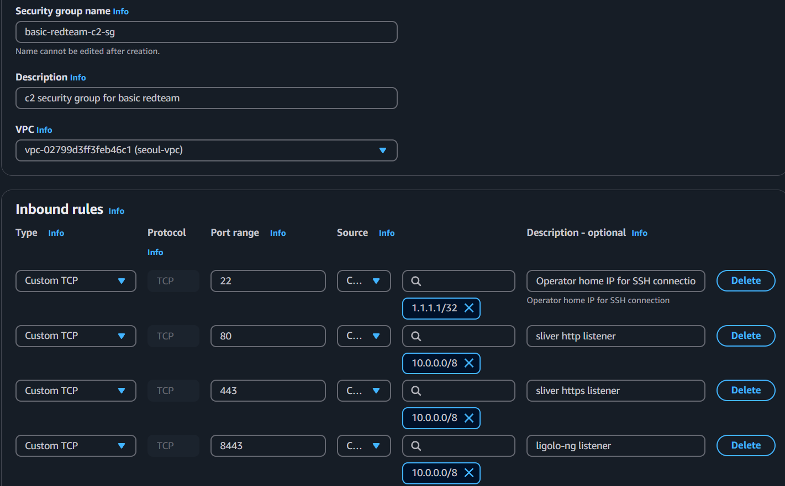

# 1. 공격자 인프라 구성

이번 섹션에서는 다음과 같은 주제들을 다룬다:

* 도메인 구입
* 클라우드플레어(Cloudflare) Workers를 이용한 리다이렉터 생성
* C2 서버 생성, 방화벽 구축
* C2 서버의 Malleable C2 Profile을 이용한 네트워크 트래픽 변경

<figure><figcaption></figcaption></figure>

## 도메인 구입

공격자 도메인 없이도 레드팀은 가능하지만, 공격자 레벨과는 상관없이 대다수의 공격자들은 공격용 도메인을 구입한다. 도메인 에이징을 하기에는 시간이 없기 때문에 이미 만료된 도메인을 구입한다. 다음은 도메인 구입 시 고려할 점들이다:

* WBY: Whois 기준 도메인 생성년도
* BL: Majestic SEO 기준 Backlink 개수
* DP: Domain Pop 기준 Backlink 개수

생성년도는 2년 이상, BL과 DP또한 각각 두 자릿 수 이상이면 충분하다. 물론 높을 수록 좋다.

<figure><figcaption></figcaption></figure>

도메인 결정 후 구입하기 전, [Cloudflare Radar](https://radar.cloudflare.com/domains/feedback)를 사용해 도메인 카테고리를 확인한다. 이번 프로젝트에서 사용될 [shealthinsurance.com](http://shealthinsurance.com/) 도메인의 경우 18년 이상 된 도메인이고, BL과 DP 점수가 어느정도 있으며, 이미 도메인이 Economy, Finance, Health, Fitness로 카테고리화 되어 있다. 특히 Finance와 Health 카테고리가 중요하다. 대부분의 기업 프록시 같은 경우 아무리 프록시단에서 DPI를 진행한다고는 해도 금융과 건강 관련된 도메인에는 컴플라이언스 때문에 룰이 좀 느슨하거나, 심지어 DPI를 진행 안하는 경우가 있기 때문이다.

<figure><figcaption></figcaption></figure>

좋은 도메인을 구매하기 전, 마지막으로 바이러스 토탈, wayback machine 서비스를 이용해 해당 도메인이 과거에 악용되었었는지 확인한다.

<figure><figcaption></figcaption></figure>

좋은 도메인을 구했다면 레지스트라에서 가격을 확인한 뒤, 적당한 가격에 구입한다.

## 인프라 구성

공격에 인프라 구성은 정말 다양하게 할 수 있다. 어떤 서버와 서비스를 인터넷에 노출 시킬 것이냐부터, 작전보안, 현실성, 편리함의 밸런스까지, 어떤 가치를 최우선에 두느냐에 따라 수십 가지의 인프라가 만들어질수도, 아예 인프라 자체를 운영하지 않고 공격을 진행할 수도 있다.

다양한 종류의 인프라 및 인프라 구성, 배포 방법에 대해서는 레드팀에 정리를 많이 해놨으니 레퍼런스 섹션을 참고한다.

이번 베이직 레드팀 프로젝트에서는 현실적이고, 사용하기 편리하며, 간단한 인프라 구성을 클라우드 플레어 터널링과 Workers를 이용해 만든다. 자세한 내용은 [레드팀.com](https://www.xn--hy1b43d247a.com/infrastructure/cloudflared-tunnel-and-worker-redirector)에 정리해놨으니 기술적인 부분이 궁금하다면 참고한다.&#x20;

## 팀 서버 구축

팀 서버 자체는 클라우드에 구축하되, 인바운드 방화벽을 설정해 오퍼레이터 IP주소에서만 접근할 수 있도록 한다. 그 뒤, 포트 80, 443, 8443, 53 등 HTTP(S)/DNS 트래픽은 리다이렉터의 AWS 사설 IP에서만 받을 수 있도록 설정한다. 어차피 C2 서버에서 노출되는 포트는 22를 제외하면 없고, 모든 트래픽은 클라우드플레어의 터널을 통해 로컬호스트에서만 받을 것이기 때문에 22를 제외한 모든 포트를 인터넷에 노출시키지 않는다.

SSH 포트포워딩등의 다양한 방법을 써서 작전보안을 고려할 수도 있지만, 실제 프로덕션 레드팀 활동이 아닌 이상 아래와 같이 설정해도 충분하다.

<figure><figcaption></figcaption></figure>

C2 프레임워크는 [러시아 대외정보국(SVR)](https://www.ncsc.gov.uk/files/Advisory%20Further%20TTPs%20associated%20with%20SVR%20cyber%20actors.pdf), [랜섬웨어 갱](https://www.cybereason.com/blog/sliver-c2-leveraged-by-many-threat-actors) 뿐만 아니라, [한국을 대상](https://asec.ahnlab.com/en/55652/)으로 공격을 실행하는 실제 공격자들도 많이 사용하고 있는 Sliver(슬리버)를 이용한다.

슬리버 설치 후 기본 프로필을 사용하지 않고 [Malleable C2 프로필](https://www.xn--hy1b43d247a.com/defense-evasion/malleable-c2-profile)을 사용하기 위해 실제로 Ruby on Rails 관련 서버들에서 사용하는 URL 경로, 파일 이름 등이 들어간 파일을 사용해 프로필을 제작한다.

```
# 슬리버 1.5.42 설치 및 실행
apt update -y
curl <https://sliver.sh/install|sudo> bash
sliver

# armory 설치 후 https 리스너 실행
s> armory install all
s> https

# Malleable C2 프로필 적용
wget https://raw.githubusercontent.com/danielmiessler/SecLists/refs/heads/master/Discovery/Web-Content/ror.txt

python3 generateC2Profile.py default_c2profile ror.txt _session_id
cp ~/.sliver/configs/http-c2.json ~/.sliver/config/http-c2.json.bak

# 리스너 재시작
s> jobs -K
s> https -c /root/fullchain.pem -k /root/key.pem  // cerbot을 이용해 받아온 인증서 사용 
```


## 인프라

위와 같이 인프라 구성이 끝났다면 C2 서버는 Sliver, 네트워크 트래픽은 Sliver의 Malleable C2 로 인해 변경된 트래픽이 통신된다. 슬리버 에이전트의 통신은 다음과 같이 일어날 것이다.

1. (타겟) Sliver 에이전트 --> (Cloudflare) <커스텀도메인>.workers.dev 로 콜백
2. (Cloudflare Worker) 워커로 들어온 네트워크 트래픽 HTTP Header, User-Agent, IP 주소 등을 통해 확인. 검증된 트래픽만 Cloudflared 터널으로 전송
3. (Cloudflared Tunnel) 터널로 들어온 트래픽의 Access Token 검증, 검증이 된다면 C2 서버의 127.0.0.1:443으로 전송
4. (C2 서버) 서버의 포트 443 리스너로 들어온 트래픽을 Malleable C2 Profile을 통해 검증. 트래픽이 맞다면 에이전트와 통신

기본적으로 위와 같은 통신은 공격자 인프라로서 다음의 목적을 달성한다.

1. 타겟의 네트워크에서는 클라우드플레어의 Workers.dev라는 합법적인 도메인으로 나가는 Outbound 트래픽만 보이게 한다
2. Sliver C2를 사용한다는 것을 눈치채지 못하도록 모든 네트워크 트래픽을 Malleable C2 프로필로 바꾼다 (http header, parameters, url, cookies, user-agent, url path, 등등...)
3. 클라우드 플레어 터널링을 통해 C2 서버의 인터넷 노출 최소화한다.

## 우리 회사는

* Workers.dev, Pages.dev, azureedge.net, azure-api.net, azurewebsite.net 등의 legitimate 한 클라우드 서비스들의 엔드포인트가 공격자들의 C2 엔드포인트 및 리다이렉터로 사용될 수 있음을 인지하고, 이에 대한 대응을 하고 있는가?
* C2 서버들이 단순히 정해진 URL 경로나 파라미터들을 사용하는 것이 아니라, Malleable C2를 사용해 언제든지 네트워크 트래픽을 변경하고 숨길 수 있다는 것을 인지하고 있는가?
* 비컨, 에이전트와 같이 일정한 시간대, 일정한 트래픽을 특정 도메인이나 IP 주소 등으로 계속해서 보내는 엔드포인트들에 대한 능동적 점검 및 SIEM/방화벽/프록시 로그 모니터링을 진행하고 있는가?

## 마치며&#x20;

인프라를 구성해봤으니 초기 침투를 진행한다.

## 레퍼런스&#x20;

* 인프라 구성 개념: https://www.xn--hy1b43d247a.com/infrastructure/concepts
* 도메인 프론팅1: https://www.xn--hy1b43d247a.com/infrastructure/domain-fronting
* 도메인 프론팅2: https://www.xn--hy1b43d247a.com/infrastructure/domain-fronting-azure-edgio-cdn
* HTTP/S 리다이렉터: https://www.xn--hy1b43d247a.com/infrastructure/https-redirector
* 피싱 인프라 - 자체 메일 서버: https://www.xn--hy1b43d247a.com/infrastructure/smtp-do
* 피싱 인프라 - ESP: https://www.xn--hy1b43d247a.com/infrastructure/smtp-aws-zoho
* 피싱 인프라 - 자체 메일 + ESP: https://www.xn--hy1b43d247a.com/infrastructure/smtp-toolkit-relay-esp
* 인프라 구축 자동화 - 테라폼: https://www.xn--hy1b43d247a.com/infrastructure/infra-automation
* 네뷸라를 이용한 내부 VPN 인프라: https://www.xn--hy1b43d247a.com/infrastructure/old
