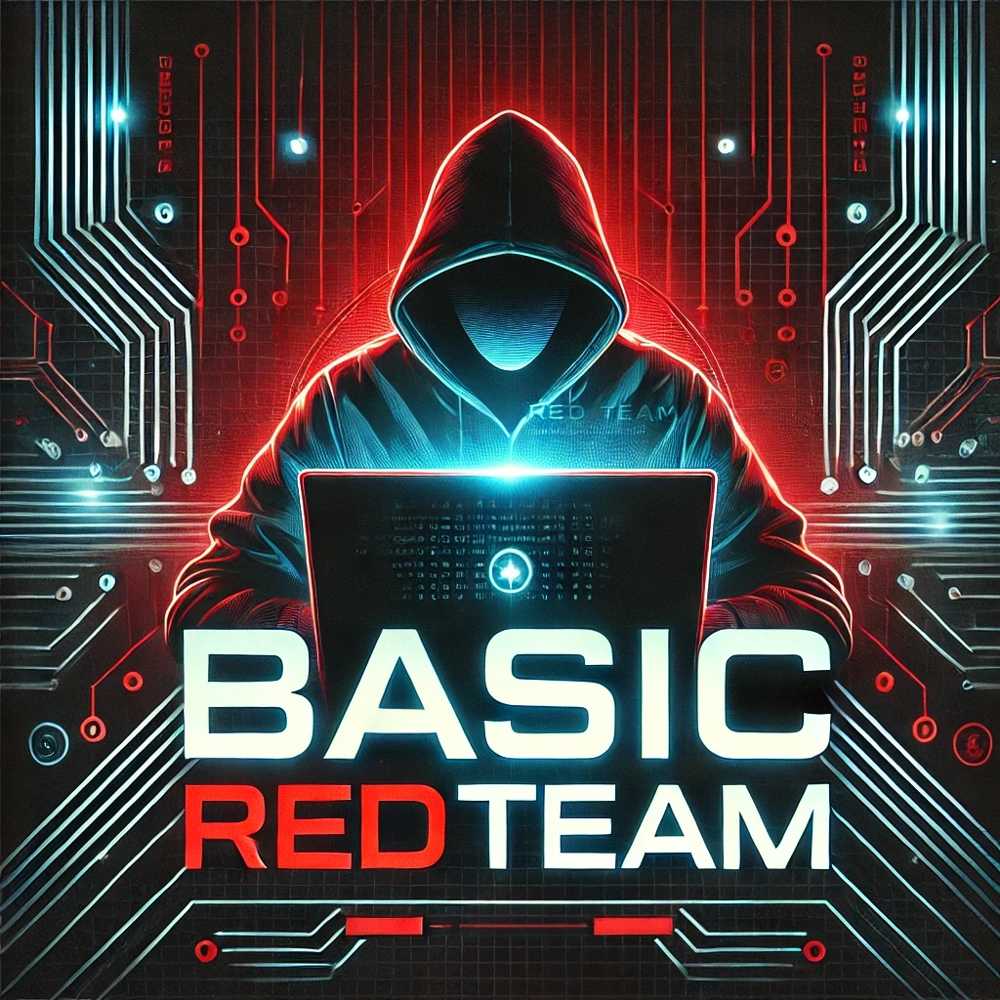
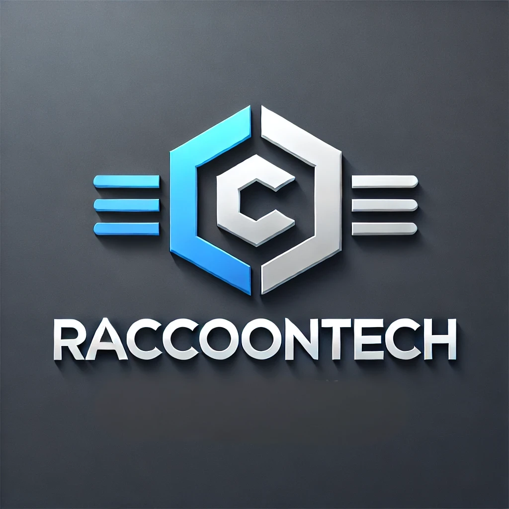

# 개요

## 베이직 레드팀 (Basic Redteam) 프로젝트

<figure><figcaption></figcaption></figure>

베이직 레드팀/레드티밍(Basic Redteam/Redteaming)은 기본적인 온-프레미스 기반 레드팀 작전에서 기술적인 공격 시나리오를 중심으로 공격자 인프라 구축, 정보 수집, 권한 상승, 횡적 이동, 후속 공격, 목표 달성 과정을 직접 실행해보는 프로젝트입니다.

국내에는 공격자 시뮬레이션과 관련되어 공격자 인프라 구성 및 C2 기반의 침투를 보여준 공개된 프로젝트가 없다고 판단하여 이번 기회에 진행한 내용을 공개합니다.

레드팀(공격자 시뮬레이션)이 어떻게 이뤄지는지에 대해 알아보고, 각 페이지의 "우리 회사는" 섹션을 통해 이러한 유형의 공격을 탐지하거나 방어할 수 있을지 고민해 보는 계기를 제공할 수 있다면, 그것만으로도 충분히 의미가 있을 것입니다.

이 프로젝트와 관련된 질문이나 국내 레드팀 커뮤니티를 같이 꾸려갈 분들은 레드라쿤의 디스코드 서버로 와주시면 감사하겠습니다. [https://discord.gg/FGeh8Uk9Dg](https://discord.gg/FGeh8Uk9Dg)

Brought to you, with <3, by: choi@레드라쿤

### Disclaimer

본 프로젝트의 모든 내용은 교육 목적으로 작성되었으며, 공개된 인터넷 정보들을 바탕으로 제작되었습니다. 본 프로젝트는 사전에 명시적인 허가를 받지 않은 컴퓨터 시스템, 네트워크 또는 기타 디지털 자산에 대한 접근, 모의 해킹, 사이버 공격 등 **모든 불법적인 행위를 엄격히 금지합니다.** 이러한 행위는 법적으로 금지되어 있으며, 국내외 법률에 따라 처벌될 수 있습니다.

## 배경

<figure><figcaption></figcaption></figure>

라쿤 테크는 IT 관련 모바일 어플리케이션 및 플랫폼을 제공하는 가상의 회사다. 최근 국내IT 업계를 대상으로 하는 APT 1337의 공격이 많아짐에 따라, 라쿤 테크는 현재 가진 보안 인력, 프로세스, 기술 (People, Process, Technology)을 바탕으로 현실적인 사이버 공격을 받았을 때 이를 탐지 및 방지할 수 있는지 알아보기 위해 레드팀을 진행했다.

### 목표

현재 보안 인력, 프로세스, 기술을 가지고 현실적인 사이버 공격을 탐지 및 방지할 수 있는지 알아보기 위함

### 목적

1. 외부 공격자(Outsider)가 라쿤 테크의 소스 코드 저장소에 접근해 소스 코드 탈취를 할 수 있는가
2. 외부 공격자가 라쿤 테크의 GitLab CI/CD 프로세스를 장악해 소스 코드 변조 후 공급망 공격을 진행할 수 있는가
3. 외부 공격자가 라쿤 테크의 본사, 미국 지사, 인도 지사의 사내망의 액티브 디렉토리를 장악할 수 있는가

### 환경

라쿤테크는 국내 가상 IT 회사이며, 다음과 같은 IT 환경을 가지고 있다.

<figure><figcaption></figcaption></figure>

라쿤테크는 오래된 IT 회사로, 클라우드 도입이 늦어 현재까지 온-프레미스 환경을 유지하고 있다. 주요 자산은 주로 액티브 디렉토리와 윈도우 기반으로 구성되어 있으며, Gitlab과 Bookstack(위키 서버) 등은 우분투 기반의 서버에서 운영되고 있다.

본사 네트워크는 국내와 미국 법인으로 이뤄져 있으며, RT.LOCAL이라는 포레스트에 속해있다. 모바일 어플리케이션 및 라쿤 플랫폼을 개발하고 있는 인도쪽 지사는 DEV.RACCOON 포레스트에 속해있다.

이외에 따로 라쿤 IT라는 MSP 회사와 외주 계약을 맺어 IT 및 보안을 맡기고 있는데, 이번 베이직 레드팀 시나리오에서는 MSP.ORG와 라쿤 IT의 고객사들은 모두 범위에서 제외된다.

### 위협 모델링

다음 표는 Red Team Development and Operations - A Practical Guide 에서 고안된 예시 위협 분석을 이번 프로젝트에 맞게 수정한 위협 모델링이다.

<table><thead><tr><th width="215">카테고리</th><th>설명</th></tr></thead><tbody><tr><td>예시 위협</td><td>2025년 1분기 국내 IT 업계를 공격한 APT 1337</td></tr><tr><td>상세정보</td><td>낮은 수준의 공격자. 금전적인 이득을 목표로 한 랜섬웨어 갱. 오픈소스 C2 및 툴을 활용해 공격함</td></tr><tr><td>목표</td><td>소스 코드 탈취 및 공급망 공격으로 인한 추가 피해자 확보</td></tr><tr><td>공격자 위치</td><td>외부 공격자(Outsider). 인터넷을 통해 침투.</td></tr><tr><td>C2 정보</td><td>AWS, Azure, GCP 등을 이용한 클라우드 C2 서버 오픈소스 C2 프레임워크 Sliver HTTPS 비컨 및 에이전트 AWS, Azure, GCP 등을 이용한 리다이렉터 공격자 도메인</td></tr><tr><td>TTP 개요</td><td>초기 침투 - 피싱 이메일, 페이로드 정보 수집 - 블러드 하운드 및 사내 위키 서버 권한 상승 - 액티브 디렉토리 기반 공격 횡적 이동 - PSExec, WinRM 등의 기본적인 윈도우 기반 횡적 이동 지속성 유지 - 없음. 목표 달성 - 소스 코드 탈취 및 랜섬웨어 배포</td></tr><tr><td>익스플로잇</td><td>제로데이 및 N-Day 익스플로잇 사용하지 않음. 피싱을 통한 초기 침투</td></tr><tr><td>레퍼런스</td><td>APT 1337 CTI 분석 보고서 (링크)</td></tr></tbody></table>

### 한계점

베이직 레드팀은 혼자서 진행하는 사이드 프로젝트이기 때문에 현실적인 대상의 환경과 레드팀 TTP를 모두 보여줄 수 없다. 따라서, 프로젝트에는 다음과 같은 한계점이 존재한다:

* **스케일:** 수만대의 호스트, 수천개의 어플리케이션/서비스, 수백개의 네트워크 등을 포함한 현실적인 환경을 만들기는 불가능해 작은 스케일로 진행된다.
* **현실적인 TTP:** 실제 레드팀 업무에서는 기술적 공격뿐만 아니라 문서를 읽고, 환경을 이해하며, 맥락을 분석하는 데 많은 시간을 할애한다. 그러나 이번 프로젝트는 기술적 TTP에만 집중한다.
* **공격자 수준:** 프로젝트는 낮은 수준의 공격자 관점에서 진행되며, 연휴 동안 간단히 진행하는 터라 활용되는 TTP 및 공격자의 수준이 제한적이다.
* **클라우드:** AWS, Azure 등의 클라우드 플랫폼 뿐만 아니라 EntraID, M365등의 클라우드는 이번 프로젝트에서 제외됐다 (금전적 이유 + 국내 도입 현황)
* **외부망 정보 수집, OSINT:** 는 생략했다. 인터넷에 라쿤 테크 관련된 자산 및 데이터를 만들기에는 시간이 없었다.

### 시작

그럼 이제 레드팀 업무를 배정받은 레드라쿤의 레드팀 오퍼레이터로서, 이번 라쿤테크를 향한 레드팀 업무를 시작한다.
