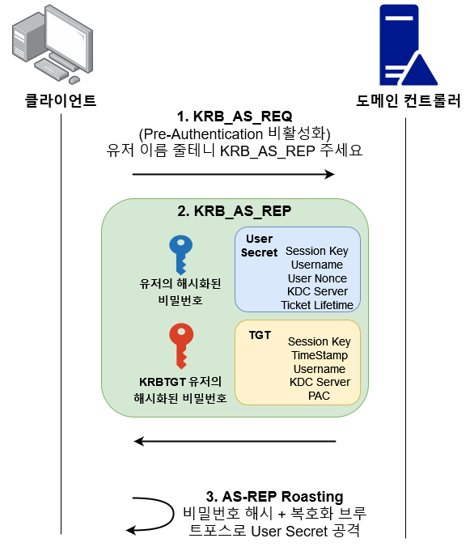

# AS-Rep Roasting

### 배경&#x20;

커버로스의 인증은 6단계로 이뤄진다. 그 중 첫 2단계는 유저 인증을 담당하며, Pre-Authentication 이라고도 불린다. 클라이언트는 Pre-Authentication 단계를 통해 도메인 컨트롤러로부터 Ticket Granting Ticket (TGT) 라는 유저 인증 관련 티겟을 발급받고, TGT는 나머지 4개의 커버로스 인증 단계에 쓰인다.

Pre-Authentication은 다음과 같은 요청/응답으로 이뤄진다. &#x20;

.png)

1. `KRB_AS_REQ` - Kerberos Authentication Service Request - 클라이언트는 현재 timestamp 를 자신의 해시화된 비밀번호로 암호화한 뒤, 유저 이름과 함께 도메인 컨트롤러에게 건네준다. "choi.local\Administrator 유저 인증 좀 하겠습니다. TGT 발급해주세요"&#x20;
2. `KRB_AS_REP` - Kerberos Authentication Service Response - 도메인 컨트롤러는 자신의 `NTDS.dit` 을 통해 유저의 이름을 확인하고, NTDS.dit 안에 있는 유저의 해시화된 비밀번호를 이용해 `KRB_AS_REQ` 안의 timestamp 복호화를 시도한다. 성공하면 유저가 제대로된 유저 이름 + 비밀번호를 준 것이니, 인증을 허락하고 `KRB_AS_REP` 응답을 반환한다. 이 응답에는 2가지 메시지가 들어있다. 1) 유저의 해시화된 비밀번호로 암호화된 `User Secret` (파란색)과 2) 도메인의 KRBTGT 유저의 해시화된 비밀번호로 암호화된 TGT (빨간색) 이 있다. &#x20;

### 개념&#x20;

 (4).png>)

액티브 디렉토리에서는 위 Pre-Authentication 과정을 무시하는 설정인 `Do not require Kerberos Preauthentication` 이 존재한다. 이 설정을 특정 유저에게 부여하면 앞의 Pre-Authentication 과정 중 `KRB_AS_REQ` 을 유저의 비밀번호 없이 유저 이름만 가지고 보낼 수 있다. 이를 악용해 AS-REPRoasting 공격을 진행할 수 있다.&#x20;



AS-REPRoasting 은 다음과 같이 이뤄진다.

1. `Do not require Kerberos Preauthentication` 설정이 있는 유저의 이름만 알면 비밀번호를 몰라도 `KRB_AS_REQ` 요청을 보낼 수 있다.&#x20;
2. 도메인 컨트롤러는 `KRB_AS_REP` 응답을 반환한다.&#x20;
3. 이 `KRB_AS_REP` 응답에는 `User Secret` 이라는 메시지가 있다. 이는 유저의 해시화된 비밀번호로 암호화 되어있다.&#x20;
4. 공격자는 `KRB_AS_REP` 를 메모리상에서 추출해 `User Secret` 만 따로 빼내온 뒤, 오프라인 복호화 브루트포스를 감행한다. `User Secret` 메시지가 복호화가 될 때까지 무작위 비밀번호를 해시화 한 뒤 복호화를 진행한다.&#x20;
5. 유저의 비밀번호가 약한 비밀번호라면 브루트포스에 성공할 것이고, 이제 공격자는 유저의 평문 비밀번호를 얻게된다.&#x20;

요약은 다음과 같다:&#x20;

* `Do not require Kerberos Preauthentication` 설정이 되어 있는 도메인 유저는 AS-REPRoasting에 취약하다. 공격자는 AS-REPRoasting 을 통해 유저의 비밀번호를 몰라도 이름만 갖고 `KRB_AS_REQ` 응답을 반환받을 수 있다. 응답 안의 유저의 해시화된 비밀번호로 암호화된 `User Secret` 메시지 부분만 따로 빼내 복호화 브루트포스 공격을 시도할 수 있다. 유저가 약한 비밀번호를 사용한다면 공격에 성공한 뒤 평문 비밀번호를 알아낼 수 있다.&#x20;
* 더 요약 - AS-REPRoasting에 취약한 유저는 약한 비밀번호를 갖고 있다면 유저 이름만 알아도 브루트포스 공격을 한 뒤 평문 비밀번호를 알아낼 수도 있다. &#x20;

### 이유?&#x20;

`Do not require Kerberos Preauthentication` 이라는 설정은 이렇게 위험한데 왜 존재하는 것일까? 왜 마이크로소프트사는 커버로스 인증의 2단계를 무력화 시키는 이 설정을 만든 것일까? 답은 놀랍게도, 모른다. 그저 리눅스/맥을 사용하는 유저들이나 외부 솔루션들이 사용하는 도메인 유저들 중 이 설정이 필요하다고 추측만 할 뿐이다.&#x20;

내부망 모의해킹 실무에서도 발견한 뒤 시스어드민 분들께 여쭤보면 "글쎄요 한 15년전에 만들어진 유저라 전 잘 모르겠는데요" 라고 대답하시는 경우가 많다 (...).&#x20;

### 실습 - 1

**전제 조건**&#x20;

* 도메인 유저를 1개 장악했거나, Kerberos Username Enumeration 에서 AS-REP Roasting에 취약한 유저를 찾았을 경우&#x20;
* AS-Rep Roasting에 취약한 유저가 존재함
* AS-Rep Roasting에 취약한 유저의 비밀번호가 브루트포스에 뚫릴 정도로 약함&#x20;

1. 이미 장악한 도메인 유저를 통해 도메인 내 AS-REP Roasting 이 가능한 유저가 있나 정보 수집을 한다.

```
cme ldap 192.168.40.150 -u low -p 'Password123!' --asreproast roast.txt
```

 (3).png>)

`linuxadmin` 이라는 유저가 AS-REP Roasting에 취약하다고 나온다. `KRB_AS_REP` 응답도 받아왔다.&#x20;

2\. `KRB_AS_REP` 의 `User Secret` 을 복호화 하는 브루트포스 공격을 진행한다. 브루트포스에는 johntheripper 나 hashcat 을 이용한다.&#x20;

```
john --wordlist=/usr/share/wordlists/rockyou.txt roast.txt
hashcat -m 18200 -a 0 .\asreproast.txt .\rockyou.txt
```

 (1) (2).png>)

3\. 공격자는 타겟 유저의 이름 (`linuxadmin`) 과 평문 비밀번호 (`Ohnonono123!`) 를 통해 유저 계정을 장악한다.&#x20;


### 실습 - 2&#x20;

도메인 유저 맥락이 없고 [커버로스 유저 이름 정보 수집](../../enumeration/kerberos-username-enumeration.md)을 통해 유저 이름 리스트를 확보했다면 해당 리스트에 AS-REPRoasting 이 가능한 유저가 있는지 알아본 뒤, 브루트포스 할 `KRB-AS-REP` 응답을 받아온다.&#x20;

```
./kerbrute userenum -d <domain> --dc <dc-ip> <username-list> | tee <output-file>
cat kerbrute-output.txt | grep -i 'valid username' | cut -d ' ' -f 8 > valid-usernames.txt

impacket-GetNPUsers <domain>/ -request -usersfile valid-usernames.txt  -dc-ip <dc-ip>
```

 (1).png>)

받아온 `KRB-AS-REP` 응답은 위 실습-1 처럼 johntheripper 나 hashcat 을 이용해 브루트포스한다.&#x20;

### 대응 방안&#x20;

* `Do not require Kerberos preauthentication` 설정이  유저들이 존재하는지 확인한다.&#x20;

```
Get-ADUser -Filter 'useraccountcontrol -band 4194304' -Properties useraccountcontrol | Select-Object -Property name,enabled
```

* 해당 설정이 존재하는 도메인 유저가 있다면 이 설정이  필요한 것인지 재확인한다. 필요 없는 설정이라면 설정을 비활성화 하고, 필요 없는 도메인 유저라면 유저를 비활성화 하거나 삭제한다.&#x20;

### 레퍼런스&#x20;




