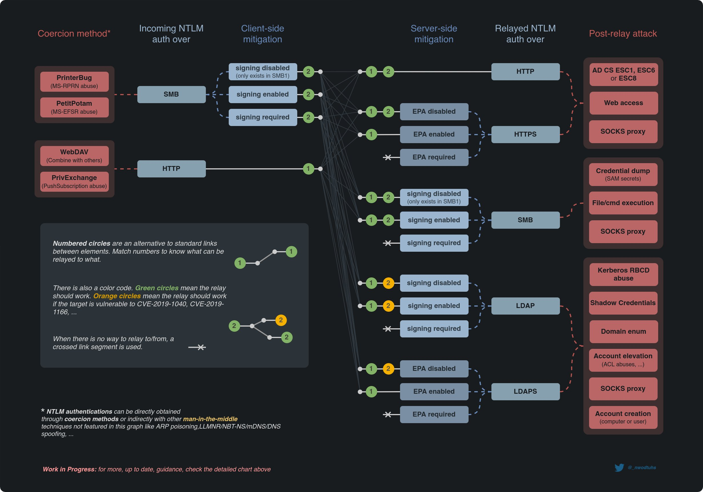

# NTLM 릴레이 (NTLM Relay)

액티브 디렉토리에서는 LLMNR/Nbt-NS/mDNS, MITM6, RPC 기반 강제 인증 등으로 공격자 머신에게 들어온 인증 트래픽을 다른 머신들의 다양한 서비스 (SMB, HTTP(S), LDAP(S)) 로 릴레이 (Relay) 공격을 할 수 있다. 이때 공격자는 중간자 위치에 있기 때문에 피해자 호스트로 부터 받은 인증 트래픽을 타겟 서버에게 그대로 릴레이하며 피해자 머신/유저 계정의 맥락에서 인증을 할 수 있게 된다.&#x20;

.png)

NTLM 릴레이는 코드 실행, 계정 정보 덤프, SOCKS 프록시 구축, ADCS (Active Directory Certificate Services) 접근 등의 다양한 공격으로 이어질 수 있다. 굳이 공격자가 도메인 유저나 머신의 권한을 가지고 있지 않아도 중간자 공격을 통해 다양한 효과를 볼 수 있기 때문에 내부망 모의해킹 시 자주 사용된다. &#x20;

### NTLM 릴레이 구성 요소

릴레이 공격에는 다음과 같은 호스트 3종류가 필요하다.&#x20;

* 릴레이(피해자) 호스트 - 사용자 인증 트래픽을 공격자 호스트에게 보내는, 릴레이를 "할" 호스트&#x20;
* 공격자 호스 - 중간자 포지션에서 릴레이 공격을 실행하는 호스트&#x20;
* 타겟 호스트 - 공격자로부터 릴레이 호스트의 트래픽을 받는, 릴레이 공격을 "당할" 호스트&#x20;

하위 페이지들에서 나오는 "릴레이 호스트", "공격자 호스트", "타겟 호스트" 라고 일컫는 호스트들은 위 호스트들이다.&#x20;

레이 공격은 총 두 가지 구성요소로 이뤄져있다.&#x20;

1. 트리거 - 공격자 호스트에게 들어오는 릴레이 호스트의 인증 트래픽. LLMNR/NBT-NS 포이즈닝, 강제 인증, MITM6 등으로 이 트래픽을 트리거 시킬 수 있다. &#x20;
2. 릴레이  - 공격자 호스트에서 트리거에서 들어오는 인증 트래픽을 받아 타겟 호스트에게 이를 릴레이 시키는 공격&#x20;

### 릴레이 종류&#x20;

릴레이 공격의 종류는 다음 [@nwodtuhs](https://twitter.com/\_nwodtuhs/) 라는 분이 만든 NTLM 릴레이 공격 이어그램을 참고한다. &#x20;

릴레이가 시작 되는 부분은 강제 인증, LLMNR/Nbt-NS 포이즈닝, MITM6 등의 공격으로 들어오는 SMB 인증 트래픽일 때가 많다. HTTP 인증 트래픽도 WebDav 등을 통해서 들어올 수 있다.&#x20;

* SMB -> SMB - 모의해킹 시 가장 자주 이용되는 릴레이 공격이다. 릴레이 되는 호스트의 SAM 데이터베이스를 덤프하거나, SOCKS PROXY 를 구축하거나, 원격 코드를 실행하는 용도로 사용된다.&#x20;
* SMB -> HTTP - 강제 인증과 Active Directory Certificate Services (ADCS) 공격을 할 때 자주 이용된다. 뿐만 아니라 다양한 HTTP 기반 웹 서비스들을 이용할때도 사용할 수 있다.&#x20;
* SMB -> LDAP - 커버로스 기반의 RBCD 공격이나 프록시, 계정 생성, 도메인 정보 수집 등에 사용되는 릴레이 공격이다. 단, 릴레이 되는 도메인 컨트롤러가 CVE-2019-1040 / CVE-2019-1188 에 취약해야지 사용이 가능하다.&#x20;
* HTTP -> SMB/HTTPS/LDAP - 주로 WebDav 를 이용해 릴레이 공격을 시작한다. SMB, HTTP/S, LDAP 으로 릴레이 공격을 해서 얻을 수 있는 효과는 위와 동일하다.&#x20;

### 공격 종류&#x20;

릴레이를 통해 실행할 수 있는 공격들은 다음과 같다. &#x20;

1. [SAM Dump / SOCKS](https://www.xn--hy1b43d247a.com/credential-access/ntlm-relay/smb-to-smb#undefined) - 릴레이되는 트래픽의 유저/머신 계정 맥락을 이용해 타겟 호스트의 SAM을 덤프하거나 SOCKS 프록시를 구축할 수 있다.&#x20;
2. [NTLMv1 Downgrade](../ntlm-downgrade.md) - Net-NTLMv1 이 릴레이 된다면 다운그레이드를 통해 NT해시를 얻을 수 있고, 이 NT 해시는 그대로 [Pass-the-Hash](../../lateral-movement/pass-the-hash.md)에 사용될 수 있다.&#x20;
3. [ADCS ESC8](../../privilege-escalation/ad/adcs.md#esc-8) - 액티브 디렉토리내 ADCS와 ADCS Web Enrollment가 운영되고 있다면 이에 릴레이 해 릴레이 되는 트래픽의 유저/머신 계정 맥락의 인증서 인증을 받은 뒤 계정을 장악할 수 있다.&#x20;
4. [Resource Based Constrained Delegation](broken-reference) - 커버로스의 Delegation (대리자/델리게이트) 를 이용해 공격자가 타겟서버에 높은 권한의 유저로 접근 가능하게끔 만드는 공격.&#x20;

### NTLM 릴레이 구성 요소

릴레이 공격에는 다음과 같은 호스트 3종류가 필요하다.&#x20;

* 릴레이(피해자) 호스트 - 사용자 인증 트래픽을 공격자 호스트에게 보내는, 릴레이를 "할" 호스트&#x20;
* 공격자 호스 - 중간자 포지션에서 릴레이 공격을 실행하는 호스트&#x20;
* 타겟 호스트 - 공격자로부터 릴레이 호스트의 트래픽을 받는, 릴레이 공격을 "당할" 호스트&#x20;

하위 페이지들에서 나오는 "릴레이 호스트", "공격자 호스트", "타겟 호스트" 라고 일컫는 호스트들은 위 호스트들이다.&#x20;

레이 공격은 총 두 가지 구성요소로 이뤄져있다.&#x20;

1. 트리거 - 공격자 호스트에게 들어오는 릴레이 호스트의 인증 트래픽. LLMNR/NBT-NS 포이즈닝, 강제 인증, MITM6 등으로 이 트래픽을 트리거 시킬 수 있다. &#x20;
2. 릴레이  - 공격자 호스트에서 트리거에서 들어오는 인증 트래픽을 받아 타겟 호스트에게 이를 릴레이 시키는 공격&#x20;

### 대응 방안 &#x20;

NTLM 릴레이의 대응 방안은 여러가지가 있지만, 기본적으로는 마이크로소프트사에서 지원하는 Message Signing 및 EPA를 적용하는 것이 가장 효율적으로 방어할 수 있는 방법이다. 아주 가끔 NTLM 인증 자체를 버리고 커버로스 + ADCS 만 구축해놓은 액티브 디렉토리도 있지만, 이 방법은 하위 호환성을 전혀 생각하지 않기 때문에 모든 프로그램/솔루션들을 따로 설정해야한다.&#x20;

다음은 NTLM 릴레이를 막는 Message/Session Signing 과 EPA의 관계도를 나타낸 다이어그램이다.&#x20;

### 레퍼런스&#x20;



