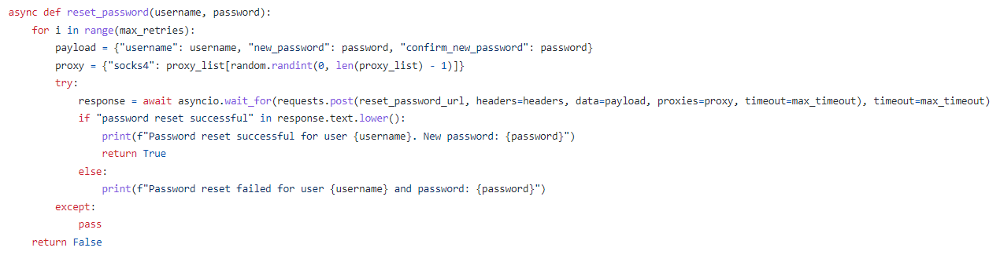
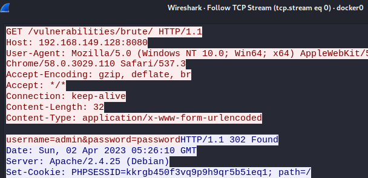
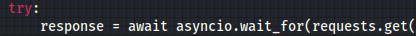
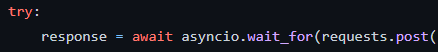
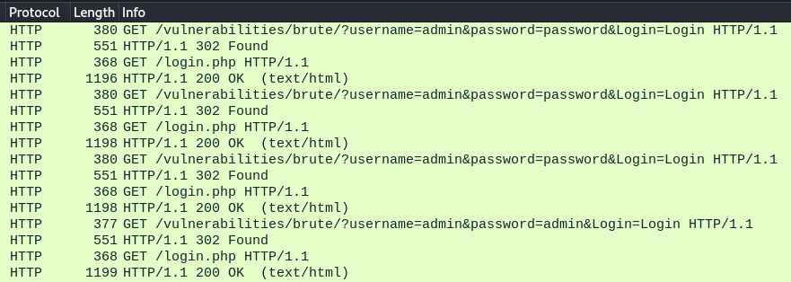

# 첫번쩨, payload설정 방법

아래 이미지와 code를 보자

<figure><figcaption></figcaption></figure>

payload에는 각종 임의의 데이터를 입력하는 구간인데&#x20;

username과 password를 무차별 대입하여 자동적으로 공격을 진행하는 소스코드라고 생각하면 된다.

payload = {"username": username, "new\_password": password, "confirm\_new\_password": password}

그러면 해당 소스 코드를 실행하기 전에 Wireshark를 켜두고 소스 코드를 실행하면&#x20;

아래 이미지와 같이 통신이 이루어지는 것을 확인 할 수 있다.

<figure><figcaption></figcaption></figure>

그러나 302 Found로 통신이 실패하고 리다이렉션이 되는데&#x20;

이 부분은 '두번째, 세션을 유지하는 방법' 에서 다루고 우선 payload 설정 방법을 먼저 이야기 하자면&#x20;

해당 통신을 보면 username과 password의 데이터 값을 임의로 돌리는 것이 보인다.

<figure><figcaption></figcaption></figure>

즉, 데이터 값을 변조 할 수 있는 것이다.

&#x20;\-> payload = {"username": username, "password": password}&#x20;

GET과 POST에 따라 패킷 통신 값이 달라진다.

GET 일 경우 :&#x20;

<figure><figcaption></figcaption></figure>

POST 일 경우 :

<figure><figcaption></figcaption></figure>

그러나 'requests.get'을 이용하여 하위 url로 수정을 하여도 통신은 정상적으로 이루어지지 않고 302 Found로 GET /login.php 파일이 있는 특정 주소로 리다이렉션이 이루어지는 것을 확인 할 수 있다.

<figure><figcaption></figcaption></figure>

그럼 어떻게 설정을 해야 302 Found의 에러가 안나고 정상적으로 통신이 이루어질까 그것에 관한 것은 '두번째, 세션을 유지하는 방법'에서 알아보자
