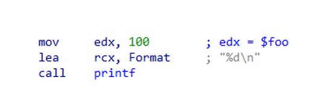
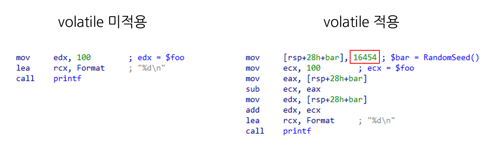

# 다형성 코드

## 개요

다형성 코드란 매번 컴파일 할 때마다 형태가 달라지는 코드를 말한다. 예를 들면, "A가 과일가게에서 사과를 산다" 라는 소스코드를 컴파일하면 생성되는 기계어 코드는 항상 달라야 한다. 다만, 형태가 달라진다고 해서 원본 소스코드의 기능이 바뀌어선 안된다. 쌩뚱맞게 A가 과일가게에서 두리안을 사버리면 안된다는 뜻이다.

다형성 코드를 사용하는 이유는 저마다 다르다. 악성코드는 안티바이러스 제품의 파일 해시(시그니처) 기반 탐지를 우회하기 위해 주로 사용한다. 해시 함수는 입력값이 1비트라도 달라지면 결과값이 크게 바뀌는 속성이 있다. 따라서 코드 또는 데이터의 일부를 아주 조금만 변경해도 파일 해시 기반 탐지를 우회할 수 있다. 프로텍터(엔드포인트 제품 보호)와 같은 보안 제품은 프로텍터 해제의 자동화를 어렵게 만들기 위해 사용하기도 한다.

> 이 페이지에서 퍼지 해시(Fuzzy hash)는 예외로 둡니다. 퍼지 해시는 입력값을 가지고 영역을 나누어 각자 따로 일반적인 해시값을 구한 뒤, 이들을 병합하는 방식입니다. 병합된 최종 해시값은 서로 다른 입력값이라 할지라도 유사도를 비교할 수 있습니다. 안티바이러스 분야에서는 악성코드 변종을 구분하는데 주로 사용됩니다.

어떻게 원본 소스코드의 기능을 훼손하지 않는 선에서 기계어 코드를 매번 다르게 생성할 수 있을까? 예시를 살펴보자.

## 예시

```cpp
int main(void)
{
	int foo = 100;
	printf("%d\n", foo);    // 콘솔에 정수 100 출력
}
```

작고 귀여운 코드가 있다.

이 프로그램의 기능은 "콘솔에 100을 출력"하는 것이다. 기능을 훼손하지 않는 선에서 다형성을 적용시켜 보자.

```cpp
// RandomSeed 함수 출처: Conti V3.0 랜섬웨어 소스코드
constexpr int RandomSeed(void)
{
	return '0' * -40271 + // offset accounting for digits' ANSI offsets
		__TIME__[7] * 1 +
		__TIME__[6] * 10 +
		__TIME__[4] * 60 +
		__TIME__[3] * 600 +
		__TIME__[1] * 3600 +
		__TIME__[0] * 36000;
};

int main(void)
{
	int foo = 100;
	int bar = RandomSeed();
	foo = foo + bar - bar;  // (bar - bar)의 결과는 0이므로 foo의 상태는 변화 없음
	printf("%d\n", foo);    // 콘솔에 정수 100 출력
}
```

생소할 수 있는 키워드들

* `constexpr <TYPE>` : 컴파일 타임에 값이 결정되는 변수. 즉, 컴파일을 마치면 실행파일의 코드에 기호(변수)로 존재하지 않고 상수로 존재한다.
* `__TIME__` : Visual C/C++, GCC 등 컴파일러에서 지원하는 매크로이다. 전처리 과정에서 `<hh:mm:ss>` 형식의 시간을 가진 `char[]` 타입 문자열로 확장된다. 참고로 C/C++에서 `char` 타입은 산술연산이 가능함.

위 예시 코드의 동작은 아래와 같다.

1. 컴파일 타임(정확히는 매크로가 확장되는 전처리 작업 때)을 기반으로 의사 난수를 생성함. `__TIME__` 매크로는 초단위로 값이 바뀌기 때문에 의사 난수값은 매 초마다 갱신된다.
2. `foo`에 의미없는 산술연산 수행 (실행 전과 후의 상태가 동일함)
3. 콘솔에 `foo` 출력

결과는 아래와 같이 정상적으로 100을 출력하였다.

```
C:\dev> example.exe
100
```

그런데 문제가 생겼다.

다형성을 결정짓는 변수 `bar`가 아래 실행파일에서 찾아볼 수가 없다. 왜 그럴까?

<figure><figcaption></figcaption></figure>

\* _`example.exe!main()` 함수를 디스어셈블한 코드_

그 이유는 컴파일러의 코드 최적화(Release 빌드는 최대 최적화 `/O2`가 기본값) 과정에서 `bar`는 없어도 무방한 변수이므로 삭제되었기 때문이다.

`__TIME__` 매크로를 사용해 매 초마다 파일 해시가 다른 실행파일을 생성하고 싶었는데, 다른 방법이 없을까?

```cpp
// RandomSeed 함수 출처: Conti V3.0 랜섬웨어 소스코드
constexpr int RandomSeed(void)
{
	return '0' * -40271 + // offset accounting for digits' ANSI offsets
		__TIME__[7] * 1 +
		__TIME__[6] * 10 +
		__TIME__[4] * 60 +
		__TIME__[3] * 600 +
		__TIME__[1] * 3600 +
		__TIME__[0] * 36000;
};

int main(void)
{
	int foo = 100;
	volatile int bar = RandomSeed();
	foo = foo + bar - bar;
	printf("%d\n", foo);
}
```

이 문제는 `volatile <TYPE>` 키워드를 사용하면 간단하게 해결할 수 있다.

컴파일러의 코드 최적화는 컴파일 대상이 되는 단일 프로그램 내에서 수행되는 것이다. 만약, 외부에서 이 프로그램의 변수에 접근하려는데, 최적화되어 사라진 상태라면 난감할 것이다. 이런 문제를 완화시켜줄 목적으로 `volatile` 키워드로 선언된 변수는 코드 최적화에서 제외된다. 실행 전과 후의 상태가 동일한 코드는 컴파일 타임에 최적화되어 사라지기 쉬운데, 이런 트릭을 사용하면 어느정도 완화가 가능하다.

<figure><figcaption></figcaption></figure>

다형성 코드는 소스코드 뿐만 아니라 패커, 컴파일러, 어셈블러 등등 다양한 수준에서 구현할 수 있다. 소스코드가 아닌 다른 수준에서 다형성 코드를 생성하고 싶다면 이미 만들어진게 인터넷에 공개되어 있으니 참고하여 아이디어를 얻을 수 있다.
