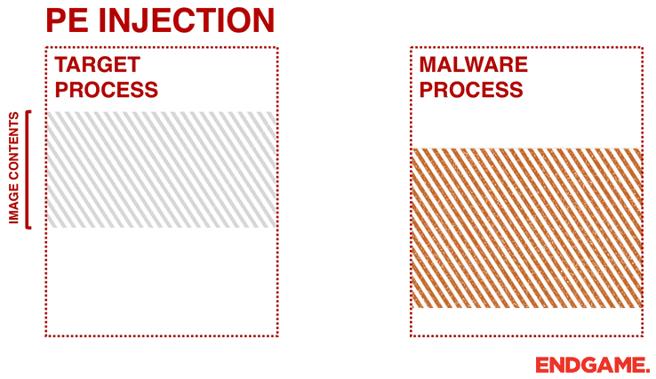

# 프로세스 인젝션

프로세스 인젝션은 실행된 프로세스나 원격 프로세스에 Position Independent Code (PIC), 흔히 쉘코드라고 불리는 작은 사이즈의 프로그램을 삽입하는 TTP. 로컬 프로세스 인젝션과 원격 프로세스 인젝션으로도 나뉘지만, 대부분 프로세스 인젝션이라고 하면 원격의 프로세스에 공격자의 쉘코드를 삽입하는 TTP를 일컫는다.&#x20;

공격자의 입장에서 프로세스 인젝션은 자신의 쉘코드의 context (맥락)을 바꾸는데 도움이 된다. 즉, 자신의 코드가 `malware.exe` 의 메모리에서 실행되는 것이 아닌, 정상적인 다른 프로그램 `explorer.exe`, `notepad.exe` 등에서 실행되기 때문에 AV/EDR 들에게 탐지될 확률이 낮아진다.&#x20;

물론 2022년도 기준으로 AV/EDR 솔루션들은 프로세스 인젝션을 상당히 강력하게 모니터링하고 높은 확률로 탐지하고 있기 때문에 공격자들의 입장에서는 기피하고 있는 TTP이기도 하다. 하지만 지난 30년간 공격자들이 많이 사용한 TTP고, 지금도 많이 사용하고 있기 때문에 기초를 닦는다는 마음가짐으로 이 페이지에 정리해본다.&#x20;

### 원리&#x20;

프로세스 인젝션은 수십가지가 있기 때문에 일반화를 하는 것은 어렵다. 하지만 기본적으로 다음의 일반적인 단계는 밟아야 한다: &#x20;

1. 생성/수집 - 원격의 프로세스에 관련된 정보를 수집하거나, 새로운 프로세스를 생성해야한다.&#x20;
2. 확보 - 프로세스에 쉘코드가 들어갈 메모리를 확보/할당해야한다.
3. 전달 - 확보한 메모리에 어떻게든 쉘코드를 전달해야한다.
4. 실행 - 전달한 쉘코드를 어떻게든 실행한다.&#x20;

간단하게 생각하면 원격의 프로세스를 알아야하고, 쉘코드를 실행할 메모리를 확보한 뒤, 전달해서 실행시켜야 프로세스 인젝션을 성공시킬 수 있다. 각 프로세스 인젝션 기법들마다 위 4단계를 진행하는 방법이 달라질 수도 있고, 단계가 더 추가되거나 빠질 수도 있다. 하지만 일반적으로 위의 4단계는 지켜야 프로세스 인젝션을 실행할 수 있다.&#x20;
