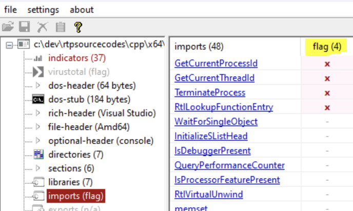

# 말웨어 자동 분석툴 Cuckoo 샌드박스 설치

## Cuckoo 샌드박스란? <a href="#cuckoo-sandbox" id="cuckoo-sandbox"></a>

Cuckoo SandBox는 말웨어를 자동으로 분석해주는 오픈 소스 샌드박스 환입니다. Cuckoo 샌드박스는오픈 소스이므로 무료로 사용할 수 있지만 설치에는 약간의 시간과 노력이 필요합니다.

## 샌드박싱이란? <a href="#what-is-sandboxing" id="what-is-sandboxing"></a>

우선 샌드박싱이란 무엇일까요? 샌드박싱은 End User가 실제 운영 환경을 모방해 안전하고 격리된 네트워크 환경에서 파일을 실행하고 관찰 및 분석하는 방식입니다. Cuckoo 샌드박스는 의심스러운 파일을Dumping 할수 있도록 개발되었으며, 이를 "샌드박싱"이라고 부릅니다.

## Cuckoo 샌드박스의 구조 <a href="#how-the-cuckoo-sandbox-structure-looks-like" id="how-the-cuckoo-sandbox-structure-looks-like"></a>

Cuckoo 샌드박스의 기본적 구조에 대해 알아봅시다. 샌드박싱 환경을 설치하는 방법은 여러 가지가 있지만 본 데모에서는  가장 간단한 구조를 구축해 보겠습니다.

아래 다이어그램은 기본 Cuckoo 샌드박스 환경이 어떻게 구성되는지 설명합니다.

<figure><figcaption></figcaption></figure>

#### **Cuckoo 호스트:**

Cuckoo 호스트는 Cuckoo 게스트와 관리하며 데이터 트래픽 관리를 담당합니다. 분석을 시작하고 트래픽을 덤프하며 보고서를 생성합니다.

**아래와 같은 스펙으로 호스트를 설치합니다:**

* 운영 체제: 우분투 22 LTS
* CPU: 가상 CPU 4 코어
* 메모리: 8GB
* 가상 IP: 192.168.121.133(고정)

**가상 네트워크 (Virtual Network):**

가상 네트워크는 가성 VM호스트와 게스트를 이어주는 네트워크입니다.

* Bridge Adapter로Cuckoo 호스트와 게스트 사이를 연결해 주세요.

**Cuckoo 게스트:**

각   분석 게스트 Analysis Guest는 악성코드가 실행되는 깨끗한 환경입니다. 맬웨어 동작은 Cuckoo 호스트에 다시 보고됩니다.

**아래와 같은 스팩으로 게스트를 설치합니다:**

* 운영 체제: Windows 7 및 Windows 10
* CPU: 가상 CPU 2 코어
* 메모리: 2GB
* 가상 IP: 192.168.121.10(Static) 및 192.168.121.20

_주의! 데이터베이스 쿼리를 저장을 위한 개별 VM을 설치하여 Cuckoo 호스트 VM과 데이터 베이스를 격리할 수도 있습니다. 일반적으로 Cuckoo 호스트 (Ubuntu에 설치할 경우)는 100GB 미만으로 설치되며 호스트 VM에 데이터베이스 저장소를 두는 것은 장기적으 사용하기에는 이상적인 환경이 아닙니다._

## 설치 단계

설치 단계는 다음의 과정을 거칩니다.

\-> Cuckoo 호스트 우분투 VM 설치&#x20;

\-> Cuckoo 게스트 윈도우 VM 설치&#x20;

\-> 윈도우 VM 구성&#x20;

\-> 네트워크 구성 요소 구성&#x20;

\-> Cuckoo 에이전트 설치&#x20;

\-> 가상 머신 스냅샷저장&#x20;

\-> Cuckoo 모듈 및 사용자 정의 구성&#x20;

\-> 작동 테스트

### Cuckoo 호스트 설치

먼저 Cuckoo 호스트 설치를 진행합니다. Cuckoo 호스트 설치 및 구성을 진행하기 전에 Cuckoo 호스트를 성공적으로 설치하려면 다음과 같은 기본 요구 사항 설정이 필요합니다.

왼쪽 빨간 네모안이 Cuckcoo 호스트입니다. 호스트 VM은 서버의 역할을 수행하며 하나의 호스트를를 설정합니다.

<figure><figcaption></figcaption></figure>

#### Cuckoo 호스트 요구 사항 설정

VMware Workstation을 다운로드하고 Ubuntu VM을 설치합니다.

본 데모에서는 VMware Workstation Pro를 사용했지만 언제든지 다른 시각화 솔루션을 사용하여도 무관합니다.

본 데모에서는 Ubuntu 리눅스 배포판을 Cuckoo 서버 호스트 OS로 설치했습니다.

* 운영 체제: 우분투 22 LTS
* CPU: 가상 CPU 4 코어
* 가상 IP: 192.168.121.133(고정)
* 메모리: 8GB


#### 파이썬 라이브러리 설치하기 (Ubuntu & Debian 기반 배포판용)

호스트를 설치하기 전에 몇 가지 필수 소프트웨어 패키지 및 라이브러리를 설치해야합니다. Cuckoo 샌드박스는 아직 Python 3을 완전히 지원하지 않으므로 다음과 같이 Python 2.7 패키지를 설치해야 합니다.

`sudo apt-get install python2 python-pip python2.7-dev libffi-dev libssl-dev`

`pip2 install virtualenv`

`pip2 install python-setuptools`

`sudo apt-get install libjpeg-dev zlib1g-dev swig`

#### MongoDB 설치

Django 기반 웹 인터페이스를 사용하기 위해서는 MongoDB가 필요합니다.&#x20;

sudo apt-get install mongodb 설치 대신에 수동 설치 (소스 코드에서)방법을 권장합니다:

```
cho "deb http://security.ubuntu.com/ubuntu impish-security main" | sudo tee /etc/apt/sources.list.d/impish-security.list
sudo apt-get update
sudo apt-get install libssl1.1
sudo apt-get install curl
curl -fsSL https://www.mongodb.org/static/pgp/server-5.0.asc | sudo apt-key add -
echo "deb [ arch=amd64,arm64 ] https://repo.mongodb.org/apt/ubuntu focal/mongodb-org/5.0 multiverse" | sudo tee /etc/apt/sources.list.d/mongodb-org-5.0.list
sudo apt update
sudo apt install mongodb-org -y
```

#### MongoDB 서비스 시작

```
sudo service mongod start && sudo systemctl enable mongod.service
```

#### TCPDUMP 설치

맬웨어 샌드박스  실행 중 발생하는 네트워크 트래픽 덤프하려면 tcpdump 패키지가 필요합니다.

```
sudo apt-get install tcpdump apparmor-utils
sudo aa-disable /usr/sbin/tcpdump
sudo setcap cap_net_raw,cap_net_admin=eip /usr/sbin/tcpdump
sudo setcap cap_net_raw,cap_net_admin=eip /usr/bin/tcpdump
sudo getcap /usr/sbin/tcpdump
```

Tcpdump 실행은 루트 권한이 필요하지만 Cuckoo가 루트로 실행되는 것을 원하지 않으므로 특정 Linux 기능을 바이너리로 설정해야합니다.

```
sudo groupadd pcap
sudo usermod -a -G pcap cuckoo
sudo chgrp pcap /usr/sbin/tcpdump
sudo setcap cap_net_raw,cap_net_admin=eip /usr/sbin/tcpdump
```

#### Volatility & M2Crypto 설치

```
git clone https://github.com/volatilityfoundation/volatility3.git
sudo pip2 install m2crypto
```

#### guacd 설치

guacd는 Cuckoo 웹 인터페이스의 원격 제어 기능을 위해 RDP, VNC 및 SSH에 대한 변환 계층을 제공하는 옵션서비스입니다.

```
sudo apt install libguac-client-rdp0 libguac-client-vnc0 libguac-client-ssh0 guacd
```

#### 호스트 VM내  Virutual 박스 설치

이제 호스트VM 내에 게스트 VM을  설치하기위한 가상화 솔루션이 필요합니다. Cuckoo 샌드박스는 대부분의 가상화 소프트웨어 솔루션을 지원합니다. 본  데모에서는 VirtualBox를 사용하며 다음과 같이 원활한수 업데이트를 위해 수동설치을 사용하는 것이 좋습니다.

```
echo deb http://download.virtualbox.org/virtualbox/debian xenial contrib | sudo tee -a /etc/apt/sources.list.d/virtualbox.list
wget -q https://www.virtualbox.org/download/oracle_vbox_2016.asc -O- | sudo apt-key add -
sudo apt-get update
sudo apt-get install -y virtualbox-5.1
sudo apt-get install virtualbox
https://developer.microsoft.com/en-us/microsoft-edge/tools/vms/
```

#### Cuckoo 호스트에 Cuckoo 서버 설치

최신 버전의 Cuckoo를 설치하는 것은 다음과 같이 간단합니다. -U 옵션을 사용하여 "cuckoo"   (현재 사용자)로 cuckoo를 설치합니다.

```
sudo pip2 install -U cuckoo
```

이제 Cuckoo서버가 호스트에 제대로 설치되었는지 확인해 보겠습니다.

<figure><figcaption></figcaption></figure>

이것으로 Cuckoo 샌드박스의 호스트 설치를 마칩니다. 이제 Cuckoo Guest 설정 방법과 Cuckoo 샌드박스 분석 결과를 검증하기 위한 악성코드 샘플 테스트 방법을 다룹니다.

### Cuckoo 게스트 설치

<figure><figcaption></figcaption></figure>

#### VirtualBox에 Cuckoo Windows 게스트 VM 설치

Windows 운영 체제는 무료로 사용할 수 없기 때문입니다. 그러나 Microsoft는 90일 무료 평가판 가상 머신을 제공하며 아래 링크에서 다운로드할 수 있습니다.



또는 인터넷에서 Windows 7 ISO를 쉽게 찾을 수 있습니다.

#### VirtualBox를 실행하고 Cuckoo Ubuntu 호스트에서 게스트 VM 생성

먼저,  VirtualBox를 실행합니다

```
sudo virtualbox
```

나중에 여러 게스트 VM을 생성할 수 있으므로 컴퓨터 이름을 cuckoo1, cuckoo2와 같이 지정해야 합니다.

<figure><figcaption></figcaption></figure>

Settings-> Display -> Enable 3D Acceleration을 활성화 시켜주세요.

<figure><figcaption></figcaption></figure>

Settings -> Storage -> CD 아이콘을 클릭하여 윈도우 .iso를 가져옵니다. 또한 호스트(Ubuntu)와 게스트(Windows) 간에 공유 폴더를 활성화하려면 최신 VBox 게스트 추가가 필요합니다.

<figure><figcaption></figcaption></figure>

Help -> About에서 VirtualBox 버전을 확인합시다. 본  데모는  6.1.32\_Ubuntu r1 49290을 실행 중입니다.

<figure><figcaption></figcaption></figure>


VirtualBox 다운로드창에 가서 버전에 맞는확장 프로그램을 다운로드하고 가져옵니다.

&#x20;[https://download.virtualbox.org/virtualbox/6.1.0/](https://download.virtualbox.org/virtualbox/6.1.0/)&#x20;

<figure><figcaption></figcaption></figure>

### 게스트윈도우 VM 구성  설정

이제 VM을 실행하고 제품 키를 사용하여 Windows 7을 설치 및 활성화합니다.

<figure><figcaption></figcaption></figure>

Windows 7 게스트VM이 부팅되면 다음과 같이 몇 가지 기본 Windows 보안 기능을 비활성화해야 합니다.

이제 게스트VM을 설정할 차례입니다. 아래와 같이 윈도우방화벽과  자동 업데이트를 비활성화 해야합니다.

**Windows 방화벽 비활성화**

맬웨어 샘플에 대한 트래픽 분석을 수행하려면 다음과 같이 Windows 방화벽을 해제해야 합니다.

<figure><figcaption></figcaption></figure>

**Windows 업데이트 비활성화**

다음으로 Windows 업데이트도 비활성화합니다.

<figure><figcaption></figcaption></figure>

**UAC를 "Never Notify"로 설정**

다음으로 사용자 계정 컨트롤을 "Never notify"으로 설정해야 합니다. UAC(사용자 계정 컨트롤)는 관리자가 권한승격을 승인할 때까지 응용 프로그램 소프트웨어를 표준 사용자 권한으로 제한하여 맬웨어가 PC를 손상시키는 것을 방지합니다. 따라서 맬웨어 분석을 위해 비활성화해야 합니다.

<figure><figcaption></figcaption></figure>

#### **관리자 계정 활성화**

마지막으로 현재 사용자를 로컬 관리자로 만듭니다.

또는 다음과 같이 관리자 계정을 활성화할 수 있습니다.

`net  user administrator /active:yes`

<figure><figcaption></figcaption></figure>

#### **공유 폴더를 위한 VirtualBox** Guest Additions **설치**

이제 Guest Additions을 추가 설치하여 호스트(Ubuntu)와 게스트(Windows) 사이에 "공유 폴더"를 마운트해야 합니다. Windows에서 인터넷을 사용하여 Python을 다운로드할 수 있지만 게스트 VM이 최소 사양으로 실행되어 느리게 실행되므로 시간이 더 오래 걸립니다. 따라서 호스트에서 필요한 파일을 다운로드하고 공유 폴더를 통해 게스트와 공유할 수 있도록 공유 폴더를 사용하십시오.

Devices -> Guest Additions CD image 삽입으로 이동합니다.

<figure><figcaption></figcaption></figure>

Yes를클릭하면 설치할 VBoxWindowsAddions를 찾을 수 있습니다.

<figure><figcaption></figcaption></figure>

설치가 완료될 때까지 다음을 클릭하십시오.

<figure><figcaption></figcaption></figure>

Devices -> Shared Folders -> Add Share -> Set the Folder Path and name -> Opt-in Auto-mount   Make Permanent 설정을 해줍니다.


#### **Python 설치**

게스트 VM에도 Python을 설치해야 합니다. 이제 파이썬 2.7.18을 다운로드합니다다.

<figure><figcaption></figcaption></figure>

[Python 릴리스 Python 2.7.18](https://www.python.org/downloads/release/python-2718/)

[Python.org](https://www.python.org/downloads/release/python-2718/)

Windows 게스트 VM에서 파일을 가져올 수 있도록 .msi를 Ubuntu 호스트의 공유 폴더에 복사합니다.

<figure><figcaption></figcaption></figure>

.

.

<figure><figcaption></figcaption></figure>

#### **Pillow 라이브러리 설치**

Pillow 라이브러리는 분석 중에 Windows 데스크톱의 스크린샷을 찍는 데 사용됩니다. 다음과 같이 설치합시다.

`cd C:\Python27\scripts\`

`C:\Python27\Scripts\pip.exe install pillow`

<figure><figcaption></figcaption></figure>

### **가상 네트워크 (Virtual Network) 구성:**

<figure><figcaption></figcaption></figure>

이제 Cuckoo Host와 Cuckoo Guest를 모두 설정했습니다. 인터넷 및 로컬 네트워크에 액세스하도록 가상 네트워크 구성을 진행할 수 있습니다.

Bridged Adapter를 사용하여 동일한 서브넷에서 호스트 및 게스트 IP를 모두 할당합니다.&#x20;

Settings -> Network -> Enable Networkt Adapter로 이동하여 Bridged Adapter에 연결합니다. 네트워크 인터페이스 "ens33"을 선택합니다.

<figure><figcaption></figcaption></figure>

Cuckoo Host IP를 확인하고 192.168.121.133를 복사해  두세요. Host와동일한 서브넷에 게스트 IP를 설정해야 합니다.

<figure><figcaption></figcaption></figure>

게스트 VM IP를 설정해 보겠습니다. Windows 게스트 VM에서 제어판 > 네트워크 및 인터넷 > 네트워크 및 공유 센터 -> 어댑터 설정 변경 -> 속성 -> 인터넷 프로토콜 버전 4(TCP/IPv4) -> 속성으로 이동합니다.

고정 IP와 DNS 서버를 다음과 같이 설정합니다.

<figure><figcaption></figcaption></figure>

IP가 제대로 설정되어 있고(ipconfig) 인터넷에 접속할 수 있는지(Ping) 확인해 봅시다.

<figure><figcaption></figcaption></figure>

### Cuckoo 에이전트 설치

Cuckoo는 Guest 내부에서 실행되고 Host와의 통신 및 데이터 교환을 처리하는 에이전트를 설치합니다.

먼저 agent.py를 데스크톱으로 이동한 다음 스크립트를 실행합니다.

<figure><figcaption></figcaption></figure>

<figure><figcaption></figcaption></figure>

### 가상 머신  스냅샷 저장

이제 가상 머신을 스냅샷 상태로 저장할 준비가 되었습니다.

그래픽 사용자 인터페이스 또는 명령줄에서 스냅샷을 만들 수 있습니다.

```
VBoxManage snapshot "cuckoo1" take "Cuckoo Test Box" --pause
```

스냅샷 생성이 완료되면 머신의 전원을 끄고 복원할 수 있습니다.

```
VBoxManage controlvm "cuckoo1" poweroff
VBoxManage snapshot "cuckoo1" restorecurrent
```

이제 위의 안내대로 모든 것이 올바르게 설정되었으면 게스트 VM을 Cuckoo에서 사용할 준비가 된겁니다!

<figure><figcaption></figcaption></figure>

### Cuckoo 모듈 구성 및 사용자 정의

거의 다 왔습니다! 이제 cuckoo 구성 모듈을 편집하기만 하면 됩니다.

먼저 cuckoo.conf 모듈을 수정하고 resultserver ip를 Cuckoo Host IP로 설정해야 합니다. 이 경우 호스트 IP는 192.168.121.133입니다.

cuckoo.conf 파일은  \~/.cuckoo/conf/cuckoo.conf에서 찾을수 있습니다.

```
vim ~/.cuckoo/conf/cuckoo.conf
```

<figure><figcaption></figcaption></figure>

그런 다음 virtualbox.conf에 유사한 설정을 적용합니다. 이 파일은 cuckoo 호스트가 생성한 게스트 VM을 가리키고 있는지 확인합니다.

```
vim ~/.cuckoo/conf/virtualbox.conf
```

머신 이름을 cuckoo1로 지정하고 IP도 192.168.121.10으로 설정했습니다.

<figure><figcaption></figcaption></figure>

똑같이 virtualbox.conf에서다음과 같이 mongdb를 활성화해야 합니다.

<figure><figcaption></figcaption></figure>

#### Processing modules**을 사용한 사용자 지정**

Cuckoo의 Processing modules  은 샌드박스에서 생성된 RAW 결과를 분석하는 사용자 정의 방법을 정의할 수 있는 Python 스크립트입니다.

Cuckoo에서 제공하는 몇 가지 기본 처리 모듈이 있습니다. 본 데모는 바이러스토탈 무료 커뮤니티 API (`cuckoo/processing/virustotal.py`)를  사용합니다. 이러한 API Integration을 통해VirusTotal.com에서 분석된 파일의 바이러스 Signature를 검색합니다. Virustotal과 통합하려면 다음과 같이 processing.conf를 편집해야 합니다.

```
vim ~/.cuckoo/conf/processing.conf
```

그런 다음 Virustotal API가 있는 아래로 스크롤하고 Enabled를 "Yes"로 변경하고 API 키를 복사하여 붙여넣습니다.

<figure><figcaption></figcaption></figure>

<figure><figcaption></figcaption></figure>

이제 Cuckoo는 맬웨어에 대해 VirusTotal 엔진을 실행할 준비가 됐습니다

### &#x20;작동 테스트

이제 테스트 실행을 할 시간입니다!

다음과 같은 간단한 명령을 사용하여 cuckoo 서버를 실행하기만 하면 됩니다:

```
cuckoo
```

웹 인터페이스를 시작하겠습니다. 다음 명령을 간단히 실행할 수 있습니다.

```
cuckoo web runserver
```

<figure><figcaption></figcaption></figure>

http://127.0.0.1:8000(기본 포트 8000)으로 이동하면 다음과 같은 웹 인터페이스가 연결결됩니다.

<figure><figcaption></figcaption></figure>

말웨어  mimikatz.exe로 테스팅 해보면 Cuckoo가 성공적으로 실행되고 게스트 VM에서 파일을 분석하고 다시 Cuckoo 호스트  서버로 보고하는 것을 확인할수 있습니다.

<figure><figcaption></figcaption></figure>

맬웨어 Analysis Summary에는 바이러스 AV signature, memory dump, network analysis 또는 스크린샷과 같은 몇 가지 유용한 정보가 표시됩니다.

<figure><figcaption></figcaption></figure>

오른쪽 탭에서는 기타 세부 정보도 확인할 수 있습니다. 예를 들어 네트워크 분석에서 pcap 파일을 다운로드할 수 있습니다.

<figure><figcaption></figcaption></figure>

### 마치며&#x20;

이제 Cuckoo 악성코드 자동 분석 솔루션이 있으니 말웨어  샘플을 가져 테스팅 해보고웨어가 어떻게  작동하는지 공부하면 된다. Happy Hacking!

\
