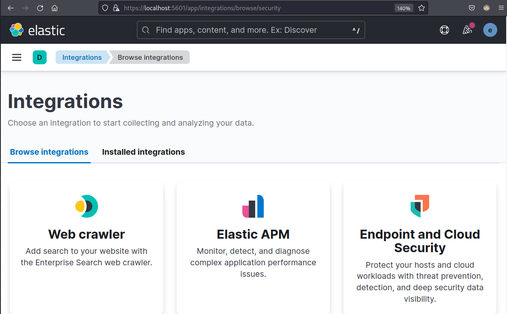
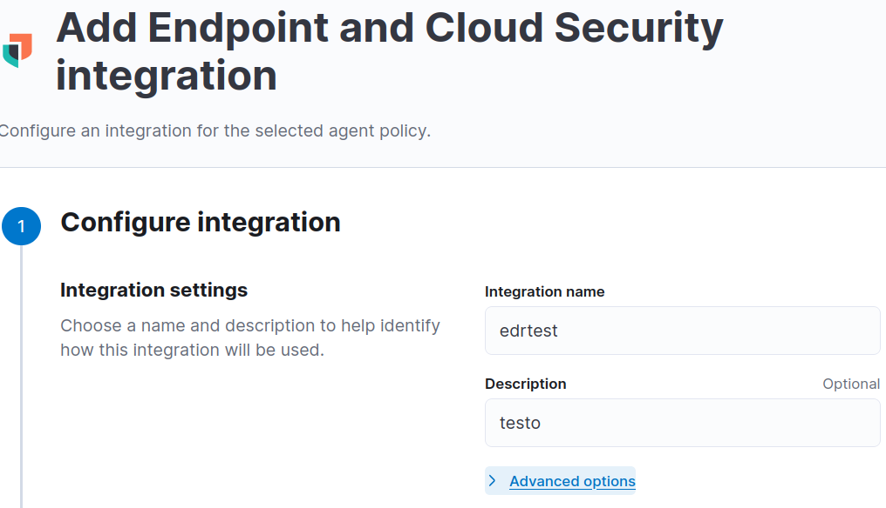
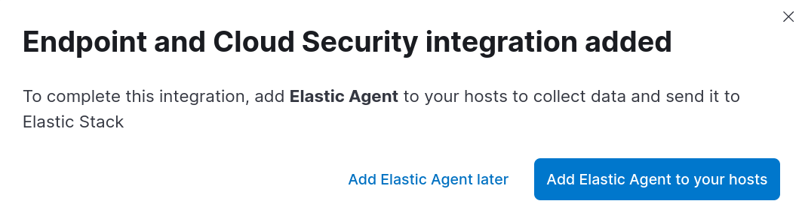
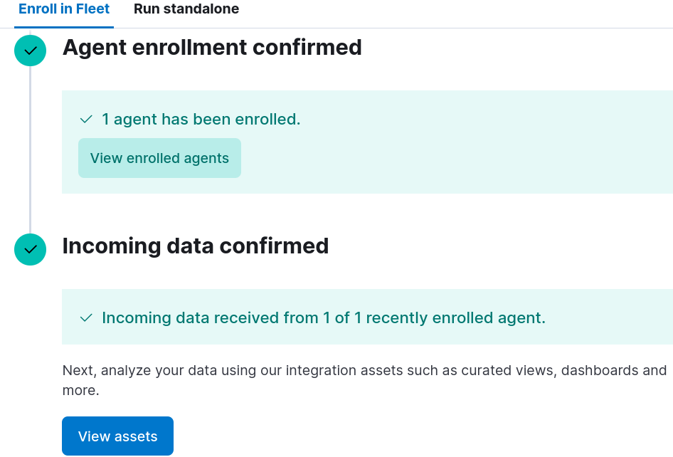
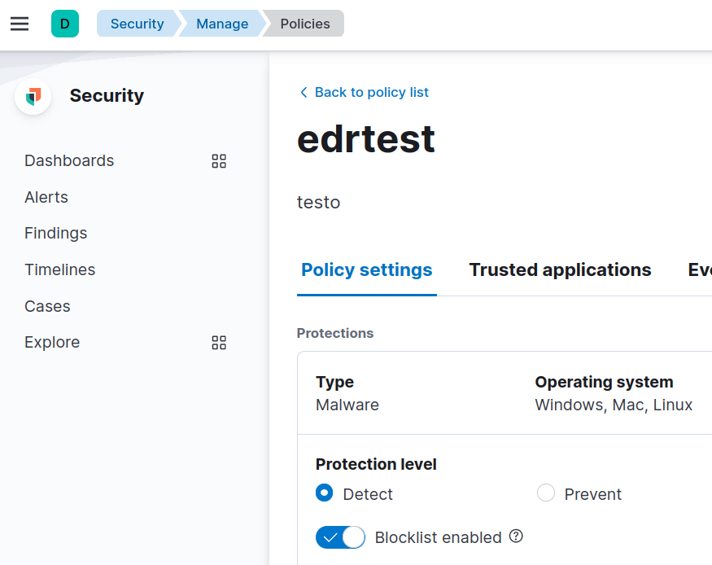

# SIEM과 EDR 솔루션 설치

이 페이지는 다음의 페이지와 비슷한 내용을 포함하고 있으니 영어가 편하신 분들은 확인하시기 바랍니다. \
[https://www.elastic.co/security-labs/the-elastic-container-project](https://www.elastic.co/security-labs/the-elastic-container-project)&#x20;

* 글을 참고 하지는 않았지만 페이지 작성이 끝난 뒤 공식 블로그 글이 있다는 것을 알아서 뒤늦게 Credit 및 레퍼런스로 첨부합니다. &#x20;

오펜시브 시큐리티 관련 공부를 하다보면 EDR 솔루션과 SIEM을 구축해 공격용 툴이나 스크립트가 어떤 IOC를 남기고 어떤 알람을 울리는지에 대해 알고 싶을 때가 많다. 하지만 기업용 EDR 솔루션이나 SIEM을 개인이 구입하기에는 금전적으로 무리가 있을 뿐더러, 아예 불가능한 경우도 많다. &#x20;

### Elastic EDR&#x20;

Elasticsearch 로 유명한 Elastic 사에서는 자사의 EDR 솔루션의 일부와 SIEM 솔루션을 무료로 배포하고 있다. 최근 Elastic 사의  [Andrew Pease](https://twitter.com/andythevariable) 라는 엔지니어분이  ELK 스택을 도커화 시킨 프로젝트를 오픈소스 했기 때문에 이를 이용해 Elastic SIEM과 EDR 을 설치해본다.&#x20;

### 요구사항&#x20;

* VMware, ESXi, VirtualBox 등의 하이퍼바이저&#x20;
* Ubuntu, Debian, Kali Linux 등의 가상머신 1대&#x20;
* 윈도우 가상머신 1대&#x20;

### 설치&#x20;

ELK 스택을 설치하기 전 필요한 의존성 패키지들을 먼저 설치한다. 깃헙 리포의 README 를 읽으셔도 된다. 이 가이드에서는 칼리 리눅스를 기반으로 설치를 진행한다.&#x20;

```
# Docker installation - Ubuntu 
https://docs.docker.com/engine/install/ubuntu/

# Docker installation - Debian 
https://docs.docker.com/engine/install/debian/

# Docker Install for Kali/Debian
sudo apt update -y 
sudo apt update -y ca-certificates curl gnupg lsb-release 
sudo mkdir -p /etc/apt/keyrings
curl -fsSL https://download.docker.com/linux/debian/gpg | sudo gpg --dearmor -o /etc/apt/keyrings/docker.gpg
echo \
  "deb [arch=$(dpkg --print-architecture) signed-by=/etc/apt/keyrings/docker.gpg] https://download.docker.com/linux/debian \
  $(lsb_release -cs) stable" | sudo tee /etc/apt/sources.list.d/docker.list > /dev/null
  
# Install Docker 
sudo apt update -y 
sudo apt install docker-ce docker-ce-cli containerd.io docker-compose-plugin 

# Install rest of the dependencies 
sudo apt install jq git curl 
```

이후 [Elasitc Container](https://github.com/peasead/elastic-container) 프로젝트 클론한 뒤 설치한다.

```
sudo git clone https://github.com/peasead/elastic-container.git
cd ./elastic-container

# ELASTIC_PASSWORD와 KIBANA_PASSWWORD를 changeme에서 다른 문자열로 바꾼다.
sudo vim ./.env 

sudo ./elastic-container.sh start 
```

스크립트는 약 10\~15분간 도커 이미지를 다운받고, 도커를 실행한다. 설치가 성공적으로 끝나면 [https://localhost:5601](https://localhost:5601) 를 방문하라는 메시지와 함께 유저이름 + 비밀번호가 나타난다.&#x20;

```
READY SET GO!

Browse to https://localhost:5601
Username: elastic
Passphrase: <위 .env 파일에서 바꾼 비밀번호> 
```

### 설정&#x20;

설치가 성공적으로 끝났다면 `https://localhost:5601` 로 가 로그인을 한 뒤 Elastic Security 과 Elastic EDR 설정을 해준다. 먼저 왼쪽 설정 탭의 맨 아래에 있는 Integrations 로 가 Endpoint and Cloud Security 를 누르고, `Add Endpoint and Cloud Security` 를 눌러 설치한다.&#x20;

<figure><figcaption><p>세번째에 있는 Endpoint and Cloud Security 클릭</p></figcaption></figure>

설정 화면에서 `Integration name`과 `Description` 은 아무렇게나 설정한다. 2번은 그냥 디폴트 상태로 설정한 뒤 진행한다.&#x20;

<figure><figcaption></figcaption></figure>

Endpoint and Cloud Security 설치가 끝나면 `Add Elastic Agent to your hosts` 버튼을 눌러 Agent 생성과 설정을 진행한다.&#x20;

<figure><figcaption></figcaption></figure>

마찬가지로 1번은 디폴트 상태로 넘기고, 2번으로 가면 Elastic (EDR) Agent 를 설치해주는 명령어들이 나온다. 이 가이드의 경우 윈도우 호스트에 EDR 에이전트를 설치할 것이기 때문에 Windows 를 누르고, 파워쉘 명령어들을 이용해 설치를 진행한다. 단, 맨 마지막줄에는 `--insecure` 플래그를 넣어준다. 다음과 같은 명령어가 나올 것이다 - 물론 IP 주소와 포트는 다르니 참고한다:&#x20;

```
$ProgressPreference = 'SilentlyContinue'
Invoke-WebRequest -Uri https://artifacts.elastic.co/downloads/beats/elastic-agent/elastic-agent-8.4.1-windows-x86_64.zip -OutFile elastic-agent-8.4.1-windows-x86_64.zip
Expand-Archive .\elastic-agent-8.4.1-windows-x86_64.zip -DestinationPath .
cd elastic-agent-8.4.1-windows-x86_64

# 맨 뒤에 --insecure 플래그 추가! 
.\elastic-agent.exe install --url=https://192.168.40.182:8220 --enrollment-token=elROTEdvTUJvYWNVSXA3ZjZCOWk6QXU5R1YtX1NTUEtvT1Y2RzRUU0lkUQ== --insecure 
```

Agent 설치 명령어가 끝나고 다시 Elastic 으로 돌아오면 Agent가 콜백을 성공적으로 했다는 메시지가 나온다.&#x20;

<figure><figcaption></figcaption></figure>

오펜시브 시큐리티 연구를 위해서는 악성코드가 꼭 실행되어야만 하는 경우가 많이 있다. 따라서 능동적 방지 (Prevention) 이 아닌 수동적 탐지 (Detection) 로 설정을 바꾼다. `Security -> Manage -> Policies` 로 가 `Protection Level` 을 `Detect` 로 설정한다.&#x20;

<figure><figcaption></figcaption></figure>

추가로 더 많은 악성코드 탐지를 위해 특정한 룰을 설정할 수도 있다. `Security -> Manage -> Rules` 로 가 원하는 룰을 활성화 한다. 예를 들자면 간단한 오픈소스 오펜시브 시큐리티 툴을 탐지하고 싶다면 `malware` 를 검색한 뒤 `Malware - Detected - Elastic Endgame` 룰을 활성화한다.&#x20;

<figure><figcaption></figcaption></figure>

### 실습&#x20;

Elastic EDR 이 실제로 잘 작동하는지 확인하기 위해 EDR 에이전트가 설치된 테스트 윈도우 박스로 가서 악성코드를 실행해본다.&#x20;

```
iex(new-object net.webclient).downloadfile('https://github.com/Flangvik/SharpCollection/raw/master/NetFramework_4.5_Any/Rubeus.exe','C:\windows\temp\rubeus.exe')

# DELETE the rubeus malware
rm c:\windows\temp\rubeus.exe
```

파워쉘을 실행하면 바로 `Malware Alert` 라는 경고문구가 뜬다. 이후 약 2\~3분 정도가 지나면 대쉬보드에 알람이 울리기 시작한다. 경우에 따라 조금 더 기다려야 할 수도 있다. &#x20;

<figure><figcaption></figcaption></figure>

<figure><figcaption></figcaption></figure>

악성코드를 탐지했다는 알람이 들어오기 시작하면 다양한 `Actions` 버튼을 눌러 정보를 확인할 수 있다.&#x20;

&#x20;

<figure><figcaption></figcaption></figure>

### 마치며&#x20;

이제 Elastic SIEM과 Elastic EDR 솔루션이 있으니 공격자의 관점과 방어자의 관점에서 창과 방패의 대결을 계속 진행하며 공부하면 된다. 오펜시브 시큐리티 툴과 악성코드는 어떤 알람을 만들어내는지, 이는 어떻게 우회할 수 있는지, 어떤 TTP가 SIEM에 어떤 알람을 만들어내는지 등에 대해서 알아본다.&#x20;

### 레퍼런스&#x20;






