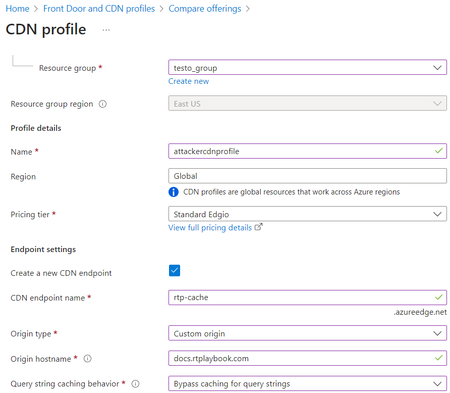
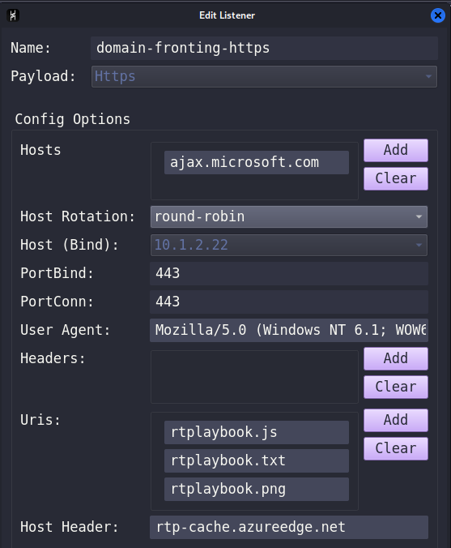
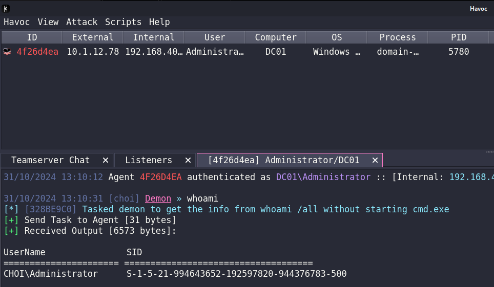

# 도메인 프론팅 - Azure CDN

본 페이지는 다음의 링크들을 바탕으로 만들어졌습니다: https://0xdarkvortex.dev/c2-infra-on-azure/, https://redops.at/en/blog/cobalt-strike-cdn-reverse-proxy-setup)

2010년대 후반부터 2020년대 초반까지, 도메인 프론팅을 악용하는 공격자들 때문에 많은 수의 CDN 서비스들이 도메인 프론팅 기능을 더 이상 지원하지 않았다. 하지만 2023년 9월, 마이크로소프트가 LimeNetwork의 CDN을 edgeio로 리브랜딩 하고, Azure에서 서비스 하기 시작하면서 해당 CDN은 도메인 프론팅을 다시 지원하고 있다.

도메인 프론팅과 관련된 개념은 [이전 글](https://www.xn--hy1b43d247a.com/infrastructure/domain-fronting)에서 설명했으니, 이번 글에서는 ParanoidNinja (Chetan Nayak)와 RedOps에서 발표한 블로그 글을 토대로 마이크로소프트사의 CDN을 이용해 도메인 프론팅을 진행한다.

실습으로는 하복 C2를 사용하지만, 도메인 프론팅의 개념을 알아보기 위해서 굳이 C2까지 사용하지 않아도 된다. 그냥 `python3 -m http.server 80` 하고 파일 가져오기 하는 것으로도 충분하다. 하지만 poc는 재미없기도 하고, C2 연습을 해보고 싶으니 하복을 이용해 진행한다.

## 준비물

* 공격자 도메인
* 공격자 리다이렉터 (+ 공인 아이피)
* 공격자 C2 (+ 공인 아이피)
* Azure 계정 및 구독

## 리다이렉터

리다이렉터는 nginx를 사용한다. 박스가 만들어지면 바로 공격자 도메인에 박스 공인 아이피를 이용해 A 레코드를 등록한다. 이 A 레코드는 추후 CDN에도 필요하다. 이후 certbot을 이용해 인증서를 받는다.

방화벽 (AWS security group)

* 80: 인터넷
* 443: 인터넷
* 22: 오퍼레이터 IP

```
# nginx + certbot 설치 
sudo apt update -y 
sudo apt install nginx python3-certbot-nginx certbot python3-certbot-dns-route53 -y

# 와일드카드를 위해 DNS 검증 
sudo certbot certonly -d '*.rtplaybook.com' -d 'rtplaybook.com' --manual --preferred-challenges=dns --agree-tos -m admin@rtplaybook.com

# certbot 가 내뱉는 값들 route53에 _acme-challenge.domain.com TXT 레코드로 생성 
# 귀찮지만 2번 해야한다 
```

그러면 다음과 같이 인증서가 나온다

```
[ . . . ] 
Successfully received certificate.
Certificate is saved at: /etc/letsencrypt/live/rtplaybook.com/fullchain.pem
Key is saved at:         /etc/letsencrypt/live/rtplaybook.com/privkey.pem
This certificate expires on 2025-01-29.
```

## C2

C2는 오픈소스 하복을 설치한다. 하복은 조만간 Rewrite 1.0 버전이 나올거기 때문에 설치 방법이 다를테니, 공식 깃헙 리포를 확인한다.

개념 증명용이라 작전보안은 최소한으로 생각했다. 때문에 포트포워딩이 귀찮아 그냥 공인 아이피를 주고, 오퍼레이터 집 IP에서 접근 가능하도록 방화벽을 설정한다.

방화벽 (AWS security group)

* 80: 10.0.0.0/8
* 443: 10.0.0.0/8
* 22: 오퍼레이터 IP
* 40056: 오퍼레이터 IP

```
하복 설치 - https://havocframework.com/docs/installation
```

## CDN

이후 Azure CDN 설정을 진행한다. 먼저 Subscription에서 CDN을 등록해 돈이 빠져나가도록 (...) 한다.

* Azure > Subscriptions > Settings > Resource Providers > CDN 검색 > Microsoft.Cdn > Register

이후, CDN을 만든다.

1. Azure > CDN > Front Door and CDN profiles > Create
2. Explore other offerings > Azure CDN Standard from Edgeio
3. 이후 CDN 이름, CDN 엔드포인트 이름, 리다이렉터의 A 레코드 등을 지정한다. Bypass caching for query strings를 지정한다.

<figure><figcaption></figcaption></figure>


4. 만든 이후 CDN > Endpoint를 클릭한 뒤, 설정을 마저 한다.

* Settings > Compression > Off
* Settings > Caching rules > Caching behavior: Bypass cache

## 테스트

먼저 하복 C2와 리다이렉터 설정을 하기전에, 간단하게 테스트를 진행한다.

```
# 리다이렉터 
mkdir /var/www/html
cd /var/www/html
echo "hello world from redirector" > hmmtesto.txt
python3 -m http.server 8443

# /etc/nginx/sites-enabled/default  맨 끝에 추가해준다. 도메인 이름만 바꾼다.  
server {
    listen 443 ssl;
    server_name rtplaybook.com docs.rtplaybook.com;

    ssl_certificate /etc/letsencrypt/live/rtplaybook.com/fullchain.pem;
    ssl_certificate_key /etc/letsencrypt/live/rtplaybook.com/privkey.pem;

    root /var/www/html;
    location / {
        try_files $uri $uri/ =404;
    }
}

sudo nginx -s reload

# 아무 호스트에서 테스트 
┌──(root㉿kali)-[/]
└─# curl https://docs.rtplaybook.com/hmmtesto.txt
hello world from redirector

┌──(root㉿kali)-[/]
└─# curl https://rtp-cache.azureedge.net/hmmtesto.txt
hello world from redirector

┌──(root㉿kali)-[/]
└─# curl https://ajax.microsoft.com/hmmtesto.txt -H 'host: rtp-cache.azureedge.net'
hello world from redirector
```

1. docs.rtplaybook - 도메인 이름도 잘 되고
2. rtp-cache.azureedge.net - CDN 이름도 잘 되고
3. ajax.microsoft.com - 도메인 프론팅도 잘 되는 것을 볼 수 있다.

특히 3번 도메인 프론팅이 성공적이였다. 실제로 ajax.microsoft.com은 존재하는 서브도메인이고 해당 아이피주소에 hmmtesto.txt 라는 파일이 없더라도, host 헤더에 공격자의 CDN 이름을 지정하면 해당 CDN으로 HTTP 요청이 날라가는 것을 확인했다.

## C2 테스트

이제 C2 로 테스트를 마무리한다.

MalleableC2로 제대로 테스트 하려면 https://github.com/ChoiSG/havoc2nginx 같은 프로젝트를 사용하면 되지만, 그냥 개념 증명용으로 간단하게 설정한다.

먼저, 하복 리스너를 만들어준다.

<figure><figcaption></figcaption></figure>

* **Hosts:** 콜백하는 주소는 ajax.microsoft.com
* **URIs:** 테스트용도로 `/rtplaybook.js` 와 txt, png
* **Host Header:** 도메인 프론팅을 통해 도달할 CDN 주소는 `rtp-cache.azureedge.net`
* **Host (bind):** 실제로 바인드 될 주소는 AWS 내부 아이피인 `10.1.2.22`

그 뒤, 리다이렉터의 nginx 설정값에서 프록시 설정과 URIs 설정을 해준다. 이전 설정에서 약간만 바꿔주면 된다.

```
root@ip-10-1-12-78:/var/www/html# cat /etc/nginx/sites-enabled/default

server {
    listen 443 ssl;
    server_name rtplaybook.com docs.rtplaybook.com;

    ssl_certificate /etc/letsencrypt/live/rtplaybook.com/fullchain.pem;
    ssl_certificate_key /etc/letsencrypt/live/rtplaybook.com/privkey.pem;

    root /var/www/html;
    location ~ ^/(rtplaybook.txt|rtplaybook.js|rtplaybook.png) {
        proxy_pass https://10.1.2.22:443;
    }
}
```

이외에도 User Agent, 아이피 블랙 리스트 등의 작전보안을 생각해도 되겠지만, 일단은 개념 증명용으로 진행한다.

## 결과

페이로드 실행 후, 콜백이 제대로 되는 것을 볼 수 있다.

<figure><figcaption></figcaption></figure>

엔드포인트의 와이어샤크에서는 다음과 같은 트래픽이 보인다. 일단 DNS로 ajax.microsoft.com을 알아낸 뒤, 모든 HTTPS 트래픽은 ajax.microsoft.com으로 보낸다. 물론 DPI이나 포워드 프록시에서 HTTPS를 드러내면 HTTP 요청의 Host 헤더에는 `rtp-cache.azureedge.net` 이 보일 것이다.

<figure><figcaption></figcaption></figure>

## 마치며

도메인 프론팅은 몇년 전 CDN 서비스 프로바이더들이 심각하게 생각하며 지원을 종료했던 기능이다. 하지만 SNI와 Host 헤더간의 차이, CDN의 특성 자체는 시간이 지나도 바뀌지 않기 때문에 도메인 프론팅이 가능한 CDN 프로바이더가 있다면 공격자들은 항상 이를 악용할 것이다. Azure의 Edgeio CDN이 도메인 프론팅을 지원하자마자 레드티머들이 사용하는 것처럼 말이다.

## 레퍼런스

* https://0xdarkvortex.dev/c2-infra-on-azure/
* https://redops.at/en/blog/cobalt-strike-cdn-reverse-proxy-setup
