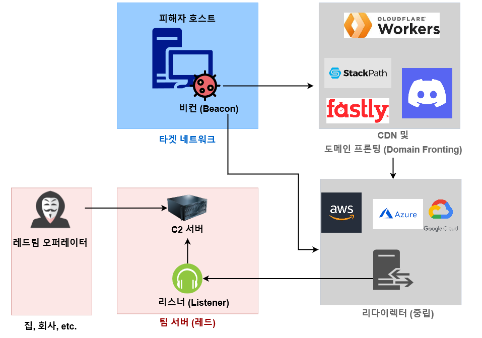

# 개념

레드팀은 실제 공격자가 아닌, 공격자들을 시뮬레이션 하는 업계 전문가들이다. 따라서 레드팀들은 실제 공격자와는 다르게 작전 실행 도중 더 큰 책임감을 갖고 작전을 수행해야한다. 계약을 맺은 고객사, 자사, 플랫폼 회사, 그리고 제 3자의 타사들의 데이터를 책임감 있고 안전하게 다루면서도 실제 공격자들을 시뮬레이션 할 줄 알아야한다.&#x20;

이런 문제점들을 해결하고 책임감 있게 레드팀 작전을 수행하기 위해선 공격자 인프라를 안전하게 구축해야한다.

## 용어 정리 (Terminology)&#x20;

### C2 서버 관련 용어&#x20;

* C2(Command and Control) 서버 - 공격자가 감염시킨 피해자 호스트들을 조종할 수 있는 중앙 서버. 봇넷 (botnet)의 중앙 서버와 비슷한 개념이다.
* 팀 서버(Teamserver) - C2 서버가 설치된 호스트.
* 리스너(Listener) - 비컨의 콜백을 받는 C2서버의 페이로드 핸들러. 프로토콜, 호스트 이름, 포트, 페이로드 종류 등을 설정한 뒤, 리스너로 "듣고" 있다가, 비컨이 해당 리스너로 콜백(callbck)해서 연결되면 그때부터 C2 서버에서 비컨 및 피해자 호스트를 조종할 수 있게 된다.
* 비컨/에이전트(Beacon, Agent) - 피해자 호스트에서 실행되어 C2 서버의 리스너로 콜백하는 악성코드의 일종. 진화된 RAT (Remote Access Trojan) 이라고도 볼 수 있다.

### 인프라 관련 용어

* 리다이렉터 (Redirector) - 인터넷 접근 가능한 클라우드 플랫폼 혹은 VPS (Virtual Private Server). 비컨으로부터 오는 콜백을 팀 서버로 리다이렉트 하는 역할을 담당한다. 리다이렉터들은 팀 서버를 인터넷에 노출하지 않기 위해 사용된다.&#x20;
* 공격자 도메인 (Domain) - 작전에 사용될 도메인 이름. &#x20;
* 도메인 프로팅 (Domain Fronting) - CDN 인프라의 특징과 HTTP/HTTPS의 특징을 이용해 비컨이 CDN으로 콜백을 하는 것처럼 보이지만 실제로는 공격자의 리다이렉터로 콜백하는 TTP 중 하나. 도메인 프론팅에 대해서는 다른 페이지에서 서술한다.&#x20;

## 레드팀 인프라 공간 개념&#x20;

 (1) (1) (1) (1).png>)

### 레드팀 인프라의 3가지 구분

* **레드팀 공간 (Red Team Space) -** 레드팀의 C2 , 설정 비밀, 패킷 캡처, 툴링이 자리잡고 있는 공간. 레드팀이 소유하고 있고 물리적으로 접근 가능한 온프레미스 하드웨어와 네트워크로 이뤄져있다. 중요하고 민감한 데이터 - 고객 데이터, API키, 비밀번호, 설정 방법, 문서 등 - 은 모두 이 레드팀 스페이스 안에서만 존재해야한다.\

* **중립/그레이 공간 (Neutral/Gray Space) -** 외부 인터넷에서 접근 가능한 레드팀 호스트들이 자리잡고 있는 공간. 작전 시 사용되는 프록시, 리다이렉터 (Redirectors), 도메인 프론팅 서버, CDN 서버 등이 작동하고 있는 클라우드/CDN 플랫폼이라고 보면 된다. 중립 공간안의 서버들은 뒤에 나올 타겟 공간에서 실행된 비컨/리버스 쉘/트래픽과 소통할 수 있다.\

* **타겟 공간 (Victim Org Space) -** 공격이 이뤄지는 타겟 기관의 네트워크로 이뤄진 공간이다. 현재 레드팀이 공격중인 타겟의 네트워크이며, 대부분 한개 이상의 비컨 (Beacon) 이 작동해 레드팀의 중립 공간의 리다이렉터로 콜백한다.

### 예시&#x20;

용어들만 나열해놓고 보니 조금 헷갈린다. 하나의 예시를 들어보자.&#x20;

 (1).png>)

레드팀 회사 소속의 "choi" (초이) 직원은 오늘도 회사에 출근한다. 초이는 회사 내 온프레미스에 있는 팀 서버로 접속한다. 회사 내 팀 서버와 고객사 피해자 호스트를 인터넷을 통해 서로 연결할 수 없기에 AWS 에다가 리다이렉터 서버를 설치해놨다. 물론 해당 리다이렉터 서버에는 방화벽이 있어 팀 서버의 IP주소와 SSH 트래픽이 아닌 모든 트래픽은 무시한다.

초이는 SSH 공개 인증키를 통해 AWS에 있는 리다이렉터에 접속한다. 접속하면서 SSH 리모트 포트 포워딩을 통해 리다이렉터의 2222/tcp 포트로 오는 모든 트래픽을 팀 서버의 443 포트로 보내도록 설정한다. 이후 리다이렉터 서버에서 다시 한 번 socat 등의 툴을 이용해 리다이렉터의 443/tcp 포트로 오는 모든 트래픽을 리다이렉터의 2222/tcp 포트로 보내도록 설정한다.

이후, 초이는 모종의 방법을 통해 피해자 타겟을 감염 시킨 뒤, 비컨을 실행시켰다. 비컨은 다음과 같은 과정을 통해 팀 서버의 리스너에 연결된다:

1. 비컨이 작전에 사용될 도메인 - `attackerchoi.com:443` 으로 콜백한다.
2. `attackerchoi.com:443` 에는 리다이렉터 서버가 자리잡고 있다. socat 의 리다이렉트를 통해 `attackerchoi.com:443` 에서 `localhost(리다이렉터):2222` 로 트래픽을 전송한다.
3. SSH 리모트 포트 포워딩에 따라 `localhost(리다이렉터):2222` 에서 팀 서버 `192.168.1.1:443` 로 트래픽을 전송한다.
4. 팀 서버의 사설 IP 주소인 `192.168.1.1:443` 에서 실행중이던 리스너는 리다이렉터가 보낸 비컨의 트래픽을 받고 연결을 확인한다.
5. 이제 공격자의 팀 서버와 피해자 호스트에서 실행중인 비컨이 연결됐다. 공격자는 이 연결을 통해 비컨에게 다양한 명령을 내릴 수 있다.

### 레퍼런스

[Responsbile Red Team](https://malcomvetter.medium.com/responsible-red-teams-1c6209fd43cc)

[Safe Red Team Infrastructure](https://malcomvetter.medium.com/safe-red-team-infrastructure-c5d6a0f13fac)

[Red Team Infra Done Right](https://notes.huskyhacks.dev/blog/red-team-infrastructure-done-right)

[Red Team Infrastructure Wiki](https://github.com/bluscreenofjeff/Red-Team-Infrastructure-Wiki)

[Infrastructure as Code](https://rastamouse.me/infrastructure-as-code-terraform-ansible/)
