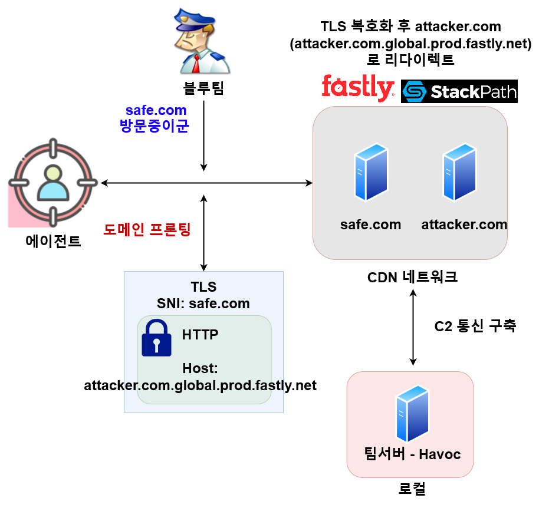
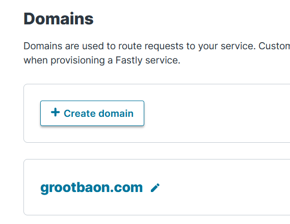
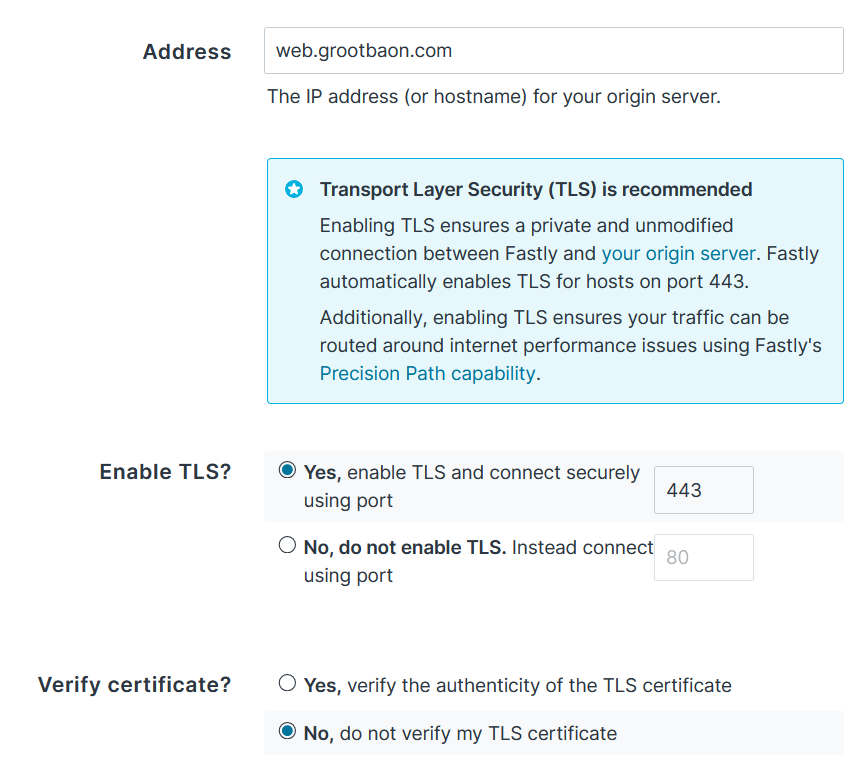
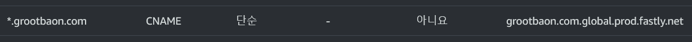
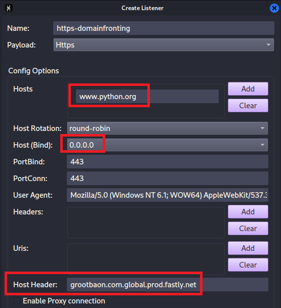
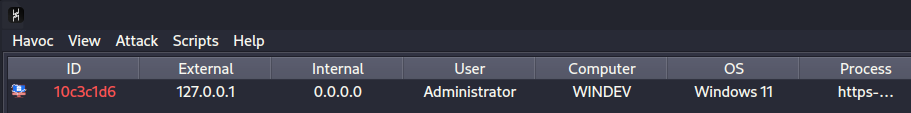
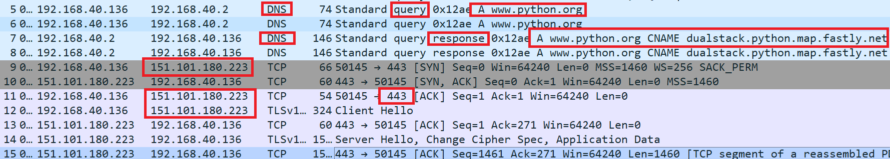

# 도메인 프론팅 (Domain Fronting)

## 개념

도메인 프론팅은 같은 CDN (Content Delivery Network)안의 호스트들을 대상으로 HTTPS 요청의 SNI (Server Name Indiction)에는 허용된 도메인의 이름을 지정한 뒤, HTTP의 요청 헤더 중 Host에는 원래 접근 불가능한 도메인을 특정해 네트워크 트래픽 검열 및 감시를 피하는 기법 중 하나다. 2018년도 이후로는 도메인 프론팅 자체를 막아버린 CDN 플랫폼들이 많아서 (CloudFront, Akamai, Azure 등) 더이상 많이 사용되지는 않지만, 그래도 꾸준히 레드팀이나 공격자들이 사용하는 기법이다.

<figure><figcaption></figcaption></figure>

Content Delivery Network (CDN) 은 전세계 고객들이 원하는 데이터와 리소스들을 빠르게 배포하기 위해 다양한 DNS CNAME 레코드들을 사용한다. 예를 들어 특정 회사에서 이미지 호스팅을 해야할 때, Fastly 라는 CDN 회사의 서버들에 CNAME 레코드를 구축해 한국과 미국의 유저들에게 빠르게 이미지를 배포할 수 있게 된다. 예를 들어, `image.naver.com` 은 `naver.com.korea.prod.fastly.net` 이라던지 `naver.com.us-east-2.prod.fastly.net` 등의 CNAME 레코드를 갖게 된다.

HTTPS SNI와 HTTP Host 헤더의 동일함 (TLS 인증서 등)을 체크하지 않는 CDN 플랫폼의 경우 HTTPS SNI는 정상적인 도메인 (예. `image.naver.com` -> `naver.com.korea.prod.fastly.net`) 을 지정해놓고, HTTP Host 헤더는 공격자의 도메인 CNAME (예. `attacker.com.korea.prod.fastly.net`) 를 지정해놓으면, CDN 회사는 트래픽을 최종적으로 공격자의 호스트 `www.attacker.com` 에 배달을 해준다.

## 네트워크 트래픽 플로우

공격자의 피싱 이메일이 성공해서 타겟에서 에이전트가 실행됐다고 가정해보자. 공격자는 이미 다양한 정보수집을 통해서 `safe.com` 이 Fastly 라는 CDN 회사의 CNAME 레코드를 가지고 있다는 것을 알게 되었다.

```
└─# nslookup -type=CNAME www.safe.com

Non-authoritative answer:
www.safe.com  canonical name = safe.com.global.prod.fastly.net.
```

위 다이어그램에서 볼 수 있듯, 공격자는 HTTPS의 SNI에는 `www.safe.com` 을 지정한 뒤, HTTP의 Host 헤더에는 `attacker.com.global.prod.fastly.net` 을 지정한다.

1. 타겟 머신은 `www.safe.com` 과 관련된 CNAME 레코드와 CNAME의 DNS 호스트 이름과 관련된 A 레코드를 받는다. 예를 들자면 `www.safe.com` == `safe.com.global.prod.fastlyi.net` 이라는 CNAME, 그리고 A 레코드는 Fastly 사의 서버 중 한대인 `1.1.1.1` IP주소를 받는다.
2. 타겟은 `1.1.1.1` 로 자신의 HTTPS 트래픽을 보낸다.
3. Fastly사의 `1.1.1.1` 서버는 TLS Handshake 를 시작한다.
4. TLS Handshake가 끝난 뒤, 연결이 구축되면 HTTP 파싱을 진행한다.
5. 어라, HTTP의 Host 헤더에는 `attacker.com.global.prod.fastly.net` 가 있다. Fastly 서버는 자신의 CDN 네트워크를 뒤져본다. 아하, 공격자가 이미 등록해놨던 `attacker.com.global.prod.fastly.net` CNAME을 찾아낸다. "우리 CDN 네트워크에 존재하는 호스트구나!"
6. Fastly 사의 `1.1.1.1` 서버는 트래픽을 `www.safe.com` 한테 보내는 것이 아니라, `attacker.com.global.prod.fastly.net` 으로 보낸다. HTTP의 Host 헤더에 그렇게 써져있었으니까.
7. 공격자는 이미 `attacker.com.global.prod.fastly.net` 에 오는 모든 트래픽을 `www.attacker.com` 이라는 자신의 팀서버에 가도록 Fastly 플랫폼에서 설정을 해뒀다. Fastly 사의 서버는 리다이렉터처럼, 자신이 받은 트래픽을 공격자 서버에게 보낸다.
8. 공격자는 에이전트의 트래픽을 받는다.

## 사전 조건

타겟 호스트가 CDN 관련 CNAME 레코드를 갖고 있다고 해서 무조건 도메인 프론팅이 가능한 것은 아니다.

1. 도메인 프론팅이 가능한 CDN이여야 한다 (Fastly, StackPath, 등). 2010년대 후반을 거치며 AWS Cloudfront, Azure, Akamai 등, 유명한 CDN 들은 모두 도메인 프론팅을 막는 대응 방안을 도입했다.
2. 공격자는 타겟과 동일한 CDN에 가입한 뒤, 자신의 공격자 도메인을 CDN에 등록 시켜 CNAME 을 성공적으로 구축해야한다. 대부분의 CDN은 공짜로 50\~100달러 정도의 크레딧을 주기 때문에 큰 문제는 없다.&#x20;

정리하자면, 도메인 프론팅이 가능한 CDN CNAME 레코드를 가지고 있는 타겟 FQDN이 있다면 공격자도 똑같은 CDN 플랫폼에 가입한 뒤 자신의 공격자 도메인(과 호스트)를 CDN에 등록, 비슷한 CNAME을 받아 도메인 프론팅을 실행할 수 있다.

## 실습 - 세팅

> 01/30/2024: Fastly가 드디어 도메인 프론팅을 중단하기로 결정했다. 따라서 2024년 2월 이후에 이 글을 보시는 분들은 아래의 실습을 진행하지 마시길 바란다 ([https://lists.torproject.org/pipermail/anti-censorship-team/2023-October/000328.html](https://lists.torproject.org/pipermail/anti-censorship-team/2023-October/000328.html)).&#x20;

이렇게 설명해도 복잡하긴 마련이다. 일단 실습을 진행한다.

**시나리오: 공격자는 피싱을 통해 IT 회사의 직원 중 한명의 컴퓨터를 장악했다. 이제, 공격자의 C2 서버로 콜백을 진행해야한다.**

1. 먼저, 타겟이 방문할만한 도메인을 찾는다. 파이썬의 공식 홈페이지가 괜찮아 보인다.

```
www.python.org 
```

2. 해당 서브도메인의 CNAME을 찾아본다.

```
└─# nslookup -type=CNAME www.python.org                             

Non-authoritative answer:
www.python.org  canonical name = dualstack.python.map.fastly.net.
```

`dualstack.python.map.fastly.net` 이라는 CNAME을 갖고 있다. 이는 Fastly CDN 플랫폼의 CNAME이다.

3. 공격자도 Fastly 에 계정을 생성한뒤, 공격자의 도메인을 생성한다.

<figure><figcaption></figcaption></figure>

4. Fastly CDN CNAME이 리다이렉트할 공격자의 호스트와 포트를 지정한다. 이미 만들어놨던 HTTP/S 리다이렉터 서버를 향하게 하자.

<figure><figcaption></figcaption></figure>

5. Settings > Request Settings > Action: Pass (do not cache) 를 설정해 요청들을 캐시하지 않는다.
6. Settings > Cache Settings > Action: Pass (do not cache) 를 설정해 캐시 하지 않도록 설정한다.
7. 공격자의 도메인으로 가 Fastly 관련 CNAME 레코드를 생성한다.

<figure><figcaption></figcaption></figure>

8. Fastly의 UI 에서 "Activate" 를 눌러 CDN 배포를 시작한다.

## 실습 - 간단

먼저 Fastly CDN에 공격자의 CNAME이 잘 설정됐고, CNAME이 리다이렉터 서버로 잘 리다이렉트 하는지 확인한다. 리다이렉터 서버에 간단한 파일을 만든뒤, Fastly CNAME 을 통해 가져와보자.

```
└─# curl https://grootbaon.com.global.prod.fastly.net/hi.txt
hello, from red team playbook!
```

이제 도메인 프론팅을 실행해보자. HTTPS SNI는 `www.python.org` 로 지정해주고, HTTP Host 헤더는 공격자의 CDN CNAME으로 지정한다.

```
└─# curl -H "Host: grootbaon.com.global.prod.fastly.net" https://www.python.org/hi.txt
hello, from red team playbook!
```

신기하다! 분명 `www.python.org` 에는 `hi.txt` 라는 파일도, 파이썬 공식 홈페이지에서 `hello, from red team playbook!` 이라는 메시지를 보낼수도 없을텐데, 해당 HTTP 응답이 돌아왔다. 이는 Fastly CDN에서 Host 헤더의 `grootbaon.com.global.prod.fastly.net` 으로 트래픽을 보냈기 때문이다.

## 실습 - 실전

cURL 도 나쁘지 않지만, 실제로 에이전트를 이용해 콜백을 진행해보자.

먼저, 팀서버에서 하복 리스너를 생성한다.

<figure><figcaption></figcaption></figure>

유의할 점은 총 3가지다.

1. Hosts: HTTPS의 SNI 와 동일하기 때문에, 도메인 프론팅에 취약한 `www.python.org` 로 지정한다.
2. Host(Bind): 리스너가 Bind 할 호스트다. 이번에도 HTTP/S 리다이렉터 + SSH 리모트 포워딩을 실행할 것이기 때문에 꼭 `0.0.0.0` 으로 지정한다.
3. Host Header: HTTP의 Host 헤더다. 공격자의 CDN CNAME 인 `grootbaon.com.global.prod.fastly.net` 으로 지정했다.

이후, 페이로드를 만들고 실행하면, 콜백이 성공적으로 오는 것을 볼 수 있다.

<figure><figcaption></figcaption></figure>

네트워크 트래픽을 살펴보자.

<figure><figcaption></figcaption></figure>

1. DNS Query: `www.python.org` 의 A 레코드를 찾는다.
2. DNS Response: CNAME `dualstack.python.map.fastly.net` 과 함께 A 레코드인 `151.101.180.223` 을 응답한다 (오른쪽이 짤렸다).
3. 이제 타겟은 오로지 Fastly 의 서버 중 하나인 `151.101.180.223` 과만 통신한다.
4. Fastly -> HTTP 리다이렉터 -> SSH 리모트 포트 포워딩 -> 하복 팀서버로 트래픽이 들어온다.

이제 블루팀은 타겟 머신이 아주 가끔, 불규칙적으로 `www.python.org` 에 HTTPS 요청을 1개씩 보내는 것을 볼 것이다. `grootbaon.com.global.prod.fastly.net` 도, HTTPS 리다이렉터의 수상한 IP 주소도, 공격자의 수상한 도메인 `www.grootbaon.com` 도 없다. 오로지 타겟 머신은 `www.python.org` 에 트래픽을 보낼 뿐이다.

블루팀이 `www.python.org` 를 막는다면, 다른 수백만개의 Fastly를 사용하는 도메인을 사용하면 그만이다. 모든 CDN을 사용하는 도메인을 막기 전까지 도메인 프론팅은 완벽하게 막을 수 없다....

## 대응 방안

라고 생각했다면 아니다. 블루팀은 어떻게 대응해야할까? 두 가지 방법이 있다.

1. CDN 회사들이 자체적으로 SNI 와 Host 헤더의 불일치를 판별. 실제로 AWS CloudFront, Azure, Google 등에서 사용하는 방법이다. 안타깝게도, 특정 CDN 회사들은 실제로 인터넷 검열을 피해 컨텐츠들을 소비해야하는 사람들을 위해서 도메인 프론팅을 계속 허용하고 있다.
2. TLS Deep Packet Inspection 이 가능한 포워드 프록시를 이용한다.

특정 회사들의 포워드/SSL 프록시는 회사/기관내 모든 네트워크 트래픽을 소화하며 TLS Deep Packet Inspection 을 실행한다. 이때 포워드 프록시가 나가는 HTTPS 트래픽을 복호화 한 뒤, HTTPS SNI와 HTTP Host 헤더의 불일치를 확인하고, 해당 트래픽을 차단시켜 버리면 된다.

우리 회사의 프록시/SSL 프록시는 도메인 프론팅을 막고 있을까? 평범하게 파이썬 공식 홈페이지, XX 회사 공식 홈페이지, 언론사등으로 나가던 회사 직원들의 HTTPS 트래픽은 사실 도메인 프론팅을 가장한, 에이전트의 C2 콜백이 아니였을까?

## 마치며

도메인 프론팅은 CDN 이라는 새로운 플랫폼이 나오며, Routing과 DNS를 누가, 어떻게 처리할 것인가에서 비롯된 재밌는 공격/검열 우회 기법 중 하나다. 인터넷이 발달할수록, 일반적인 서버가 아닌 다양한 "호스트들" (CDN, serverless, IoTs, etc.) 이 인터넷을 채워갈수록, 공격자들은 이런 다양한 호스트들을 이용해 공격을 진행하고 있다.

유행이 지난지 몇 년이 지난 기법인데도 불구하고 아직도 도메인 프론팅이 가능한 도메인은 인터넷에 수백만개 이상 널려있다. Domain Shadowing, Domain Hiding 등의 추후에 나온 기법에 취약한 도메인들은 말할 것도 없다.

원래는 인터넷 검열과 감시를 피하기 위해 나온 기법들이 공격 기법에도 악용되는 사례는 점점 늘고 있다. 도메인 프론팅과 그 유사 기법들 또한 이런 사례들 중 하나다. 앞으로 인터넷 검열은 더 심해질 것이지만, 그에 맞는 우회 기법들도 계속해서 더 나올 것이다. 이때 공격자들이 이런 기법들을 어떻게 악용할 수 있는지 확인해야할 것이다.

## 레퍼런스

* https://www.cobaltstrike.com/blog/high-reputation-redirectors-and-domain-fronting/
* https://www.optiv.com/explore-optiv-insights/blog/escape-and-evasion-egressing-restricted-networks
* https://www.optiv.com/explore-optiv-insights/blog/escape-and-evasion-egressing-restricted-networks-part-2
* https://github.com/vysecurity/DomainFrontingLists
* https://github.com/cisagov/findCDN/wiki/Domain-Fronting
* https://digi.ninja/blog/domain\_fronting.php
* https://fortynorthsecurity.com/blog/fastly-and-fronting/

