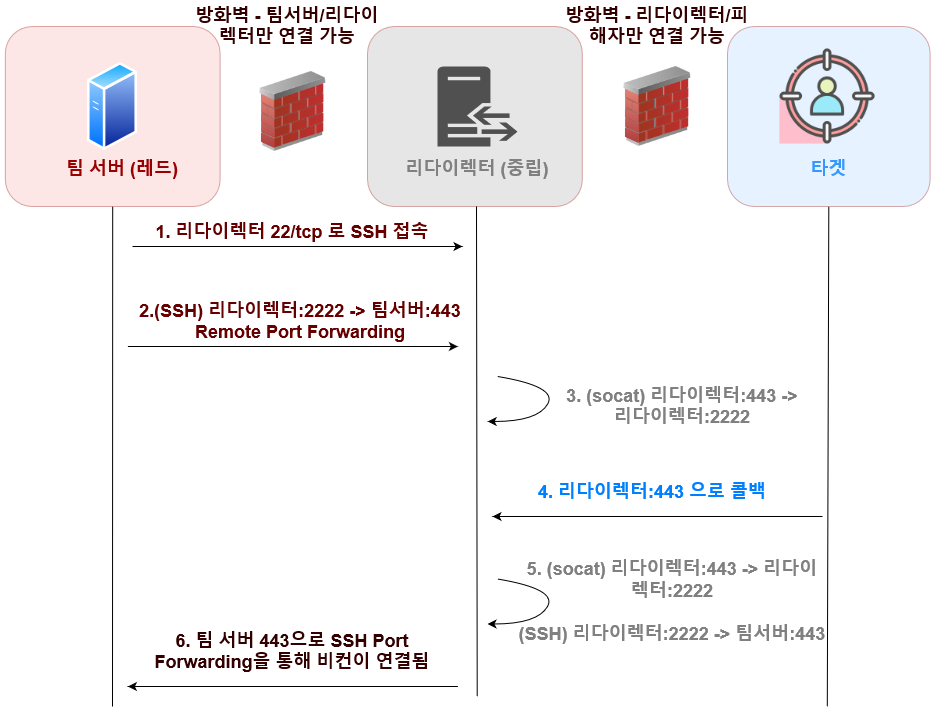
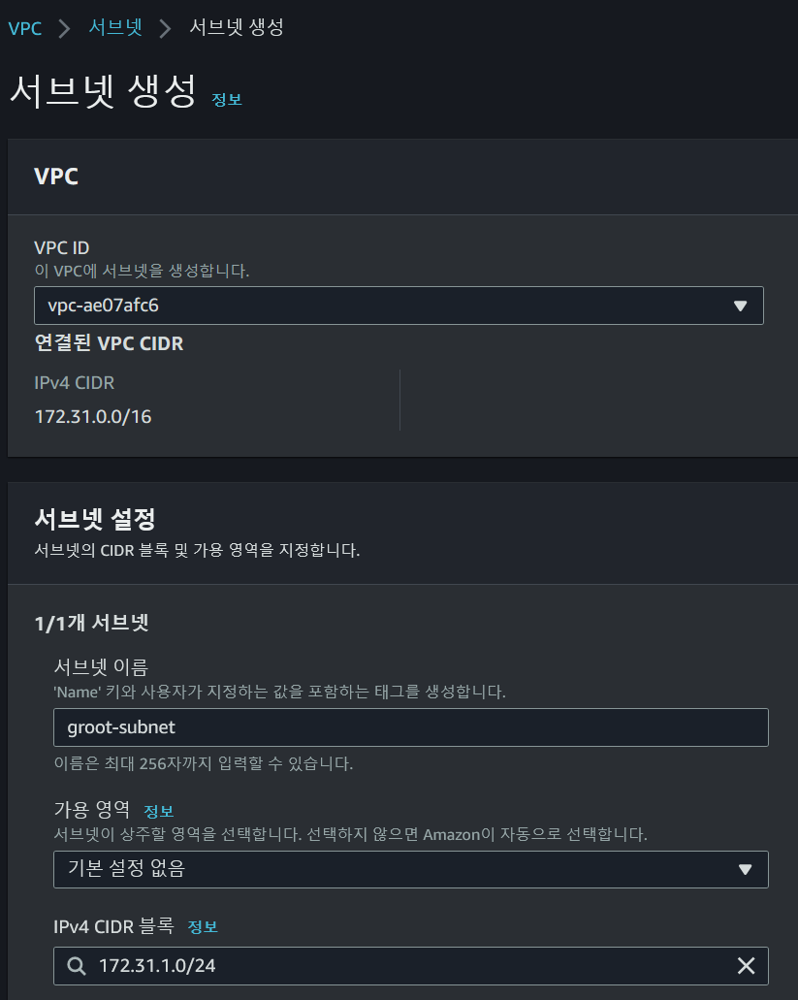
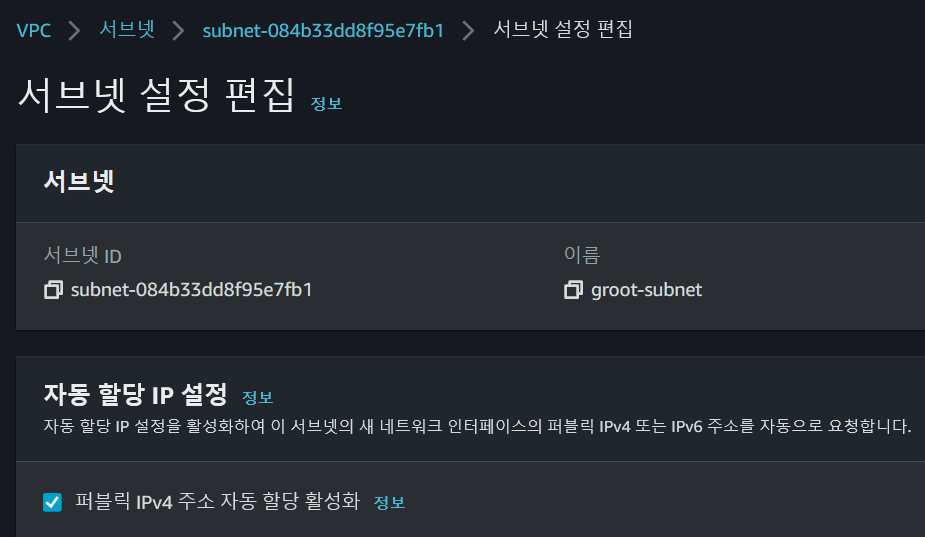
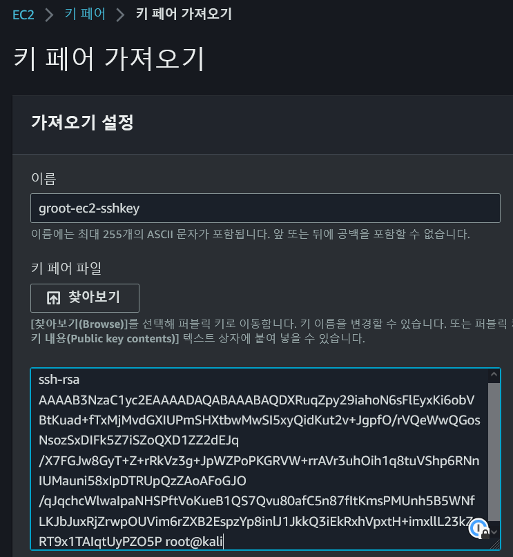
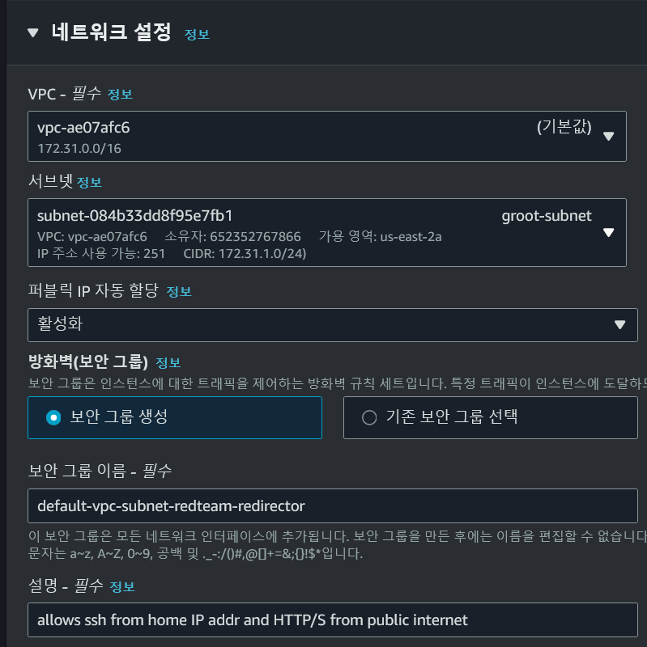
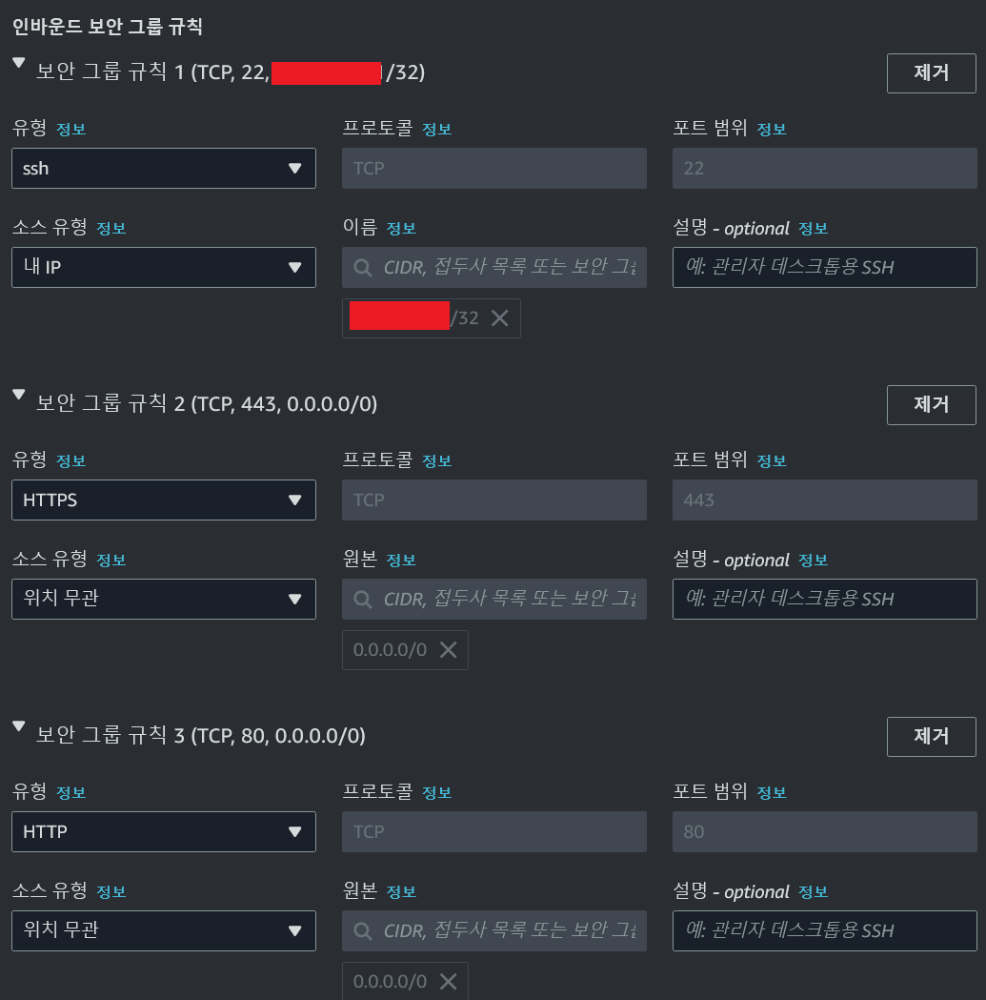
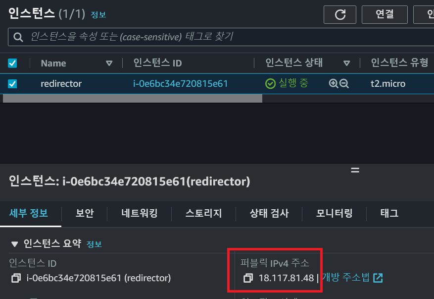
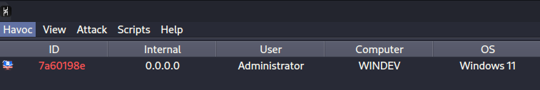
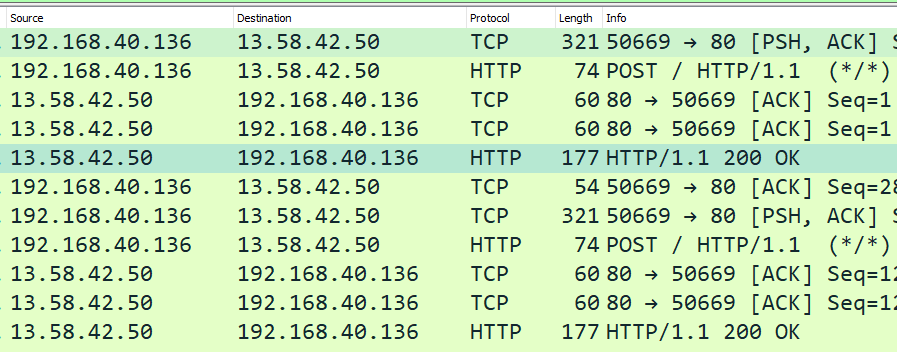

# HTTP 리다이렉터

\`\`# HTTP 리다이렉터 설정

이 페이지에서는 [example-infra.md](example-infra.md "mention") 의 개념을 참고해 레드팀 작전시 필요한 팀서버 및 HTTP 리다이렉터 (Redirector)를 AWS를 이용해 레드팀 공간과 그레이 공간에 설치해본다.

#### 개요

이 페이지에서는 다음과 같은 인프라를 구축한다.

<figure><figcaption></figcaption></figure>

해당 인프라는 비컨이 팀서버에 직접적으로 콜백하지 않고, 클라우드에 있는 리다이렉터를 거쳐 레드팀존의 팀서버로 콜백이 되게끔 설정한 아주 간단한 인프라다. 비컨과 레드팀 팀서버의 네트워크 트래픽은 아래와 같이 일어나게 된다.

<figure><figcaption></figcaption></figure>

네트워크 트래픽은 다음과 같이 진행된다. 포트는 443을 사용한다고 가정하지만, 포트는 언제든지 바뀔 수 있다.

1. 비컨 -> 리다이렉터:443
2. (socat) 리다이렉터:443 -> 리다이렉터:2222 - socat을 이용한 리다이렉션
3. (SSH remote port forwarding) 리다이렉터:2222 - 팀서버 443 - SSH 터널
4. (SSH) 팀서버 443 -> 127.0.0.1:443 - SSH 터널
5. 127.0.0.1:443 에서 실행중이던 C2 리스너와 연결

굳이 이렇게까지 트래픽을 보내는 이유는 다음과 같다.

1. 팀 서버를 직접적으로 클라우드 프로바이더 및 인터넷에 연결하지 않음으로서 작전보안과 레드팀 보안을 강화한다.
2. SSH 리모트 포트 포워딩을 통해 팀서버 -> 클라우드 접근은 가능하지만, 반대로 클라우드 -> 팀서버로의 접근은 오로지 SSH 터널을 통해서만 가능하도록 만든다. 이는 만약 리다이렉터 서버가 장악당했을 경우 공격자들이 팀서버를 향해서 어떤 네트워크적 트래픽도 보내지 못하게 하기 위함이다.

오퍼레이터가 물리적으로 접근 가능한 ("내 컴퓨터", "내 노트북") 호스트의 하이퍼바이저에 레드팀 공간을 만든다. 홈랩의 경우 그냥 이미 설치해놨던 칼리 리눅스를 사용하면 된다. 그 뒤, AWS를 이용해 VPC, 서브넷, 방화벽 설정을 마친 뒤, EC2 인스턴스를 1개 생성해 리다이렉터 서버를 구축한다. 마지막으로 타겟 호스트에서 비컨을 실행해 해당 비컨이 팀서버까지 도달할 수 있는지를 확인하며 실습을 마친다.

#### 레드팀 공간 설정

1. 하이퍼바이저와 가상머신 오퍼레이터가 실제로 사용할 가상머신을 하이퍼바이저 안에 설치한다. 이 부분은 스킵한다. 대부분 오펜시브 시큐리티에 관심이 있다면 버츄얼박스나 VMWare player/workstation 안에 칼리 리눅스를 사용하고 있을테니, 그것을 사용하면 된다.
2. C2 프레임워크 설치 Sliver, Mythic 설치해도 되지만 이번 실습에서는 비교적 최근에 나온 [Havoc Framework](https://github.com/HavocFramework/Havoc)를 #1번의 가상머신에 설치한다. 물론, 자신이 원하는 C2 프레임워크(Cobalt Strike, Brute Ratel, Nighthawk, 등)를 아무거나 설치해도 상관없다.

아래의 배시 명령어들은 칼리 리눅스 2023.1 을 기준이며, 칼리나 Havoc의 버전이 바뀔때마다 조금씩 바뀔 수 있다. 뭔가 잘 되지 않을 경우 하복 프레임워크의 공식 문서를 참고하거나 Docker 버전을 이용해 설치한다.

```
# Install Prereq 
sudo apt install -y git build-essential apt-utils cmake libfontconfig1 libglu1-mesa-dev libgtest-dev libspdlog-dev libboost-all-dev libncurses5-dev libgdbm-dev libssl-dev libreadline-dev libffi-dev libsqlite3-dev libbz2-dev mesa-common-dev qtbase5-dev qtchooser qt5-qmake qtbase5-dev-tools libqt5websockets5 libqt5websockets5-dev qtdeclarative5-dev golang-go qtbase5-dev libqt5websockets5-dev libspdlog-dev python3-dev libboost-all-dev mingw-w64 nasm

# Install python3.10 - should be installed by default, but still. 
echo 'deb http://ftp.de.debian.org/debian bookworm main' >> /etc/apt/sources.list
sudo apt update
sudo apt install python3-dev python3.10-dev libpython3.10 libpython3.10-dev python3.10

cd /opt 
git clone https://github.com/HavocFramework/Havoc.git

# Build the client 
cd /opt/Havoc/Client 
pip3 install cmake 
make

# Build the teamserver 
cd /opt/Havoc/Teamserver

go mod download golang.org/x/sys  
go mod download github.com/ugorji/go
./Install.sh 
make
./teamserver --help 
```

3. 설치가 끝났다면 하복 클라이언트로 하복 팀서버에 접속해본다. 기본 프로필을 사용하기 때문에 계정 정보는 `C5pider:password1234` 를 사용하면 된다.

```
./teamserver server -d 
./Havoc 

user: C5pider
password: password1234 
```

#### 그레이 공간 설정

그레이 공간은 AWS를 이용할 것이며, 다음의 설정들을 하면 된다.

1. 기본 VPC 안에 레드팀 전용 서브넷 생성
2. SSH 키 생성 및 설정
3. EC2 인스턴스 생성 및 리다이렉터 서버 설정

\---

1. 레드팀 전용 서브넷 생성 VPC 서비스를 검색한 뒤 왼쪽의 "서브넷"을 클릭해 이번 실습 전용 서브넷을 생성한다. 이번 실습에서는 다음과 같은 설정을 했다.

* VPC ID: 본인의 기본 AWS VPC
* 서브넷 이름: groot-subnet-1
* IPv4 CIDR: 172.31.1.0/24

<figure><figcaption></figcaption></figure>

서브넷 생성 후 오른쪽 클릭 -> 서브넷 설정 편집 -> "퍼블릭 IPv4 주소 자동 할당 활성화" 를 설정한다.

<figure><figcaption></figcaption></figure>

3. EC2 전용 SSH 키 페어 생성 후 설정 EC2 인스턴스들을 생성하기 전 접속에 필요한 SSH 키 페어를 생성한다. 팀서버가 설치된 오퍼레이터의 가상머신에서 생성하는 것을 추천한다.

```
┌──(root㉿kali)-[~/grootredteam]
└─# ssh-keygen -f rsa -b 2048 -f grootssh -q -N "" 
                                                                                            
┌──(root㉿kali)-[~/grootredteam]
└─# ls -alh   
total 16K
drwxr-xr-x  2 root root 4.0K Apr  9 20:24 .
drwx------ 43 root root 4.0K Apr  9 20:22 ..
-rw-------  1 root root 1.8K Apr  9 20:24 grootssh
-rw-r--r--  1 root root  391 Apr  9 20:24 grootssh.pub
```

이후 AWS에서 EC2를 검색한 뒤, 왼쪽의 메뉴를 쭉 내려 `네트워크 및 보안 -> 키 페어` 로 간다. 오른쪽 위의 `작업 -> 키 페어 가져오기` 를 누른다. 이름을 지정해주고, 아래의 텍스트상자에 공개 키 `grootssh.pub` 의 내용을 복사/붙여넣기 해주면 끝이다.

<figure><figcaption></figcaption></figure>

4. EC2 인스턴스 생성 다시 왼쪽의 메뉴에서 `인스턴스` 로 간 뒤, 인스턴스 시작을 누른다. 인스턴스의 이름을 대충 지정해준다.

* 애플리케이션 및 OS 이미지 - "프리 티어 사용 가능" 지정 (Amazon Linux 2023 AMI) - 아마 2023년이 지나면 2024, 2025... 이렇게 갈 것 이다.
* 인스턴스 유형: t2.micro - "프리 티어 사용 가능"
* 키 페어 (로그인) - 위에서 만들었던 키 페어 이름 지정
* 네트워크 설정 - "편집" 클릭 후 스샷 참고. 위에서 만들었던 서브넷을 지정한 뒤 아래를 참고한다.

<figure><figcaption></figcaption></figure>

그 뒤, 방화벽 설정에서 오로지 본인의 집 주소 IP에서만 SSH와 TCP/443가 가능하도록 설정한다. "내 IP" 를 누르면 본인공개IP/32 가 자동적으로 설정된다.

<figure><figcaption></figcaption></figure>

이후 다른 설정은 건들지 않고 인스턴스를 생성한다. 생성한 뒤 인스턴스를 클릭하면 하단에 공개 IP 주소가 뜬다.

<figure><figcaption></figcaption></figure>

#### 리다이렉터 서버 설정

SSH 키를 이용해 리다이렉터 서버에 접속이 가능한지 확인한다. 만약 접속이 되지 않을 경우, 다시 한 번 보안그룹 (방화벽) 설정에서 tcp/22 를 허용하고 있는지, 생성한 서브넷이 "퍼블릭 IPv4 주소 자동 할당 활성화" 가 설정되어 있는지, SSH 키는 적용을 했는지 등을 다시 한 번 확인한다.

```
└─# ssh -i grootssh ec2-user@13.58.42.50     
X11 forwarding request failed on channel 0
   ,     #_
   ~\_  ####_        Amazon Linux 2023
  ~~  \_#####\
  ~~     \###|
  ~~       \#/ ___   https://aws.amazon.com/linux/amazon-linux-2023
   ~~       V~' '->
    ~~~         /
      ~~._.   _/
         _/ _/
       _/m/'
Last login: Mon Apr 10 01:41:07 2023 from <somewhere>
[ec2-user@ip-172-31-1-220 ~]$ 
```

접속한 뒤 socat을 설치하고, 로컬호스트:2222로 리다이렉트 하도록 설정한다. 로컬호스트:2222 인 이유는 어차피 SSH 리모트 포트 포워딩을 할 것이기 때문이다.

```
sudo dnf install socat 
sudo socat tcp-listen:443,reuseaddr,fork,bind=0.0.0.0 tcp:127.0.0.1:2222
```

그 뒤, 다음의 테스트를 거쳐 리다이렉트가 잘 되는지 확인한다.

1. 레드팀 호스트에서 넷캣을 이용해 포트 443을 연다.
2. 레드팀 호스트 -> 리다이렉터로 SSH 리모트 포트 포워딩을 구축한다.
3. 아무 호스트에서나 리다이렉터의 443으로 접속해본다. 그 뒤, 트래픽이 리다이렉트 되는 것을 확인한다.

```
(레드팀) echo 'hello from redteam zone, through redirector!' > hi.txt 
(레드팀) python -m http.server 443 
(레드팀) ssh -i grootssh ec2-user@<리다이렉터IP> -R 2222:127.0.0.1:443
(레드팀) curl http://<리다이렉터>:443/hi.txt 
 
예시) 

└─# curl http://13.58.42.50:443/hi.txt
hello from redteam zone, through redirector!
```

신기하다, 분명히 `hi.txt` 파일은 레드팀, 본인의 가상머신에서 만든 파일이다. 리다이렉터에는 해당 파일이 존재하지 않는다. 그럼에도 불구하고 `http://리다이렉터:443/hi.txt` 를 방문하면, 오히려 레드팀 호스트의 `hi.txt` 파일이 반환된다. 이는 리다이렉터 덕분이다.

#### C2 리다이렉트 실습

이번에는 포트 80 HTTP를 이용해 실습을 진행한다.

1. 리다이렉터 서버에서 socat 을 실행한다 (위에서 실행중이였다면 그냥 냅둔다)
2. SSH 리모트 포트 포워딩을 해 터널을 구축한다
3. 하복 프레임워크에서 리다이렉트 관련된 리스너와 에이전트를 생성한다.
4. 에이전트 실행 후, 리다이렉트 서버를 거쳐 레드팀 호스트의 팀서버까지 잘 비컨이 도착하는지 확인한다.
5. 리다이렉트 서버 - socat 실행

```
sudo socat tcp-listen:80,reuseaddr,fork,bind=0.0.0.0 tcp:127.00.1:2222
```

2. 레드팀 호스트 - SSH 리모트 포트 포워딩 실행

```
ssh -i <ssh키> ec2-user@<리다이렉트IP> -R 2222:127.0.0.1:80
```

3. 레드팀 호스트 - 하복 프레임워크에서 리스너와 에이전트 생성

View -> Listeners 로 가 HTTP 리스너를 생성한다. Host에는 꼭 리다이렉터의 공개 IP 주소를 설정해준다. Host(Bind) 에서도 꼭 `0.0.0.0` 을 설정해줘야한다. 트래픽이 SSH 리모트 터널을 통해서 들어올 때 `127.0.0.1` 주소로 들어오기 때문이다.

<figure><figcaption></figcaption></figure>

Attack -> Payloads 로 가 페이로드를 생성한 뒤 타겟 호스트에서 실행시킨다.

<figure><figcaption></figcaption></figure>

실행하면 리다이렉터 `13.58.42.50` 로 트래픽을 날리지만, 로컬에 있는 레드팀 호스트의 팀서버에 비컨이 콜백한 것을 볼 수 있다.

<figure><figcaption></figcaption></figure>

#### 마치며

이번 페이지에서는 간단한 레드팀 공간 설정, 그레이 공간 설정 및 클라우드에서 리다이렉터 서버 운영 등에 대해서 알아봤다. 추후 도메인, HTTPS, certbot을 이용한 HTTPS 리다이렉팅을 시도해도 되고, 이 모든 과정을 테라폼으로 만들어 자동화를 진행할 수도 있을 것이다. 또한, 지금은 간단하게 하기 위해 socat을 이용한 리다이렉팅을 했지만 좀 더 세분화되고 고급 리다이렉팅을 위해서는 리버스 프록시나 nginx/apache 등을 통한 URL/URI/User-Agent/IP 화이트리스트 등을 진행할 수도 있다. 이것은 추후 다른 페이지에서 다룬다.
