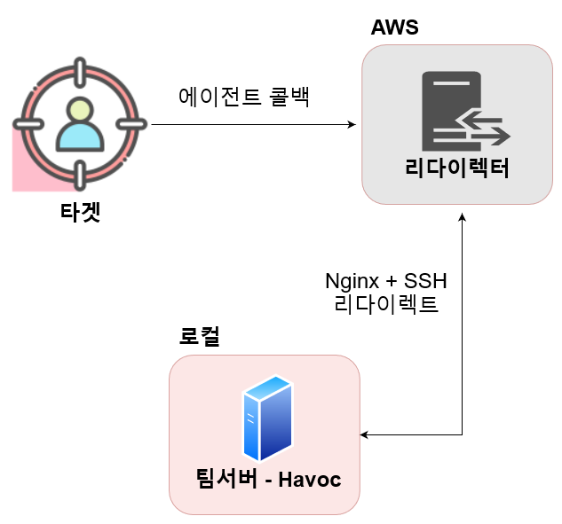
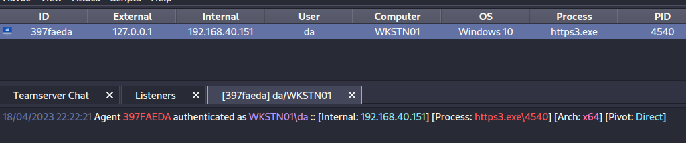

# HTTPS 리다이렉터

이 페이지에서는 [http-redirector.md](http-redirector.md "mention")의 개념을 기반으로 HTTPS 리다이렉터를 구축한다. HTTP 리다이렉터를 설치했고, 리다이렉터의 개념을 이해하고 있다면 크게 바뀌는 것은 없다.

## 개요

이 페이지에서는 다음과 같은 인프라를 구축한다.

<figure><figcaption></figcaption></figure>

위 스크린샷은 HTTP 리다이렉터 페이지의 스크린샷과 동일하다. 네트워크 트래픽의 플로우 또한 동일하다. 이와 관련된 설명은 이 페이지에서는 생략한다.

HTTP 리다이렉터때와 달라진 점은 아래와 같다.

1. Socat 대신 Nginx를 리버스 프록시 역할로 사용해 리다이렉션을 실행한다.
2. HTTPS 통신을 위해 Certbot 으로 Lets Encrypt 인증서를 발급받는다.
3. 발급 받은 인증서를 Nginx와 Havoc 프레임워크에 설정한다.

## 리다이렉터 서버 설정

이전에 구축했던 리다이렉터 EC2 인스턴스를 사용해도 되지만, 이번 실습에서는 새로 인스턴스를 생성했다. 이전 것을 사용해도 무방하다.

EC2, Subnet, SSH 키 페어 생성에 관해서는 설명을 생략한다. 이전의 페이지들을 참고한다.

* **이름:** redirector2
* **운영체제:** 우분투 22.04 LTS server "프리 티어 가능"
* **서브넷:** 생성해뒀던 서브넷 아무거나
* **보안그룹:** 22 - 집 IP, 80/443 - 모든 IPv4 에서 접근 가능

1. SSH 접속 이후, Nginx와 Certbot을 설치한다.

```
# Install necessary stuffs 
sudo apt update -y 
sudo apt install nginx -y
sudo apt install certbot python3-certbot-nginx -y 
sudo rm /etc/nginx/sites-enabled/default 
```

2. 아래의 기본 Nginx 설정 파일을 위에서 지웠던 `/etc/nginx/sites-enabled/default` 에다 쓴다.

```
// sudo vim /etc/nginx/sites-enabled/default 

server {
	listen 80 default_server;
	listen [::]:80 default_server;

	root /var/www/html;
        index index.html;
        server_name *.<도메인.com>; # CHANGE ME with your domain name! 

        location / {
                try_files $uri $uri/ @c2;
        }

        location @c2 {
                proxy_pass https://127.0.0.1:2222;
                proxy_redirect off;
                proxy_ssl_verify off;
                proxy_set_header Host $host;
                proxy_set_header X-Forwarded-For $proxy_add_x_forwarded_for;
        }
}
```

3. Certbot을 실행해 TLS 인증서를 만든다.

TLS 인증서를 받으려면 도메인이 있어야 하고, DNS에서 리다이렉터 서버의 IP주소를 가르키는 A레코드도 하나 있어야 한다. Route 53나 Namecheap 등에 가서 생성한다. 이번 실습에서는 `web.grootbaon.com` 레코드를 생성했다.&#x20;

<figure><figcaption></figcaption></figure>

또한, 0.0.0.0에서 포트 80/443 인바운드 접근하도록 보안그룹을 잘 설정했는지 확인한다. DNS A 레코드와 방화벽 설정이 좋다면 cerbot을 실행한다.

```
sudo certbot --nginx -d web.grootbaon.com --non-interactive --agree-tos -m webmaster@grootbaon.com 
```

Certbot의 좋은 점은 `--nginx` 플러그인이 스스로 Nginx 설정 파일을 업데이트 해준다는 것이다. 업데이트가 끝난 설정 파일 - `/etc/nginx/sites-enabled/default` 은 다음과 같을 것이다.

```
server {
        root /var/www/html;
        index index.html;
        server_name *.grootbaon.com; # CHANGE ME with your domain name! 

	location / {
                try_files $uri $uri/ @c2;
        }

        location @c2 {
                proxy_pass https://127.0.0.1:2222;
                proxy_redirect off;
                proxy_ssl_verify off;
                proxy_set_header Host $host;
                proxy_set_header X-Forwarded-For $proxy_add_x_forwarded_for;
        }

    listen [::]:443 ssl ipv6only=on; # managed by Certbot
    listen 443 ssl; # managed by Certbot
    ssl_certificate /etc/letsencrypt/live/web.grootbaon.com/fullchain.pem; # managed by Certbot
    ssl_certificate_key /etc/letsencrypt/live/web.grootbaon.com/privkey.pem; # managed by Certbot
    include /etc/letsencrypt/options-ssl-nginx.conf; # managed by Certbot
    ssl_dhparam /etc/letsencrypt/ssl-dhparams.pem; # managed by Certbot
}

server {
    if ($host = web.grootbaon.com) {
        return 301 https://$host$request_uri;
    } # managed by Certbot

    listen 80 default_server;
    listen [::]:80 default_server;

    server_name *.grootbaon.com;
    return 404; # managed by Certbot
}
```

작전보안을 생각하자면 보안업체들의 IP 스캐너 주소 블랙 리스트, User-Agent 화이트 리스트, URI 화이트 리스트등을 진행할 수도 있다. 단, 이번에는 빠르고 간단하게 실습을 하기 위해 어느정도의 작전보안 관련 설정은 생략한다.

4. 마지막으로 TLS 인증서 파일을 로컬 팀서버로 SCP 하기 편하도록 현재 유저의 홈 디렉토리에 가져다놓자.

```
cd ~
sudo cp /etc/letsencrypt/live/web.grootbaon.com/fullchain.pem .
sudo cp /etc/letsencrypt/live/web.grootbaon.com/privkey.pem .
sudo chown ubuntu:ubuntu fullchain.pem
sudo chown ubuntu:ubuntu privkey.pem 
```

## 팀서버 (하복) 설정

이제 거의 끝났다. 하복 프레임워크도 위에서 만든 TLS 인증서를 사용하도록 설정 한 뒤, 리스너를 만들고 에이전트를 만든 뒤 실행만 하면 된다.

1. TLS 인증서 파일을 리다이렉터 서버에서 로컬 팀 서버로 가져온다.

```
cd /root
scp -i <ssh키> ubuntu@<리다이렉터-IP>:/home/ubuntu/fullchain.pem .
scp -i <ssh키> ubuntu@<리다이렉터-IP>:/home/ubuntu/privkey.pem .
```

2. TLS 인증서 파일을 적용하도록 프로필 파일을 수정한다.

하복에 기본적으로 있는 `havoc.yaotl` 파일을 수정하자. 파일을 vim 으로 연 뒤, 맨 아래에다가 아래의 `Listeners` 블럭을 추가한다. 유의할 설정은 다음과 같다.

* Hosts = 리다이렉터 서버의 DNS 호스트이름을 추가한다.
* Cert 블럭 = `fullchain.pem` 파일과 `privkey.pem` 파일의 위치를 쓴다.

```
Listeners {
    Http {
        Name         = "HTTPS Listener"
        Hosts        = ["web.grootbaon.com"]
        HostBind     = "0.0.0.0"
        HostRotation = "round-robin"
        PortBind     = 443
        PortConn     = 443
        Secure       = true
        UserAgent    = "Mozilla/5.0 (Windows NT 6.1; WOW64) AppleWebKit/537.36 (KHTML, like Gecko) Chrome/96.0.4664.110 Safari/537.36"
        Uris         = [
            "/redteamplaybook.gif",
            "/index.php",
            "/grootsecurity.txt",
            "/index.js"
        ]
        Headers      = [
            "X-RTP-Version: Prod",
            "X-HTTP-Client: true",
        ]

        Response {
            Headers  = [
                "Content-type: text/plain",
                "X-Powered-By: ASP.NET",
            ]
        }

        Cert {
            Cert = "/root/grootredteam/fullchain.pem"
            Key = "/root/grootredteam/privkey.pem"
        }
    }
}
```

3. 팀서버 -> 리다이렉터로 SSH 리모트 포트 포워딩을 실행한다.

이 리모트 포트 포워딩으로 Nginx -> 리다이렉터:2222 -> 팀서버:443 의 네트워크 트래픽 플로우가 완성된다.

```
(팀서버) ssh -i <ssh키> ubuntu@<리다이렉터IP> -R 2222:127.0.0.1:443
```

4. 팀 서버 실행 후 에이전트를 생성한 뒤, 테스트를 해본다.

```
./teamserver server --profile ./profiles/havoc.yaotl 
```

<figure><figcaption></figcaption></figure>

External 이 127.0.0.1 인걸로 보아 SSH 터널을 통해 콜백을 한 것을 볼 수 있다.

Nginx의 `/var/log/nginx/access.log` 파일을 살펴보면 에이전트가 콜백하고 있는 것 또한 볼 수 있다.

```
ubuntu@ip-172-31-89-135:~$ cat /var/log/nginx/access.log | tail -5 

<타겟IP> - - [19/Apr/2023:03:38:19 +0000] "POST /test.txt HTTP/1.1" 200 12 "-" "Mozilla/5.0 (Windows NT 6.1; WOW64) AppleWebKit/537.36 (KHTML, like Gecko) Chrome/96.0.4664.110 Safari/537.36"
<타겟IP> - - [19/Apr/2023:03:38:22 +0000] "POST /test.txt HTTP/1.1" 200 12 "-" "Mozilla/5.0 (Windows NT 6.1; WOW64) AppleWebKit/537.36 (KHTML, like Gecko) Chrome/96.0.4664.110 Safari/537.36"
<타겟IP> - - [19/Apr/2023:03:38:24 +0000] "POST /test.txt HTTP/1.1" 200 12 "-" "Mozilla/5.0 (Windows NT 6.1; WOW64) AppleWebKit/537.36 (KHTML, like Gecko) Chrome/96.0.4664.110 Safari/537.36"
<타겟IP> - - [19/Apr/2023:03:38:26 +0000] "POST /test.txt HTTP/1.1" 200 12 "-" "Mozilla/5.0 (Windows NT 6.1; WOW64) AppleWebKit/537.36 (KHTML, like Gecko) Chrome/96.0.4664.110 Safari/537.36"
<타겟IP> - - [19/Apr/2023:03:38:29 +0000] "POST /funny_cat.gif HTTP/1.1" 200 12 "-" "Mozilla/5.0 (Windows NT 6.1; WOW64) AppleWebKit/537.36 (KHTML, like Gecko) Chrome/96.0.4664.110 Safari/537.36"
```

## 마치며

HTTPS 리다이렉터는 공격자들의 인프라에 가장 기본적인 요소 중 하나다. 이 리다이렉터가 어떻게 구축되는지 알아보고, 직접 실습해본 뒤, 방어자의 입장에서 공격자들의 인프라가 어떻게 생겼는지, 어떤 설정이 되어 있는지, 어떤 작전 보안 실패가 일어날 수 있는지 등에 대해서 알아보도록 하자.

### 레퍼런스&#x20;

* [https://coffeegist.com/security/resilient-red-team-https-redirection-using-nginx/](https://coffeegist.com/security/resilient-red-team-https-redirection-using-nginx/)
* [https://havocframework.com/docs/profiles](https://havocframework.com/docs/profiles)

