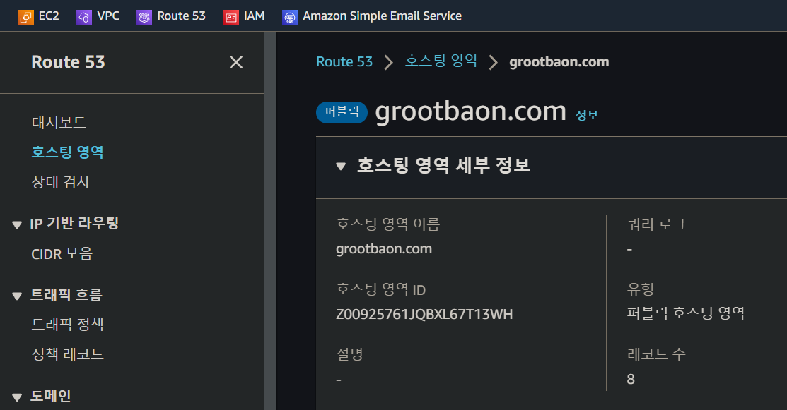
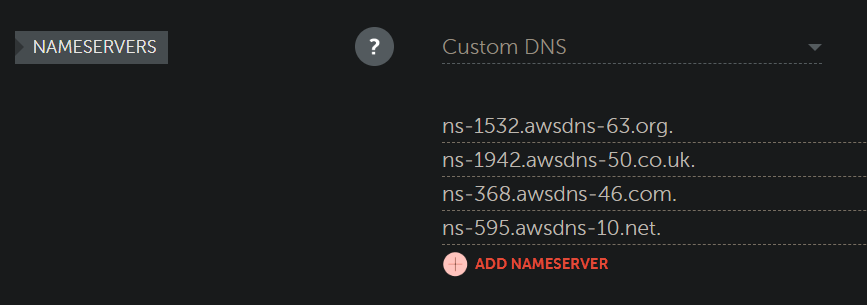
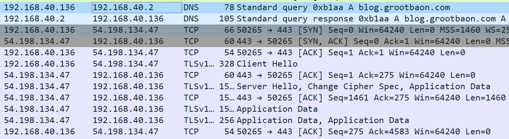
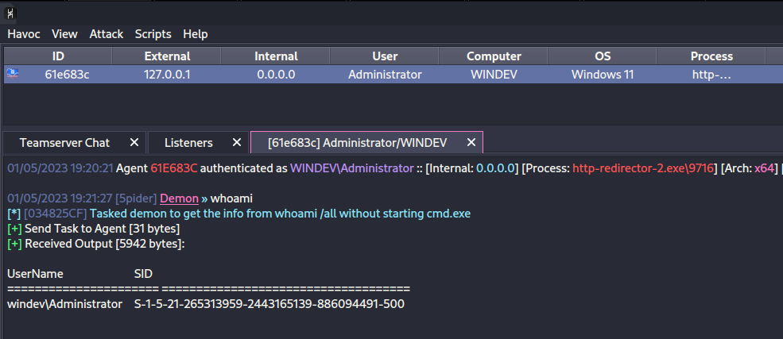

# HTTPS 리다이렉터 자동화 (AWS)

## 개요

이전 HTTPS 리다이렉터 페이지에서는 수동으로 HTTPS 리다이렉터를 설정했다. 인프라 구축을 자동화 하기 위해서 테라폼을 이용한 Infrastructure as Code (IaC) 를 진행한다.



위 테라폼 스크립트를 실행하면 AWS에 다음과 같은 인프라를 구축한다.

1. HTTPS 리다이렉터 서버와 다른 레드팀 서버들이 들어갈 VPC, Subnet, Internet Gateway, Routing Table
2. Nginx 설정이 모두 끝난 리다이렉터 서버 EC2 인스턴스
3. 리다이렉터 서버와 관련된 DNS A 레코드

구축되는 리다이렉터 서버는 다음과 같은 설정이 되어 있다.

1. 보안 업체, 위협 인텔리전스 업체, 인터넷 스캐너와 관련되어 있는 IP주소들을 블랙리스트 처리한다.
2. 특정 User Agent 만 화이트리스트 처리한다. curl, python, 스캐너들의 유저 에이전트는 모두 무시한다.
3. C2 서버의 에이전트가 아닌, "나쁜 트래픽"은 모두 `www.notion.so` 로 301 리다이렉션 처리된다.

## 사전 준비

위 테라폼 스크립트를 사용하기 위해서는 다음과 같은 사전 준비를 해야한다.

1. 테라폼을 사용하기 위한 설정 - 이전 페이지 참고 (https://www.레드팀.com/infrastructure/infra-automation/terraform)
2. AWS Route53 로 가서 도메인 등록 후 Zone ID 받아오기&#x20;

<figure><figcaption></figcaption></figure>

3. 도메인을 구입한 도메인 레지스트라(Namecheap, GoDaddy, ...)에서 AWS의 네임서버 업데이트&#x20;

<figure><figcaption></figcaption></figure>

3. `variables.tf` 를 본인이 원하는 값들로 업데이트

만약 3번에서 사용할 SSH 키가 없다면 다음 명령어로 만들어주자.

```
ssh-keygen -f rsa -b 2048 -f terraformssh -q -N ""
```


사전 준비가 많아보이지만 사실 0번과 4번은 인프라 구축을 하는 사람이라면 이미 다 준비되어 있는 부분이다. 따라서 사실상 사전 준비는 1) AWS Route53 호스팅 영역 생성 + Zone ID 받아오기 + 네임서버 업데이트 2) variables.tf 업데이트 밖에 없다.

## 실습

테라폼 스크립트를 실행해보면 다음과 같은 출력이 나온다.

```
└─# terraform init
└─# terraform plan
└─# terraform apply

[ . . . ]

Apply complete! Resources: 10 added, 0 changed, 0 destroyed.

Outputs:

outputs = <<EOT
  
  << HTTP Redirector Created >> 

  [+] VPC created           = vpc-080595e6981db6853
  [+] Subnet created        = subnet-0670c640e73a5d76b
  [+] HTTP Redirector DNS   = blog.grootbaon.com 
  [+] HTTP Redirector IP    = 54.198.134.47
  [+] SSL Fullchain.pem     = ./fullchain.pem
  [+] SSL privkey.pem       = ./privkey.pem
  [+] Allowlist User Agent  = Mozilla/5.0 (Windows NT 6.1; WOW64) AppleWebKit/537.36 (KHTML, like Gecko) Chrome/96.0.4664.110 Safari/537.36
  [+] Allowlist IP          = <REDACTED>/32

  [+] Run the following SSH command for SSH Remote Port Forwarding: 
    
    ssh -i ./groot-redteam ubuntu@blog.grootbaon.com -o StrictHostKeyChecking=no -o UserKnownHostsFile=/dev/null -R 2222:127.0.0.1:443
```

생성된 VPC, 서브넷, DNS 레코드, 아이피주소, TLS/SSL 인증서 파일 이름, 그리고 리다이렉팅을 위한 SSH Remote Port Forwarding 명령어까지 자동으로 나온다.

먼저 SSH 리모트 포트 포워딩을 진행한다.

```
ssh -i <ssh-priv-key> ubuntu@<redirector> -o StrictHostKeyChecking=no -o UserKnownHostsFile=/dev/null -R 2222:127.0.0.1:443
```

사용할 C2 프레임워크에서 테라폼이 생성한 TLS/SSL 인증서 파일을 지정해준다. 다음의 예시는 Havoc Framework 의 `havoc.yaotl` 가변적 C2 프로필 파일을 변형한 것이다.

* 맨 아래의 `Cert` 블럭을 보면 테라폼이 생성한 `fullchain.pem` 과 `privkey.pem` 파일을 설정했다.
* `Hosts`는 리다이렉터 서버의 DNS FQDN (`blog.grootbaon.com`)를 사용했다.
* `HostBind`는 SSH Remote Port Forwarding을 하기 때문에 꼭 `0.0.0.0` 으로 지정한다.
* `UserAgent`는 테라폼의 `variables.tf` 에 있는 화이트리스트 된 유저 에이전트를 사용한다.

<details>

<summary>havoc.yaotl</summary>

```
Teamserver {
	Host = "0.0.0.0"
	Port = 40056

	Build {
	    Compiler64 = "data/x86_64-w64-mingw32-cross/bin/x86_64-w64-mingw32-gcc"
	    Nasm = "/usr/bin/nasm"
	}
}

Operators {
	user "choi" {
		Password = "password1234"
	}
}

# this is optional. if you dont use it you can remove it.
Service {
    Endpoint = "service-endpoint"
    Password = "service-password"
}

Demon {
    Sleep = 2
    Jitter = 15

    TrustXForwardedFor = false

    Injection {
        Spawn64 = "C:\\Windows\\System32\\notepad.exe"
        Spawn32 = "C:\\Windows\\SysWOW64\\notepad.exe"
    }
}

Listeners {
    Http {
        Name         = "HTTPS Listener"
        Hosts        = ["blog.grootbaon.com"]
        HostBind     = "0.0.0.0"
        HostRotation = "round-robin"
        PortBind     = 443
        PortConn     = 443
        Secure       = true
        UserAgent    = "Mozilla/5.0 (Windows NT 6.1; WOW64) AppleWebKit/537.36 (KHTML, like Gecko) Chrome/96.0.4664.110 Safari/537.36"
        Uris         = [
            "/redteamplaybook.gif",
            "/index.php",
            "/grootsecurity.txt",
            "/index.js"
        ]
        Headers      = [
            "X-RTP-Version: Prod",
            "X-HTTP-Client: true",
        ]

        Response {
            Headers  = [
                "Content-type: text/plain",
                "X-Powered-By: ASP.NET",
            ]
        }

        Cert {
            Cert = "/root/youtube/grootredteam/fullchain.pem"
            Key = "/root/youtube/grootredteam/privkey.pem"
        }
    }
}
```

</details>


리스너를 생성한 뒤 Attack > Payload로 가서 에이전트를 만든 뒤 실행하면 다음과 같은 콜백이 이뤄진다. DNS 요청으로 리다이렉터 서버의 IP 주소를 알아낸 뒤, 해당 IP로 HTTPS 트래픽을 보내고 있다.&#x20;

<figure><figcaption></figcaption></figure>

그리고 성공적으로 리다이렉터 서버를 거쳐서 콜백이 된 것을 볼 수 있다.

<figure><figcaption></figcaption></figure>

블루팀의 입장에서 해당 서버를 방문해보자. 화이트리스트 되지 않은 일반적인 curl, python, 인터넷 브라우저로 해당 리다이렉터 서버를 방문하면 다른 웹사이트로 301 리다이렉팅 되는 것을 볼 수 있다.

```
└─# curl https://blog.grootbaon.com 
<html>
<head><title>301 Moved Permanently</title></head>
<body>
<center><h1>301 Moved Permanently</h1></center>
<hr><center>nginx/1.18.0 (Ubuntu)</center>
</body>
</html>
```

하지만 화이트리스트 된 유저 에이전트로 방문하면 제대로된 컨텐츠를 출력한다. 물론, 이중에서도 또 하복 프레임워크와 통신이 이어지려면 다양한 암호화키를 알아내야 할 것이고, 이는 매우 어렵다.

```
└─# curl -H 'User-Agent: Mozilla/5.0 (Windows NT 6.1; WOW64) AppleWebKit/537.36 (KHTML, like Gecko) Chrome/96.0.4664.110 Safari/537.36' https://blog.grootbaon.com

<!DOCTYPE html>
<html>
[ . . . ] 
<body>
<h1>Welcome to nginx!</h1>
<p>If you see this page, the nginx web server is successfully installed and
working. Further configuration is required.</p>

<p>For online documentation and support please refer to
<a href="http://nginx.org/">nginx.org</a>.<br/>
Commercial support is available at
<a href="http://nginx.com/">nginx.com</a>.</p>

<p><em>Thank you for using nginx.</em></p>
</body>
</html>
```

실습이 모두 끝난 뒤 생성한 모든 리소스들을 폐기하려면 다음의 명령어를 이용한다.&#x20;

```
terraform destroy 
```

## 마치며

수동으로 인프라를 구축하는 것보다 훨씬 더 간편하고 작전보안적으로도 안전한 테라폼 스크립트를 만들어봤다. 이번 테라폼은 HTTPS 리다이렉터 1개만 설치하는 아주 간단한 스크립트지만, 추후 SMTP 서버나 페이로드 다운로드 서버 등까지 합쳐서 전반적인 레드팀 인프라를 Infrastructure as Code 로만 만들어낼 수 있을 것이다.
