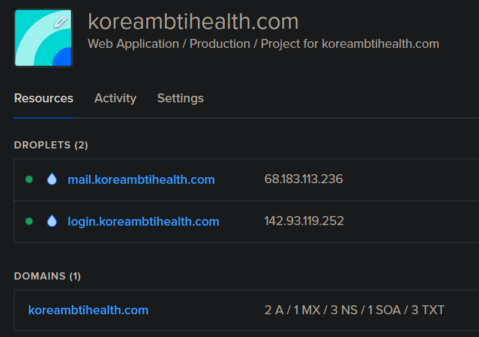
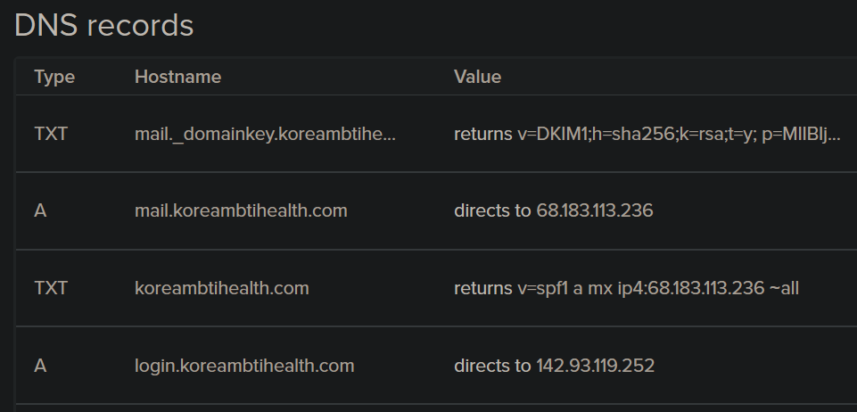
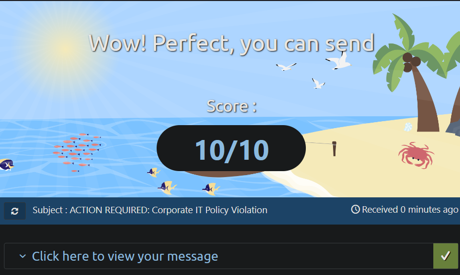

# SMTP 테라폼 자동화

### 개요

이전 페이지( [smtp-do.md](../smtp-do.md "mention") )에서는 수동으로 메일 SMTP 서버와 고피시 서버를 설정했다. 회사 입장에서 레드팀 작전을 실행할 때마다 이런 인프라를 구축한다면 엄청난 시간 낭비일 것이다. 따라서 인프라 구축을 자동화 하기 위해서 테라폼 (Terraform)을 이용한 Infrastructure as Code (IaC)를 진행한다.



테라폼 스크립트를 이용하면 짧은 시간내에 디지털오션에 다음과 같은 리소스들을 자동으로 생성할 수 있다.

1. 메일 서버 (SMTP)
2. 고피시 서버 (Gophish)
3. DNS 레코드 - A, MX, rDNS
4. 이메일 관련 DNS 레코드 - SPF, DKIM, DMARC

### 구성

테라폼 구성은 여러개의 작은 `.tf` 스크립트로 이뤄져있다. 각 스크립트들은 디지털오션(Digital Ocean - DO)의 특정한 리소스들을 만들어내고 상태(State)를 바꾼다. 예를 들어 `dns.tf` 는 DNS 레코드 및 SPF, DKIM, DMARC 설정을, `gophish.tf` 는 고피시 서버를 만든 뒤 고피시를 설치하는 등이다.

```
└─# ls -1  

configs
dns.tf
gophish.tf
init.tf
mail.tf
outputs.tf
project.tf
provider.tf
README.md
variables.tf
```

### 사용법

본격적으로 테라폼을 사용하기 전 현 운영체제에 테라폼을 설치한다.

* https://developer.hashicorp.com/terraform/tutorials/aws-get-started/install-cli

아래의 사전 준비를 끝낸 뒤 테라폼을 실행한다.

1. 도메인 레지스트라를 이용해 도메인을 구입한다.
2. 도메인의 네임 서버를 디지털오션 (혹은 다른 클라우드 서비스 프로바이더)의 네임 서버로 바꾼다.
3. 디지털오션의 토큰을 활성화한다.
4. SMTP 테라폼을 깃-클론 한 뒤, `variables.tf` 를 업데이트 하고, 테라폼을 실행한다.

```
// 깃 클론 및 variables.tf 업데이트
 
git clone https://github.com/ChoiSG/RTPSourceCodes.git
cd ./iac/smtp-terraform 
vim variables.tf 

// 테라폼 실행 

└─# terraform apply

null_resource.delete_previous_build_file: Creating...
null_resource.delete_previous_build_file: Provisioning with 'local-exec'...
null_resource.delete_previous_build_file (local-exec): Executing: ["/bin/sh" "-c" "rm -f dkim_output.txt"]
null_resource.delete_previous_build_file: Creation complete after 0s [id=353568763928876350]
digitalocean_domain.default: Creating...
digitalocean_ssh_key.default: Creating...
digitalocean_ssh_key.default: Creation complete after 0s [id=37960483]
digitalocean_droplet.gophish: Creating...

< ... 7~8분 ... > 

Apply complete! Resources: 13 added, 0 changed, 0 destroyed.

Outputs:

dkim_output = <sensitive>
outputs = <<EOT
  // INFRA 
  phishing - mail.koreambtihealth.com - 68.183.113.236
  phishing - login.koreambtihealth.com - 142.93.119.252

  // MISC 
  Gophish rid changed to: clientID

  // TODOs 
  1. Start gophish with: 
  ssh -i /root/rtp/tftesto root@142.93.119.252 -L 3333:127.0.0.1:3333

EOT

```

총 13개의 리소스들이 생성됐다는 것을 알려주며 각 서버들의 아이피주소 및 다음의 할 일들을 보여준다. 이제 고피시 서버에 들어간 뒤 고피시를 실행하기만 하면 된다.

### 결과물

테라폼이 끝나면 디지털오션에 서버들과 DNS 레코드가 생성된 것을 확인할 수 있다.

<figure><figcaption></figcaption></figure>

<figure><figcaption></figcaption></figure>

또한, 고피시를 설정한 뒤 이메일 테스트를 하면 10/10 만점으로 통과할 수 있다.

<figure><figcaption></figcaption></figure>

만약 DKIM이 제대로 설정되지 않아서 8.5\~9.0 사이의 점수를 얻는다면 메일 서버에 접속해 `systemctl restart opendkim.service` 와 `systemctl restart postfix.service` 를 하고, 10분 정도 기다린 뒤 다시 이메일 테스트를 진행한다. 원래 DKIM 자체가 시간이 좀 걸리는 편이다.

### 마치며

테라폼과 Infrastructure as Code는 레드팀 인프라 구축에서 매우 중요하다. 지금은 간단한 SMTP + 고피시 서버지만 앞으로 Evilginx2, C2 서버, HTTP 리다이렉터, 페이로드 배포 서버 등, 더 많은 리소스들을 IaC로 구축할 수 있을 것이다.

### 레퍼런스

* https://www.ired.team/offensive-security/red-team-infrastructure/automating-red-team-infrastructure-with-terraform
* https://github.dev/b1gbroth3r/red-team-infrastructure-example
* https://github.dev/ralphte/build\_a\_phish
* https://lifars.com/wp-content/uploads/2021/05/PHISHING-INFRASTRUCTURE.pdf
* https://mailtrap.io/
* https://notes.offsec-journey.com/resource-development/infrastructure-1
* https://outpost24.com/blog/Better-proxy-than-story
