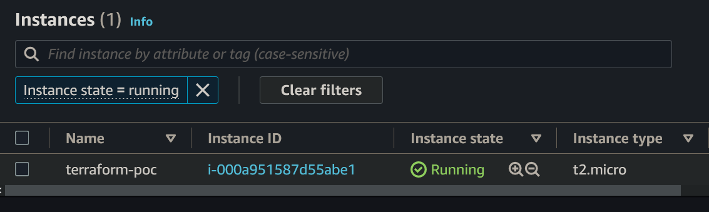

# 테라폼 (Terraform)

이번 페이지에서는 앞으로 인프라 구축 자동화와 관련된 기술 중 테라폼 (Terraform)이라는 소프트웨어를 설치하고 사용하는 법에 대해서 다룬다. 클라우드 플랫폼은 AWS를 이용한다.

레드팀 인프라 구축은 비슷한 일을 반복하고, 시간이 오래 걸리기 때문에 테라폼 (Terraform), 엔서블 (Ansible), 도커 (Docker) 등의 다양한 데브옵스 관련 소프트웨어들을 사용해 자동화 시키는 경우가 많다. 이 중 테라폼은 인프라를 코드로 표현한 뒤 구현하는 Infrastructure as a Code (IaC) 소프트웨어다. 서버, 네트워크, 스토리지, 클라우드 리소스들을 간단한 설정 언어 (Configuration Language) 로 "코딩" 한 뒤, 이를 실행하면 테라폼이 알아서 필요한 클라우드 플랫폼에 접속해 해당 인프라를 구축한다.

테라폼 워크플로우는 다음과 같다.

1. 테라폼 설치
2. (필요시) 클라우드 플랫폼 CLI 설치
3. 클라우드 플랫폼 자동화를 위한 토큰이나 API 키 등 생성
4. 테라폼 스크립트 `.tf` 제작
5. 테라폼 스크립트 실행

## 1. 테라폼 설치

테라폼 설치는 칼리 리눅스를 기반으로 진행한다. 우분투나 데비안에도 적용될 수 있다.

```
sudo apt-get update && sudo apt-get install -y gnupg software-properties-common
wget -O- https://apt.releases.hashicorp.com/gpg | \
gpg --dearmor | \
sudo tee /usr/share/keyrings/hashicorp-archive-keyring.gpg
gpg --no-default-keyring \
--keyring /usr/share/keyrings/hashicorp-archive-keyring.gpg \
--fingerprint
echo "deb [signed-by=/usr/share/keyrings/hashicorp-archive-keyring.gpg] \
https://apt.releases.hashicorp.com $(lsb_release -cs) main" | \
sudo tee /etc/apt/sources.list.d/hashicorp.list
sudo apt update -y 
sudo apt-get install terraform -y 

# Confirm terraform installation 
terraform --help 
```

## 2. 클라우드 플랫폼 CLI 설치

굳이 안해도 되지만, 이번 실습에서는 AWS를 이용하기 때문에 진행한다.

```
curl "https://awscli.amazonaws.com/awscli-exe-linux-x86_64.zip" -o "awscliv2.zip"
unzip awscliv2.zip
sudo ./aws/install

# Confirm aws cli installation  
aws --version 
```

## 3. 클라우드 플랫폼 토큰/API 키 생성

클라우드 플랫폼마다 다르니 각 플랫폼의 공식 문서를 참고한다. 이번 페이지에서는 AWS를 위주로 생성한다.&#x20;

1. 로그인 후 IAM으로 이동 https://console.aws.amazon.com/iam/
2. IAM으로 가 관리자 권한을 가진 유저를 생성한다.

Access Management > Users > Add Users

* Username: terraform
* Add User to Group
* Attach Policies Directly
  * AdmnistratorAccess
  * AdministratorAccess-Amplify

3. 유저 생성 후, 유저 클릭. Security Credentials > Create Access Key > "Command Line Interface (CLI)" 이때 생성되는 Access Key 는 딱 지금만 확인 가능하다. 패스워드 매니저에 안전하게 보관해놓는다.
4. AWS CLI 를 설정한다.

```
└─# aws configure 
AWS Access Key ID [None]: <REDACTED>                                        
AWS Secret Access Key [None]: <REDACTED>
Default region name [None]: us-east-1
Default output format [None]: text

└─# aws configure list
```

## 4. 테라폼 실행

테라폼은 항상 프로젝트 디렉토리를 만든 뒤, 해당 티렉토리에서 사용하는 것이 가장 좋다. 디렉토리 생성 후, 위에서 설정한 AWS 엑세스키와 테라폼이 잘 돌아가는지 확인하기 위해 EC2 인스턴스를 하나 만들고, 확인한 뒤, 삭제해보자.

**디렉토리 생성**

```
mkdir terraformtesto 
cd ./terraformtesto 
```

**간단 poc 테라폼 스크립트 - test.tf**&#x20;

```
terraform {
  required_providers {
    aws = {
      source  = "hashicorp/aws"
      version = "~> 4.16"
    }
  }
}

provider "aws" {
  region = "us-east-1" # Choose the desired AWS region
}

resource "aws_instance" "example" {
  ami           = "ami-007855ac798b5175e"
  instance_type = "t2.micro"

  tags = {
    Name = "terraform-poc"
  }
}

```

**테라폼 실행**

```
└─# terraform fmt 
└─# terraform plan 
└─# terraform apply 

Do you want to perform these actions?
  Terraform will perform the actions described above.
  Only 'yes' will be accepted to approve.

  Enter a value: yes

[ . . . ]

aws_instance.example: Creation complete after 33s [id=i-000a951587d55abe1]

Apply complete! Resources: 1 added, 0 changed, 0 destroyed.
```

인스턴스가 잘 생성된 것을 볼 수 있다.

SSH키를 지정해주지도 않았고, 보안 그룹 (방화벽) 설정을 해주지도 않았기 때문에 SSH 접근은 불가능하다. 그저 테라폼이 제대로 실행하는지, 엑세스 키는 잘 사용되는지, IAM 유저는 제대로된 권한을 가지고 있는지 확인하기 위한 실습이다.

<figure><figcaption></figcaption></figure>

**구축한 인프라 폐기**

```
└─# terraform destroy 

[ . . . ] 
aws_instance.example: Destruction complete after 30s

Destroy complete! Resources: 1 destroyed.
```

다시 EC2 대시보드로 가면 아무 인스턴스도 없는 것을 확인할 수 있다.

## 마치며

이렇게 간단하게 테라폼과 AWS CLI를 설치한 뒤 설정해봤다. 지금은 프로바이더로 AWS 만 자동화 하고 있지만, 점차 나아가 Namecheap와 같은 도메인 레지스트라, Zoho / Mailgun / o365 등의 메일 프로바이더들과도 연동해 다양한 백엔드를 모두 자동화 시킬 수 있다.


## 레퍼런스&#x20;

* [https://developer.hashicorp.com/terraform/tutorials/aws-get-started/install-cli](https://developer.hashicorp.com/terraform/tutorials/aws-get-started/install-cli)&#x20;
* [https://docs.aws.amazon.com/cli/latest/userguide/getting-started-install.html](https://docs.aws.amazon.com/cli/latest/userguide/getting-started-install.html)&#x20;
* [https://aws.amazon.com/getting-started/guides/setup-environment/?nc1=h\_ls](https://aws.amazon.com/getting-started/guides/setup-environment/?nc1=h\_ls)
