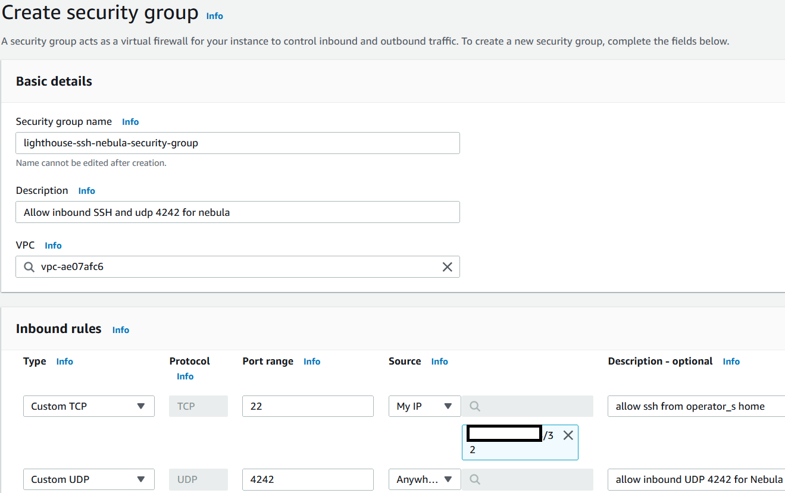
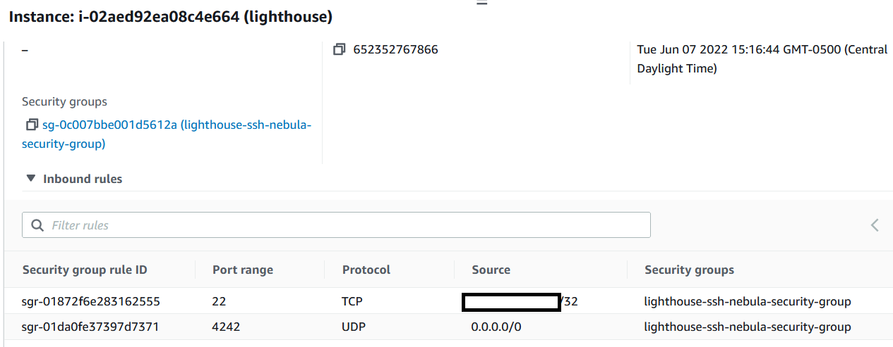

# 중립 공간 (클라우드) 설정

팀 서버와 도메인 구입/분류/신뢰도가 모두 끝났다면 리다이렉터와 네뷸라 등대서버를 클라우드에 구축한다.&#x20;

이 페이지에서는 "중립 공간 - AWS" 에 있는 네뷸라 서버와 리다이렉터 서버를 구축해본다.

### 클라우드 설정

리다이렉터 서버를 올리기 전, 먼저 클라우드 관련된 설정을 진행한다. 이 글에서는 AWS를 이용하기 때문에 AWS 계정을 생성하고, 결제 방법을 설정한 뒤, 다중 인증(MFA)를 설정한다.

이후 클라우드 및 서버 접속에 사용할 SSH 공개키를 만든다. 이때 작전보안을 위해서 각 서버들마다 1개씩의 SSH key를 만든다. `aws-redirector-ssh` 키와 `aws-lighthouse-ssh` 키를 각각 리다이렉터 서버와 네뷸라 등대 서버를 위해 만든다.

 (1) (1).png>)

### VPC 생성&#x20;

VPC가 기본적으로 있다면 생략해도 되는 단계다. 나 같은 경우는 완전히 모든 리소스와 VPC를 제거한 뒤에 새롭게 설정한 계정이라 이 단계를 꼭 수행해야만 했다. VPC에 들어가서 현재 가지고 있는 CIDR 안에 다른 서브넷을 구축한다.&#x20;

 (1) (1) (1) (1) (1).png>)

### 리다이렉터 서버 구축&#x20;

SSH 키가 등록됐다면 EC2 화면으로가 새로운 EC2 인스턴스를 2개 생성한다. 이름을 집어넣고, 키 페어와 인바운드 SSH 방화벽 설정을 해준다. 작전보안을 위해 본인이 사용하고 있는 공인 아이피에서"만" SSH가 되도록 설정한다.

* 이름 - redirector / lighthouse
* 머신 이미지 - Ubuntu 22.04 LTS, x64&#x20;
* Key Pair - `aws-redirector-ssh`
* 서브넷 - 가지고 있는 서브넷&#x20;
* Auto-Assign public IP - Enabled&#x20;
* 방화벽 - Create Security Group, Allow SSH Traffic From - 내 공인 아이피주소/32&#x20;

 (1) (1) (1) (1).png>)

Security Group은 AWS의 가상 방화벽 룰들의 집합이라고 생각하면 된다. 내가 원하는 방화벽 룰 들을 하나의 집합 (Security Group)으로 만든 뒤, 이 Security Group을 특정 VPC안에 있는 서브넷 혹은 인스턴스들에게 적용할 수 있다.&#x20;

위에서 EC2 인스턴스를 만들때 오퍼레이터(본인)의 공인 아이피주소에서만 SSH가 가능하도록 설정했었다. 하지만 Security Group 생성/삭제/설정도 연습해볼겸, 다시 새로운 방화벽 세팅을 만들어서 적용해보자. 먼저 EC2 -> Network & Security -> Security Groups 로 간다. 이후 `Create Security Group` 을 눌러 새로운 방화벽 설정을 만든다.

먼저 네뷸라 등대서버의 방화벽 설정을 만들어보자. 네뷸라 등대서버는

1. (인바운드) 오퍼레이터(본인)의 집 공인 아이피주소에서 SSH 접속이 가능해야하며
2. (인바운드) 모든 IPv4 에서 UDP/4242 포트로 접속이 가능해야한다. 그 이유는 네뷸라의 프로토콜이 사용하는 포트가 4242이기 때문이다. 제대로된 네뷸라 세팅이 되어있지 않으면 UDP/4242 포트로 그 어떤 트래픽을 보내도 무시당하기 때문에 인터넷에 포트 4242를 열어놔도 문제가 없다.
3. (아웃바운드) 아웃바운드는 아무런 방화벽을 설정하지 않아도 된다. Allow All Traffic으로 모두 열어놓자.&#x20;

해당 시큐리티 그룹을 만들면 최종적으로는 이렇게 된다:

이후 EC2 인스턴스 -> 등대 서버 인스턴스 오른쪽 클릭 -> Security -> Change Security Groups 로 가서 원래 있던 Security Group을 삭제하고, 위에서 만들었던 `lighthouse-ssh-nebula-security-group` 을 적용시켜준다.

제대로 Security Group을 바꿨다면 등대 서버 인스턴스를 클릭했을 때 나오는 시큐리티 그룹이 바뀌어있을 것이다.&#x20;

이렇게 인프라 생성에 필요한 VPC, SSH Key pair, EC2 instances, 그리고 Security Group 까지 모두 설정을 끝냈다. 이 뒤에서는 실제로 네뷸라 등대 서버와 리다이렉터 서버로 접속해 네뷸라를 설치해보자.
