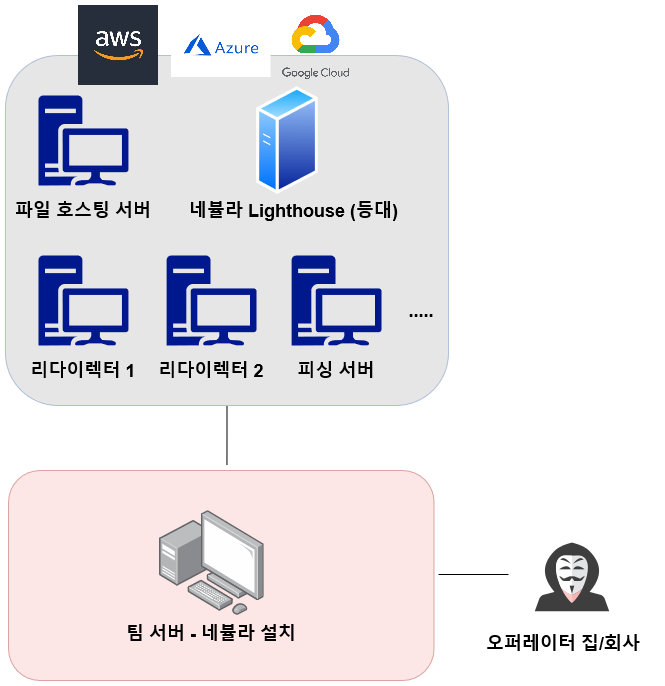

# 네뷸라 (Nebula)

### 네뷸라&#x20;

네뷸라는 Mesh-topology 형태의 VPN으로서, 각기 다른 지역과 클라우드 플랫폼에 배포된 수천, 수만대의 호스트들을 하나의 같은 네트워크안에서 관리하게끔 해주는 네트워킹 툴이다.&#x20;

레드팀 인프라를 구축할 때 어떤 문제가 생기는지, 그리고 네뷸라가 이 문제를 어떻게 해결해주는지에 대해서 알아본다.&#x20;

### 문제

레드팀 작전을 수행하면서 수 많은 서버들을 실시간으로 만들고 없애는데, 항상 같은 네트워크안에서 모든 호스트들을 연결하고 관리할 수 있는 방법이 없을까?

다양한 지역 (클라우드 플랫폼, 데이터 센터, 온-프레미스, 클라우드 region)에 흩어져 있는 호스트들을 모두 연결하고 관리하고 싶은데, 어떤 방법이 없을까?

VPN을 사용하면 된다! 는 절반 정도 맞는 정답이다. 전통적인 VPN은 다음과 같은 문제점이 있다:

* 전통적인 VPN은 중앙 서버가 VPN 관리를 담당하는 스타 토폴로지 (Star-Topology) 형태다. 모든 노드들이 중앙 서버를 거쳐야 하기 때문에 이 중앙 서버에 많은 트래픽이 가중된다. 또한, 노드들이 다양한 지역에 분포될수록 속도가 느려진다. 예를 들어 AWS의 US-East-2 리전과 navercloud의 KR-1 리전에서, GCP에 있는 Central-EU-1 중앙서버를 이용해서 서로 소통을 하려면 속도가 꽤나 느릴 것이다.&#x20;
* 보안적인 측면에서 중앙 VPN 서버가 장악/노출/잘못 설정될 경우 단일 장애점(Single Point of Failure)이 생길 수 있다.

### 해결

이 문제를 해결하기 위해 Slack 사에서 네뷸라(Nebula)라는 툴을 만들었다. 리눅스, 맥, 윈도우에서 모두 작동하며, 네뷸라를 사용할 경우 호스트들은 어떤 지역 (물리적 지역, 데이터 센터, 온-프레미스, 클라우드) 및 어떤 클라우드 플랫폼 (aws, azure, gcp, etc.)을 사용하던간에 서로 소통할 수 있는 Mesh-Topology VPN 네트워크를 형성한다.&#x20;

네뷸라는 호스트 인증, Certificate Authority, 역할 등을 호스트들에게 부여해 강력한 접근 제어를 지원한다. 또한, NAT 설정된 두 개의 호스트들도 공인 아이피 없이 같은 네뷸라 네트워크 안에서 소통할 수 있도록 만들 수도 있다. 마지막으로, 중앙 VPN 서버를 거쳐야할 일이 없이 때문에 속도 또한 빠르다.

### 개념

네뷸라는 다음과 같은 요소들로 이뤄져있다.

**Lighthouse (등대):** 등대 서버는 네뷸라 Mesh Topology 에서 노드들이 서로 소통할 수 있는지를 확인해주고, 한 노드가 다른 노드를 찾으려고 할 때 해당 노드의 호스트이름/IP주소를 알려주는 "등대"와도 같은 역할을 한다. NAT 되어 있어서 공인 아이피주소가 없는 노드들의 경우 등대 노드의 공인 아이피를 스푸핑해서 다른 노드와 소통할 수 있도록 아이피주소를 제공해주는 (스푸핑 하도록 허락해주는...?) 역할도 제공한다.

**노드 (Node):** 레드팀 작전에서의 네뷸라 노드들은 중립 공간에 구축된 다양한 서버들을 일컫는다. 예를 들어 리다이렉터, 파일 호스팅 서버, 피싱 서버, 이메일 서버 등등이다. 이 모든 서버들은 물리적으로 다양한 지역에 존재할수도, 다양한 클라우드 플랫폼에 존재할수도 있다. 심지어 클라우드가 아니라 CDN 플랫폼에 존재할수도 있다. 이 모든 중립 공간에 구축된 노드/서버들은 네뷸라 등대 서버에 접근할수만 있다면, 네뷸라 네트워크 안에서 서로 안전하게 트래픽을 주고받을 수 있게 된다.&#x20;

네뷸라 등대 서버를 클라우드 플랫폼에 구축만 해놓으면 다른 노드들에는 네뷸라 설치만 해도 같은 VPN 네트워크안에서 서로 소통할 수 있다.&#x20;

### 레퍼런스

[Slack 팀의 네뷸라 발표](https://slack.engineering/introducing-nebula-the-open-source-global-overlay-network-from-slack/)

[byt3bl33dr3r - 고통없는 C2 인프라 구축](https://byt3bl33d3r.substack.com/p/taking-the-pain-out-of-c2-infrastructure-3c4?s=r)

[ArsTechnica - 네뷸라 세팅](https://arstechnica.com/gadgets/2019/12/how-to-set-up-your-own-nebula-mesh-vpn-step-by-step/)

[네뷸라 - Intro](https://theorangeone.net/posts/nebula-intro/)
