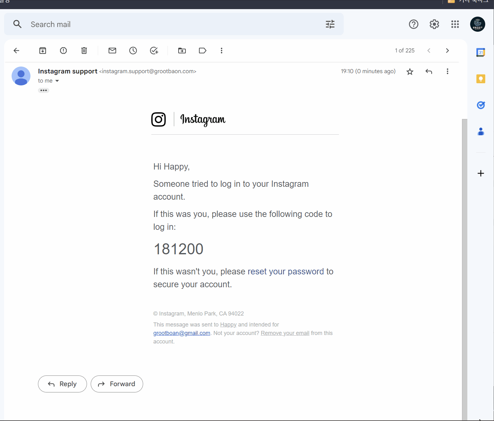

# SMTP Gophish + ESP

## 개요

저번 시간에서 Postfix와 같은 오픈 소스 메일 서비스를 사용해 Digtal Ocean 메일 서버를 직접 설정하는 법을 배웠다.



이번 시간에는 클라우드 서비스로는 AWS, 이메일 서버로는 ZOHO 서드파티 이메일 서버 서비스를 활용해 초보자들이 쉽게 구축할수 있는 방법을 소개한다.

일단 저번시간과 다른점은 Digital Ocean 대신 AWS, Postfix 대신 서드파티 이메일 서비스를 이용한다.

Digital Ocean vs AWS & Postfix vs 서드파티이( e.g ZOHO )의 차이점은 다음과 같다:

### Digital Ocean vs AWS

Digital Ocean과 AWS 클라우드 서비스의 차이점은 다음과 같다:

1. 규모및 기능: 기본적으로 Digital Ocean은 간단한 웹 사이트 또는 애플리케이션을 호스팅하려는 개인 또는 작은 기업에게 적합하다. AWS는 대규모 기업이나 더 많은 서비스와 기능이 필요한 기업이나 큰 큐모의 인프라 서비스에 적합하다.
2. 가격:Digital Ocean과 AWS 두 서비스 모두 무료 Trial 버전을 제공한다 DO의 경우 2달동안 200 USD의 크레딧을 제공하고 AWS또한 12 개월 무료 Tier를 제공한다. Digital Ocean은 비교적 저렴한 가격으로 서비스를 제공하고 있다. AWS는 다양한 옵션과 서비스로 인해 가격이 상대적으로 높다.
3. 사용 편의성: Digital Ocean은 사용하기 쉽고 직관적인 사용자 인터페이스를 제공한다. 반면, AWS는 다양한 옵션과 기능을 제공하지만, 초보자들이 사용하기에는 복잡할 수 있습니다.

### Postfix 메일 서버 vs 서드파티 메일 서버

ZOHO와 같은 서드파티 메일 서버 호스팅 "서비스"를 이용하면따로 메일 서버를 사용자가 구축하지 않아도 된다.

Postfix 메일 서버와 ZOHO와 같은 서드파티 메일 서버의 차이점은 다음과 같다:

1. 호스팅: Zoho 메일은 클라우드 호스팅 이메일 서비스입니다. 따라서 사용자 친화적인 인터페이스와 보안 및 백업 기능을 제공한다. 반면에 Postfix는 오픈 소스 메일 전송 에이전트 (MTA)이며, 사용자가 직접 설치하고 구성해야합니다 하지만, 직접 설치하고 구성하는 만큼 OPSEC에 있어서 Postfix와 직접 VM을 설치 구성하는것이 레드팀이나 APT 입장에선 더 "안전"할수도 있다.
2. 가격: Zoho 메일은 기본 기능이 무료이며 추가 기능을 원할 경우 추가 비용이 발생할 수 있습니다. 반면에 Postfix는 오픈 소스 소프트웨어이므로 무료입니다.

교육차원에서 두 이메일 서비스를 모두 사용할수 있지만 이번 시간에는 ZOHO 서비스를 통해 좀더 직관적으로 쉽게 메일서버 + GoPhish를 설치하는 법을 배운다.

## 준비물

이번 실습은 다음과 같은 준비물이 필요하다:

* 도메인
  * 이메일용 + 피싱 페이지용 도메인 1개 (Namecheap) - https://www.namecheap.com/
* 메일 발송 서비스및 서버
  * 메일 발송 서버 프레임워 - Gophish
    * https://getgophish.com/
  * 메일 서비스 프로바이더
    * ZOHO 메일
      * https://www.zoho.com/mail/login.html
* 클라우드 서비스 프로바이더
  * 클라우드 - AWS

### "좋은" 도메인 구매

먼저 "좋은" 레드팀을 준비하기 위해 구매하려는 도메인 이름 또한 최대한 합법적인 웹사이트의 도메인과 충분히 유사하고 설득력이 있어야 한다.

본 실습에선 DnsTwist 와 같은 오프소스 도메인 체킹툴을 이용한다.

기타 비슷한툴:

* UrlCrazy
* Catphish

DNSTWIST를 통해 그루트 도메인 grootboan.com과 비슷하지만 다른? 도메인을 찾는다. 이번 실습에서는 boan의 a와 o를 바꿔 grootbaon.com을 구매했다.

 (1) (1) (2) (1) (2).png>)

Namecheap에 들어가 grootbaon.com을 확인하여 구매한다.

.png>) 

### GoPhish 호스팅 AWS EC2 서버 구축

적절한 도메인을 구입했다면 이제 AWS와 같은 클라우드 VM 호스팅 서비스를 이용해서 GoPhish (피싱 메일 전송 서비스)를 구축한다. AWS는 처음 12개월 프리 티어를 제공하므로 본 실습에서는 AWS를 사용한다.

일단 아래 링크에서 무료 계정을 생성해 12개월 무료 티어 계정을 만든다.



AWS EC2 웹 서비스를 아래와 같은 스펙으로 설정하여 생성한다.

* OS: 우분투 22.10
* CPU: Regular + SSD
* 메일 서버 가격: 무료
* 고피시 서버 가격: 셀프 호스팅 무료
* 인증 방식: SSH 키
* 호스트이름: login (gophish 서버) ( e.g login.grootbaon.com)

다음과 같이 EC2를 생성해준다.

 (1) (2).png>)

안전하고 Private한 연결을 위해 SSH 키 페어를 설정해준다.

<figure><figcaption></figcaption></figure>

물론 나중에 세팅이 완료되면 디테일한 방화벽 설정이 필요하지만 스무스한 진행을 위해 방화벽은 따로 설정하지 않기로 한다.

<figure><figcaption></figcaption></figure>

스토리지 또한 15-20 기가 정도로 설정하여 혹시모를 스토리지 부족에 대비해 넉넉히 설정해도 된다. 모든 설정이 마무리되면 "인스턴트 시작"을 눌러 GoPhish 서버 EC2를 생성한다.

## 설치

### GoPhish 서버 설치

위 EC2 서버 설정에서 만들었던 SSH Private Key를 통해 고피시 서버에 연결한다.

 (1).png>)

이제 고피쉬를 설정한다.

```sh
apt update -y ; apt install golang-go gcc -y;cd /opt
git clone https://github.com/gophish/gophish.git
cd ./gophish
```

GoPhish는 디폴트로 여러 증거를 남길수 있기때문에 OPSEC 차원에서 GoPhish가 만들어내는 트래픽에 남는 여러 스트링을 아래와 같이 바꿔줄수있다 .

```shell
find . -type f -name "config.go" -exec sed -i 's/const ServerName = "gophish"/const ServerName = "IGNORE"/g' {} +
find . -type f -name "campaign.go" -exec sed -i 's/const RecipientParameter = "rid"/const RecipientParameter = "keyname"/g' {} +
find . -type f -exec sed -i 's/X-Gophish-Contact/X-Contact/g; s/X-Gophish-Signature/X-Signature/g' {} +
go build
```

모든 과정이 에러없이 완료 되었다면 모든 GoPhish 설정은 다 끝났다.

### ZOHO 메일 서버 설정

메일 서버를 설정하기 앞서 Namecheap에 들어가 도메인 Privacy가 활성화 되어있는지 확인해 준다.

.png>)

아래 sign up 링크에서 ZOHO 계정 만든다.



참고로 아시안쪽에서 VPN을 굴리면 ZOHO 데이터 베이스가 호주 또는 일본으로 설정되기에 AU 코드가 뜬다. 구매한 도메인으로 이메일 도메인을 설정하기에 다음과 같이 진행한다.

<figure><figcaption></figcaption></figure>


Proceed to domain verification 누른뒤 AWS Route 53으로 돌아온뒤 아래와 같이 과정으로 도메인과 AWS 클라우드 , ZOHO 메일 서버를 연결해준다.

### AWS Route53 DNS 설정정

1. Route53에서 호스팅 영역 -> 호스팅 영역 생성을 선택한다.

<figure><figcaption></figcaption></figure>

2. 구매한 도메인 이름으로 다음과 같이 호스팅 영역을 만들어준다.

<figure><figcaption></figcaption></figure>

3. NS와 SOA 레코드가 생성되면 NS 레코드 값을 복사한뒤 Namecheap 도메인 설정에서 Nameserver를 Custom DNS로 바꾼뒤 위의 AWS NS 레코드 값으로 바꿔 준다.

<figure><figcaption></figcaption></figure>


다음과 같이 성공적으로 연결되면 Domain Ownership 테스트는 통과다.

<figure><figcaption></figcaption></figure>

4. ZOHO 무료버전은 계정 5개까지 무료이므로 다음과 같이 피슁에 쓰일 이메일을 만들어 줄수 있다. 여기서는 가짜 Instagram 서포트 계정으로 보일 만한 테스팅 이메일 instagram.support를 만들어 보았다.

<figure><figcaption></figcaption></figure>

5. 그 다음은 아래와 같이 ZOHO가 알려주는대로 DNS MX,SPF,DKIM을 AWS Route 53 레코드로 설정해준다.


6. 마지막으로 A 레코드는 GoPhish가 설치된 AWS EC2의 퍼블릭 아이피와 login.grootbaon.com를 연결 해준뒤 다음과 같이 설정이 되었다면 모든 설정이 끝난다.


이로써 NAMECHEAP <-> AWS <-> ZOHO의 설정이 끝났다.


## 이메일 서버 중간점검

mail-tester 를 통해 메일 서버와 SPF, DKIM, DMARC 등의 이메일 관련 TXT 레코드가 잘 생성되었는지 확인한다. mail-tester.com 방문한 뒤 이메일 주소를 받고, 해당 이메일 주소로 이메일을 보내본다.




상당히 높은 스코어와 `You're Properly Authenticated` 이 부분 통과하면 성공이다. SPF, DKIM, DMARC, rDNS 섹션에 모두 체크마크가 있다면 우리의 피싱이메일은 대부분의 이메일 필터를 통과할수있다. 다면 DNS 레코드 및 DKIM 문자열 등을 다시 한 번 체크한다.


## GoPhish 실행

ping login.grootbaon.com을 실행해 login.grootbaon.com이 AWS EC2 퍼블릭 아이프로 연결되었는지 확인해보자.


이제 GoPhish 서버에서 나와 다시 SSH 연결을 해줄건데 이번에는 IP 대신login.grootbaon.com으로 로컬 포트 포워딩으로 로컬 호스트 3333에서 바로 연결이 될수 있게 다음과 같이 SSH 연결을 해준다.

`ssh -i id_rsa ubuntu@login.grootbaon.com -L 3333:127.0.0.1:3333`

이제 고피시 실행한뒤 뒤 나오는 비밀번호를 이용해 호스트에서 `https://localhost:3333` 로 접속한다.

`sudo ./gophish`


브라우저에서 https://localhost:3333 로 연결하면 다음과 같이 GoPhish가 실행되는것을 확인할수 있다.


이제 피싱에 필요한 모든 준비가 완료되었다!

## GoPhish로 피싱 캠페인 실행하기

아래와 같은 방법으로 순서대로 Sending Profile -> Landing Page -> Email Template -> Users & Group을 설정해준 뒤, 피싱 Campaign을 진행한다.

#### Sending Profile 설정

* Name: <프로필 이름 아무거나>
* SMTP From: instagram.support@grootbaon.com
* Host: smtp.zoho.coom.au:465 Username/Password: \<ZOHO instagram.support@grootbaon.com Username/Password>

<figure><figcaption></figcaption></figure>

테스팅겸 Send Test Email을 눌러 이메일을 보내본다.

<figure><figcaption></figcaption></figure>

정상적으로 이메일이 온거를 확인하면 성공이다.

<figure><figcaption></figcaption></figure>

#### Landing Pages 설정

Landing Pages에서는 피싱 피해자가 피싱 메일이 유도하는 피싱 페이지를 방문할때 보이는 페이지를 뜻한다. 본 실습에서는 "Instagram 계정 탈취"를 가정해 아래와 같이 설정해주었다.

본 실습이 교육의 목적인 만큼 여기에 쓰인 인스타그램 로그인 페이지 소스는 따로 공유할수 없지만 피싱 템플릿은 어느정도 본 페이지의 HTML과 CSS 소스를 레퍼런스 떠와 만들수 있겠다.

* Name: Instagram HTML: <피싱 템플릿 HTML 코드>
* Capture Submitted Data 활성화
* Capture Passwords 활성화
* Redirect to: https://www.instagram.com


아래와 같이 돋보기 아이콘을 눌러주면 템플릿을 미리보기 할수 있다.

<figure><figcaption></figcaption></figure>

아래와 같은 피싱 템플릿이 사용되는걸 미리 확인할 수 있다.

<figure><figcaption></figcaption></figure>

#### Email Templates 설정

이제 Email Templates를 설정해 실제 피싱 피해자가 받는 피싱 이메일의 제목과 내용을 설정해준다.


역시 미리보기로 확인하면 아래와 같은 피싱 이메일 템플릿이 사용되는것을 확일할 수 있다.


#### Users & Groups 설정

피싱 피해자의 이메일 리스트를 작성해준다.

* Group Name: Instagram victim lists


#### Campaign 설정

위에서 설정한 모든 설정값으로 캠페인을 만들어 준다. URL은 GoPhish 서버, 즉 login.grootbaon.com으로 설정해주고 포트 80/HTTP로 설정해 준다.


Launch Campaign을 눌러 최종적으로 Status에 Email Sent가 뜨면 성공적으로 피싱 캠페인이 실행된것을 확인할 수 있다.


## 인스타그램 템플릿을 이용한 피싱 실습 데모



스팸으로 필터링이 되지않고 정상적인 타겟 이메일 inbox 안으로 이메일이 도착한 것을 볼 수 있다. 이메일 발송자도 타사 브랜드가 보이게 만들수도 있지만 일단 본 실습에서는 grootbaon.com 도메인을 사용하기에 인스타그램과 비슷하진 않다. 하지만 현업에서 레드팀을 실행한땐 비슷한 typosquatting 도메인과 SSL Certificate까지 매우 치밀하게 이뤄진다.

## 마치며

이로써 서드파티 메일 서버, AWS, 고피시 서버를 설정하는 법에 대해서 다뤄봤다. 다시한번 강조하지만 본 실습은 교육의 목적으로 쓰이며 실제 위의 방법과 똑같이 따라하여 피싱을 시도하는것은 https://www.xn--hy1b43d247a.com/infrastructure/smtp 에서도 강조했듯이 절대 좋은 생각이 아니니 행운을 빈다.

## Reference

* https://github.dev/b1gbroth3r/red-team-infrastructure-example
* https://www.mail-tester.com/
* https://www.sprocketsecurity.com/resources/never-had-a-bad-day-phishing-how-to-set-up-gophish-to-evade-security-controls
* https://www.mogozobo.com/?p=3685
