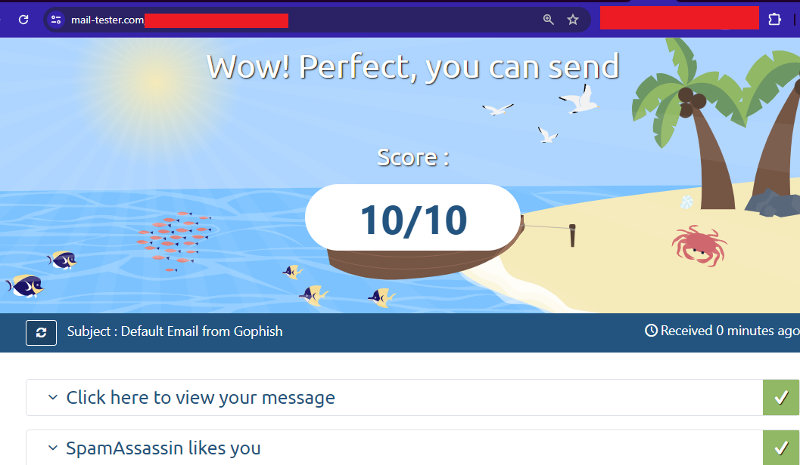
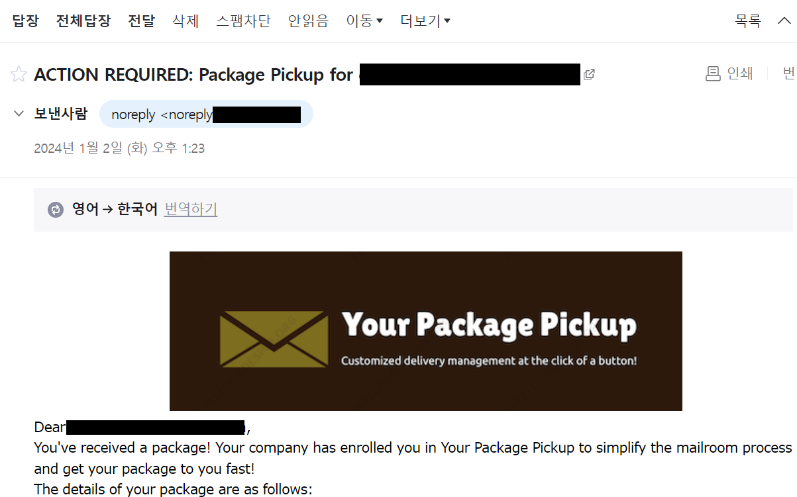

# SMTP Gophish + Relay + ESP

## 피싱 인프라

<figure><figcaption></figcaption></figure>

이번 페이지에서는 다양한 피싱 인프라 구축 방법에 대해서 알아본 뒤, 피싱 툴킷 + 릴레이 + ESP를 활용한 피싱 인프라 구축을 실습해본다. 다른 기법들과는 다르게 피싱 인프라와 관련된 정보는 너무 자세하게 인터넷에 공유할 경우 악용될 여지가 있기에 기술적인 디테일은 최대한 검열했다.

### 용어 설명

* **피싱 툴킷 서버(Phishing Toolkit Server):** 피싱 툴킷이 설치된 서버. 예) Gophish가 설치된 우분투 22.04
* **SMTP 릴레이 서버(SMTP Relay Server):** 피싱 툴킷으로부터 피싱 메일을 받은 뒤, 이메일 서비스 제공자(ESP)의 메일 서버로 SMTP 릴레이하는 서버. 릴레이 말고 타겟에게 직접적으로 메일을 보내는 것 또한 가능하다. 예) Postfix가 설치된 우분투 22.04
* **이메일 서비스 제공자(Email Service Provider):** 이메일 전송, 수신, 관리 기능을 제공하는 서비스 제공자. Mailgun, Sendgrid, MS365(o365).

### 인프라

피싱 인프라를 구축하는데에는 다양한 방법이 존재한다. 인프라 구축의 간단함, 작전 보안 정도 등을 생각해 봤을 때 피싱 인프라는 다음과 같이 구축할 수 있다.

1. **이메일 서비스 제공자(ESP)만 사용**

사실상 인프라가 필요 없는 가장 간단한 방법이다. 랜덤한 계정을 생성한 뒤, 평소 사용하던 ESP를 사용해 피싱 캠페인을 실행하는 것이다. 하지만 실제 공격자들의 TTP를 구현할 수 없고, 피싱 대상들의 반응을 모니터링 할 수 없으며, 작전보안에 취약하고, ESP 회사들의 이용 약관을 직접적으로 위반하는 방법이기 때문에 잘 사용되지 않는다.

한가지 예외가 있다면 ms365 개발자용 테넨트를 만들어 사용하는 방법이다 (https://badoption.eu/blog/2023/12/03/PhishingInfra.html). 물론 여전히 피싱 메일 열람, 링크 클릭 등의 모니터링이나 분석을 할 수 없는 것은 마찬가지다.

2. **피싱 툴킷 서버 + 메일 서버**

피싱 툴킷 서버에서 공격자 메일 서버로 이메일을 전송한 뒤, 공격자 메일 서버에서 대상 메일 서버로 직접적으로 메일을 보내는 방식이다. 구축이 간편한 편이지만, 공격자의 메일 서버가 직접적으로 노출되어 있으며, 대상 메일 서버/게이트웨이에서 바로 차단을 당할 수 있다는 위험이 있다.

이와 관련해서는 [smtp-do.md](smtp-do.md "mention") 페이지를 참고한다.&#x20;

3. **피싱 툴킷 서버 + ESP**&#x20;

피싱 툴킷 서버에 고피시 등의 툴킷을 설치한 뒤, 평소 사용하고 있던 ESP를 이용해 이메일을 직접적으로 보내는 방식이다. 이메일의 경로는 다음과 같이 된다: `피싱 툴킷 서버 -> ESP -> 타겟` . 간단하고 빠르게 구축할 수 있다는 장점이 있지만, 그와 동시에 SMTP 사용자 인증에 사용되는 ESP 유저 계정이 차단될 수 있으며, 피싱 툴킷 서버와 ESP가 직접적으로 통신하기 때문에 ESP측에서 피싱 툴킷 서버를 바로 차단할 수 있다는 단점 또한 존재한다.

이와 관련해서는 [smtp-aws-zoho.md](smtp-aws-zoho.md "mention") 페이지를 참고한다.&#x20;

4. **피싱 툴킷 서버 + SMTP 릴레이 + ESP 사용**

피싱 툴킷 서버에서 공격자 소유의 SMTP 릴레이 서버로 메일 트래픽을 보낸 뒤, 릴레이 서버에서 SMTP 헤더 제거 및 IP 주소 변환으로 작전 보안을 챙겨주고, 마지막으로 ESP를 사용해 이메일의 신뢰도를 높여 대상에게 보내는 방식이다. 구축해야할 서버나 서비스가 많기 때문에 가장 번거롭다. 하지만 작전 보안이 치밀하고, 공격자의 피싱 툴킷 서버를 인터넷에 노출할 위험이 없으며, SMTP 릴레이 서버들이 들통난다고 하더라도 새로 만들면 그만이기 때문에 가장 원활한 작전 수행을 할 수 있다는 장점이 있다.

이번 페이지에서 다룰 인프라다.&#x20;

### SMTP 릴레이 서버

<div data-full-width="false">

<figure><figcaption></figcaption></figure>

</div>

SMTP 릴레이 서버는 실제 정상적인 메일 인프라에서도 사용되는 서버들이다. 릴레이 서버들은 메일 서버들의 사이에서 로드 밸런싱, 보안, 필터링등의 역할을 맡는다. 공격자의 입장에서 SMTP 릴레이 서버는 공격자의 피싱 툴킷 서버를 인터넷에 노출 시키지 않으면서도, ESP와 공격자 사이에 완충지대를 역할을 담당하는데 쓰인다. 레드팀의 입장에서 SMTP 릴레이 서버는 다음과 같은 기능을 제공한다.

1. 피싱 툴킷 서버가 포함하고 있는, 작전 보안에 취약한 SMTP 헤더 삭제 (예. X-Gophish, X-Originating-IP, 등)
2. 피싱 툴킷 서버와 ESP 사이의 "대포 서버" 역할. 발각시 릴레이 서버 삭제 후 또 다른 릴레이 서버를 다른 IP를 사용해 구축.
3. 피싱 툴킷 서버가 직접적으로 ESP를 사용하지 않고, 실제 메일 네트워크 서비스(postfix)를 통해 릴레이 되며 좀 더 "정상적인" SMTP 트래픽 생성 가능.

### 실습

실습에는 아직 비공개인 `rtinfra`를 사용한다. rtinfra를 사용하면 테라폼과 앤서블을 이용해 10분만에 VPC, 공개/비공개 서브넷, C2, HTTP 리다이렉터, 고피시, Evilginx, SMTP 릴레이 서버, 페이로드 서버, VPN 서버를 구축할 수 있으며, 복잡한 포트포워딩 없이 VPN을 이용해 오퍼레이터가 각 서버들에 직접적으로 연결할 수 있다.

rtinfra를 사용하지 않고 실습을 진행한다면 필요한 인프라는 다음과 같다. 클라우드 및 인프라 구축은 이번 페이지에서는 다루지 않는다.

* Private 서브넷 - Ubuntu + Gophish 서버
* Public 서브넷 - Ubuntu + Postfix 서버 + 공인 IP
* ESP 가입에 필요한 신원 및 결제방법 (블랙햇도 아니고, 감옥 갈거 아니라면 그냥 본인 신원을 사용한다)
* 고피시 서버와 postfix 서버에 접속할 수 있는 권한 및 방법.

실습의 대략적인 절차는 다음과 같다.

1. 고피시 서버 구축
2. 릴레이 서버 (Postfix) 구축
3. ESP 가입 및 설정
4. Postfix 서버에서 SMTP 사용자 계정 정보 + 비밀번호 및 릴레이 서버 설정
5. 고피시를 이용해 메일 전송

### 고피시 서버 구축

개념 증명용 실습이니 최대한 간단하게 구축한다.

```
#!/bin/bash

apt update -y ; apt install golang-go gcc -y 
cd /opt 
git clone https://github.com/gophish/gophish.git
cd ./gophish 

# Opsec changes 
find . -type f -name "config.go" -exec sed -i 's/const ServerName = "gophish"/const ServerName = "IGNORE"/g' {} + 
find . -type f -name "campaign.go" -exec sed -i 's/const RecipientParameter = "rid"/const RecipientParameter = "clientID"/g' {} + 
find . -type f -exec sed -i 's/X-Gophish-Contact/X-Contact/g; s/X-Gophish-Signature/X-Signature/g' {} +

go build 
```

### 릴레이 서버(Postfix) 구축

먼저 Postfix를 구축한다. 이와 관련된 레드팀 페이지도 있으니 생략한다. 소스코드는 RTPSourceCodes 리포를 참고한다 - https://github.com/ChoiSG/RTPSourceCodes/blob/main/iac/smtp-terraform/mail.tf#L17-L69

1. Postfix, opendkim, certbot 설치
2. 허락된 IP 주소만 Postfix 릴레이를 사용가능하도록 mynetworks 설정
3. 작전보안용 SMTP 헤더를 제거하기 위한 `header_check` 파일 설정
4. DNS DKIM 설정을 위한 opendkim 설정

기본적인 SMTP Postfix 서버가 설치 + 설정되었다면 이제 ESP를 설정한다.

### ESP 가입 및 설정

ESP와 Postfix 릴레이 서버 설정은 레퍼런스 섹션의 글들을 참고해 진행했다.

많은 ESP가 있지만, 가장 신뢰도가 높고 한 달 공짜로 사용할 수 있는 MS365 E5 라이센스를 사용한다. 주의할 점은 개인용 라이센스가 아니라 기업용 E5 라이센스를 사용 해야 한다는 것이다. 최근 MS365와 EntraID와 관련된 공부도 시작했고, 추후 홈랩 온프레미스 AD에 EntraID(AAD)도 적용시킬 것이기 때문에 MS365를 사용하기로 결정했다. 한달이 지나도 월 4만원이기 때문에 크게 부담이 되지는 않는다.

가입할 때 이름과 Tenant 이름은 작전 보안을 생각해 정하는 것이 좋다. 예를 들어 `choi@testinghahafunny.onmicrosoft.com` 보다는 `info@<attackerdomain>.onmicrosoft.com`이 좋다. 성/이름에는 `Choi Choi` 라는 성/이름 보다는 `business noreply` 등이 더 좋을 것이다. 물론, 추후에 변경 가능하니 너무 걱정은 안해도 된다.

https://www.microsoft.com/en-us/microsoft-365/enterprise/office-365-e5#overview

가입 후 다음과 같이 설정한다.

1. 계정 이름과 이메일 주소를 변경한다. `admin.microsoft.com` > Users > Active Users > 유저 클릭 > Manage Username and Email 에서 Primary 이메일 주소를 `noreply`, `info` 등으로 바꾼다. 그 뒤, 처음 가입할 때 지정해놨던 alias를 지운다. Primary 이메일 주소가 바뀌면 로그인때 필요한 유저 이름도 바뀌는 것이니 유의한다.
2. MS365의 SMTP를 사용할 수 있도록 SMTP 인증을 허용한다. `admin.microsoft.com` > Users > Active Users > 유저 > Mail > `Manage email apps` 에서 `Authenticated SMTP` 를 활성화한다.
3. 공격자의 도메인을 등록한다 - `admin.microsoft.com` > Settings > Domain > Add Domain

이제 사용 가능한 ESP가 있으니, Postfix에서 릴레이를 설정해 ESP를 통해 이메일을 보내도록 구축한다.

### 릴레이 서버 릴레이 설정

릴레이 서버가 SMTP 사용자 인증을 사용해 ESP의 메일 서버로 메일을 보내려면 `sasl_passwd` 라는 파일에 사용자 이름과 비밀번호를 집어넣은 뒤, 해당 파일을 해시화 해야 한다. 또한, MS365의 경우 특정 계정으로 SMTP 인증을 사용하면 나가는 모든 이메일의 발신자 표시가 해당 계정의 이메일 주소가 되어야 하기 때문에 `sender_canonical`이라는 파일에 SMTP 인증을 사용할 계정의 이메일 주소를 넣는다.

두 개의 파일을 생성한 뒤 해시화 했다면 Postfix의 `main.cf`를 바꿔 MS365 메일 서버를 향해 릴레이 하도록 설정한다.

```
# SMTP 사용자 계정 정보 생성 후 해시화 
echo '[smtp.office365.com]:587 <user>@<domain.com>:<password>' > /etc/postfix/sasl_passwd
postmap /etc/postfix/sasl_passwd 
chmod 640 /etc/postfix/sasl_passwd* 

# 모든 SMTP 발신자(/.+/)가 위 ESP 계정의 이메일 주소를 갖도록 sender_canonical 생성 후 해시화 
echo '/.+/ <user>@<domain.com>' > /etc/postfix/sender_canonical
echo '/.+/ noreply@example.com' > /etc/postfix/sender_canonical
postmap /etc/postfix/sender_canonical
chmod 640 /etc/postfix/sender_canonical*

# Postfix - main.cf: 릴레이할 ESP의 SMTP 서버 및 sasl_passwd, sender_canonical, SSL 인증서 설정 
relayhost = [smtp.office365.com]:587
smtp_sasl_auth_enable = yes
smtp_sasl_password_maps = hash:/etc/postfix/sasl_passwd
smtp_sasl_security_options = noanonymous
smtp_tls_security_level = may
sender_canonical_maps = regexp:/etc/postfix/sender_canonical
smtp_tls_CAfile = /etc/ssl/certs/ca-certificates.crt
smtp_use_tls = yes
smtp_always_send_ehlo = yes

systemctl restart postfix 
```

릴레이 서버 설정이 끝났다면 도메인의 SPF도 업데이트한다.

```
v=spf1 ip4:<SMTP-릴레이-서버-ip> include:spf.protection.outlook.com -all
```

### 실습 - 메일 전송

이후 고피시에서 캠페인을 설정한다. 설정할 때 Sending Profile에서 SMTP 호스트는 SMTP 릴레이 서버의 사설 IP로 지정한다. 본격적으로 메일을 전송하기 전, mail-tester를 이용해 테스트 메일을 날려본다. 릴레이 서버에서 SMTP 헤더를 지우고, ESP의 신뢰도를 사용해 메일을 날리다 보니 놀랍게도 10/10점 만점을 받을 수 있었다.

<figure><figcaption></figcaption></figure>

테스트 이후에는 실제 메일을 전송해본다. 링크가 들어가던, 파일 첨부를 하던간에 스팸메일함으로 가지않고 일반적인 받은 메일함에 정상적으로 도착하는 것을 확인할 수 있다. "수상한 도메인"이라던지, "외부도메인" 이라는 주의 메시지도 없다. ESP의 입장에서는 또 다른 ESP가 보낸 메일이니, 가장 신뢰도가 높고 정상적인 이메일로 인식하는 것이다.

<figure><figcaption></figcaption></figure>

<figure><figcaption></figcaption></figure>


### 대응 방안

* ESP를 이용해 전송하는 이메일의 경우 SMTP에 들어가 있는 모든 IP 주소가 ESP의 메일 서버인 경우가 많다. `client-ip`, `SPF`, 등. 따라서 괜히 IP 주소 블랙리스트를 했다가 ESP의 메일주소를 차단하지 않도록 한다.
* ESP에 따라 다르지만, `Return-Path`, `X-OriginatorOrg` 등에는 ESP에 등록된 공격자의 도메인이 남아 있다. 해당 도메인의 SPF 및 MX 레코드를 확인해 공격자의 SMTP 릴레이 서버 주소를 알아낼 수 있다.
* **블루팀:** 이메일 헤더를 살펴보면 어떤 ESP를 사용했는지 알 수 있다. 해당 ESP에 악용 신고를 한다. 예를 들어 MS365의 경우 MSRC를 통해 신고할 수 있다(https://msrc.microsoft.com/report/).
* **블루팀 + 이메일 관리자:** 이메일 게이트웨이 단에서 단순히 상대방 메일 서버의 IP 주소(ESP의 IP)나 도메인 이름 (ESP의 도메인 이름) 뿐만 아니라 X-OriginatorOrg 등의 헤더에서 도메인 신뢰도 검사(도메인 나이, 카테고리, 등)를 진행할 수 있는지 확인해본다.

### MISC

* 처음 ms365를 가입할때 유저 이름과 org 이름을 가급적 공격자 도메인과 관련이 없고, 대상 기관의 도메인과 비슷하게 맞추면 좋다. 예를 들어 공격자 도메인이 `attacker.com` 이고 대상 도메인이 `target.com` 이라면, 가입할때 tenant 이름을 `target-onboardingms365.onmicrosoft.com` 등으로 맞추는 형식이다.


* admin.microsoft.com > Users > Active Users > 유저 클릭 > Manage Username and Email 에서 Primary 이메일 주소를 바꿔준다. 예를 들어 `admin@target-onboardingms365.onmicrosoft.com` 으로 맨처음 유저를 만들었다면, `noreply` 등으로 바꾼다. 그 뒤, 처음 가입할 때 지정해놨던 alias를 꼭 지워준다. Primary 이메일 주소가 바뀌면 로그인때 필요한 유저 이름도 바뀌는 것이니 유의한다.


* 공격자 도메인이 아닌 기본 `<tenant>.onmicrosoft.com` 으로 메일을 보내려 한다면 왠만한 ESP들의 스팸 필터링에 걸러진다(https://learn.microsoft.com/en-us/exchange/troubleshoot/email-delivery/ndr/fix-error-code-451-4-7-500-699-asxxx-in-exchange-online). 따라서 반드시 공격자의 도메인을 ms365와 연결한 뒤 메일을 전송한다.


*   SMTP 메일 전송과 관련된 디버깅을 진행할때는 다음을 참고한다.

    * `/var/log/mail.log` : 릴레이 서버 <-> ESP 간의 SMTP 트래픽
    * SMTP 사용자 인증: `entra.microsfot.com` > Users > All Users > Sign-in Logs
    * SMTP 릴레이 서버 > ESP로 가는 SMTP가 `Security Defaults` 정책에 위반된다고 할시: `portal.azure.com` > EntraID (AAD) > Properties > Security Defaults로 가서 Security defaults를 해제한다


* 왠만한 VPS나 클라우드 플랫폼들의 경우 스팸을 막기 위해 TCP/25 아웃바운드 트래픽을 막는다. 플랫폼의 클라우드 기반의 이메일 서비스(AWS의 경우 SES 등)를 이용하면 이를 우회할 수 있으나, 백그라운드 체크라던지 검사가 좀 오래 걸리는 편이다. 또한, 실제 공격자들이 이런 방법 (클라우드 플랫폼에서 백그라운드 체크를 받는...)을 사용할 것 같지도 않다.

### 마치며

이번 글에서는 공격자들이 사용하는 현실적인 피싱 인프라에 대해서 배운 뒤 실습을 진행해봤다. 최근 이메일 보안이 매우 좋아지며 BEC 공격이 줄어들고 있는 추세다. 하지만 여전히 BEC 및 피싱은 초기 침투를 달성하는데 있어서 가장 많이 사용되는 TTP다. 따라서 실제 공격자들이 어떻게 이런 인프라를 구축하고, 이에 어떻게 대응하는가에 대해서는 꾸준한 연구가 이뤄져야 할 것이다.

### 레퍼런스

* https://poweradm.com/postfix-with-microsoft-365-smtp-relay/
* https://www.securesystems.de/blog/building-a-red-team-infrastructure-in-2023/
* https://badoption.eu/blog/2023/12/03/PhishingInfra.html
* https://learn.microsoft.com/en-us/exchange/troubleshoot/email-delivery/ndr/non-delivery-reports-in-exchange-online
* https://learn.microsoft.com/en-us/exchange/troubleshoot/email-delivery/ndr/fix-error-code-451-4-7-500-699-asxxx-in-exchange-online
