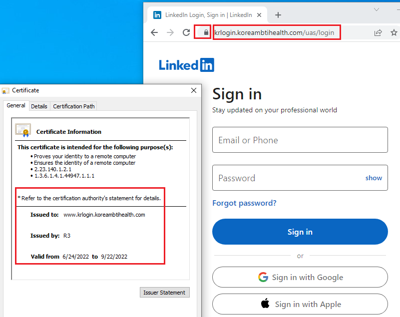
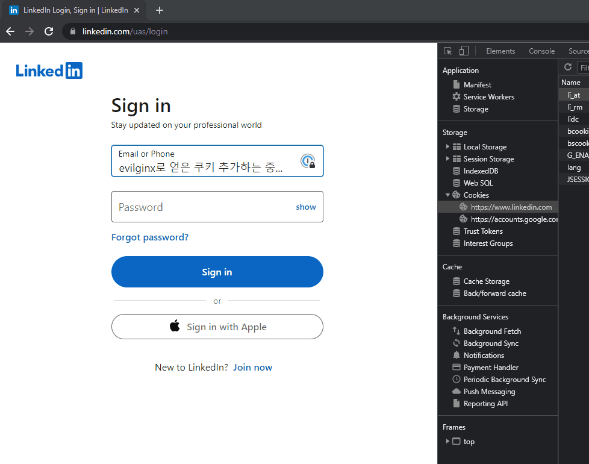

# 피싱 - AitM (Adversary in the Middle)

전통적인 방법의 피싱 공격은 정상적 사이트의 프론트엔드 코드를 클론해서 피해자 유저가 피싱 사이트에 계정 정보를 집어넣고, 공격자가 그 계정 정보를 빼내가는 식으로 진행됐다.&#x20;

이런 계정 정보 탈취 형식의 피싱 공격은 다중 인증 (Multi-Factor Authentication) 이 나오면서 어느정도 대처가 됐다. 첫번째로 공격자가 피해자 유저의 핸드폰이나 유비키 등을 물리적으로 손에 넣지 않는 한 두번째 인증을 통과하기가 대단히 어렵기 때문이고, 두번째로는 공격자의 웹사이트가 이중/다중 인증까지 구현하기는 어려웠기 때문이다.&#x20;

이런 방어를 우회하고자 공격자들은 중간자 공격 (Man-in-the-Middle) 을 피싱에도 접목하기 시작했다. 이는 곧 APT 중간자 공격 (Adversary-in-the-Middle) 이라는 용어로 만들어졌다. 관련된 유명한 툴들은 2017년도에 나온 Evilginx, 후속작인 Evilginx2, 그리고 muraena 등이 있다. AitM은 다음과 같은 형식으로 중간자 공격을 통해 피싱을 진행한다.&#x20;


피싱 서버에서 로그인이나 다중 인증 등의 코드를 구현하지 않고, 피싱 서버는 중간자 역할만 한다. 유저는 사실상 원래 서버와 소통을 하고 있는 것이다. 이렇게 되면 인증, 다중인증은 원래 서버가 진행하고, 유저는 정상적으로 인증, 다중 인증을 진행한다. 공격자는 중간에 앉아서 소통되는 계정 정보와 다중 인증 키 및 세션 쿠키만 빼내는 형식으로 공격이 진행된다.&#x20;

### 실습&#x20;

**< Evilginx2 와 공격자 도메인을 설정하는 실습은 악용을 막기 위해 공개적으로 진행하지 않는다. >** &#x20;

다음의 시나리오를 보자 - 초이(본인이다)가 출근해 이메일함을 열어봤더니, koreambtihealth.com 에서 온 이메일이 보였다.&#x20;

> 링크드인에 MBTI 관련된 포스트 잘 봤습니다. 저희는 직장인들의 MBTI를 분석하는 KoreaMBTIHalth 스타트업입니다. 편하게 링크드인 계정으로 접속하셔서 MBTI 관련된 질문 몇가지만 답해주실 수 있을실까요? "[https://www.krlogin.koreambtihealth.com/invite](https://www.krlogin.koreambtihealth.com/invite)"

피싱일까? 잘 모르겠지만 어쨌든 이중 인증을 설정해놨으니 상관 없다. 한번 가서 재밌는 MBTI 관련 정보를 받아봐야겠다.&#x20;



주의하며 웹사이트를 방문해보니 사내 정보보호 피싱 교육에서 배웠던 내용들이랑은 다른 내용들이 보인다.&#x20;

1. 크롬창에서 자물쇠가 제대로 채워져있다.&#x20;
2. TLS/SSL 인증서가 제대로된 인증서다. 3개월짜리니 LetsEncrypt을 사용했나 보다.&#x20;
3. URL도 나쁘지 않다. `koreambtihealth.com` 도메인의 `krlogin` 브도메인에, 링크드인이 실제로 사용하는 `/uas/login` 엔드포인트까지 똑같다.&#x20;
4. 모든 UI가 정상적이다. 심지어 sign in with Google 등의 SSO도 정상 작동한다!&#x20;

진짜 웹사이트고, 단순히 링크드인으로 SSO를 구축한거구나, 생각이 든다. 어차피 피싱이라도 이중 인증이 있으니 상관없다. 로그인 한다.&#x20;


 (2).png>)

이중인증 페이지도 정상적으로 뜬다. "피싱 아니고 진짜 링크드인 SSO 로그인이였구나. 다행이다" 라는 생각을 하며 이중 인증도 진행한다.&#x20;


\---&#x20;

이 와중에 공격자는 계정 정보와 이중인증이 적용된 세션 쿠키 탈취했다.&#x20;

```
: lures get-url 0

https://www.krlogin.koreambtihealth.com/invite

[23:44:00] [imp] [0] [linkedin] new visitor has arrived: Mozilla/5.0 (Windows NT 10.0; Win64; x64) AppleWebKit/537.36 (KHTML, like Gecko) Chrome/103.0.0.0 Safari/537.36
[23:44:00] [inf] [0] [linkedin] landing URL: https://www.krlogin.koreambtihealth.com/invite
[23:47:15] [+++] [0] Username: [<검열>]
[23:47:15] [+++] [0] Password: [<검열>]
[23:47:30] [+++] [0] all authorization tokens intercepted!
[23:47:31] [imp] [0] redirecting to URL: https://www.linkedin.com (1)

: sessions 66

 id           : 66
 phishlet     : linkedin
 username     : <검열>
 password     : <검열>
 tokens       : captured
 landing url  : https://www.krlogin.koreambtihealth.com/invite
 user-agent   : Mozilla/5.0 (Windows NT 10.0; Win64; x64) AppleWebKit/537.36 (KHTML, like Gecko) Chrome/103.0.0.0 Safari/537.36
 remote ip    : <검열>
 create time  : 2022-07-04 23:44
 update time  : 2022-07-04 23:47

[{"path":"/","domain":"www.linkedin.com","expirationDate":1688514694,"value":"<검열>","name":"li_at","httpOnly":true}]
```

계정 이름과 비밀번호 등은 아주 유용하지만, 어차피 피해자 유저는 이중 인증을 설정해놓은 상태기 때문에 새롭게 로그인을 할 수는 없다. 하지만 탈취한 세션 쿠키인 `li_at` 를 이용하면 유저의 세션을 얻은 뒤 계정을 장악할 수 있다. &#x20;



이렇게 중간자 피싱 공격을 통해 이중 인증이 걸려 있는 타겟의 계정을 장악하는 것이 가능하다.&#x20;

### 대응 방안&#x20;

#### 엔드 유저&#x20;

* URL 창에 있는 자물쇠를 맹신하지 말자 - 공격자의 입장에서 TLS/SSL 인증서를 발급 받는 것은 그렇게 어려운 일이 아니다.&#x20;
* 항상 도메인을 잘 살펴보자. 의심이 되는 경우 바이러스 토탈이나 urlscan.io 에 첨부한다.&#x20;
* 가장 좋은 방법은 내가 로그인 하고자 하는 페이지가 아닌 곳에서 로그인을 안하는 것이다.

### Reference

* &#x20;[https://github.com/kgretzky/evilginx2](https://github.com/kgretzky/evilginx2)
* [https://github.com/drk1wi/Modlishka](https://github.com/drk1wi/Modlishka)
* [https://github.com/muraenateam/muraena](https://github.com/muraenateam/muraena)
* [https://github.com/muraenateam/necrobrowser](https://github.com/muraenateam/necrobrowser)

