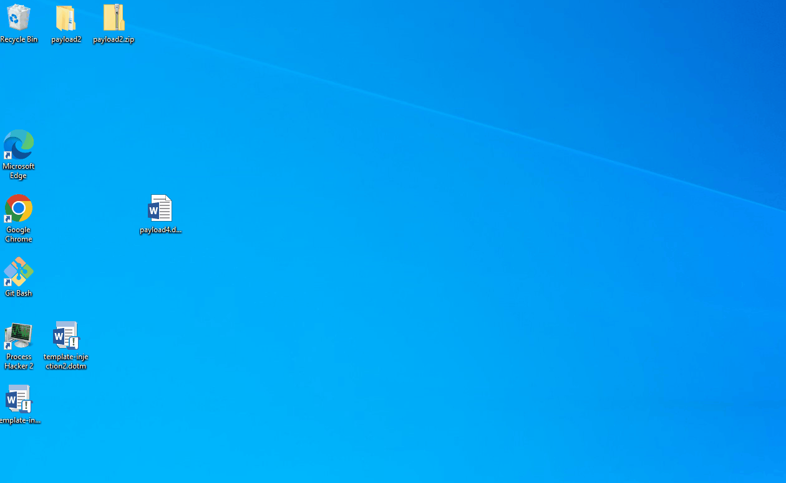

# 원격 템플렛 인젝션

마이크로소프트 워드에서는 문서 양식을 적용할 수 있다. 이 문서 양식은 로컬이나 원격의 호스트로부터 가져올 수 있으며, 양식 안에다가 VBA 매크로를 넣는 것 또한 가능하다. 따라서 공격자들은 워드 양식 파일 (Word Document Template File - `.dotm`)을 공격자 서버에 호스팅 한 뒤, 이 양식을 불러오는 워드 파일 - `.docx` 을 타겟 유저에게 보내 코드 실행을 할 수 있다. 워드 파일이 실행되면 공격자 서버로 가 양식 파일을 다운 받고, 이 양식 파일이 매크로를 실행하게 된다.&#x20;

 (1) (2).png>)

이 공격의 장점은 바로 타겟 유저에게 보내는 파일에 VBA 페이로드를 집어넣지 않아도 된다는 점이다. 타겟 유저가 받는 문서 파일에는 유해한 VBA 페이로드가 없기 때문에 이메일 게이트웨이를 패스할 수 있게 된다. 엔드포인트에서의 AV/EDR 솔루션들은 여전히 양식 파일안의 VBA 매크로를 탐지하겠지만, 적어도 첫번째 탐지 단계는 넘어갈 수 있게 된다.&#x20;

### 실습&#x20;

템플렛 인젝션 워드 양식 파일과 워드 문서 파일은 다음과 같은 단계를 통해 만들 수 있다.&#x20;

1. VBA 매크로 페이로드가 들어간 .dotm 양식 파일을 만든 뒤 저장한다.&#x20;
2. 이 .dotm 양식 파일을 공격자 서버 혹은 CDN/파일 호스팅 서버에 호스트한다.&#x20;
3. .docx 워드 문서 파일을 만든 뒤, 마이크로소프트에서 제공하는 기본 양식을 지정한 다음 저장한다.&#x20;
4. .docx 워드 문서 파일을 zip파일로 만든 뒤 압축을 해제한다. 그 뒤, `./word/_rels/settings.xml.rels` 파일을 찾아 그 안의 `Target` 파라미터를 호스팅 된 `.dotm` 파일을 가르키도록 설정한다.&#x20;
5. 다시 압축 한 뒤 `.docx` 문서 파일로 이름을 바꾸고, 이 파일을 타겟 유저에게 보낸다.&#x20;

템플렛과 VBA 페이로드를 만드는 방법은 따로 설명하지 않는다. 워드 파일 안에 VBA 매크로 페이로드를 넣는 것은 [오피스 VBA 매크로](vba-macros.md) 페이지에서 설명했다. 저장할 때 `.dotm` 파일로 저장하면 된다.&#x20;

`.docx` 문서 같은 경우 문서를 만든 뒤, 마이크로소프트사에서 제공하는 디폴트 양식 중 하나를 선택한다. 그 뒤 저장한다. 이후 `.zip` 파일로 이름을 변경한 뒤 압축을 풀어준다.&#x20;

```
mkdir test
cd ./test
mv ../payload.docx payload.zip 
expand-archive ./payload.zip 
```

`/word/_rels/settings.xml.rels` 파일을 찾아 Target 파라미터를 공격자가 호스팅 하고 있는 양식 파일 위치로 바꾼다.&#x20;

 (1) (1).png>)

이후 다시 파일들을 압축한다. 이 때 디렉토리 하나만 압축하지 말고, 디렉토리 안의 파일들을 모두 모아서 압축한다.&#x20;

 (1) (1).png>)

이후 이 문서 파일을 실행하면 다음과 같이 코드 실행이 된다.&#x20;



실습에 사용한 Meterpreter 페이로드의 x86/x64 문제 때문에 최종 Meterpreter 쉘은 얻지 못했지만, VBA 매크로가 실행 됐다는 것은 확인할 수 있다.&#x20;

### 대응 방안&#x20;

* 원격 템플렛 인젝션 공격은 2017년도에 화제가 되었으며, 왠만한 엔드포인트 AV/EDR 솔루션들은 탐지 할 수 있다.&#x20;
* 오피스 VBA 매크로와도 같이 결국 최종적으로 실행되는 페이로드는 VBA 매크로다. 디지털 서명을 강제하거나 오피스 매크로를 사용하지 않을 경우 오피스 VBA 매크로 페이지에서 나왔던 [대응 방안](vba-macros.md#undefined-1)들을 적용한다.&#x20;
* 템플렛 파일 또한 메모리상에서 실행되는 것이 아니고 엔드포인트 디스크에 다운 받아야되기 때문에 엔드포인트상에서 악성 VBA 매크로를 탐지한다.&#x20;


### 레퍼런스&#x20;








