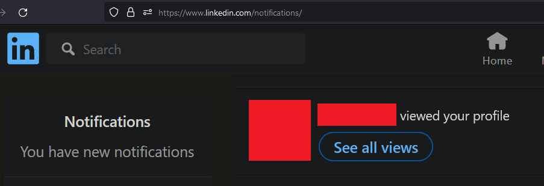

# 작전보안

앞서 공개 출처 정보는 이미 공개된 출처에서 타겟의 인프라 및 인적 자원들과 직접적 교류 없이 수집한 정보를 일컫는다고 정의했었다. 작전보안은 레드팀 활동시 모든 단계에서 중요하지만, OSINT 단계에서도 중요하다. 비록 타겟과의 직접적인 네트워크 트래픽 교환이 없다곤 해도, 제3자의 플랫폼을 통해 타겟과 교류하거나, 다른 플랫폼을 사용할 때 오퍼레이터의 신원을 숨기는 것이 중요하기 때문이다.

예를 들어 레드팀을 진행한다고 가정해보자. 작전 보안 단계에서 상대방의 블루팀 멤버들의 링크드인 프로필을 보며 정보를 수집하는 것은 일반적이다. 이때 오퍼레이터의 진짜 링크드인 계정을 사용하면 고객사의 블루팀 멤버들이 이를 보고 레드팀 작전 수행에 대해 눈치를 챌 수 있다.

또는 theHarvester/amass 와 같은 툴을 사용해 공개 검색 엔진 등을 이용한 OSINT를 진행할 때, 오퍼레이터의 집/회사 IP 주소를 이용해 많은 양의 검색을 하다간 검색 엔진 사이트나 ISP 단계에서 IP 주소 밴을 당할 수도 있다. 그 뿐인가, 타겟과 관련되어 있는 웹사이트를 방문할 때 마다 오퍼레이터의 브라우저 핑거프린트 및 Geolocation, 아이피주소까지 모두 다 고객사가 수집하고 저장한 뒤, 분석할 수 있다.

따라서 레드팀 작전 수행시 안전한 작전 수행을 위해 오퍼레이터들은 작전보안을 지켜야한다.

1. 모든 SNS 활동은 가짜 페르소나 계정인 Sock Puppet 계정을 사용한다
2. OSINT 툴을 사용할 땐 일회성 클라우드 자원을 이용하거나 셀프 호스팅 VPN 혹은 프록시를 이용한다.
3. 셀프 호스팅 VPN 혹은 프록시 가상머신은 매 작전마다 제거한 뒤 새로 만들어 새로운 IP 주소를 획득하게 한다
4. 웹 브라우저를 이용해 OSINT를 이용할 시 다음과 같은 프라이버시 에드온들을 사용한다.
   * [Privacy Badger](https://privacybadger.org/)
   * Location Guard
   * [UBlock Origin](https://ublockorigin.com/)

### 가짜 계정 (Sock Puppet Account)&#x20;

Sock Puppet Account - 가짜 계정은 존재하지 않은 가상의 페르소나를 만든 뒤, 해당 페르소나로 만든 계정일 일컫는다. 인터넷에서 일컫는 깡통 계정과는 다른 부분들이 있다. 아무런 정보가 없는 깡통 계정들과는 달리, 가짜 계정들은 실제 사람과 비슷한 페르소나를 만드는 것이기 때문에 실제로 사람을 하나 만든다는 생각을 하면 된다.&#x20;

이름, 직업, 직장, 웹사이트, SNS, 경력, 가족 관계, 가족들의 가짜 계정, 취미, 수상 이력 등등을 모두 설정한 뒤, 해당 설정에 맞게 SNS 계정을 만든다. SNS 계정에는 설정된 정보가 모두 보일 수 있도록 링크를 걸거나 가짜 데이터를 생성한다. 진짜 사람처럼 블로그 글도 쓰고, 링크도 걸고, 다른 사람들의 승진을 축하해주기도 한다. 이후 다른 사람들과 커넥션을 만들고 "인플루언서" 처럼 커넥션을 늘려나간다.

예를 들어 한국의 개발자/보안 인력들의 링크드인 정보를 확인하는 용도를 위한 가짜 계정을 만든다고 친다면, 다음과 같은 페르소나를 생성할 수 있다.&#x20;

* 이름: 미국 1970\~80년대생 여성 이름&#x20;
* 직업: 한국/미국 IT 인력 리크루터&#x20;
* 직장: 아직 웹사이트가 없는 한국의 스타트업. 한국과 미국의 개발자들을 헤드헌팅해 양국의 하이 프로파일 회사에게 소개시켜주는 스타트업&#x20;
* 가족관계: 기혼. 남편 계정과 아들 계정도 생성&#x20;
* 경력: 리크루터, CHRO 등으로 3개의 회사에서 17년 동안 근무&#x20;

위 정보를 바탕으로 링크드인에서 가짜 계정을 찾는 분들은 메시지 주시면 기프티콘이라도 드리겠다.&#x20;

### IP 주소 작전보안&#x20;

OSINT 툴들을 사용하다보면 검색 엔진이나 웹사이트들로부터 IP 밴을 먹는 경우가 많다. 이를 방지하기 위해서 AWS, Azure, GCP 등의 클라우드 플랫폼을 이용해 Dynamic Port Forwarding 을 통한 SOCKS 프록시를 이용하거나, 셀프 호스팅 VPN을 사용한다.&#x20;

* [WireGuard](https://www.wireguard.com/), [WireGuard GUI](https://github.com/WeeJeWel/wg-easy)&#x20;
* [SOCKS Proxy](https://securityintelligence.com/posts/socks-proxy-primer-what-is-socks5-and-why-should-you-use-it/)&#x20;

위 프록시/VPN 서버들은 [예시 인프라](../infrastructure/example-infra.md)에서 나왔던 것처럼 모두 중립공간 (Gray Area)에 배포한다. 매 작전마다 해당 서버들은 제거한 뒤, 새로운 작전에는 새로운 서버들을 다시 배포해 사용한다.&#x20;

