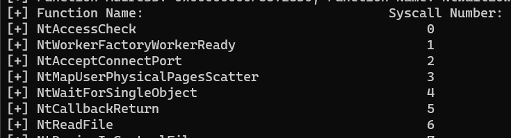

# FreshyCall

###

## Disclaimer&#x20;

이곳은 제 개인 공부 + 연구 섹션입니다. 오펜시브 시큐리티 관련 블로그 글을 읽고, 요약한 뒤, 거기에 있는 코드들 따라치기 정도의 낮은 퀄리티 글 밖에 없을거기 때문에 안 읽으셔도 무방합니다. 이 섹션의 모든 페이지들의 내용 및 코드는 제것이 아닙니다.

블로그 링크: [https://www.crummie5.club/freshycalls/](https://www.crummie5.club/freshycalls/)

툴/코드 링크: [https://github.com/Crummie5/FreshyCalls](https://github.com/Crummie5/FreshyCalls)

### 문제 & 해결

* FreshyCall은 다른 기법들의 문제를 해결하려고 나온 기법은 아니다. 그저 ntdll.dll의 exported 된 NTAPI 함수들과 그 메모리주소를 보고 있자니, 특정한 패턴이 보이길래 나온 기법이다.

### FreshyCall

* FreshyCall 은 ntdll.dll 이 export하고 있는 NTAPI 함수들의 메모리 주소를 정렬해봤을 때, 시스템 콜 번호가 0부터 시작해 순차적으로 늘어난다는 개념을 통해 런타임 중 다이나믹 하게 NTAPI 함수의 시스템 콜 번호를 찾아내는 기법이다.
* Hell's Gate와 Halos Gate에서 살펴봄 봐와 같이, NTAPI 함수들은 메모리상의 ntdll.dll 안에 순차적으로 exported 되어있으며 각 함수들은 32 바이트(0x20)씩 떨어져 있다. 예를 들어, ntdll의 가장 첫번째 함수인 `NtAccessCheck` 와 `NtWorkerFactoryWorkerReady`를 살펴보면 다음과 같다.

```
// 첫번째 NTAPI - 00007ffa`f566ec40 부터 시작하는 NtAccessCheck
0:000> uf ntdll!NtAccessCheck
ntdll!NtAccessCheck:
00007ffa`f566ec40 4c8bd1          mov     r10,rcx
00007ffa`f566ec43 b800000000      mov     eax,0    // 시스템 콜 번호 0
00007ffa`f566ec48 f604250803fe7f01 test    byte ptr [SharedUserData+0x308 (00000000`7ffe0308)],1
00007ffa`f566ec50 7503            jne     ntdll!NtAccessCheck+0x15 (00007ffa`f566ec55)  Branch

// 두번째 NTAPI - 00007ffa`f566ec60 부터 시작하는 NtWorkerFactoryWorkerReady
ntdll!NtWorkerFactoryWorkerReady:
00007ffa`f566ec60 4c8bd1          mov     r10,rcx
00007ffa`f566ec63 b801000000      mov     eax,1    // 시스템 콜 번호 1
00007ffa`f566ec68 f604250803fe7f01 test    byte ptr [SharedUserData+0x308 (00000000`7ffe0308)],1
00007ffa`f566ec70 7503            jne     ntdll!NtWorkerFactoryWorkerReady+0x15 (00007ffa`f566ec75)  Branch
```

* 그리고 이들의 시스템 콜 번호는 0부터 시작해 순차적으로 1씩 증가한다.&#x20;
* 그렇다면 ntdll.dll 이 export 하고 있는 모든 함수들을 메모리 낮음 -> 높음 상태로 정렬한 뒤, 시스템 콜 번호를 0부터 XXX까지 부여한 딕셔너리/맵/배열을 만들면, 언제든지 원하는 시스템 콜 번호를 가져올 수 있게 된다.

### 코드

* 아래의 코드는 모두 원본 코드들 (https://github.com/Crummie5/FreshyCalls, https://alice.climent-pommeret.red/posts/direct-syscalls-hells-halos-syswhispers2/) 참고해 재구성한 코드다.
* 최종 코드는 여기에 있다 - [https://github.com/ChoiSG/RTPSourceCodes/blob/main/cpp/freshyCallPOC/freshyCallPOC.cpp](https://github.com/ChoiSG/RTPSourceCodes/blob/main/cpp/freshyCallPOC/freshyCallPOC.cpp) \
  \

* 먼저 PEB -> LoaderData + InMemoryOrderModuleList.Flink -> Flink 콤보와 함께 Dos/NT/Optional/ExportTable 를 통해 exported 함수들의 `AddressofFunction`, `AddressofName`, `AddressofNameOrdinals` 테이블 3개를 가져오는 코드는 Hell's Gate와 동일하다.\

* 이후 Ordinal을 통해 AddressOfFunction을 낮음 -> 높음 순서대로 정렬해준다. Exported Functions 들은 테이블을 3개나 가지고 있는데, 이때 `AddressOfFunction[ordinal]` 식으로 메모리 주소를 빼내오는게 가장 낮은 메모리 주소부터 높은 메모리 주소까지 정렬을 할 수 있는 방식이다.

```
// Various export tables from ntdll 
DWORD* FuncAddr_Table = (DWORD*)(ImageBase + ExportTable->AddressOfFunctions);
DWORD* Names_Table = (DWORD*)(ImageBase + ExportTable->AddressOfNames);
WORD* Names_Ordinal_Table = (WORD*)(ImageBase + ExportTable->AddressOfNameOrdinals);
DWORD numOfNtNames = 0;

// cpp map orders the key sequentially by default - til. 
// Map to store ntapi functionaddr:functionname
std::map<DWORD, std::string> funcAddrNameMap;
std::map<DWORD, std::string> funcNameSortedMap;
std::map<std::string, DWORD> funcNameSyscallMap;

// Populate each maps with funcAddr, funcName
for (int i = 0; i < ExportTable->NumberOfNames; i++) {
	DWORD nameOffset = Names_Table[i];
	WORD ordinal = Names_Ordinal_Table[i];
	DWORD functionAddr = (DWORD)(ImageBase + FuncAddr_Table[ordinal]);
	char* funcName = (char*)(ImageBase + nameOffset);

	if (strncmp(funcName, "Nt", 2) == 0 && strncmp(funcName, "Ntdll", 5) != 0 &&
		strncmp(funcName, "NtGetTickCount", 14) != 0) {
		printf("[+] funcName: %s\n", funcName);
		funcAddrNameMap[functionAddr] = funcName;
	}
}
```

* 코드를 보면 cpp의 `std::map` 을 통해 파이썬의 딕셔너리 비슷한 맵을 만들고 있다. Exported 함수의 이름은 `ImageBase + Names_Table[i]` 를 통해 가져오고, 가장 중요한 메모리 주소는 `ImageBase + FuncAddr_Table[ordinal]` 을 통해서 가장 낮은 주소부터 가져오고 있다.\

* 그 뒤 조건문을 이용해 `Nt` 로 시작하는 함수들만, `Ntdll` 와 `NtGetTickCount` 는 제외한채, 맵에다가 `functionAddr` 부터 넣어 낮은 메모리주소 -> 높은 메모리주소까지 정렬 시킨 뒤, 그에 맞는 Exported 함수의 이름을 넣어주고 있다.\

* 이렇게 `FunctionAddr:FunctionName` 형태의 맵을 만들었다면, 메모리 주소를 바탕으로 이제 `FunctionName:Syscall-Number` 형태의 또 다른 맵을 만들면 된다. cpp 의 맵은 기본적으로 키 (Key) 를 기준으로 정렬을 시켜버리기 때문에, 두번째 맵을 그대로 만들면 `FunctionName` 의 알파벳 순서대로 시스템 콜 번호를 부여해버린다. 따라서 세번째 맵을 만들어 `FunctionAddr` 순서 그대로 `FunctionName` 이 정렬하게 한 뒤, 시스템 콜 번호를 부여해준다.\

* 말로하면 복잡해보이지만 실제 코드는 간단하다.

```
// Populate funcNameSyscallMap with funcName sorted based on the address (lowest to highest) from funcAddrNameMap.
for (auto& kv : funcAddrNameMap) {
	funcNameSortedMap[kv.first] = kv.second;
}

DWORD syscallNumber = 0;
for (auto& kv : funcNameSortedMap) {
	funcNameSyscallMap[kv.second] = syscallNumber;
	syscallNumber++;
}

// Print stuff out 
printf("[+] Function Name:                                Syscall Number:\n");
for (auto& kv : funcNameSyscallMap) {
	printf("[+] %-*s %d\n", 50, kv.first.c_str(), kv.second);
}	
```

위의 코드를 실행하면 Exported 함수 이름과 그에 맞는 시스템 콜 번호가 들어간 맵의 출력 결과를 볼 수 있다. 이제 시스템 콜 번호가 필요할 때마다 이 맵에서 함수 이름을 검색해 번호를 찾아내면 된다. 아래의 맵은 보기 좋으라고 또 다시 번호대로 정렬 했지만, 어차피 해시맵 개념의 맵이기 때문에 큰 의미는 없다.&#x20;

<figure><figcaption></figcaption></figure>

### 마치며

FreshyCall은 NTAPI 함수들의 메모리 주소와 시스템 콜 번호와의 상관관계지, 공격 기법이나 방어 우회 기법으로 보기는 힘들다. Hell's Gate나 Halos Gate에 비교해봤을 때 간단하지만 효과적인 개념으로 시스템 콜 번호를 구할 수 있다. 윈도우 운영체제의 ntdll exported 함수들의 메모리주소와 시스템 콜 번호들이 계속해서 순차적인 정렬 방식을 유지한다면, FreshyCall은 추후 윈도우 버전에서도 쓰이는 기법이 되지 않을까 싶다.

* Windows 11 Pro 22H2 - 03/28/2023 에서 테스트 됨

### 레퍼런스

* https://github.com/Crummie5/FreshyCalls
* https://www.crummie5.club/freshycalls/
* https://alice.climent-pommeret.red/posts/direct-syscalls-hells-halos-syswhispers2/
