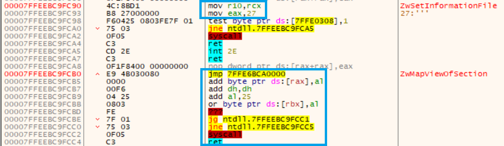
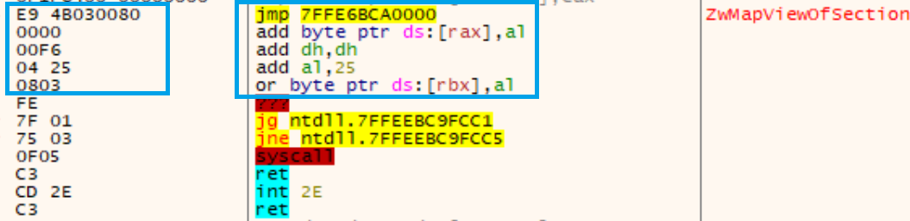
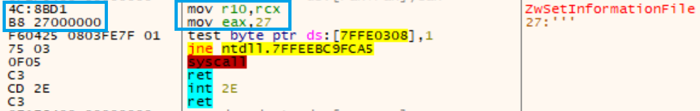

# HalosGate

## Disclaimer

이곳은 제 개인 공부 + 연구 섹션입니다. 오펜시브 시큐리티 관련 블로그 글을 읽고, 요약한 뒤, 거기에 있는 코드들 따라치기 정도의 낮은 퀄리티 글 밖에 없을거기 때문에 안 읽으셔도 무방합니다. 이 섹션의 모든 페이지들의 내용 및 코드는 제것이 아닙니다.

블로그 링크: [https://blog.sektor7.net/#!res/2021/halosgate.md](https://blog.sektor7.net/#!res/2021/halosgate.md)

툴/코드 링크: [https://alice.climent-pommeret.red/posts/direct-syscalls-hells-halos-syswhispers2/#retrieve-syscall-id-dynamically](https://alice.climent-pommeret.red/posts/direct-syscalls-hells-halos-syswhispers2/#retrieve-syscall-id-dynamically)

### 문제

* HellsGate에서 다이나믹하게 시스템 콜 번호를 가져올 때 가장 중요했던 점 중 하나는 바로 `mov r10, rcx // mov eax,<syscall#>` 형식의 시스템 콜 번호 바이트 패턴 - `4c 8b d1 b8 <syscall> <syscall> 00 00` 을 찾는 것이였다.
* 바이트 패턴은 깔끔한 ntdll.dll 의 경우에는 쉽게 찾을 수 있다. 하지만 유저랜드 후킹이 들어간 메모리상의 NTAPI 함수 메모리에서는 바이트 패턴이 완전히 바뀌어 버린 경우가 많이있다. 이 경우, 바이트 패턴 자체를 아예 찾지 못하기 때문에 HellsGate 기법을 사용할 수 없게 된다.

<figure><figcaption><p>Sektor7 사 블로그 포스트 중 일부. 유저랜드 후킹 때문에 ZwMapViewOfSection에서 바이트 패턴을 찾아볼 수 없다.</p></figcaption></figure>

### 해결

* Halos Gate (헤일로즈 게이트)는 시스템 콜 번호를 찾고자 하는 NTAPI 함수가 유저랜드 후킹이 된 경우, 해당 함수 위/아래에 있는 "이웃" 함수들에게서 바이트 패턴을 찾고, Hells Gate를 이용해 시스템 콜 번호를 찾아낸 뒤, 간단한 더하기/빼기를 이용해 찾고자 하는 NTAPI 함수의 시스템 콜 번호를 찾는 기법이다.

### 중요 개념 - NTAPI들의 시스템 콜 번호 패턴

1. NTAPI 함수들의 시스템 콜 번호는 0부터 시작해, 순차적으로 1씩 증가한다.
2. AV/EDR 솔루션들은 모든 NTAPI 함수들에 유저랜드 후킹을 걸어놓지 않는다.
3. 따라서, 만약 찾고자 하는 함수에 유저랜드 후킹이 걸려있다면, 메모리상으로 위로 올라가거나, 아래로 내려가서 "이웃" NTAPI 함수들에게서 바이트 패턴을 찾고, 시스템 콜 번호를 찾은 뒤, 올라간/내려간 함수 갯수만큼 시스템 콜 번호를 더하거나/빼면, 찾고자 하는 함수의 시스템 콜 번호를 논리적으로 찾아낼 수 있다.

* 원문 글의 예시를 살펴보자.

`ZwMapViewOfSection` 함수의 시스템 콜 번호를 찾으려고 하는데, 이미 AV/EDR 솔루션에서 유저랜드 후킹을 걸어버렸다. `mov r10,rcx // mov eax, <syscall#>` 바이트 패턴을 찾을 수 없는 상태다.

<figure><figcaption><p>Sektor7 사 블로그 포스트 중 일부. 유저랜드 후킹 때문에 ZwMapViewOfSection에서 바이트 패턴을 찾아볼 수 없다.</p></figcaption></figure>

하지만 메모리상 `ZwMapViewOfSection` 의 바로 위에 있는 `ZwSetInformationFile` 의 경우는 유저랜드 후킹이 걸려있지 않다. 이 함수에서는 시스템 콜 번호 바이트 패턴 `mov r10, rcx // mov eax,<syscall#>` == `4c 8b d1 b8 <syscall> <syscall> 00 00` 를 찾을 수 있다.

<figure><figcaption><p>Sektor7사 블로그 포스트 중 일부. ZwSetInformationFile 에는 후킹이 안걸려있고, 바이트 패턴이 존재한다.</p></figcaption></figure>

이제 HellsGate 공식을 이용해 `ZwSetInformationFile` 의 시스템 콜 번호를 다이나믹하게 찾는다. 27이 나온다.

```
// 시스템 콜 번호 바이트 패턴 
0  1  2  3  4  5  6  7  
4c 8b d1 b8 27 00 00 00 

// 5번째 바이트 bitwise shift left 8 | 4번째 바이트 
(00 << 8) | 27 == 27 
```

1. `ZwSetInformationFile` 은 `ZwMapViewOfSection` 의 바로 "위" 에 있던 이웃 함수였다.
2. `ZwSetInformationFile` 의 시스템 콜 번호는 27이다.
3. NTAPI 함수들의 시스템 콜 번호는 순차적으로, 1씩 증가한다.
4. `ZwMapViewOfSection` 은 바로 "아래"에 있는 이웃 함수니, 시스템 콜 번호는 27 + 1 = 28이 된다.

만약 "이웃" 함수들도 후킹되어 있다면, 반복문을 통해 쭉쭉 위 (혹은 아래)에 있는 이웃 함수들을 살펴본다. 유저랜드 후킹이 되어 있지 않은 이웃 함수를 드디어 찾았다면, 시스템 콜 번호를 찾아낸 뒤, 반복문의 루프 횟수 만큼 더하거나 빼주면 된다. (예. 4번째 아래에 있는 이웃함수에서 시스템 콜 바이트 패턴 확인. 시스템 콜 30 확인. 따라서 타겟은 30 - 4 = 26)

### 코드

아래의 코드는 모두 이 블로그 포스트 ([https://alice.climent-pommeret.red/posts/direct-syscalls-hells-halos-syswhispers2/#retrieve-syscall-id-dynamically](https://alice.climent-pommeret.red/posts/direct-syscalls-hells-halos-syswhispers2/#retrieve-syscall-id-dynamically)) 에서 가져왔음을 밝힌다.

각 NTAPI 함수들의 stub는 항상 32비트 (4바이트)로 일정하다. 따라서, 반복문 안에서 32비트씩 위로, 그 다음 아래로 100개(혹은 500개, 1000개, etc.)의 이웃 함수들을 루프하며 바이트 패턴을 찾을 때 까지 반복한다.

바이트 패턴을 가진 이웃 함수를 찾았다면 이웃 함수의 시스템 콜 번호를 구한다. 그 뒤, 위로 올라갔냐 아래로 내려갔냐를 따져 반복문의 인덱스 만큼 이웃 함수의 시스템 콜 번호에서 더하기/빼기를 해주면 원하던 함수의 시스템 콜 번호를 찾을 수 있다.


```c
// NTAPI 함수들의 stub는 항상 32비트로 일정. 
int GoUp -32;
int GoDown 32;

// 첫 명령어가 e9 (jmp) 라면 후킹 되어 있다는 뜻. 이럴 경우 HalosGate 기법 시작. 
if (*((PBYTE)pFunctionAddress) == 0xe9) {
  // 반복문 실행, 인덱스 i 
  for (WORD index = 1; index <= 500; index++) {
    // 현 함수에서 인덱스 * 32비트를 이용해 "아래로" 내려감. 그 뒤, 시스템 콜 번호 바이트 
    // 패턴을 Hells Gate 조건문을 이용해 찾음. 
    if (*((PBYTE)pFunctionAddress + index * GoDown) == 0x4c
      && *((PBYTE)pFunctionAddress + 1 + index * GoDown) == 0x8b
      && *((PBYTE)pFunctionAddress + 2 + index * GoDown) == 0xd1
      && *((PBYTE)pFunctionAddress + 3 + index * GoDown) == 0xb8
      && *((PBYTE)pFunctionAddress + 6 + index * GoDown) == 0x00
      && *((PBYTE)pFunctionAddress + 7 + index * GoDown) == 0x00) {
      BYTE high = *((PBYTE)pFunctionAddress + 5 + index * GoDown);
      BYTE low = *((PBYTE)pFunctionAddress + 4 + index * GoDown);

      // "아래로" 내려갔으니, 이웃함수의 시스템 콜 번호에서 index 만큼 "빼기" == 타겟 함수의 시스템 콜 번호. 
      pVxTableEntry->wSystemCall = (high << 8) | low - index;
      return TRUE;
  	}
		
    // 이번엔 "위로" 올라감. 시스템 콜 번호 바이트 패턴을 HellsGate 조건문을 이용해 찾음. 
    if (*((PBYTE)pFunctionAddress + index * GoUp) == 0x4c
      && *((PBYTE)pFunctionAddress + 1 + index * GoUp) == 0x8b
      && *((PBYTE)pFunctionAddress + 2 + index * GoUp) == 0xd1
      && *((PBYTE)pFunctionAddress + 3 + index * GoUp) == 0xb8
      && *((PBYTE)pFunctionAddress + 6 + index * GoUp) == 0x00
      && *((PBYTE)pFunctionAddress + 7 + index * GoUp) == 0x00) {
      BYTE high = *((PBYTE)pFunctionAddress + 5 + index * GoUp);
      BYTE low = *((PBYTE)pFunctionAddress + 4 + index * GoUp);

      // "위로" 올라갔으니, 이웃함수의 시스템 콜 번호에서 index 만큼 "더하기" == 타겟 함수의 시스템 콜 번호. 
      pVxTableEntry->wSystemCall = (high << 8) | low + index;
      return TRUE;
    }
}
```


### 적용과 예시

Halos Gate는 Hells Gate에서 시스템 콜 번호를 찾는 논리만 강화된 기법이기 때문에 시스템 콜 번호를 찾은 뒤 사용하는 것 자체는 Hells Gate와 동일한 어셈블리 코드 양식을 사용한다. [hellsgate.md](hellsgate.md "mention") 페이지를 참고한다.

### 마치며

헤일로즈 게이트는 maldev 쪽에서 유명한 강의를 제공하는 Sektor7([https://www.sektor7.net/](https://www.sektor7.net))에서 발표한 기법이다. NTAPI 함수들이 순차적으로 1씩 증가한다는 점, NTAPI 함수들의 stub는 무조건 32비트로 일정하기 때문에 "올라갔다" "내려갔다" 하기가 쉽다는 점, 이웃 함수들의 존재로 간접적으로 타겟 함수의 시스템 콜 번호를 찾은 뒤, 더하기/빼기를 이용해 원하는 함수의 시스템 콜 번호를 찾는다는 점이 정말 똑똑하고도 흥미로운 발상이다.

헤일로즈 게이트 또한 부족한 점이 있기 때문에 추후 Tartarus Gate나 FreshyCalls 등의 기법들이 추가로 나오기도 했지만, 이는 또 다른 페이지에서 다뤄보도록 한다.

### 레퍼런스




